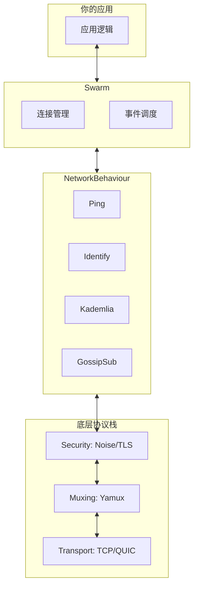

## 每个 P2P 项目都在重复造轮子

2015 年，[胡安·贝内特（Juan Benet）](https://en.wikipedia.org/wiki/Juan_Benet_(computer_scientist))和他的团队正在开发 [IPFS](https://ipfs.tech/)——一个旨在取代 HTTP 的去中心化文件系统。他们需要构建一个能在全球数百万节点间高效通信的 P2P 网络。

但很快，他们陷入了一个熟悉的困境：

- 如何让两个躲在家庭路由器后的设备互相连接？（NAT 穿透）
- 如何在不信任的节点之间建立安全通道？（加密传输）
- 如何发现网络中谁拥有某个文件？（节点发现）
- 如何在断连后自动重连？（连接管理）

这些问题，二十年前 [Napster](https://zh.wikipedia.org/wiki/Napster) 遇到过，[BitTorrent](https://zh.wikipedia.org/wiki/BitTorrent) 解决过一部分，[比特币](https://bitcoin.org/)和 [Freenet](https://freenetproject.org/) 又各自摸索出不同的方案。**每个项目都在重新发明网络层**。

更糟糕的是，这些实现往往紧密耦合在应用逻辑中。想把 BitTorrent 的 [DHT](https://zh.wikipedia.org/wiki/分散式雜湊表) 拿来用在区块链里？几乎不可能。想给比特币加上 [QUIC](https://zh.wikipedia.org/wiki/QUIC) 传输？得重写半个网络栈。

"这太荒谬了，"贝内特后来回忆道，"我们不是在构建新协议，而是在不断复制旧错误。"

于是，IPFS 团队做了一个决定：**把网络层抽出来，做成一个独立的、可复用的工具箱**。这个工具箱，就是 **[libp2p](https://libp2p.io/)**。

> libp2p 不是一个应用，而是一个**网络栈的乐高积木系统**。

## 模块化：libp2p 的核心哲学

在传统网络编程中，我们习惯使用 TCP/IP + TLS + DNS 这样的固定组合。它像一套预制套餐：你要么全吃，要么饿着。

但 P2P 网络的需求千差万别：

- 区块链节点需要极高的安全性，愿意牺牲一点速度
- 实时协作编辑需要低延迟，可以容忍偶尔丢包
- 物联网设备资源有限，只能跑轻量协议
- 某些网络环境特殊，必须支持 [WebRTC](https://webrtc.org/) 或 [WebSocket](https://zh.wikipedia.org/wiki/WebSocket) 中继

**没有一种"万能协议"能适应所有场景**。libp2p 的答案是：**解耦**。

它将 P2P 网络通信拆解为一系列正交的抽象层，每一层提供多种实现，开发者可以按需组合：

| 抽象层 | 作用 | 可选实现 |
|-------|------|---------|
| **Transport** | 建立底层字节流连接 | TCP, QUIC, WebSocket, WebRTC |
| **Security** | 加密与身份认证 | TLS, [Noise](https://noiseprotocol.org/) |
| **Muxing** | 在单个连接上承载多个逻辑流 | Yamux, Mplex |
| **Discovery** | 找到网络中的其他节点 | [mDNS](https://zh.wikipedia.org/wiki/多播DNS), [Kademlia](https://zh.wikipedia.org/wiki/Kademlia) DHT, Bootstrap |
| **Routing** | 查询"谁拥有 X？" | Kademlia DHT |
| **PubSub** | 广播消息给兴趣组 | [GossipSub](https://docs.libp2p.io/concepts/pubsub/overview/) |

你可以用 TCP + Noise + Yamux 构建一个安全高效的私有网络；也可以用 WebRTC + TLS 让浏览器直接参与 P2P 通信。甚至可以在运行时动态切换传输协议——比如先尝试直连，失败后自动降级到 WebSocket 中继。

这就是 libp2p 的核心哲学：**不要规定"应该怎么做"，而是提供"可以怎么做"的选项**。

## 两个基础概念：PeerId 与 Multiaddr

在深入 libp2p 的架构之前，我们需要先理解两个基础概念——它们是整个系统的基石。

### PeerId：节点的身份

在中心化网络中，你通过 IP 地址找到服务器。但在 P2P 网络中，IP 地址不可靠——设备可能移动、重启、换网络。更重要的是，**IP 无法证明"你是谁"**。

libp2p 引入 **PeerId** 作为节点的永久身份标识。它不是随机字符串，而是基于**公钥密码学**生成的：


PeerId 的关键特性：

- **唯一性**：不同公钥几乎不可能产生相同 PeerId
- **可验证性**：任何节点都可以用公钥验证对方是否真的是该 PeerId 的持有者
- **位置无关**：无论从哪个 IP 或端口连接，PeerId 不变

这意味着，在 libp2p 网络中，你不是"连接到某个地址"，而是"连接到某个身份"。

```rust
use libp2p::identity::Keypair;

let keypair = Keypair::generate_ed25519();  // Ed25519 是一种高效的椭圆曲线签名算法
let peer_id = keypair.public().to_peer_id();
println!("My PeerId: {peer_id}");
// 输出: 12D3KooWDpJ7As7BWAwRMfu1VU2WCqNjvq387JEYKDBj4kx6nXTN
```

### Multiaddr：如何连接你

有了身份，还需要知道"怎么连"。libp2p 发明了 **[Multiaddr](https://multiformats.io/multiaddr/)**——一种自描述的地址格式。

传统地址是扁平的：`192.168.1.100:8080`

Multiaddr 是**分层的**，明确描述了连接路径：

```text
/ip4/192.168.1.100/tcp/8080/p2p/12D3KooWRvUH...
```

它告诉你：使用 IPv4，目标 IP 是 192.168.1.100，通过 TCP 端口 8080，连接后验证对方 PeerId。

Multiaddr 支持任意协议嵌套，这让 libp2p 能无缝支持未来的新传输协议：

```text
/ip4/192.168.1.1/udp/8080/quic-v1
/ip4/192.168.1.1/tcp/8080/ws
/dns4/bootstrap.libp2p.io/tcp/443/wss/p2p/12D3KooW...
```

## Swarm 与 NetworkBehaviour：libp2p 的运行时架构

有了 PeerId（身份）和 Multiaddr（地址），我们知道"谁是谁"和"怎么连"。但这些只是静态概念——真正让 libp2p 运转起来的，是 **Swarm** 和 **NetworkBehaviour**。



### Swarm：连接管理中心

**Swarm** 是 libp2p 的核心运行时，负责：

- 管理所有活跃连接
- 监听入站连接、发起出站连接
- 将网络事件分发给对应的协议处理器

你可以把 Swarm 想象成一个"交换机"——所有网络流量都经过它。

```rust
use libp2p::swarm::SwarmEvent;

loop {
    match swarm.select_next_some().await {
        SwarmEvent::NewListenAddr { address, .. } => {
            println!("监听地址: {address}");
        }
        SwarmEvent::ConnectionEstablished { peer_id, .. } => {
            println!("已连接: {peer_id}");
        }
        SwarmEvent::Behaviour(event) => {
            // 处理协议事件
        }
        _ => {}
    }
}
```

Swarm 是你与 libp2p 网络交互的唯一入口——监听、连接、发送消息，都通过它完成。

### NetworkBehaviour：定义节点行为

Swarm 负责"管道"，但"管道里流什么"由 **NetworkBehaviour** 决定。

NetworkBehaviour 是一个 trait，定义了节点如何响应网络事件。libp2p 提供了多种内置实现：

| Behaviour | 作用 |
|-----------|------|
| **Ping** | 检测连接是否存活 |
| **Identify** | 交换节点信息（协议版本、监听地址等） |
| **Kademlia** | 分布式哈希表，用于节点发现和内容路由 |
| **GossipSub** | 发布-订阅消息传递 |
| **RequestResponse** | 请求-响应模式 |

你可以组合多个 Behaviour 构建复杂应用：

```rust
use libp2p::{ping, identify, gossipsub, swarm::NetworkBehaviour};

#[derive(NetworkBehaviour)]
struct MyBehaviour {
    ping: ping::Behaviour,
    identify: identify::Behaviour,
    gossipsub: gossipsub::Behaviour,
}
```

`#[derive(NetworkBehaviour)]` 宏会自动将各个子 Behaviour 的事件合并，让你在一个事件循环中处理所有协议。

### 抽象层与运行时的关系

现在我们可以把前面的概念串起来：

- **抽象层**（Transport、Security、Muxing）定义了"如何建立连接"
- **Swarm** 管理这些连接的生命周期
- **NetworkBehaviour** 定义了"连接建立后做什么"

当你调用 `swarm.dial(addr)` 时，libp2p 会：

1. 根据 Multiaddr 选择合适的 Transport（如 TCP）
2. 建立连接后，用 Security 层加密（如 Noise）
3. 用 Muxing 层多路复用（如 Yamux）
4. 最后将连接交给 NetworkBehaviour 处理

这种分层设计让你可以灵活替换任何一层，而不影响其他部分。

## libp2p 的生态

自 2015 年开源以来，libp2p 已成为去中心化基础设施的"网络层标准"：

- **[IPFS](https://ipfs.tech/)**：用 libp2p 实现文件块的发现与传输
- **[Filecoin](https://filecoin.io/)**：在存储市场和检索协议中重度依赖 libp2p
- **[以太坊 2.0](https://ethereum.org/)**：共识层使用 libp2p 进行节点发现、GossipSub 广播区块
- **[Polkadot](https://polkadot.network/)**：用 libp2p 处理平行链与中继链的通信

libp2p 是**语言无关**的，不同实现可以互相通信：

| 语言 | 项目 | 成熟度 |
|-----|------|-------|
| Go | [go-libp2p](https://github.com/libp2p/go-libp2p) | 最成熟，IPFS 主要使用 |
| Rust | [rust-libp2p](https://github.com/libp2p/rust-libp2p) | 活跃开发，性能优秀 |
| JavaScript | [js-libp2p](https://github.com/libp2p/js-libp2p) | 浏览器和 Node.js |
| Nim | [nim-libp2p](https://github.com/status-im/nim-libp2p) | Status 团队维护 |

## 为什么选择 libp2p？

回到最初的问题：为什么要用 libp2p，而不是自己写 P2P 网络？

- **避免重复造轮子**：NAT 穿透、中继、加密、DHT……这些难题已有成熟实现
- **协议灵活性**：轻松切换传输层、安全层，适应不同部署环境
- **互操作性**：与 IPFS、以太坊等主流项目天然兼容
- **未来就绪**：WebTransport、QUIC 等新协议已集成或规划中

更重要的是，libp2p 让你**专注于应用逻辑**，而不是网络细节。

## 小结

本章介绍了 libp2p 的诞生背景和核心架构：

- **模块化设计**：传输、安全、多路复用各层独立，可灵活组合
- **PeerId**：基于公钥的节点身份，自证明、位置无关
- **Multiaddr**：自描述的地址格式，支持任意协议嵌套
- **Swarm**：连接管理中心，所有网络操作的入口
- **NetworkBehaviour**：定义节点行为，可组合多个协议

概念讲完了，但你可能还是觉得有点抽象。别担心——**下一章我们直接动手**，运行第一个 libp2p 节点，让两个节点互相 ping 通。跑起来之后，再回头看这些概念，一切都会清晰很多。
