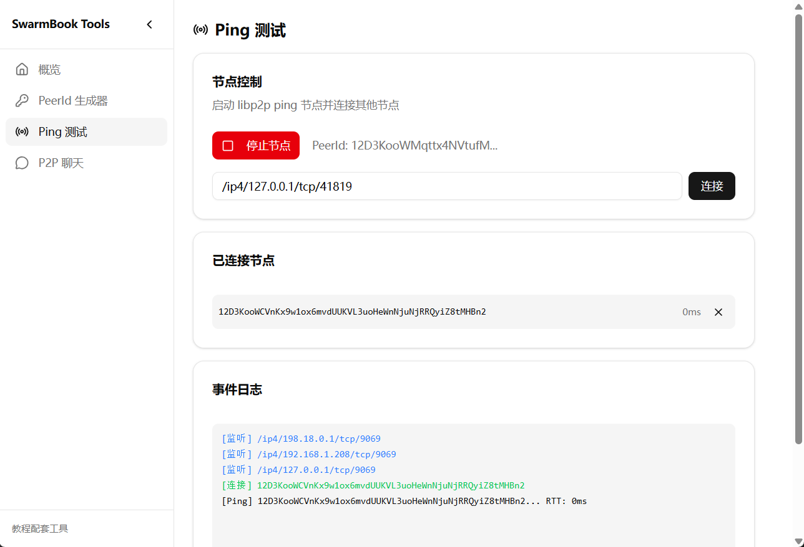
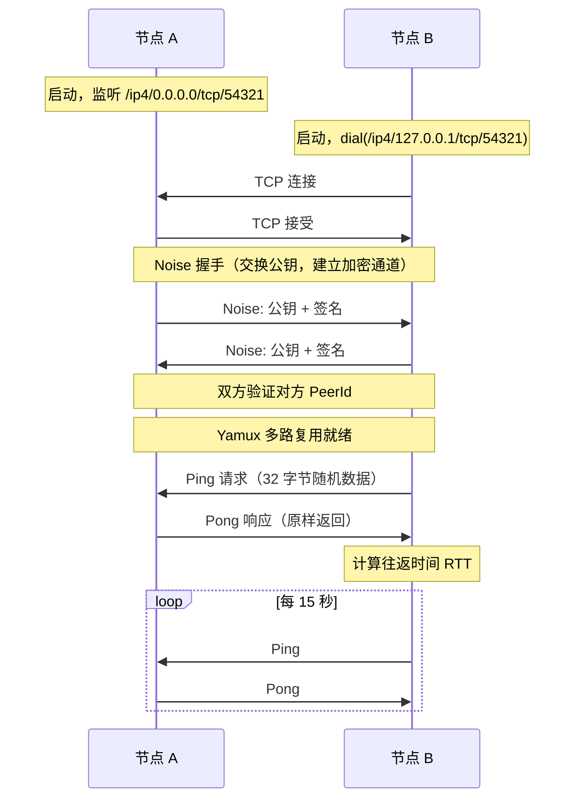

import { Steps, Tabs, TabItem } from '@astrojs/starlight/components';

上一章讲了很多概念——PeerId、Multiaddr、Swarm、NetworkBehaviour。听起来有点抽象？没关系，**先跑起来再说**。

:::tip[配套工具]
本教程配套的桌面应用提供了可视化的 **Ping 测试** 功能。你可以用它来启动节点、连接其他节点，并实时查看 Ping 结果——无需命令行操作。

打开应用后，在侧边栏选择「Ping 测试」即可使用。
:::

## 构建 Ping 节点

<Steps>

1. **创建项目**

   ```bash
   cargo new ping-example
   cd ping-example
   ```

2. **添加依赖** 到 `Cargo.toml`

   ```toml
   [dependencies]
   anyhow = "1"
   libp2p = { version = "0.56", features = ["tcp", "noise", "yamux", "ping", "tokio"] }
   tokio = { version = "1", features = ["full"] }
   tracing = "0.1"
   tracing-subscriber = "0.3"
   ```

3. **生成密钥对** — 每个节点需要一个身份

   ```rust ins={8-10}
   use std::{env, time::Duration};
   use libp2p::{futures::StreamExt, noise, ping, swarm::SwarmEvent, tcp, yamux, Multiaddr};

   #[tokio::main]
   async fn main() -> anyhow::Result<()> {
       tracing_subscriber::fmt().init();

       let keypair = libp2p::identity::Keypair::generate_ed25519();
       let peer_id = keypair.public().to_peer_id();
       tracing::info!("Local peer id: {peer_id}");
   }
   ```

4. **构建 Swarm** — 组装传输层、安全层、多路复用层

   ```rust ins={9-18}
   #[tokio::main]
   async fn main() -> anyhow::Result<()> {
       tracing_subscriber::fmt().init();

       let keypair = libp2p::identity::Keypair::generate_ed25519();
       let peer_id = keypair.public().to_peer_id();
       tracing::info!("Local peer id: {peer_id}");

       let mut swarm = libp2p::SwarmBuilder::with_existing_identity(keypair)
           .with_tokio()
           .with_tcp(
               tcp::Config::default(),
               noise::Config::new,      // Noise 加密
               yamux::Config::default,  // Yamux 多路复用
           )?
           .with_behaviour(|_| ping::Behaviour::default())?
           .with_swarm_config(|cfg| cfg.with_idle_connection_timeout(Duration::from_secs(60)))
           .build();
   }
   ```

5. **监听连接** — 使用 Multiaddr 指定地址

   ```rust ins={5} ins={7-12}
   async fn main() -> anyhow::Result<()> {
       // ...
       let mut swarm = /* ... */;

       swarm.listen_on("/ip4/0.0.0.0/tcp/0".parse()?)?;

       if let Some(addr) = env::args().nth(1) {
           let remote: Multiaddr = addr.parse()?;
           swarm.dial(remote)?;
           tracing::info!("Dialed {addr}");
       }
   }
   ```

6. **事件循环** — Swarm 是事件驱动的

   ```rust ins={6-18}
   async fn main() -> anyhow::Result<()> {
       // ...
       let mut swarm = /* ... */;
       // ...

       loop {
           match swarm.select_next_some().await {
               SwarmEvent::NewListenAddr { address, .. } => {
                   tracing::info!("Listening on {address}");
               }
               SwarmEvent::ConnectionEstablished { peer_id, .. } => {
                   tracing::info!("Connected: {peer_id}");
               }
               SwarmEvent::Behaviour(event) => {
                   tracing::info!("{event:?}");
               }
               _ => {}
           }
       }
   }
   ```

</Steps>

## 运行测试

<Steps>

1. **启动第一个节点**

   ```bash
   cargo run
   ```

   输出类似：

   ```text
   INFO ping: Local peer id: 12D3KooWAbCd...
   INFO ping: Listening on /ip4/127.0.0.1/tcp/54321
   ```

2. **启动第二个节点，连接第一个**

   <Tabs>
   <TabItem label="配套工具">

   在配套应用中输入第一个节点的监听地址，点击「连接」：

   

   </TabItem>
   <TabItem label="命令行">

   ```bash
   cargo run -- /ip4/127.0.0.1/tcp/54321
   ```

   输出：

   ```text
   INFO ping: Local peer id: 12D3KooWXyZw...
   INFO ping: Dialed /ip4/127.0.0.1/tcp/54321
   INFO ping: Connected: 12D3KooWAbCd...
   INFO ping: Event { peer: PeerId("12D3KooWAbCd..."), result: Ok(1.234ms) }
   ```

   </TabItem>
   </Tabs>

</Steps>

两个节点互相 ping 通了！

## 发生了什么？



## 小结

代码不到 50 行，但 libp2p 帮你处理了：

- 密钥生成与身份验证
- 加密通道建立（Noise）
- 流多路复用（Yamux）
- 连接保活（Ping）

下一章，我们深入 **PeerId**——节点的身份是怎么来的？为什么它能防止中间人攻击？
