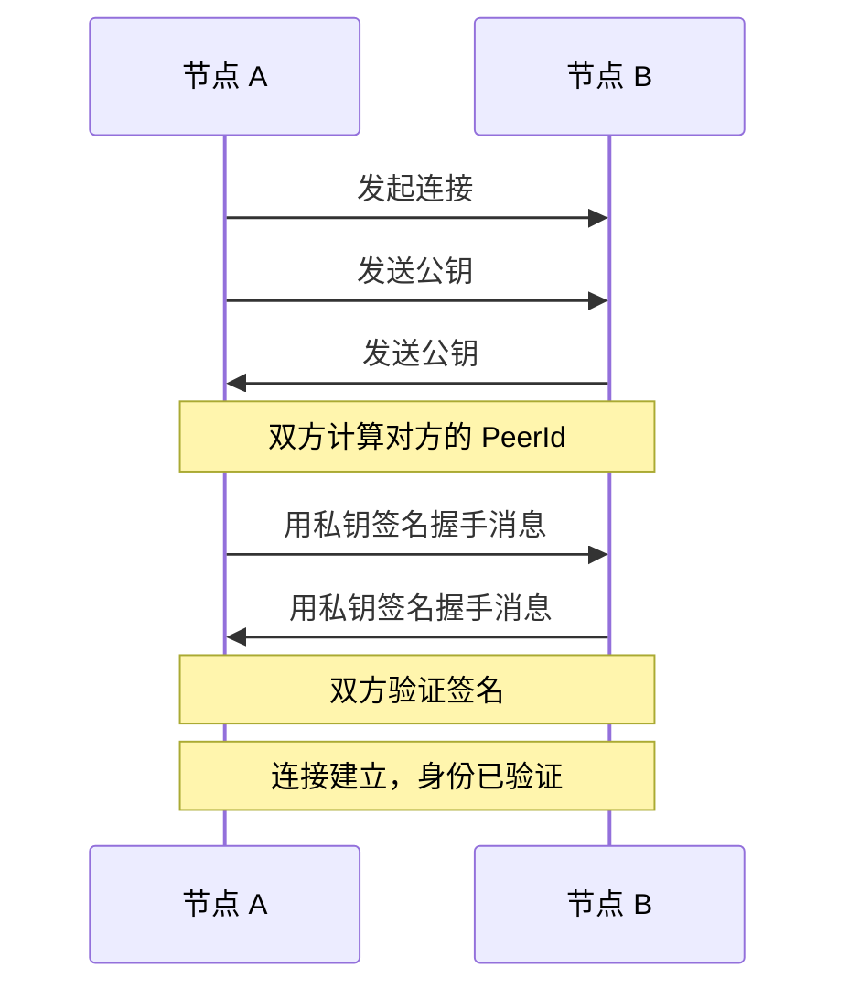

## 身份的困境

在传统互联网中，我们用 IP 地址找到服务器。但 IP 地址有两个致命问题：

1. **不稳定**：你的手机从 WiFi 切换到 4G，IP 就变了；家里路由器重启，IP 可能也变了
2. **不可信**：任何人都可以声称自己是某个 IP，你无法验证对方的真实身份

在 P2P 网络中，这两个问题更加严重。节点随时上下线，IP 地址毫无意义。更糟糕的是，没有中心服务器来"认证"谁是谁——你怎么知道连接到的节点，真的是你想连接的那个？

libp2p 的答案是：**用密码学取代 IP 地址**。

## PeerId：你的数字指纹

每个 libp2p 节点都有一个 **PeerId**——一个由公钥派生的唯一标识符。它看起来像这样：

```
12D3KooWMgcJeCtWqiptgnn4HHY6jRkMaRzHumXrntP3Np7qUqMT
```

PeerId 的生成过程很简单：


用 Rust 代码表示：

```rust
use libp2p::identity::Keypair;

// 生成 Ed25519 密钥对
let keypair = Keypair::generate_ed25519();

// 从公钥派生 PeerId
let peer_id = keypair.public().to_peer_id();

println!("PeerId: {peer_id}");
// 输出: 12D3KooWMgcJeCtWqiptgnn4HHY6jRkMaRzHumXrntP3Np7qUqMT
```

### 为什么 PeerId 可信？

PeerId 的魔力在于它与密钥对绑定。当节点 A 连接到节点 B 时：

1. B 出示自己的公钥
2. A 用这个公钥计算 PeerId，验证是否匹配
3. B 用私钥签名一个挑战消息，证明自己确实持有私钥

这个过程发生在连接建立时的加密握手中（Noise 或 TLS），无需额外配置。

**关键洞察**：PeerId 不是"分配"的，而是"计算"出来的。只有持有对应私钥的人，才能证明自己是某个 PeerId 的主人。

## 密钥类型

libp2p 支持四种密钥类型：

| 类型 | 特点 | 推荐场景 |
|-----|------|---------|
| **Ed25519** | 快速、安全、密钥短（32 字节） | **默认选择**，绝大多数场景 |
| RSA | 兼容性好，但密钥长、速度慢 | 需要与旧系统互操作 |
| Secp256k1 | 比特币/以太坊使用的曲线 | 区块链应用，复用已有密钥 |
| ECDSA | 标准椭圆曲线 | 特殊兼容性需求 |

:::tip[配套工具]
你可以使用本教程的配套工具「PeerId 生成器」来生成不同密钥类型的 PeerId，直观感受它们的格式差异。
:::

**实践建议**：除非有特殊理由，始终使用 Ed25519。它是 libp2p 的默认选择，也是目前最均衡的方案。

```rust
use libp2p::identity::Keypair;

// Ed25519（推荐）
let keypair = Keypair::generate_ed25519();

// 如果需要其他类型
// let keypair = Keypair::generate_secp256k1();
// let keypair = Keypair::generate_ecdsa();
```

## 密钥持久化

每次启动都生成新密钥？那你的 PeerId 每次都会变，其他节点无法识别你。生产环境中，密钥必须持久化。

### 保存密钥

```rust
use libp2p::identity::Keypair;
use std::fs;

let keypair = Keypair::generate_ed25519();

// 序列化为 Protobuf 格式
let encoded = keypair.to_protobuf_encoding()
    .expect("Failed to encode keypair");

// 保存到文件（注意：这是敏感数据！）
fs::write("keypair.bin", &encoded)
    .expect("Failed to write keypair");
```

### 加载密钥

```rust
use libp2p::identity::Keypair;
use std::fs;

let encoded = fs::read("keypair.bin")
    .expect("Failed to read keypair");

let keypair = Keypair::from_protobuf_encoding(&encoded)
    .expect("Failed to decode keypair");

println!("Loaded PeerId: {}", keypair.public().to_peer_id());
```

### 完整示例：启动时加载或生成

```rust
use libp2p::identity::Keypair;
use std::path::Path;
use std::fs;

fn load_or_generate_keypair(path: &Path) -> Keypair {
    if path.exists() {
        // 加载已有密钥
        let encoded = fs::read(path).expect("Failed to read keypair");
        Keypair::from_protobuf_encoding(&encoded)
            .expect("Failed to decode keypair")
    } else {
        // 生成新密钥并保存
        let keypair = Keypair::generate_ed25519();
        let encoded = keypair.to_protobuf_encoding()
            .expect("Failed to encode keypair");
        fs::write(path, &encoded).expect("Failed to write keypair");
        keypair
    }
}
```

:::caution[安全警告]
私钥文件必须妥善保护：
- 设置严格的文件权限（如 `chmod 600`）
- 不要提交到版本控制
- 生产环境考虑使用密钥管理服务（KMS）或硬件安全模块（HSM）
:::

## PeerId 的编码格式

你可能注意到 PeerId 有不同的格式：

```
12D3KooWD3eckifWpRn9wQpMG9R9hX3sD158z7EqHWmweQAJU5SA  # Ed25519
QmYyQSo1c1Ym7orWxLYvCrM2EmxFTANf8wXmmE7DWjhx5N        # RSA (SHA256)
```

这是因为 PeerId 本质上是一个 [Multihash](https://multiformats.io/multihash/)：

- **Ed25519 公钥**（32 字节）：直接嵌入，使用 `identity` 哈希（无哈希）
- **RSA 公钥**（> 42 字节）：使用 SHA-256 哈希后嵌入

`12D3KooW` 前缀表示这是一个 identity multihash（Ed25519），`Qm` 前缀表示 SHA-256 multihash（通常是 RSA）。

在代码中，你不需要关心这些细节——`PeerId` 类型会自动处理：

```rust
use libp2p::PeerId;
use std::str::FromStr;

// 从字符串解析
let peer_id = PeerId::from_str("12D3KooWD3eckifWpRn9wQpMG9R9hX3sD158z7EqHWmweQAJU5SA")
    .expect("Invalid PeerId");

// 转回字符串
println!("{peer_id}");
```

## 身份验证流程

当两个节点建立连接时，身份验证自动发生在加密握手阶段：



这个过程由 libp2p 的安全层（Noise 或 TLS）自动完成。作为开发者，你只需要：

1. 提供密钥对
2. 信任 `SwarmEvent::ConnectionEstablished` 事件中的 `peer_id`

## 小结

本章介绍了 libp2p 的身份系统：

- **PeerId** 是节点的唯一标识，由公钥派生，可验证、位置无关
- **Ed25519** 是推荐的密钥类型，兼顾安全性和性能
- **密钥持久化** 确保节点重启后身份不变
- **身份验证** 在连接建立时自动完成，无需额外代码

在 libp2p 中，你不是"连接到某个地址"，而是"连接到某个身份"。这个简单的转变，是构建可信 P2P 网络的基石。

下一章，我们将学习 Multiaddr——libp2p 如何用一种灵活的格式描述"怎么连接到某个节点"。
