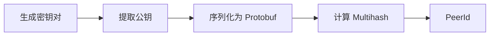
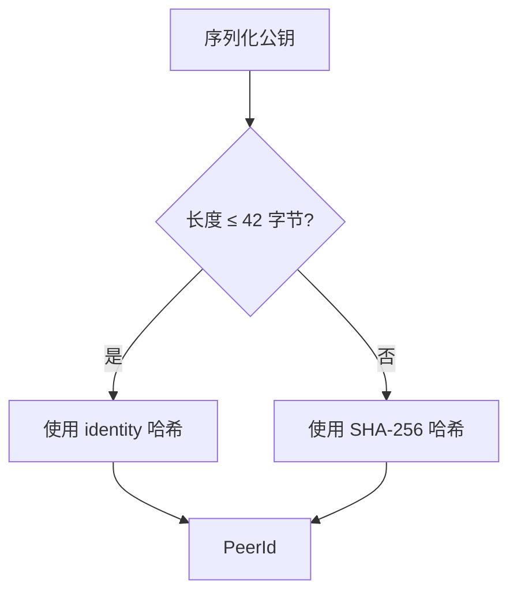

> 名不正，则言不顺；言不顺，则事不成。
> ——《论语·子路》

孔子两千多年前就指出：名分是一切行动的基础。在 P2P 网络中，"名"就是节点的身份——没有可靠的身份认证，节点之间的通信就无法建立信任，整个网络就会陷入混乱。

上一章我们运行了第一个 libp2p 节点，看到了这样的输出：

```text
INFO ping: Local peer id: 12D3KooWAbCd...
```

这串 `12D3KooW...` 开头的字符串就是 **PeerId**——节点的身份标识。它是怎么来的？为什么它能让我们信任对方？

## 一个真实的安全事故

2018 年，以太坊网络遭遇了一次"[日蚀攻击](https://www.cs.bu.edu/~goldbe/projects/eclipseEth.pdf)"（Eclipse Attack）。攻击者通过精心策划，逐步控制了受害节点的所有网络连接。受害者以为自己连接的是真正的以太坊网络，实际上连接的全是攻击者控制的恶意节点。受害者看到的交易、区块，都是攻击者伪造的。

想象一下这个场景：你经营一家小店，接受以太坊支付。一位"顾客"用价值 1000 美元的 ETH 买了商品。你的节点显示交易已确认，你交出了商品。但几小时后，你发现你的节点被隔离了——那笔交易从未真正发生在主网上。

这次攻击暴露了一个根本问题：**在没有中心服务器的网络中，你怎么知道你连接的节点，真的是你想连接的那个？**

## 身份的困境

在传统互联网中，我们用 IP 地址定位服务器。但 IP 地址作为身份标识有两个致命缺陷：

**不稳定。** 你的手机从 WiFi 切换到 4G，IP 就变了。家里路由器重启，IP 可能也变了。笔记本从家里带到咖啡店，IP 必然会变。在 P2P 网络中，节点可能在不同设备、不同网络环境中运行，IP 地址根本无法作为稳定标识。

**不可信。** IP 地址只是一个"位置"，不是"身份"。任何人都可以声称自己在某个 IP 地址后面提供服务，你无法验证对方的真实身份。在客户端-服务器架构中，我们通过 DNS + TLS 证书解决这个问题——CA 机构作为可信第三方，证明某个域名确实属于某家公司。

但 P2P 网络没有中心化的 CA。没有人能"颁发证书"证明节点 A 就是节点 A。我们需要一种**自证明的身份**——不依赖任何第三方，任何人都可以独立验证。

libp2p 的答案是：**用密码学取代位置，用自证明身份取代第三方认证**。

## PeerId：你的数字指纹

每个 libp2p 节点都有一个 **PeerId**——一个由公钥派生的唯一标识符。它看起来像这样：

```
12D3KooWMgcJeCtWqiptgnn4HHY6jRkMaRzHumXrntP3Np7qUqMT
```

PeerId 的生成过程很简单：



回顾上一章的代码：

```rust
let keypair = libp2p::identity::Keypair::generate_ed25519();
let peer_id = keypair.public().to_peer_id();
tracing::info!("Local peer id: {peer_id}");
```

这正是 PeerId 的生成过程：从密钥对中提取公钥，再从公钥派生出 PeerId。

### 为什么 PeerId 可信？

PeerId 的魔力在于它与密钥对绑定。当节点 A 连接到节点 B 时：

1. B 出示自己的公钥
2. A 用这个公钥计算 PeerId，验证是否匹配
3. B 用私钥签名一个挑战消息，证明自己确实持有私钥

回顾上一章的时序图，这个过程发生在 **Noise 握手** 阶段——双方交换公钥和签名，验证对方的 PeerId。这就是为什么我们在构建 Swarm 时要指定 `noise::Config::new`。

**关键洞察**：PeerId 不是"分配"的，而是"计算"出来的。只有持有对应私钥的人，才能证明自己是某个 PeerId 的主人。

## 密钥类型

libp2p 支持四种密钥类型：

| 类型 | 特点 | 推荐场景 |
|-----|------|---------|
| **[Ed25519](https://ed25519.cr.yp.to/)** | 快速、安全、密钥短（32 字节） | **默认选择**，绝大多数场景 |
| RSA | 兼容性好，但密钥长、速度慢 | 需要与旧系统互操作 |
| [Secp256k1](https://en.bitcoin.it/wiki/Secp256k1) | 比特币/以太坊使用的曲线 | 区块链应用，复用已有密钥 |
| ECDSA | 标准椭圆曲线 | 特殊兼容性需求 |

:::tip[配套工具]
你可以使用本教程的配套工具「PeerId 生成器」来生成不同密钥类型的 PeerId，直观感受它们的格式差异。
:::

**实践建议**：除非有特殊理由，始终使用 Ed25519。它是 libp2p 的默认选择，也是目前最均衡的方案——上一章我们用的正是 `generate_ed25519()`。

## 规范解读：密钥与 PeerId 的序列化

libp2p 有一份官方规范 [peer-ids](https://github.com/libp2p/specs/blob/master/peer-ids/peer-ids.md)，定义了密钥和 PeerId 的编码格式。理解这份规范有助于你调试问题、实现互操作性，以及理解为什么 PeerId 长得像那样。

### 密钥的 Protobuf 编码

所有密钥都使用 [Protobuf](https://protobuf.dev/) 格式编码，包含两个字段：

```protobuf
enum KeyType {
    RSA = 0;
    Ed25519 = 1;
    Secp256k1 = 2;
    ECDSA = 3;
}

message PublicKey {
    required KeyType Type = 1;
    required bytes Data = 2;
}
```

`Data` 字段的内容因密钥类型而异：

| 密钥类型    | Data 字段内容            |
| ----------- | ------------------------ |
| Ed25519     | 原始公钥字节（32 字节）  |
| RSA         | DER 编码的 PKIX 格式     |
| Secp256k1   | Bitcoin 标准 EC 编码     |
| ECDSA       | ASN.1 DER 编码           |

规范对编码器有额外要求：**编码必须是确定性的**。这意味着同一个密钥，无论何时何地编码，结果必须完全相同。这对 PeerId 的一致性至关重要。

### PeerId 的生成规则

PeerId 是公钥的 [Multihash](https://multiformats.io/multihash/)。规范定义了一个关键的 42 字节阈值：



- **≤ 42 字节**：使用 `identity` multihash（实际上不做哈希，直接嵌入公钥）
- **> 42 字节**：使用 SHA-256 multihash（哈希后嵌入）

为什么是 42 字节？这是一个务实的选择——Ed25519 公钥序列化后恰好在这个范围内（约 36 字节），可以直接嵌入。而 RSA 公钥动辄几百字节，必须先哈希。

:::note[实现互操作性]
如果你需要与其他语言的 libp2p 实现互操作，确保你的密钥序列化遵循规范。[rust-libp2p](https://github.com/libp2p/rust-libp2p) 的 `to_protobuf_encoding()` 和 `from_protobuf_encoding()` 已经正确实现了这些规则。
:::

### 字符串表示：两种格式

规范定义了 PeerId 的两种字符串表示：

**传统格式（[Base58btc](https://en.bitcoin.it/wiki/Base58Check_encoding) 编码的 Multihash）：**

```
12D3KooWD3eckifWpRn9wQpMG9R9hX3sD158z7EqHWmweQAJU5SA  # Ed25519
QmYyQSo1c1Ym7orWxLYvCrM2EmxFTANf8wXmmE7DWjhx5N        # RSA
```

**新格式（CIDv1 编码）：**

```
bafzbeie5745rpv2m6tjyuugywy4d5ewrqgqqhfnf445he3omzpjbx5xqxe
```

新格式使用 [CIDv1](https://github.com/multiformats/cid)，包含 `libp2p-key` [multicodec](https://github.com/multiformats/multicodec)（0x72），默认使用 [Base32](https://en.wikipedia.org/wiki/Base32) 编码。

目前，规范要求实现**必须支持解析两种格式**，但**应该使用传统格式显示**——直到新格式被广泛支持。rust-libp2p 默认输出传统格式。

## 密钥持久化

每次启动都生成新密钥？那你的 PeerId 每次都会变，其他节点无法识别你。生产环境中，密钥必须持久化。

### 保存密钥

```rust
use libp2p::identity::Keypair;
use std::fs;

let keypair = Keypair::generate_ed25519();

// 序列化为 Protobuf 格式
let encoded = keypair.to_protobuf_encoding()
    .expect("Failed to encode keypair");

// 保存到文件（注意：这是敏感数据！）
fs::write("keypair.bin", &encoded)
    .expect("Failed to write keypair");
```

### 加载密钥

```rust
use libp2p::identity::Keypair;
use std::fs;

let encoded = fs::read("keypair.bin")
    .expect("Failed to read keypair");

let keypair = Keypair::from_protobuf_encoding(&encoded)
    .expect("Failed to decode keypair");

println!("Loaded PeerId: {}", keypair.public().to_peer_id());
```

### 完整示例：启动时加载或生成

```rust
use libp2p::identity::Keypair;
use std::path::Path;
use std::fs;

fn load_or_generate_keypair(path: &Path) -> Keypair {
    if path.exists() {
        // 加载已有密钥
        let encoded = fs::read(path).expect("Failed to read keypair");
        Keypair::from_protobuf_encoding(&encoded)
            .expect("Failed to decode keypair")
    } else {
        // 生成新密钥并保存
        let keypair = Keypair::generate_ed25519();
        let encoded = keypair.to_protobuf_encoding()
            .expect("Failed to encode keypair");
        fs::write(path, &encoded).expect("Failed to write keypair");
        keypair
    }
}
```

:::caution[安全警告]
私钥文件必须妥善保护：

- 设置严格的文件权限（如 `chmod 600`）
- 不要提交到版本控制
- 生产环境考虑使用密钥管理服务（KMS）或硬件安全模块（HSM）

:::

## 小结

本章深入解析了上一章代码中出现的 PeerId：

- **PeerId** 是节点的唯一标识，由公钥派生，可验证、位置无关
- **Ed25519** 是推荐的密钥类型，兼顾安全性和性能
- **Noise 握手** 在连接时验证 PeerId，防止中间人攻击
- **密钥持久化** 确保节点重启后身份不变

回到开篇的日蚀攻击——如果每个节点都有一个可验证的身份，攻击者就无法轻易伪装成合法节点。这正是 libp2p 身份系统的价值：**你不是"连接到某个地址"，而是"连接到某个身份"**。

下一章，我们将学习 Multiaddr——上一章中 `/ip4/127.0.0.1/tcp/54321` 这种地址格式是怎么回事。
