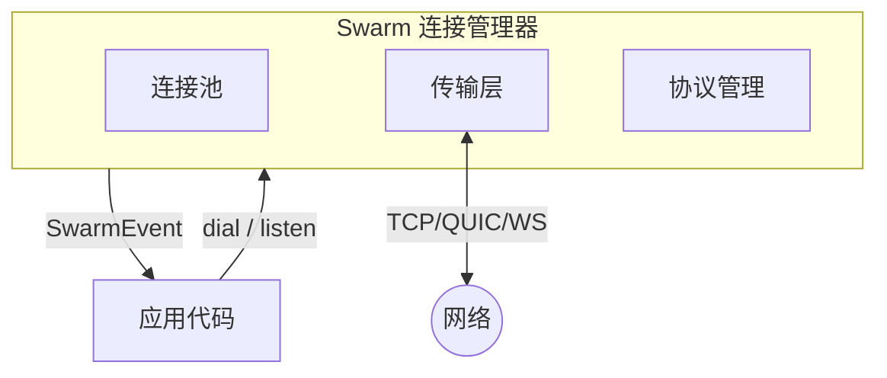
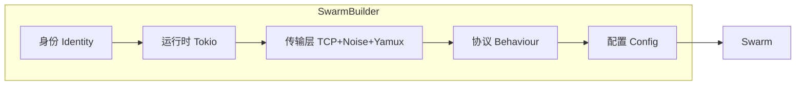
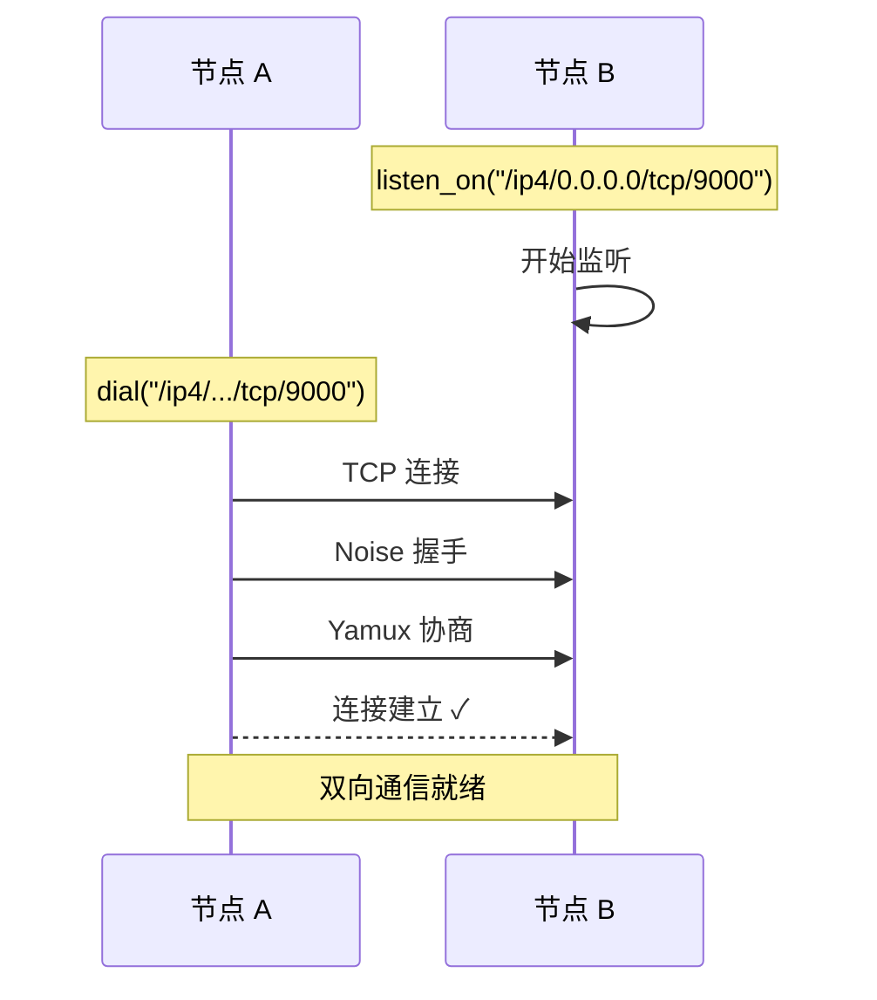
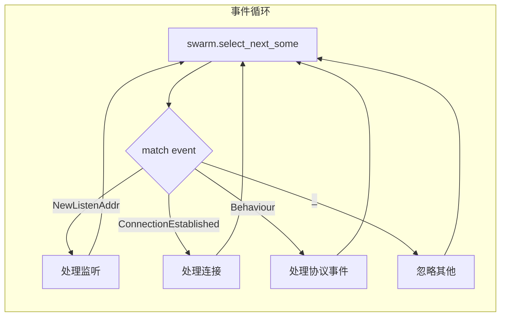
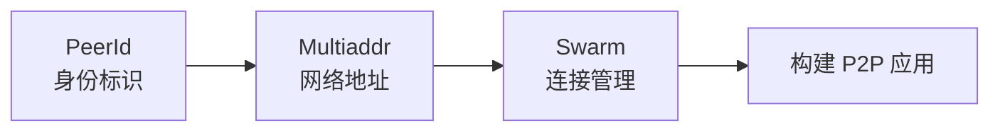

蚂蚁虽小，却能成群结队搬运比自己大数十倍的食物；蜜蜂虽微，却能协作建造精密的六边形蜂巢。这种现象被称为"[群体智能](https://en.wikipedia.org/wiki/Swarm_intelligence)"（Swarm Intelligence）——没有中央指挥，个体遵循简单规则，却涌现出复杂的集体行为。

libp2p 借用了这个概念：**Swarm**（群）是网络中所有连接的集合，没有中心服务器，却能协作完成复杂的通信任务。

## Swarm 的职责

**Swarm** 是你与 P2P 网络交互的唯一入口：



核心职责：

| 职责 | 说明 |
|-----|------|
| 连接管理 | 维护已连接节点列表，处理连接/断开 |
| 传输抽象 | 统一 TCP、QUIC、WebSocket 等传输协议 |
| 协议协商 | 自动完成加密握手（Noise）、流复用（Yamux） |
| 事件分发 | 将网络事件传递给应用层 |

## 构建 Swarm

回顾第三章 Ping 示例：

```rust
let mut swarm = SwarmBuilder::with_existing_identity(keypair)
    .with_tokio()
    .with_tcp(tcp::Config::default(), noise::Config::new, yamux::Config::default)?
    .with_behaviour(|_| ping::Behaviour::default())?
    .with_swarm_config(|cfg| cfg.with_idle_connection_timeout(Duration::from_secs(60)))
    .build();
```

`SwarmBuilder` 采用建造者模式，逐步组装各层：



| 方法 | 作用 |
|-----|------|
| `with_existing_identity` | 设置节点密钥对（决定 PeerId） |
| `with_tokio` | 使用 Tokio 异步运行时 |
| `with_tcp` | 配置 TCP 传输 + Noise 加密 + Yamux 复用 |
| `with_behaviour` | 注册协议行为（如 Ping） |
| `with_swarm_config` | 连接超时等配置 |

## 监听与拨号

Swarm 构建完成后，两个核心操作：

```rust
// 监听：在本地地址等待入站连接
swarm.listen_on("/ip4/0.0.0.0/tcp/0".parse()?)?;

// 拨号：主动连接远程节点
swarm.dial("/ip4/192.168.1.100/tcp/9000".parse()?)?;
```



- `listen_on("/ip4/0.0.0.0/tcp/0")` — 监听所有网卡，端口由系统分配
- `dial(addr)` — 连接到指定 Multiaddr，自动完成握手

## 事件驱动模型

Swarm 使用**事件驱动**——你不断从 Swarm 取出事件并处理：

```rust
loop {
    match swarm.select_next_some().await {
        SwarmEvent::NewListenAddr { address, .. } => {
            println!("Listening on {address}");
        }
        SwarmEvent::ConnectionEstablished { peer_id, .. } => {
            println!("Connected to {peer_id}");
        }
        SwarmEvent::Behaviour(event) => {
            println!("Protocol event: {event:?}");
        }
        _ => {}
    }
}
```



### 常见事件

| 事件 | 触发时机 |
|-----|---------|
| `NewListenAddr` | 成功绑定监听地址 |
| `ConnectionEstablished` | 与节点建立连接（入站或出站） |
| `ConnectionClosed` | 连接断开 |
| `Behaviour(event)` | 协议产生的事件（如 Ping 结果） |
| `OutgoingConnectionError` | 拨号失败 |
| `IncomingConnectionError` | 入站连接失败 |

`Behaviour(event)` 是最重要的——它把协议层的事件传递给你。在 Ping 示例中，就是 ping 的成功/失败和延迟信息。

### 为什么是事件驱动？

P2P 网络的复杂性远超客户端-服务器模型：

- 多个节点可能**同时**发来消息
- 连接可能**随时**断开或建立
- 多个协议可能**并行**运行

事件驱动让你以统一的方式处理这些异步情况，而不需要为每个连接创建线程。

## 小结

- **Swarm** 是 libp2p 的连接管理器，封装了传输、加密、复用等底层细节
- **SwarmBuilder** 采用建造者模式组装各层组件
- **事件驱动** 是标准范式：`loop` + `match SwarmEvent`

核心概念篇到此结束。你已理解：



后续章节将深入传输层、具体协议和实际应用场景。
