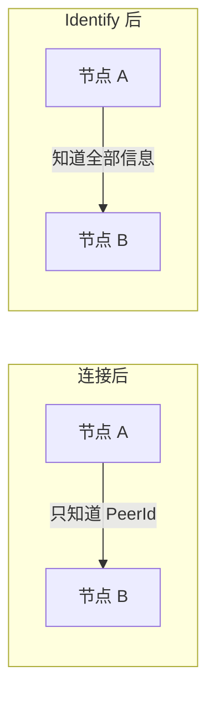
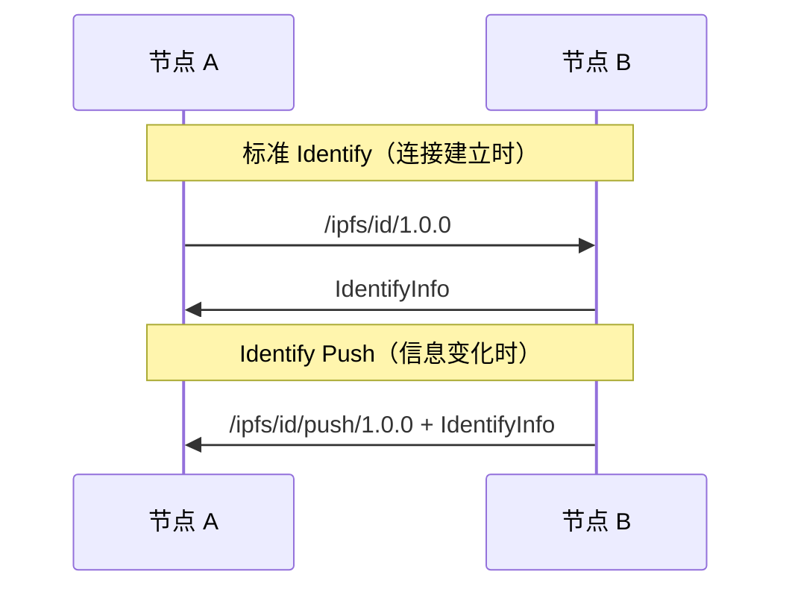
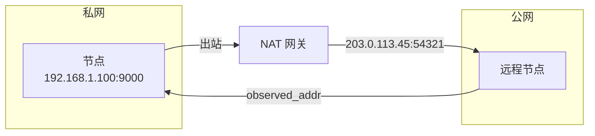

> 知己知彼，百战不殆。
> ——《孙子兵法》

在战场上，了解敌我双方的情况才能取胜。在 P2P 网络中，节点之间也需要相互了解——你是谁？你支持什么协议？你在哪些地址监听？

**Identify 协议**正是解决这个问题的。

## 为什么需要 Identify？

当两个节点建立连接后，它们只知道对方的 PeerId 和连接地址。但这远远不够：



Identify 让节点交换以下信息：

| 信息 | 用途 |
|-----|------|
| **协议版本** | 确认 libp2p 版本兼容性 |
| **Agent 版本** | 标识节点软件（如 "rust-libp2p/0.54.0"） |
| **公钥** | 验证 PeerId |
| **监听地址** | 告诉对方我的其他可达地址 |
| **支持的协议** | 告诉对方我能处理哪些协议 |
| **观察地址** | 告诉对方"我看到你从这个地址连接来" |

## 协议标识符

Identify 使用两个协议标识符：

```
/ipfs/id/1.0.0       # 主动推送
/ipfs/id/push/1.0.0  # 响应推送
```

### Identify 与 Identify Push



- **Identify**：连接建立后，主动请求对方信息
- **Identify Push**：当节点信息变化（如新增监听地址），主动推送给已连接的节点

## 消息格式

Identify 使用 Protocol Buffers 编码：

```protobuf
message Identify {
  optional string protocolVersion = 1;
  optional string agentVersion = 2;
  optional bytes publicKey = 3;
  repeated bytes listenAddrs = 4;
  optional bytes observedAddr = 5;
  repeated string protocols = 6;
}
```

实际消息示例：

```json
{
  "protocolVersion": "ipfs/0.1.0",
  "agentVersion": "rust-libp2p/0.54.0",
  "publicKey": "<Ed25519 公钥>",
  "listenAddrs": [
    "/ip4/192.168.1.100/tcp/9000",
    "/ip4/10.0.0.5/udp/9000/quic-v1"
  ],
  "observedAddr": "/ip4/203.0.113.45/tcp/54321",
  "protocols": [
    "/ipfs/ping/1.0.0",
    "/ipfs/id/1.0.0",
    "/ipfs/kad/1.0.0",
    "/meshsub/1.1.0"
  ]
}
```

## 配置 Identify Behaviour

```rust
use libp2p::{identify, identity::Keypair};

let keypair = Keypair::generate_ed25519();

let identify = identify::Behaviour::new(
    identify::Config::new(
        "/my-app/1.0.0".to_string(),  // 协议版本
        keypair.public(),              // 本地公钥
    )
    .with_agent_version("my-app/0.1.0".to_string())  // Agent 版本
    .with_interval(std::time::Duration::from_secs(300))  // 定期重新 identify
    .with_push_listen_addr_updates(true)  // 地址变化时推送
);
```

### 配置选项

| 选项 | 说明 | 默认值 |
|-----|------|--------|
| `protocol_version` | 你的应用协议版本 | 必填 |
| `agent_version` | 节点软件标识 | "rust-libp2p/{version}" |
| `interval` | 定期重新 identify 的间隔 | 5 分钟 |
| `push_listen_addr_updates` | 地址变化时是否推送 | true |

## 事件处理

Identify 产生三种主要事件：

```rust
use libp2p::{identify, swarm::SwarmEvent};

loop {
    match swarm.select_next_some().await {
        SwarmEvent::Behaviour(identify::Event::Received { peer_id, info }) => {
            println!("Received identify from {peer_id}:");
            println!("  Protocol: {}", info.protocol_version);
            println!("  Agent: {}", info.agent_version);
            println!("  Protocols: {:?}", info.protocols);
            println!("  Listen addrs: {:?}", info.listen_addrs);
            println!("  Observed addr: {:?}", info.observed_addr);
        }
        SwarmEvent::Behaviour(identify::Event::Sent { peer_id }) => {
            println!("Sent identify to {peer_id}");
        }
        SwarmEvent::Behaviour(identify::Event::Pushed { peer_id, info }) => {
            println!("Received identify push from {peer_id}");
        }
        SwarmEvent::Behaviour(identify::Event::Error { peer_id, error }) => {
            println!("Identify error with {peer_id}: {error}");
        }
        _ => {}
    }
}
```

## 观察地址的重要性

`observed_addr` 是一个特别重要的字段——它告诉你"对方看到的你的地址"。

### NAT 检测



如果多个远程节点报告的 `observed_addr` 都是同一个公网地址，节点就知道自己在 NAT 后面，且这个地址可能是可达的。

### 地址发现

```rust
SwarmEvent::Behaviour(identify::Event::Received { info, .. }) => {
    if let Some(observed) = info.observed_addr {
        // 将观察到的地址添加到本地监听地址
        // 这有助于其他节点找到我
        swarm.add_external_address(observed);
    }
}
```

## Identify 与其他协议的配合

Identify 是许多高级功能的基础：

### 与 Kademlia 配合

```rust
SwarmEvent::Behaviour(MyBehaviourEvent::Identify(
    identify::Event::Received { peer_id, info }
)) => {
    // 将对方的监听地址添加到 Kademlia 路由表
    for addr in info.listen_addrs {
        swarm.behaviour_mut().kademlia.add_address(&peer_id, addr);
    }
}
```

### 与 AutoNAT 配合

AutoNAT 使用 Identify 收集的 `observed_addr` 来确定自己的 NAT 状态。

### 协议能力发现

```rust
SwarmEvent::Behaviour(MyBehaviourEvent::Identify(
    identify::Event::Received { peer_id, info }
)) => {
    // 检查对方是否支持我需要的协议
    if info.protocols.contains(&"/my-custom/1.0.0".to_string()) {
        println!("{peer_id} supports my custom protocol!");
        // 可以安全地与这个节点进行自定义协议通信
    }
}
```

## 完整示例

```rust
use libp2p::{
    identify, ping,
    identity::Keypair,
    swarm::{NetworkBehaviour, SwarmEvent},
    noise, tcp, yamux, SwarmBuilder,
};
use std::time::Duration;
use futures::StreamExt;

#[derive(NetworkBehaviour)]
struct MyBehaviour {
    identify: identify::Behaviour,
    ping: ping::Behaviour,
}

#[tokio::main]
async fn main() -> anyhow::Result<()> {
    let keypair = Keypair::generate_ed25519();
    let peer_id = keypair.public().to_peer_id();
    println!("Local PeerId: {peer_id}");

    let mut swarm = SwarmBuilder::with_existing_identity(keypair.clone())
        .with_tokio()
        .with_tcp(
            tcp::Config::default(),
            noise::Config::new,
            yamux::Config::default,
        )?
        .with_behaviour(|key| MyBehaviour {
            identify: identify::Behaviour::new(
                identify::Config::new("/my-app/1.0.0".into(), key.public())
                    .with_agent_version("my-app/0.1.0".into())
            ),
            ping: ping::Behaviour::default(),
        })?
        .with_swarm_config(|cfg| {
            cfg.with_idle_connection_timeout(Duration::from_secs(60))
        })
        .build();

    swarm.listen_on("/ip4/0.0.0.0/tcp/0".parse()?)?;

    if let Some(addr) = std::env::args().nth(1) {
        swarm.dial(addr.parse::<libp2p::Multiaddr>()?)?;
    }

    loop {
        match swarm.select_next_some().await {
            SwarmEvent::NewListenAddr { address, .. } => {
                println!("Listening on {address}");
            }
            SwarmEvent::ConnectionEstablished { peer_id, .. } => {
                println!("Connected to {peer_id}");
            }
            SwarmEvent::Behaviour(MyBehaviourEvent::Identify(
                identify::Event::Received { peer_id, info }
            )) => {
                println!("\n=== Identify from {peer_id} ===");
                println!("Protocol: {}", info.protocol_version);
                println!("Agent: {}", info.agent_version);
                println!("Observed addr: {:?}", info.observed_addr);
                println!("Listen addrs:");
                for addr in &info.listen_addrs {
                    println!("  - {addr}");
                }
                println!("Protocols:");
                for proto in &info.protocols {
                    println!("  - {proto}");
                }
            }
            SwarmEvent::Behaviour(MyBehaviourEvent::Ping(event)) => {
                println!("Ping: {:?}", event);
            }
            _ => {}
        }
    }
}
```

## Identify 协议的设计智慧

### 1. 延迟交换

Identify 在**连接建立后**才交换信息，而不是在握手阶段。这保持了传输层的简洁。

### 2. 主动推送

当信息变化时主动推送，而不是让对方定期轮询，更高效。

### 3. 观察地址

通过对方观察到的地址来发现自己的公网地址，是 NAT 穿透的基础。

### 4. 协议列表

告知对方支持的协议，便于能力发现，避免无效请求。

## 小结

本章介绍了 Identify 协议：

- **作用**：节点间交换身份信息和能力声明
- **消息**：包含协议版本、公钥、监听地址、支持的协议等
- **观察地址**：用于 NAT 检测和地址发现
- **与其他协议配合**：Kademlia、AutoNAT 等都依赖 Identify

Identify 是 libp2p 网络的"名片交换"协议——每个节点连接后都会自动进行。理解了 Identify，你就理解了节点如何相互认识。

下一章，我们将学习**请求-响应模式**——一种在 P2P 网络中实现 RPC 风格通信的方式。
