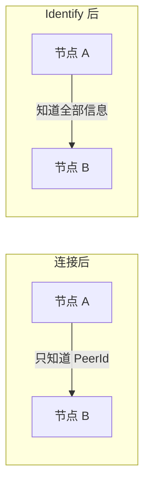
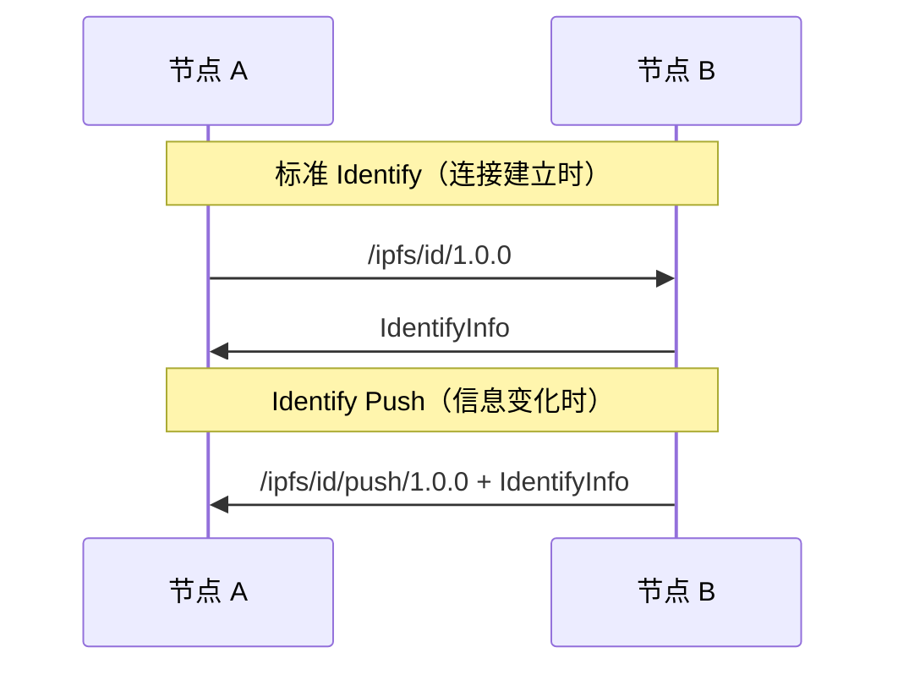
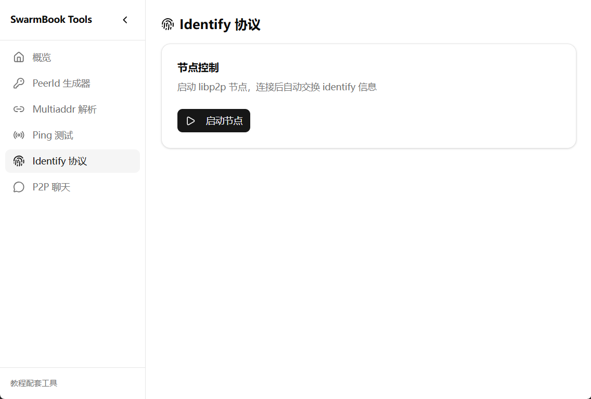
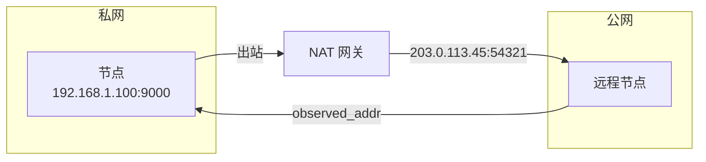

import { Steps, Tabs, TabItem } from '@astrojs/starlight/components';

> 知己知彼，百战不殆。
> ——《孙子兵法》

在战场上，了解敌我双方的情况才能取胜。在 P2P 网络中，节点之间也需要相互了解——你是谁？你支持什么协议？你在哪些地址监听？

**Identify 协议**正是解决这个问题的。

## 为什么需要 Identify？

当两个节点建立连接后，它们只知道对方的 PeerId 和连接地址。但这远远不够：



Identify 让节点交换以下信息：

| 信息 | 用途 |
|-----|------|
| **协议版本** | 确认 libp2p 版本兼容性 |
| **Agent 版本** | 标识节点软件（如 "rust-libp2p/0.54.0"） |
| **公钥** | 验证 PeerId |
| **监听地址** | 告诉对方我的其他可达地址 |
| **支持的协议** | 告诉对方我能处理哪些协议 |
| **观察地址** | 告诉对方"我看到你从这个地址连接来" |

## 协议标识符

Identify 使用两个协议标识符：

```
/ipfs/id/1.0.0       # 主动请求
/ipfs/id/push/1.0.0  # 主动推送
```

### Identify 与 Identify Push



- **Identify**：连接建立后，主动请求对方信息
- **Identify Push**：当节点信息变化（如新增监听地址），主动推送给已连接的节点

## 消息格式

Identify 使用 Protocol Buffers 编码：

```protobuf
message Identify {
  optional string protocolVersion = 1;
  optional string agentVersion = 2;
  optional bytes publicKey = 3;
  repeated bytes listenAddrs = 4;
  optional bytes observedAddr = 5;
  repeated string protocols = 6;
}
```

实际消息示例：

```json
{
  "protocolVersion": "ipfs/0.1.0",
  "agentVersion": "rust-libp2p/0.54.0",
  "publicKey": "<Ed25519 公钥>",
  "listenAddrs": [
    "/ip4/192.168.1.100/tcp/9000",
    "/ip4/10.0.0.5/udp/9000/quic-v1"
  ],
  "observedAddr": "/ip4/203.0.113.45/tcp/54321",
  "protocols": [
    "/ipfs/ping/1.0.0",
    "/ipfs/id/1.0.0",
    "/ipfs/kad/1.0.0",
    "/meshsub/1.1.0"
  ]
}
```

## 动手实践

:::tip[配套工具]
本教程配套的桌面应用提供了可视化的 **Identify 协议** 功能。你可以用它来启动节点、连接其他节点，并实时查看对方的身份信息——无需命令行操作。

打开应用后，在侧边栏选择「Identify 协议」即可使用。
:::

还记得[第一个 libp2p 节点](/01-core-concepts/03-first-node)中的 Ping 示例吗？我们只需要在它的基础上做一点修改，就能实现 Identify 功能。

<Steps>

1. **添加依赖** — 在 `Cargo.toml` 中添加 `identify` feature

   ```toml ins="identify"
   [dependencies]
   libp2p = { version = "0.56", features = ["tcp", "noise", "yamux", "ping", "identify", "macros", "tokio"] }
   ```

   :::note
   需要添加 `macros` feature 来使用 `#[derive(NetworkBehaviour)]` 宏。
   :::

2. **定义组合行为** — 使用 `NetworkBehaviour` 宏组合 ping 和 identify

   ```rust ins={1,4-8}
   use libp2p::{identify, ping, swarm};

   // 组合多个 NetworkBehaviour
   #[derive(swarm::NetworkBehaviour)]
   pub struct MyBehaviour {
       ping: ping::Behaviour,
       identify: identify::Behaviour,
   }
   ```

   `#[derive(NetworkBehaviour)]` 宏会自动生成 `MyBehaviourEvent` 枚举，包含所有子行为的事件。

3. **修改 Swarm 构建** — 实例化组合行为

   原来的 Ping 代码：

   ```rust del={4}
   let mut swarm = libp2p::SwarmBuilder::with_existing_identity(keypair)
       .with_tokio()
       .with_tcp(tcp::Config::default(), noise::Config::new, yamux::Config::default)?
       .with_behaviour(|_| ping::Behaviour::default())?
       .build();
   ```

   改为：

   ```rust ins={4-12}
   let mut swarm = libp2p::SwarmBuilder::with_existing_identity(keypair)
       .with_tokio()
       .with_tcp(tcp::Config::default(), noise::Config::new, yamux::Config::default)?
       .with_behaviour(|keypair| MyBehaviour {
           ping: ping::Behaviour::default(),
           identify: identify::Behaviour::new(
               identify::Config::new("/my-app/1.0.0".into(), keypair.public())
                   .with_agent_version("/my-app/0.1.0".into())
                   .with_push_listen_addr_updates(true)
                   .with_interval(Duration::from_secs(3)),
           ),
       })?
       .build();
   ```

   注意闭包参数从 `|_|` 变成了 `|keypair|`，因为 Identify 需要公钥。

4. **处理事件** — 区分 Ping 和 Identify 事件

   原来的事件处理：

   ```rust del={3}
   loop {
       match swarm.select_next_some().await {
           SwarmEvent::Behaviour(event) => tracing::info!("{event:?}"),
           // ...
       }
   }
   ```

   改为：

   ```rust ins={3-16}
   loop {
       match swarm.select_next_some().await {
           SwarmEvent::Behaviour(event) => match event {
               MyBehaviourEvent::Ping(event) => {
                   tracing::info!("Ping: {event:?}");
               }
               MyBehaviourEvent::Identify(identify::Event::Received { peer_id, info, .. }) => {
                   tracing::info!(
                       "Identified {peer_id}:\n  protocol: {}\n  agent: {}\n  addrs: {:?}",
                       info.protocol_version,
                       info.agent_version,
                       info.listen_addrs
                   );
               }
               MyBehaviourEvent::Identify(event) => tracing::debug!("Identify: {event:?}"),
           },
           // ...
       }
   }
   ```

</Steps>

## 完整代码

```rust
use anyhow::Result;
use libp2p::{
    Multiaddr, SwarmBuilder, futures::StreamExt, identify, noise, ping, swarm, tcp, yamux,
};
use std::{env, time::Duration};

#[derive(swarm::NetworkBehaviour)]
pub struct MyBehaviour {
    ping: ping::Behaviour,
    identify: identify::Behaviour,
}

#[tokio::main]
async fn main() -> Result<()> {
    tracing_subscriber::fmt().init();

    let keypair = libp2p::identity::Keypair::generate_ed25519();
    let peer_id = keypair.public().to_peer_id();
    tracing::info!("Local peer id: {peer_id}");

    let mut swarm = SwarmBuilder::with_existing_identity(keypair)
        .with_tokio()
        .with_tcp(
            tcp::Config::default(),
            noise::Config::new,
            yamux::Config::default,
        )?
        .with_behaviour(|keypair| MyBehaviour {
            ping: ping::Behaviour::default(),
            identify: identify::Behaviour::new(
                identify::Config::new("/my-app/1.0.0".into(), keypair.public())
                    .with_push_listen_addr_updates(true)
                    .with_agent_version("/my-app/0.1.0".into())
                    .with_interval(Duration::from_secs(3)),
            ),
        })?
        .with_swarm_config(|cfg| cfg.with_idle_connection_timeout(Duration::from_secs(u64::MAX)))
        .build();

    swarm.listen_on("/ip4/0.0.0.0/tcp/0".parse()?)?;

    if let Some(addr) = env::args().nth(1) {
        let remote: Multiaddr = addr.parse()?;
        swarm.dial(remote)?;
        tracing::info!("Dialed {addr}");
    }

    loop {
        match swarm.select_next_some().await {
            libp2p::swarm::SwarmEvent::NewListenAddr { address, .. } => {
                tracing::info!("Listening on {address}");
            }
            libp2p::swarm::SwarmEvent::Behaviour(event) => match event {
                MyBehaviourEvent::Ping(event) => {
                    tracing::info!("Ping: {event:?}");
                }
                MyBehaviourEvent::Identify(identify::Event::Received { peer_id, info, .. }) => {
                    tracing::info!(
                        "Identified {peer_id}:\n  protocol: {}\n  agent: {}\n  addrs: {:?}",
                        info.protocol_version,
                        info.agent_version,
                        info.listen_addrs
                    );
                }
                MyBehaviourEvent::Identify(event) => {
                    tracing::debug!("Identify: {event:?}");
                }
            },
            _ => {}
        }
    }
}
```

## 运行测试

<Steps>

1. **启动第一个节点**

   ```bash
   cargo run
   ```

   输出：

   ```text
   INFO: Local peer id: 12D3KooWAbCd...
   INFO: Listening on /ip4/127.0.0.1/tcp/54321
   ```

2. **启动第二个节点，连接第一个**

   <Tabs>
   <TabItem label="配套工具">

   在配套应用中输入第一个节点的监听地址，点击「连接」。连接成功后，你会看到对方的身份信息：

   

   </TabItem>
   <TabItem label="命令行">

   ```bash
   cargo run -- /ip4/127.0.0.1/tcp/54321
   ```

   输出：

   ```text
   INFO: Local peer id: 12D3KooWXyZw...
   INFO: Dialed /ip4/127.0.0.1/tcp/54321
   INFO: Identified 12D3KooWAbCd...:
     protocol: /my-app/1.0.0
     agent: /my-app/0.1.0
     addrs: ["/ip4/127.0.0.1/tcp/54321", "/ip4/192.168.1.100/tcp/54321"]
   ```

   </TabItem>
   </Tabs>

</Steps>

## 配置选项

| 选项 | 说明 | 默认值 |
|-----|------|--------|
| `protocol_version` | 你的应用协议版本 | 必填 |
| `agent_version` | 节点软件标识 | "rust-libp2p/\{version\}" |
| `interval` | 定期重新 identify 的间隔 | 5 分钟 |
| `push_listen_addr_updates` | 地址变化时是否推送 | true |

## 观察地址的重要性

`observed_addr` 是一个特别重要的字段——它告诉你"对方看到的你的地址"。



如果多个远程节点报告的 `observed_addr` 都是同一个公网地址，节点就知道自己在 NAT 后面。这是 NAT 穿透和地址发现的基础——我们会在后续章节详细介绍。

## 小结

本章介绍了 Identify 协议：

- **作用**：节点间交换身份信息和能力声明
- **消息**：包含协议版本、公钥、监听地址、支持的协议等
- **观察地址**：用于 NAT 检测和地址发现
- **实现**：基于 Ping 示例，只需添加 `identify::Behaviour` 并组合

Identify 是 libp2p 网络的"名片交换"协议——每个节点连接后都会自动进行。理解了 Identify，你就理解了节点如何相互认识。

下一章，我们将学习**请求-响应模式**——一种在 P2P 网络中实现 RPC 风格通信的方式。
