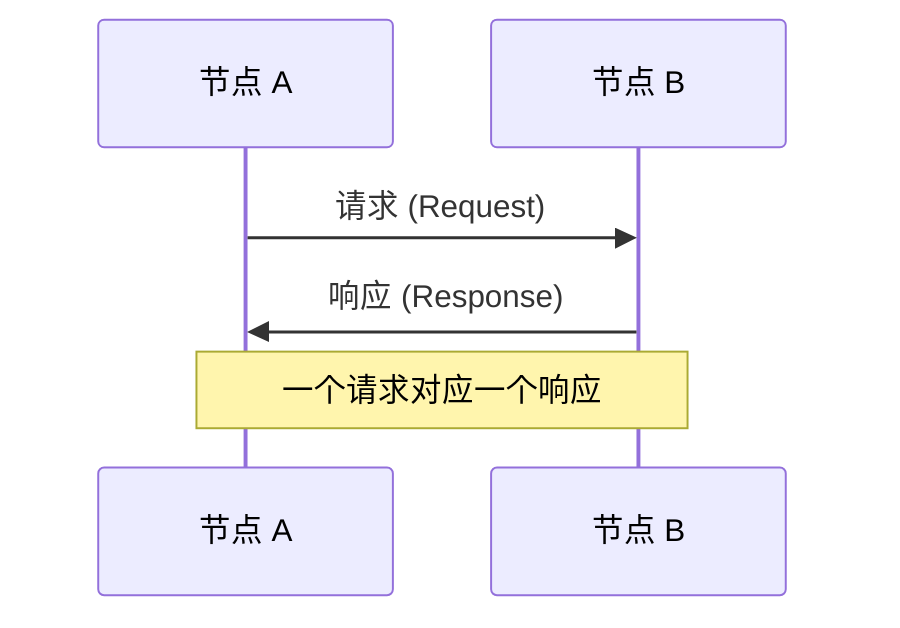
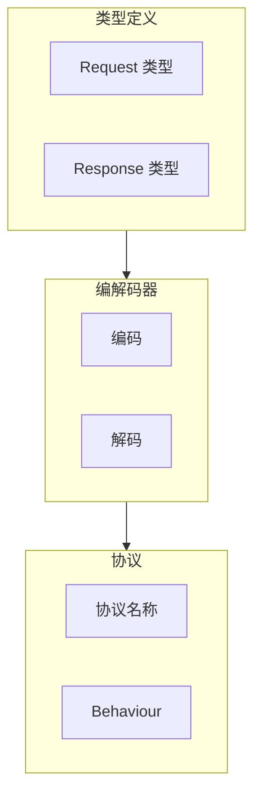

> 有问必答，问一答十。
> ——中国谚语

传统的客户端-服务器模式中，请求-响应是最基本的通信方式。在 P2P 网络中，这种模式同样重要——节点需要向其他节点请求数据、查询状态、执行操作。

libp2p 提供了 `request_response` 模块，让你轻松实现 RPC 风格的通信。

## 什么是请求-响应模式？



特点：
- **一对一**：每个请求有且只有一个响应
- **同步语义**：请求方等待响应
- **有超时**：请求可能失败

与 Ping 的区别：Ping 发送固定数据，request-response 可以发送任意结构化消息。

## 核心组件

`request_response` 模块需要你定义：

1. **请求类型**：你要发送什么
2. **响应类型**：你期望收到什么
3. **编解码器**：如何序列化/反序列化消息
4. **协议名称**：协议标识符



## 定义消息类型

首先定义请求和响应类型：

```rust
use serde::{Deserialize, Serialize};

// 请求：获取文件
#[derive(Debug, Clone, Serialize, Deserialize)]
pub struct FileRequest {
    pub filename: String,
}

// 响应：文件内容
#[derive(Debug, Clone, Serialize, Deserialize)]
pub struct FileResponse {
    pub content: Vec<u8>,
}
```

## 实现编解码器

编解码器负责消息的序列化和反序列化：

```rust
use libp2p::request_response::{Codec, ProtocolSupport};
use libp2p::StreamProtocol;
use async_trait::async_trait;
use futures::{AsyncRead, AsyncWrite, AsyncReadExt, AsyncWriteExt};

#[derive(Debug, Clone)]
pub struct FileExchangeCodec;

#[async_trait]
impl Codec for FileExchangeCodec {
    type Protocol = StreamProtocol;
    type Request = FileRequest;
    type Response = FileResponse;

    async fn read_request<T>(
        &mut self,
        _protocol: &Self::Protocol,
        io: &mut T,
    ) -> std::io::Result<Self::Request>
    where
        T: AsyncRead + Unpin + Send,
    {
        // 读取长度前缀
        let mut len_buf = [0u8; 4];
        io.read_exact(&mut len_buf).await?;
        let len = u32::from_be_bytes(len_buf) as usize;

        // 读取消息体
        let mut buf = vec![0u8; len];
        io.read_exact(&mut buf).await?;

        // 反序列化
        serde_json::from_slice(&buf)
            .map_err(|e| std::io::Error::new(std::io::ErrorKind::InvalidData, e))
    }

    async fn read_response<T>(
        &mut self,
        _protocol: &Self::Protocol,
        io: &mut T,
    ) -> std::io::Result<Self::Response>
    where
        T: AsyncRead + Unpin + Send,
    {
        // 同样的读取逻辑
        let mut len_buf = [0u8; 4];
        io.read_exact(&mut len_buf).await?;
        let len = u32::from_be_bytes(len_buf) as usize;

        let mut buf = vec![0u8; len];
        io.read_exact(&mut buf).await?;

        serde_json::from_slice(&buf)
            .map_err(|e| std::io::Error::new(std::io::ErrorKind::InvalidData, e))
    }

    async fn write_request<T>(
        &mut self,
        _protocol: &Self::Protocol,
        io: &mut T,
        req: Self::Request,
    ) -> std::io::Result<()>
    where
        T: AsyncWrite + Unpin + Send,
    {
        // 序列化
        let buf = serde_json::to_vec(&req)
            .map_err(|e| std::io::Error::new(std::io::ErrorKind::InvalidData, e))?;

        // 写入长度前缀
        io.write_all(&(buf.len() as u32).to_be_bytes()).await?;
        // 写入消息体
        io.write_all(&buf).await?;
        io.close().await?;

        Ok(())
    }

    async fn write_response<T>(
        &mut self,
        _protocol: &Self::Protocol,
        io: &mut T,
        res: Self::Response,
    ) -> std::io::Result<()>
    where
        T: AsyncWrite + Unpin + Send,
    {
        let buf = serde_json::to_vec(&res)
            .map_err(|e| std::io::Error::new(std::io::ErrorKind::InvalidData, e))?;

        io.write_all(&(buf.len() as u32).to_be_bytes()).await?;
        io.write_all(&buf).await?;
        io.close().await?;

        Ok(())
    }
}
```

:::tip[简化编解码]
上面的例子使用 JSON + 长度前缀。实际项目中可以使用：
- **cbor**：更紧凑的二进制格式
- **protobuf**：高效且有 schema
- **bincode**：Rust 原生序列化
:::

## 创建 Behaviour

```rust
use libp2p::request_response::{self, ProtocolSupport, Config};
use libp2p::StreamProtocol;
use std::time::Duration;

// 协议名称
const PROTOCOL: StreamProtocol = StreamProtocol::new("/file-exchange/1.0.0");

// 创建 Behaviour
let behaviour = request_response::Behaviour::new(
    [(PROTOCOL, ProtocolSupport::Full)],  // 支持发送和接收
    Config::default()
        .with_request_timeout(Duration::from_secs(10)),
);
```

### ProtocolSupport 选项

| 值 | 说明 |
|---|------|
| `Full` | 既可发送请求也可接收请求 |
| `Inbound` | 只接收请求（服务端模式） |
| `Outbound` | 只发送请求（客户端模式） |

## 发送请求

```rust
use libp2p::request_response::OutboundRequestId;

// 发送请求
let request_id: OutboundRequestId = swarm
    .behaviour_mut()
    .file_exchange
    .send_request(
        &peer_id,
        FileRequest { filename: "hello.txt".into() },
    );

println!("Sent request {request_id:?} to {peer_id}");
```

## 处理事件

```rust
use libp2p::request_response::{self, Message, Event};

loop {
    match swarm.select_next_some().await {
        SwarmEvent::Behaviour(MyBehaviourEvent::FileExchange(event)) => {
            match event {
                // 收到请求
                Event::Message {
                    peer,
                    message: Message::Request { request, channel, .. },
                } => {
                    println!("Received request from {peer}: {request:?}");

                    // 处理请求，生成响应
                    let response = FileResponse {
                        content: b"Hello, World!".to_vec(),
                    };

                    // 发送响应
                    swarm.behaviour_mut()
                        .file_exchange
                        .send_response(channel, response)
                        .expect("Failed to send response");
                }

                // 收到响应
                Event::Message {
                    peer,
                    message: Message::Response { request_id, response },
                } => {
                    println!("Received response from {peer} for {request_id:?}");
                    println!("Content: {:?}", String::from_utf8_lossy(&response.content));
                }

                // 发送请求失败
                Event::OutboundFailure { peer, request_id, error } => {
                    println!("Request {request_id:?} to {peer} failed: {error}");
                }

                // 接收请求失败
                Event::InboundFailure { peer, error, .. } => {
                    println!("Inbound request from {peer} failed: {error}");
                }

                // 响应已发送
                Event::ResponseSent { peer, request_id } => {
                    println!("Response sent to {peer} for {request_id:?}");
                }
            }
        }
        _ => {}
    }
}
```

## 完整示例：文件交换

```rust
use libp2p::{
    identity::Keypair,
    request_response::{self, Codec, Config, Event, Message, ProtocolSupport},
    swarm::{NetworkBehaviour, SwarmEvent},
    noise, tcp, yamux, Multiaddr, PeerId, StreamProtocol, SwarmBuilder,
};
use async_trait::async_trait;
use futures::{AsyncRead, AsyncReadExt, AsyncWrite, AsyncWriteExt, StreamExt};
use serde::{Deserialize, Serialize};
use std::{collections::HashMap, time::Duration};

// 消息类型
#[derive(Debug, Clone, Serialize, Deserialize)]
struct FileRequest {
    filename: String,
}

#[derive(Debug, Clone, Serialize, Deserialize)]
struct FileResponse {
    content: Vec<u8>,
}

// 编解码器（简化版）
#[derive(Debug, Clone, Default)]
struct FileCodec;

#[async_trait]
impl Codec for FileCodec {
    type Protocol = StreamProtocol;
    type Request = FileRequest;
    type Response = FileResponse;

    async fn read_request<T>(&mut self, _: &Self::Protocol, io: &mut T) -> std::io::Result<Self::Request>
    where T: AsyncRead + Unpin + Send {
        let mut buf = Vec::new();
        io.read_to_end(&mut buf).await?;
        serde_json::from_slice(&buf).map_err(|e| std::io::Error::new(std::io::ErrorKind::InvalidData, e))
    }

    async fn read_response<T>(&mut self, _: &Self::Protocol, io: &mut T) -> std::io::Result<Self::Response>
    where T: AsyncRead + Unpin + Send {
        let mut buf = Vec::new();
        io.read_to_end(&mut buf).await?;
        serde_json::from_slice(&buf).map_err(|e| std::io::Error::new(std::io::ErrorKind::InvalidData, e))
    }

    async fn write_request<T>(&mut self, _: &Self::Protocol, io: &mut T, req: Self::Request) -> std::io::Result<()>
    where T: AsyncWrite + Unpin + Send {
        let buf = serde_json::to_vec(&req).unwrap();
        io.write_all(&buf).await?;
        io.close().await
    }

    async fn write_response<T>(&mut self, _: &Self::Protocol, io: &mut T, res: Self::Response) -> std::io::Result<()>
    where T: AsyncWrite + Unpin + Send {
        let buf = serde_json::to_vec(&res).unwrap();
        io.write_all(&buf).await?;
        io.close().await
    }
}

#[derive(NetworkBehaviour)]
struct MyBehaviour {
    file_exchange: request_response::Behaviour<FileCodec>,
}

#[tokio::main]
async fn main() -> anyhow::Result<()> {
    let keypair = Keypair::generate_ed25519();
    println!("PeerId: {}", keypair.public().to_peer_id());

    // 模拟文件存储
    let mut files: HashMap<String, Vec<u8>> = HashMap::new();
    files.insert("hello.txt".into(), b"Hello from P2P!".to_vec());
    files.insert("world.txt".into(), b"World of libp2p!".to_vec());

    let protocol = StreamProtocol::new("/file-exchange/1.0.0");

    let mut swarm = SwarmBuilder::with_existing_identity(keypair)
        .with_tokio()
        .with_tcp(tcp::Config::default(), noise::Config::new, yamux::Config::default)?
        .with_behaviour(|_| MyBehaviour {
            file_exchange: request_response::Behaviour::new(
                [(protocol, ProtocolSupport::Full)],
                Config::default().with_request_timeout(Duration::from_secs(10)),
            ),
        })?
        .with_swarm_config(|c| c.with_idle_connection_timeout(Duration::from_secs(60)))
        .build();

    swarm.listen_on("/ip4/0.0.0.0/tcp/0".parse()?)?;

    // 连接到远程节点并请求文件
    if let Some(addr) = std::env::args().nth(1) {
        let remote: Multiaddr = addr.parse()?;
        swarm.dial(remote)?;
    }

    loop {
        match swarm.select_next_some().await {
            SwarmEvent::NewListenAddr { address, .. } => {
                println!("Listening on {address}");
            }
            SwarmEvent::ConnectionEstablished { peer_id, .. } => {
                println!("Connected to {peer_id}");
                // 连接后请求文件
                swarm.behaviour_mut().file_exchange.send_request(
                    &peer_id,
                    FileRequest { filename: "hello.txt".into() },
                );
            }
            SwarmEvent::Behaviour(MyBehaviourEvent::FileExchange(event)) => {
                match event {
                    Event::Message { peer, message: Message::Request { request, channel, .. } } => {
                        println!("Request from {peer}: {:?}", request.filename);
                        let content = files.get(&request.filename)
                            .cloned()
                            .unwrap_or_else(|| b"File not found".to_vec());
                        let _ = swarm.behaviour_mut().file_exchange
                            .send_response(channel, FileResponse { content });
                    }
                    Event::Message { message: Message::Response { response, .. }, .. } => {
                        println!("Response: {}", String::from_utf8_lossy(&response.content));
                    }
                    Event::OutboundFailure { error, .. } => {
                        println!("Request failed: {error}");
                    }
                    _ => {}
                }
            }
            _ => {}
        }
    }
}
```

## 设计考虑

### 1. 超时处理

请求可能因网络问题而失败，始终处理 `OutboundFailure`：

```rust
Event::OutboundFailure { peer, request_id, error } => {
    match error {
        request_response::OutboundFailure::Timeout => {
            // 可以重试
        }
        request_response::OutboundFailure::ConnectionClosed => {
            // 连接断开，需要重连
        }
        request_response::OutboundFailure::UnsupportedProtocols => {
            // 对方不支持此协议
        }
        _ => {}
    }
}
```

### 2. 请求限流

防止恶意节点发送大量请求：

```rust
// 在处理请求时检查
let mut request_counts: HashMap<PeerId, u32> = HashMap::new();

Event::Message { peer, message: Message::Request { .. } } => {
    let count = request_counts.entry(peer).or_insert(0);
    *count += 1;

    if *count > 100 {
        // 拒绝过多请求
        return;
    }

    // 处理请求...
}
```

### 3. 消息大小限制

编解码器中应限制消息大小：

```rust
async fn read_request<T>(&mut self, ...) -> std::io::Result<Self::Request> {
    let mut len_buf = [0u8; 4];
    io.read_exact(&mut len_buf).await?;
    let len = u32::from_be_bytes(len_buf) as usize;

    // 限制最大消息大小
    if len > 10 * 1024 * 1024 {  // 10MB
        return Err(std::io::Error::new(
            std::io::ErrorKind::InvalidData,
            "Message too large"
        ));
    }

    // ...
}
```

## 小结

本章介绍了 libp2p 的请求-响应模式：

- **核心组件**：请求/响应类型、编解码器、Behaviour
- **消息流**：发送请求 → 处理请求 → 返回响应
- **错误处理**：超时、连接断开、协议不支持

请求-响应模式是实现 P2P 应用的重要基础——无论是文件共享、状态查询还是远程调用，都可以用这种模式实现。

下一章，我们将深入**流管理**——理解 libp2p 中流的生命周期和管理方式。
