import { Steps, Tabs, TabItem } from '@astrojs/starlight/components';

> 你敲一下门，里面的人应一声——这就是请求-响应。
> ——网络通信的本质

想象你走进一家餐厅。你对服务员说："来一份宫保鸡丁"，服务员记下后去厨房，过一会儿端着菜回来。这个过程就是**请求-响应模式**——你发出请求，等待对方处理，然后收到响应。

在 P2P 网络中，节点之间也需要这种"一问一答"的通信方式：查询对方有哪些文件、请求某个区块的数据、调用远程服务……libp2p 的 `request_response` 模块正是为此而生。

## 从 Ping 到请求-响应

在前面的章节中，我们学习了 Ping 协议——它能测量延迟，但只能发送固定的 32 字节数据。如果我们想发送自定义消息呢？

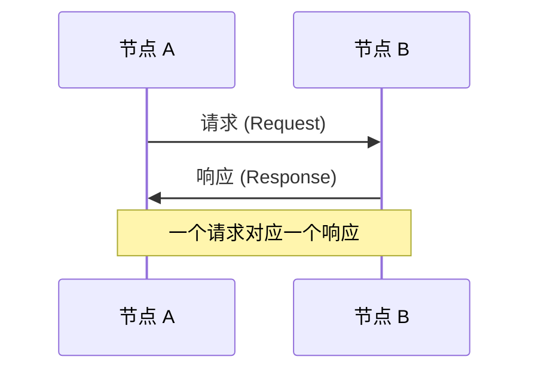

请求-响应模式的特点：
- **一对一**：每个请求有且只有一个响应
- **同步语义**：请求方等待响应
- **有超时**：请求可能失败
- **自定义消息**：可以发送任意结构化数据（这是与 Ping 的关键区别）

## 使用 request_response 的四要素

要使用 `request_response` 模块，需要定义四个要素：

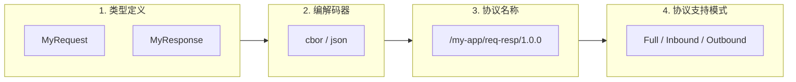

### 编解码器

编解码器负责将 Rust 结构体序列化为字节流发送，以及将收到的字节流反序列化回结构体。libp2p 内置了两种开箱即用的编解码器：

| 编解码器 | 特点 | 适用场景 |
|---------|------|---------|
| `cbor` | 紧凑的二进制格式 | 生产环境（推荐） |
| `json` | 文本格式 | 调试、可读性要求高 |

```toml
# Cargo.toml 中启用对应 feature
libp2p = { version = "0.56", features = ["request-response", "cbor"] }
# 或
libp2p = { version = "0.56", features = ["request-response", "json"] }
```

:::note[自定义编解码器]
内置编解码器能满足大多数场景。如果你需要更精细的控制——比如自定义消息格式、压缩、加密——可以实现 `Codec` trait。我们会在[自定义协议](/02-protocols/10-custom-protocol)章节详细介绍。
:::

### 协议支持模式

| 值 | 说明 |
|---|------|
| `Full` | 既可发送请求也可接收请求 |
| `Inbound` | 只接收请求（服务端模式） |
| `Outbound` | 只发送请求（客户端模式） |

## 架构设计：EventLoop 模式

在之前的 Ping 和 Identify 示例中，我们用一个简单的 `loop` 处理 Swarm 事件：

```rust
loop {
    match swarm.select_next_some().await {
        SwarmEvent::Behaviour(event) => { /* 处理事件 */ }
        _ => {}
    }
}
```

这种方式有个问题：**事件循环会阻塞主线程**。如果你想在命令行中与用户交互（输入地址、发送请求、输入响应），就会和事件循环冲突。

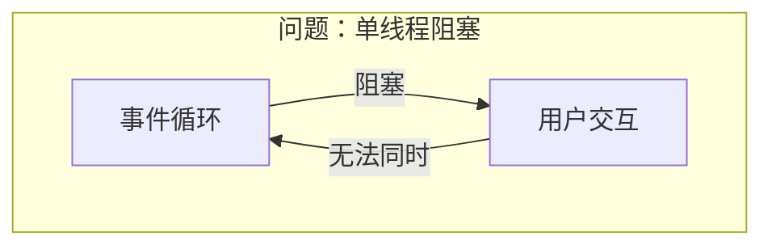

解决方案是将 Swarm 放到后台任务，通过**通道**与主线程通信：

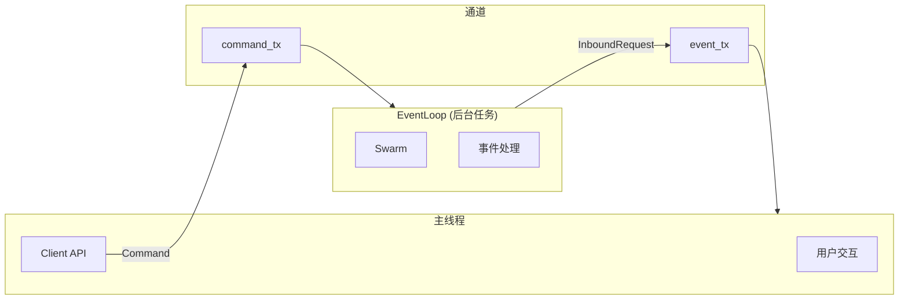

这就是 **EventLoop + Client** 模式——网络层和业务层分离，各司其职。这种模式在实际的 P2P 应用中非常常见，接下来我们就用它来实现一个完整的请求-响应示例。

## 动手实践

:::tip[配套工具]
本教程配套的桌面应用提供了可视化的 **Request-Response** 功能。你可以用它来启动节点、连接其他节点，发送请求和响应——无需命令行操作。

打开应用后，在侧边栏选择「Request-Response」即可使用。
:::

基于 [Identify 协议](/02-protocols/07-identify) 的代码，我们来实现一个完整的请求-响应示例。

<Steps>

1. **添加依赖**

   ```toml
   [dependencies]
   libp2p = { version = "0.56", features = ["tcp", "noise", "yamux", "ping", "identify", "request-response", "cbor", "macros", "tokio"] }
   serde = { version = "1", features = ["derive"] }
   tokio = { version = "1", features = ["full"] }
   dialoguer = "0.11"
   anyhow = "1"
   tracing = "0.1"
   tracing-subscriber = "0.3"
   ```

2. **定义消息类型和 Behaviour**

   ```rust title="src/main.rs" {19}
   use serde::{Deserialize, Serialize};
   use libp2p::{identify, ping, request_response, swarm};

   #[derive(Debug, Clone, Serialize, Deserialize)]
   pub struct MyRequest {
       pub name: String,
       pub age: u32,
   }

   #[derive(Debug, Clone, Serialize, Deserialize)]
   pub struct MyResponse {
       pub message: String,
   }

   #[derive(swarm::NetworkBehaviour)]
   pub struct MyBehaviour {
       ping: ping::Behaviour,
       identify: identify::Behaviour,
       request_response: request_response::cbor::Behaviour<MyRequest, MyResponse>,
   }
   ```

3. **定义命令和事件类型**

   ```rust title="src/network.rs" {6-10,13-25}
   use libp2p::{Multiaddr, PeerId};
   use libp2p::request_response::ResponseChannel;
   use tokio::sync::{mpsc, oneshot};

   // 入站请求，需要用户响应
   pub struct InboundRequest {
       pub peer: PeerId,
       pub request: MyRequest,
       pub channel: ResponseChannel<MyResponse>,
   }

   // 命令：从主线程发送到 EventLoop
   pub enum Command {
       Dial(Multiaddr),
       SendRequest {
           peer_id: PeerId,
           request: MyRequest,
           sender: oneshot::Sender<Result<MyResponse>>,
       },
       SendResponse {
           channel: ResponseChannel<MyResponse>,
           response: MyResponse,
       },
   }
   ```

4. **实现 EventLoop**

   ```rust title="src/network.rs" {5-11,17-25,35-47}
   use std::collections::{HashMap, HashSet};
   use std::sync::{Arc, RwLock};
   use libp2p::request_response::OutboundRequestId;

   pub struct EventLoop {
       swarm: Swarm<MyBehaviour>,
       command_rx: mpsc::Receiver<Command>,
       event_tx: mpsc::Sender<InboundRequest>,
       pending_requests: HashMap<OutboundRequestId, oneshot::Sender<Result<MyResponse>>>,
       peers: Arc<RwLock<HashSet<PeerId>>>,
   }

   impl EventLoop {
       pub async fn run(&mut self) {
           loop {
               tokio::select! {
                   event = self.swarm.select_next_some() => {
                       self.handle_event(event).await;
                   }
                   command = self.command_rx.recv() => {
                       match command {
                           Some(cmd) => self.handle_command(cmd),
                           None => return,
                       }
                   }
               }
           }
       }

       fn handle_command(&mut self, command: Command) {
           match command {
               Command::Dial(addr) => {
                   let _ = self.swarm.dial(addr);
               }
               Command::SendRequest { peer_id, request, sender } => {
                   let request_id = self.swarm
                       .behaviour_mut()
                       .request_response
                       .send_request(&peer_id, request);
                   self.pending_requests.insert(request_id, sender);
               }
               Command::SendResponse { channel, response } => {
                   let _ = self.swarm
                       .behaviour_mut()
                       .request_response
                       .send_response(channel, response);
               }
           }
       }
   }
   ```

5. **实现 Client**

   ```rust title="src/network.rs" {17-21}
   #[derive(Clone)]
   pub struct Client {
       command_tx: mpsc::Sender<Command>,
   }

   impl Client {
       pub fn new(command_tx: mpsc::Sender<Command>) -> Self {
           Self { command_tx }
       }

       pub async fn dial(&self, addr: Multiaddr) -> Result<()> {
           self.command_tx.send(Command::Dial(addr)).await?;
           Ok(())
       }

       pub async fn send_request(&self, peer_id: PeerId, request: MyRequest) -> Result<MyResponse> {
           let (tx, rx) = oneshot::channel();
           self.command_tx.send(Command::SendRequest {
               peer_id, request, sender: tx
           }).await?;
           rx.await?
       }

       pub async fn send_response(
           &self,
           channel: ResponseChannel<MyResponse>,
           response: MyResponse
       ) -> Result<()> {
           self.command_tx.send(Command::SendResponse { channel, response }).await?;
           Ok(())
       }
   }
   ```

6. **完整代码**

   <Tabs>
   <TabItem label="main.rs">
   ```rust
   use anyhow::Result;
   use dialoguer::{Input, Select, theme::ColorfulTheme};
   use libp2p::{
       Multiaddr, PeerId, StreamProtocol, SwarmBuilder, identify, noise, ping,
       request_response::{self, ProtocolSupport},
       swarm, tcp, yamux,
   };
   use serde::{Deserialize, Serialize};
   use std::collections::HashSet;
   use std::sync::{Arc, RwLock};
   use std::time::Duration;
   use tokio::sync::mpsc;
   use tracing_subscriber::fmt::writer::MakeWriterExt;

   mod network;
   use network::{Client, EventLoop, InboundRequest};

   // 组合多个 Behaviour 成一个 NetworkBehaviour
   #[derive(swarm::NetworkBehaviour)]
   pub struct MyBehaviour {
       ping: ping::Behaviour,
       identify: identify::Behaviour,
       request_response: request_response::cbor::Behaviour<MyRequest, MyResponse>,
   }

   // 请求消息：包含 name 和 age 字段
   #[derive(Debug, Clone, Serialize, Deserialize)]
   pub struct MyRequest {
       pub name: String,
       pub age: u32,
   }

   // 响应消息：包含 message 字段
   #[derive(Debug, Clone, Serialize, Deserialize)]
   pub struct MyResponse {
       pub message: String,
   }

   #[tokio::main]
   async fn main() -> Result<()> {
       // 日志输出到文件，避免干扰命令行交互
       let theme = ColorfulTheme::default();
       let log_path = std::env::current_dir()?.join("request-response.log");
       let file = std::fs::File::create(&log_path)?;
       println!("Logging to: {}", log_path.display());
       tracing_subscriber::fmt()
           .with_writer(file.with_max_level(tracing::Level::INFO))
           .with_ansi(false)
           .init();

       // 生成密钥对并构建 Swarm
       let keypair = libp2p::identity::Keypair::generate_ed25519();
       let mut swarm = SwarmBuilder::with_existing_identity(keypair)
           .with_tokio()
           .with_tcp(
               tcp::Config::default(),
               noise::Config::new,
               yamux::Config::default,
           )?
           .with_behaviour(|keypair| MyBehaviour {
               ping: ping::Behaviour::default(),
               identify: identify::Behaviour::new(
                   identify::Config::new("/my-app/1.0.0".into(), keypair.public())
                       .with_interval(Duration::from_secs(30)),
               ),
               // 使用 CBOR 编解码器，协议名需与配套工具一致
               request_response: request_response::cbor::Behaviour::new(
                   [(
                       StreamProtocol::new("/swarmbook/req-resp/1.0.0"),
                       ProtocolSupport::Full, // 既能发送也能接收
                   )],
                   request_response::Config::default()
                       .with_request_timeout(Duration::from_secs(600)),
               ),
           })?
           // 保持连接不超时
           .with_swarm_config(|cfg| cfg.with_idle_connection_timeout(Duration::from_secs(u64::MAX)))
           .build();

       // 监听所有网卡的随机端口
       swarm.listen_on("/ip4/0.0.0.0/tcp/0".parse()?)?;

       // 创建通道：command 用于发送命令，event 用于接收入站请求
       let (command_tx, command_rx) = mpsc::channel(32);
       let (event_tx, mut event_rx) = mpsc::channel::<InboundRequest>(32);
       // 共享的已连接节点列表
       let peers: Arc<RwLock<HashSet<PeerId>>> = Arc::new(RwLock::new(HashSet::new()));
       let client = Client::new(command_tx);

       // 启动 EventLoop 后台任务
       let mut event_loop = EventLoop::new(swarm, command_rx, event_tx, peers.clone());
       tokio::spawn(async move { event_loop.run().await });

       // 初始连接提示
       println!("Enter address to dial (or press Enter to skip):");
       let addr: String = Input::new()
           .with_prompt("Multiaddr")
           .allow_empty(true)
           .interact_text()?;
       if !addr.is_empty() {
           if let Ok(addr) = addr.parse::<Multiaddr>() {
               client.dial(addr).await?;
               println!("Dialing... waiting for connection");
               tokio::time::sleep(Duration::from_secs(2)).await;
           }
       }

       // 主交互循环
       loop {
           // 先处理所有待响应的入站请求
           while let Ok(req) = event_rx.try_recv() {
               handle_inbound_request(&client, req).await;
           }

           // 构建菜单选项
           let peer_list: Vec<_> = peers.read().unwrap().iter().copied().collect();
           let mut options = vec!["Dial a peer".to_string()];
           for p in &peer_list {
               options.push(format!("Send to {}", &p.to_string()[..8]));
           }
           options.push("Skip".to_string());
           options.push("Exit".to_string());

           println!("\n--- Connected peers: {} ---", peer_list.len());
           let selection = Select::with_theme(&theme)
               .with_prompt("Action")
               .items(&options)
               .default(0)
               .interact()?;

           if selection == 0 {
               // 连接新节点
               let addr: String = Input::with_theme(&theme)
                   .with_prompt("Multiaddr")
                   .interact_text()?;
               if let Ok(addr) = addr.parse::<Multiaddr>() {
                   client.dial(addr).await?;
                   println!("Dialing... waiting for connection");
                   tokio::time::sleep(Duration::from_secs(2)).await;
               }
           } else if selection == options.len() - 2 {
               // Skip：跳过本轮，继续检查入站请求
               continue;
           } else if selection == options.len() - 1 {
               // Exit：退出程序
               break;
           } else {
               // 向选中的节点发送请求
               let peer = peer_list[selection - 1];
               let name: String = Input::with_theme(&theme)
                   .with_prompt("Name")
                   .interact_text()?;
               let age: u32 = Input::with_theme(&theme)
                   .with_prompt("Age")
                   .interact_text()?;
               match client.send_request(peer, MyRequest { name, age }).await {
                   Ok(resp) => println!("✅ Response: {}", resp.message),
                   Err(e) => println!("❌ Error: {e}"),
               }
           }
       }
       Ok(())
   }

   // 处理入站请求：显示请求内容，等待用户输入响应
   async fn handle_inbound_request(client: &Client, req: InboundRequest) {
       let InboundRequest { peer, request, channel } = req;
       println!("\n📨 Request from {}: {:?}", &peer.to_string()[..8], request);
       let response: String = Input::with_theme(&ColorfulTheme::default())
           .with_prompt("Your response")
           .interact_text()
           .unwrap_or_default();
       let _ = client.send_response(channel, MyResponse { message: response }).await;
   }
   ```
   </TabItem>
   <TabItem label="network.rs">
   ```rust
   use crate::{MyBehaviour, MyBehaviourEvent, MyRequest, MyResponse};
   use anyhow::Result;
   use libp2p::{
       Multiaddr, PeerId, Swarm,
       futures::StreamExt,
       identify,
       request_response::{self, Message, OutboundRequestId, ResponseChannel},
   };
   use std::collections::{HashMap, HashSet};
   use std::sync::{Arc, RwLock};
   use tokio::sync::{mpsc, oneshot};

   // 入站请求：包含发送方、请求内容和响应通道
   pub struct InboundRequest {
       pub peer: PeerId,
       pub request: MyRequest,
       pub channel: ResponseChannel<MyResponse>,
   }

   // 命令枚举：主线程通过 Client 发送给 EventLoop
   pub enum Command {
       Dial(Multiaddr),
       SendRequest {
           peer_id: PeerId,
           request: MyRequest,
           sender: oneshot::Sender<Result<MyResponse>>, // 用于返回响应
       },
       SendResponse {
           channel: ResponseChannel<MyResponse>,
           response: MyResponse,
       },
   }

   // EventLoop：在后台运行，处理网络事件和命令
   pub struct EventLoop {
       swarm: Swarm<MyBehaviour>,
       command_rx: mpsc::Receiver<Command>,
       event_tx: mpsc::Sender<InboundRequest>,
       // 跟踪待处理的出站请求，收到响应后通过 oneshot 返回
       pending_requests: HashMap<OutboundRequestId, oneshot::Sender<Result<MyResponse>>>,
       // 共享的已连接节点列表
       peers: Arc<RwLock<HashSet<PeerId>>>,
   }

   impl EventLoop {
       pub fn new(
           swarm: Swarm<MyBehaviour>,
           command_rx: mpsc::Receiver<Command>,
           event_tx: mpsc::Sender<InboundRequest>,
           peers: Arc<RwLock<HashSet<PeerId>>>,
       ) -> Self {
           Self {
               swarm,
               command_rx,
               event_tx,
               pending_requests: HashMap::new(),
               peers,
           }
       }

       // 主循环：同时监听网络事件和命令
       pub async fn run(&mut self) {
           loop {
               tokio::select! {
                   // 处理 Swarm 事件
                   event = self.swarm.select_next_some() => self.handle_event(event).await,
                   // 处理来自 Client 的命令
                   command = self.command_rx.recv() => match command {
                       Some(cmd) => self.handle_command(cmd),
                       None => return, // 通道关闭，退出
                   },
               }
           }
       }

       // 处理 Swarm 事件
       async fn handle_event(&mut self, event: libp2p::swarm::SwarmEvent<MyBehaviourEvent>) {
           match event {
               libp2p::swarm::SwarmEvent::NewListenAddr { address, .. } => {
                   tracing::info!("Listening on {address}");
               }
               libp2p::swarm::SwarmEvent::ConnectionEstablished { peer_id, .. } => {
                   // 连接建立，添加到节点列表
                   self.peers.write().unwrap().insert(peer_id);
                   tracing::info!("Connected to {peer_id}");
               }
               libp2p::swarm::SwarmEvent::ConnectionClosed { peer_id, .. } => {
                   // 连接关闭，从节点列表移除
                   self.peers.write().unwrap().remove(&peer_id);
                   tracing::info!("Disconnected from {peer_id}");
               }
               libp2p::swarm::SwarmEvent::Behaviour(event) => match event {
                   MyBehaviourEvent::Ping(event) => {
                       tracing::info!("Ping: {event:?}");
                   }
                   MyBehaviourEvent::Identify(identify::Event::Received { peer_id, info, .. }) => {
                       tracing::info!(
                           "Identified {peer_id}:\n  protocol: {}\n  agent: {}\n  addrs: {:?}",
                           info.protocol_version, info.agent_version, info.listen_addrs
                       );
                   }
                   MyBehaviourEvent::Identify(_) => {}
                   MyBehaviourEvent::RequestResponse(event) => match event {
                       // 收到请求或响应
                       request_response::Event::Message { peer, message, .. } => match message {
                           Message::Request { request, channel, .. } => {
                               // 入站请求：发送到主线程处理
                               tracing::info!("Request from {peer}: {request:?}");
                               let _ = self.event_tx.send(InboundRequest {
                                   peer, request, channel,
                               }).await;
                           }
                           Message::Response { request_id, response } => {
                               // 收到响应：通过 oneshot 返回给调用方
                               if let Some(sender) = self.pending_requests.remove(&request_id) {
                                   let _ = sender.send(Ok(response));
                               }
                           }
                       },
                       // 出站请求失败
                       request_response::Event::OutboundFailure { request_id, error, .. } => {
                           if let Some(sender) = self.pending_requests.remove(&request_id) {
                               let _ = sender.send(Err(error.into()));
                           }
                       }
                       _ => {}
                   },
               },
               _ => {}
           }
       }

       // 处理来自 Client 的命令
       fn handle_command(&mut self, command: Command) {
           match command {
               Command::Dial(addr) => {
                   if let Err(e) = self.swarm.dial(addr.clone()) {
                       tracing::error!("Failed to dial {addr}: {e}");
                   }
               }
               Command::SendRequest { peer_id, request, sender } => {
                   // 发送请求并记录 request_id
                   let request_id = self.swarm
                       .behaviour_mut()
                       .request_response
                       .send_request(&peer_id, request);
                   self.pending_requests.insert(request_id, sender);
               }
               Command::SendResponse { channel, response } => {
                   // 发送响应
                   let _ = self.swarm
                       .behaviour_mut()
                       .request_response
                       .send_response(channel, response);
               }
           }
       }
   }

   // Client：主线程用来与 EventLoop 通信的接口
   #[derive(Clone)]
   pub struct Client {
       command_tx: mpsc::Sender<Command>,
   }

   impl Client {
       pub fn new(command_tx: mpsc::Sender<Command>) -> Self {
           Self { command_tx }
       }

       // 连接到指定地址
       pub async fn dial(&self, addr: Multiaddr) -> Result<()> {
           self.command_tx.send(Command::Dial(addr)).await?;
           Ok(())
       }

       // 发送请求并等待响应
       pub async fn send_request(&self, peer_id: PeerId, request: MyRequest) -> Result<MyResponse> {
           let (tx, rx) = oneshot::channel();
           self.command_tx.send(Command::SendRequest {
               peer_id, request, sender: tx,
           }).await?;
           rx.await? // 等待 EventLoop 返回响应
       }

       // 发送响应（用于回复入站请求）
       pub async fn send_response(
           &self,
           channel: ResponseChannel<MyResponse>,
           response: MyResponse,
       ) -> Result<()> {
           self.command_tx.send(Command::SendResponse { channel, response }).await?;
           Ok(())
       }
   }
   ```
   </TabItem>
   </Tabs>

</Steps>

## 错误处理

在上面的代码中，我们通过 `OutboundFailure` 事件处理请求失败的情况。常见的错误类型包括：

| 错误 | 说明 |
|-----|------|
| `Timeout` | 请求超时（可通过 `Config::with_request_timeout` 配置） |
| `ConnectionClosed` | 连接已关闭 |
| `UnsupportedProtocols` | 对方不支持此协议 |

## 运行测试

推荐使用配套工具与你的程序进行交互测试：

<Steps>

1. **启动配套工具节点**，复制监听地址

   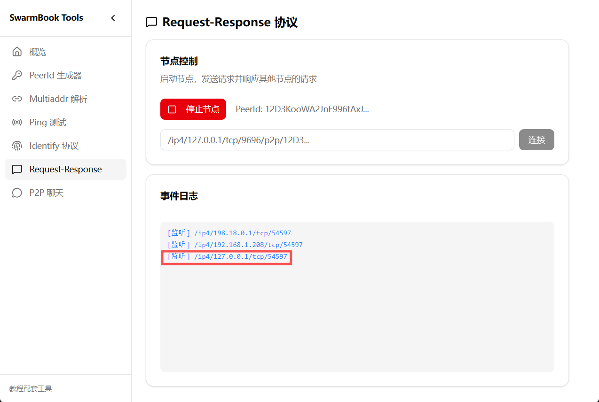

2. **运行你的程序**，输入地址连接配套工具

   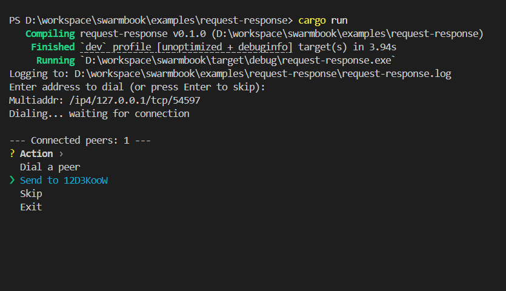

3. **程序端发送请求**：选择已连接的节点，输入 name 和 age

   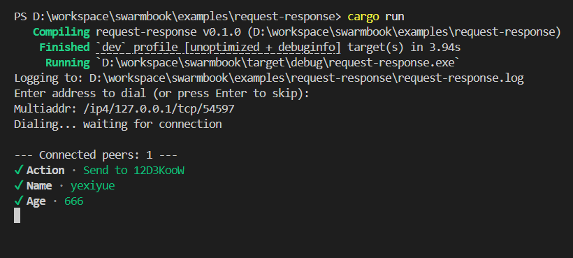

4. **配套工具响应**：看到入站请求后，输入响应消息并发送

   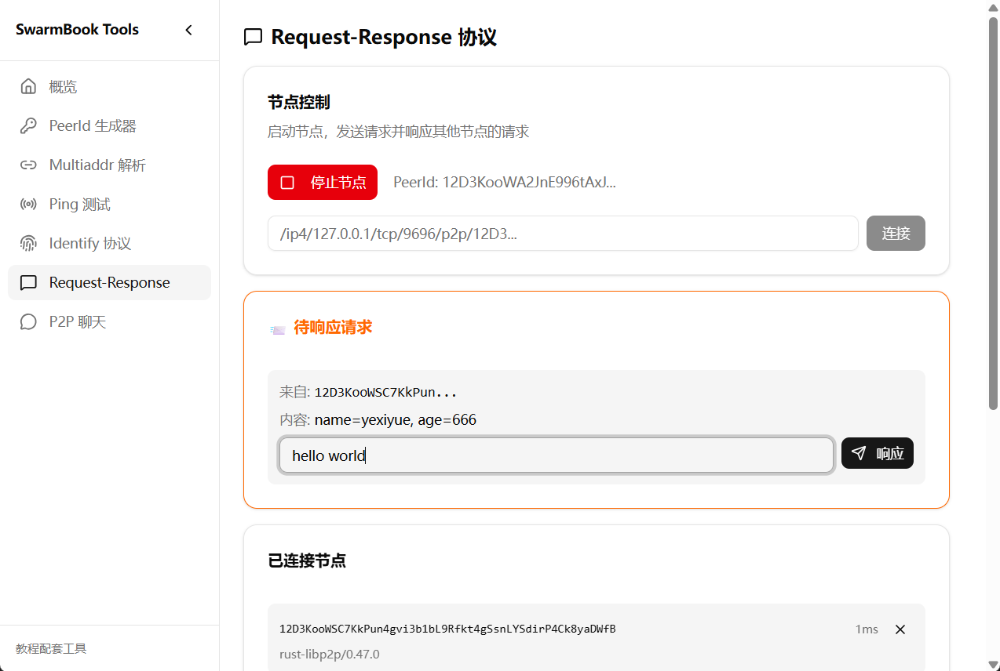

5. **程序端收到响应**

   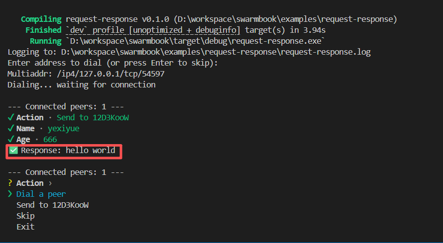

6. **反向测试**：配套工具点击已连接的节点，发送请求

   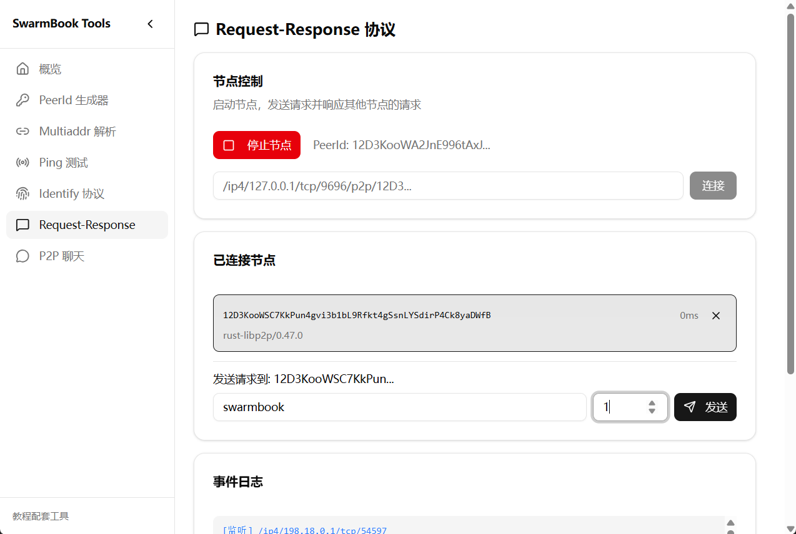

7. **程序端响应**：按 Skip 进入下个循环，输入响应消息

   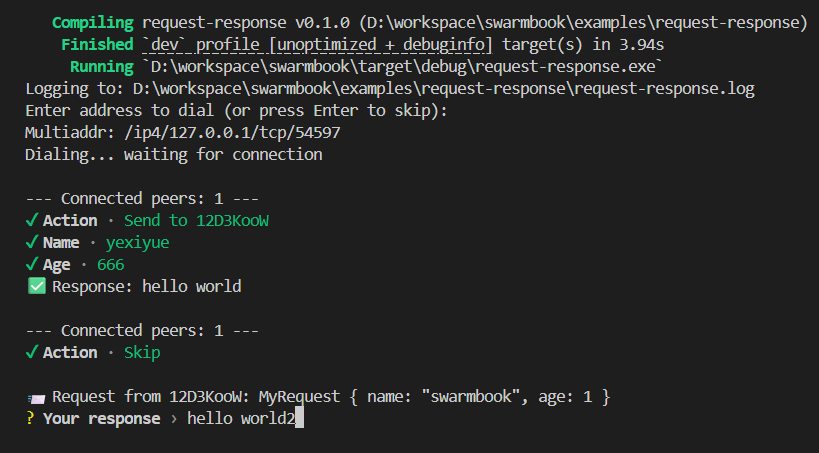

8. **配套工具收到响应**

   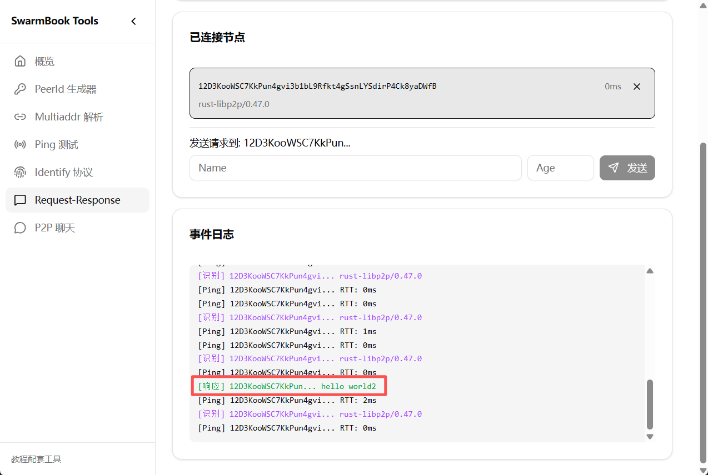

</Steps>

:::tip[命令行测试]
也可以开两个终端运行程序互相测试。由于日志输出到 `request-response.log` 文件，需要从日志中复制监听地址：

```bash
# 终端 1
cargo run
# 查看 request-response.log 获取监听地址

# 终端 2
cargo run
# 输入终端 1 的监听地址进行连接
```
:::

## 小结

本章介绍了 libp2p 的请求-响应模式：

- **消息类型**：定义 Request 和 Response 结构体
- **内置编解码**：使用 `cbor::Behaviour` 自动序列化
- **EventLoop 模式**：分离网络层和业务层，支持用户交互
- **Client API**：`send_request` 返回 Future，可以 await 响应

请求-响应模式是实现 P2P 应用的重要基础——无论是文件共享、状态查询还是远程调用，都可以用这种模式实现。

下一章，我们将深入**流管理**——理解 libp2p 中流的生命周期和管理方式。
