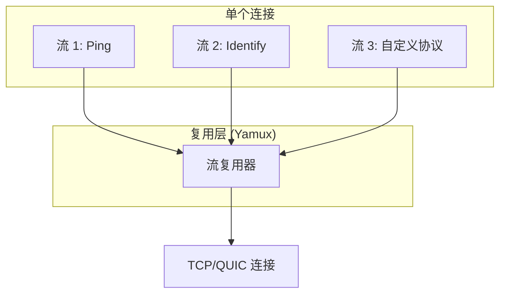
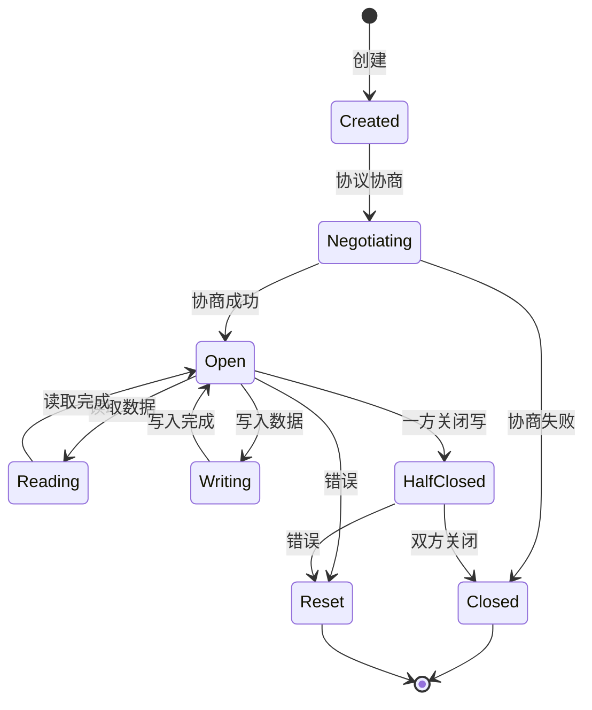
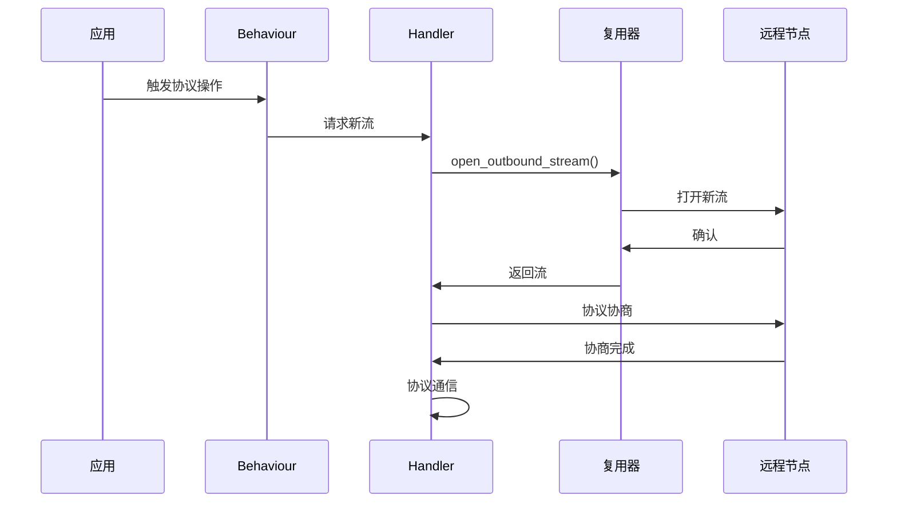
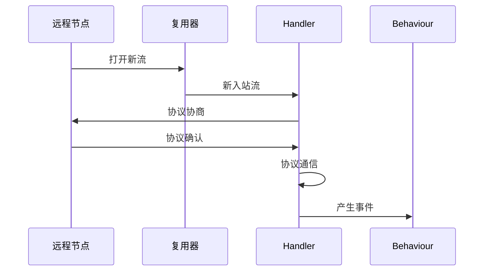
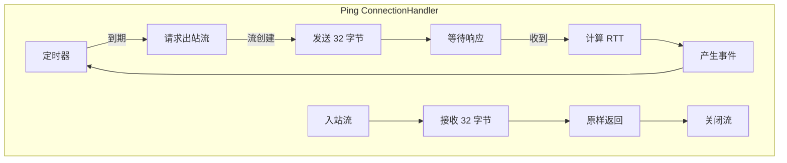
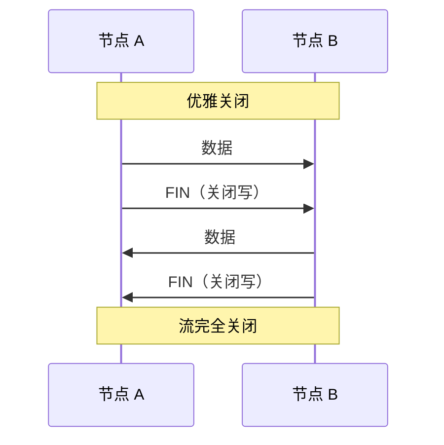
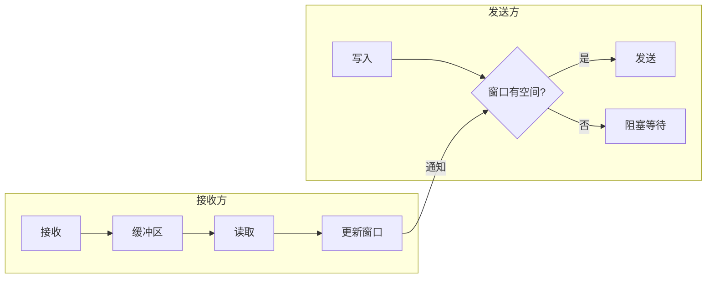
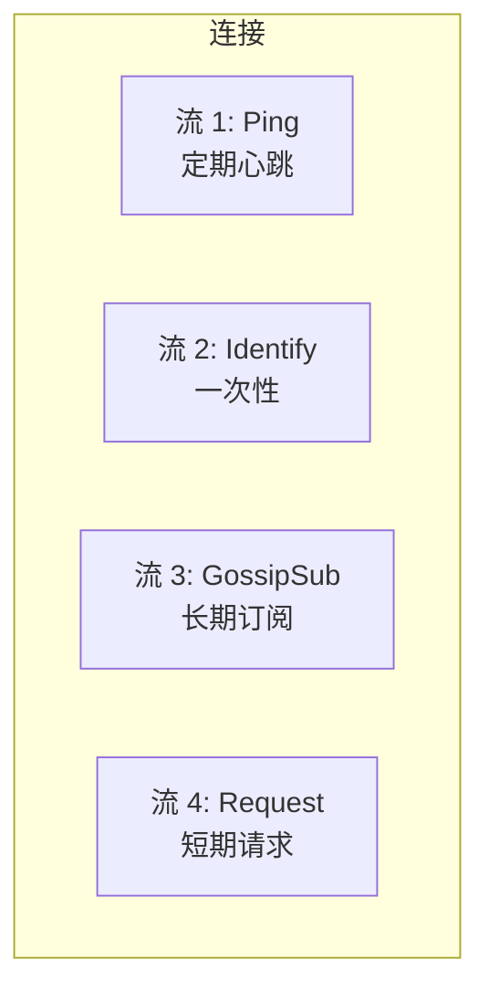
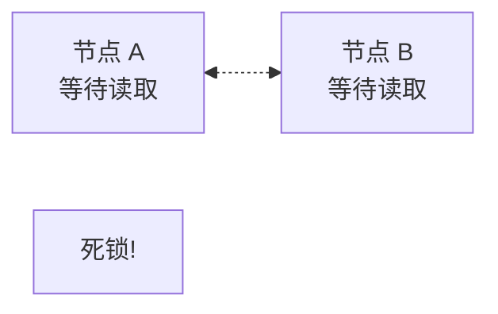

> 流水不腐，户枢不蠹。
> ——《吕氏春秋》

流动的水不会腐烂，转动的门轴不会被虫蛀。在 libp2p 中，流（Stream）是数据流动的通道——正确管理流的生命周期，是构建健壮 P2P 应用的关键。

前几章我们学习了具体的协议（Ping、Identify、Request-Response）。本章我们深入底层，理解**流**这个核心抽象。

## 什么是流？

在 libp2p 中，**流**是一个双向的、有序的字节通道，承载单个协议的通信。



每个流：
- 有唯一的 ID
- 承载单个协议
- 独立的读写缓冲区
- 可以单独关闭

## 流的生命周期



### 关键状态

| 状态 | 说明 |
|-----|------|
| **Created** | 流已创建，尚未协商协议 |
| **Negotiating** | 正在进行 multistream-select 协商 |
| **Open** | 协商完成，可以读写 |
| **HalfClosed** | 一方关闭了写端（发送了 FIN） |
| **Closed** | 双方都关闭，流完全结束 |
| **Reset** | 错误或强制关闭（发送了 RST） |

## 创建流

在 libp2p 中，流的创建通常由 `NetworkBehaviour` 自动处理。但理解底层机制很重要。

### 出站流（我方发起）



### 入站流（对方发起）



## 流与 ConnectionHandler

每个协议的流处理逻辑封装在 `ConnectionHandler` 中。

```rust
// 概念性展示 ConnectionHandler 如何处理流
pub trait ConnectionHandler {
    /// 处理新的入站流
    fn on_inbound_stream(&mut self, stream: Stream);

    /// 请求创建出站流
    fn poll_outbound(&mut self) -> Option<OutboundRequest>;

    /// 处理已创建的出站流
    fn on_outbound_stream(&mut self, stream: Stream);
}
```

### Ping 的 Handler 示例



## 流的读写

流实现了标准的异步读写 trait：

```rust
use futures::{AsyncReadExt, AsyncWriteExt};

// 写入数据
async fn write_to_stream(mut stream: impl AsyncWrite + Unpin) -> std::io::Result<()> {
    stream.write_all(b"Hello, libp2p!").await?;
    stream.flush().await?;  // 确保数据发送
    stream.close().await?;  // 关闭写端
    Ok(())
}

// 读取数据
async fn read_from_stream(mut stream: impl AsyncRead + Unpin) -> std::io::Result<Vec<u8>> {
    let mut buf = Vec::new();
    stream.read_to_end(&mut buf).await?;
    Ok(buf)
}
```

### 长度前缀模式

由于流是字节流，需要定义消息边界。常用的模式是**长度前缀**：

```rust
// 写入带长度前缀的消息
async fn write_message(
    stream: &mut (impl AsyncWrite + Unpin),
    data: &[u8],
) -> std::io::Result<()> {
    // 写入 4 字节长度
    stream.write_all(&(data.len() as u32).to_be_bytes()).await?;
    // 写入数据
    stream.write_all(data).await?;
    stream.flush().await
}

// 读取带长度前缀的消息
async fn read_message(
    stream: &mut (impl AsyncRead + Unpin),
) -> std::io::Result<Vec<u8>> {
    // 读取长度
    let mut len_buf = [0u8; 4];
    stream.read_exact(&mut len_buf).await?;
    let len = u32::from_be_bytes(len_buf) as usize;

    // 读取数据
    let mut buf = vec![0u8; len];
    stream.read_exact(&mut buf).await?;
    Ok(buf)
}
```

## 流的关闭

正确关闭流很重要，避免资源泄漏。

### 优雅关闭

```rust
// 关闭写端（发送 FIN）
stream.close().await?;

// 此时仍可以读取对方的数据
let remaining = read_message(&mut stream).await?;
```

### 强制关闭

```rust
// 直接丢弃流，发送 RST
drop(stream);
```

### 关闭时序



## 流量控制

Yamux 实现了流级别的流量控制，防止发送方发送过快：



### 窗口大小配置

```rust
use libp2p::yamux;

let yamux_config = yamux::Config::default()
    .set_receive_window_size(256 * 1024)  // 256KB 接收窗口
    .set_max_buffer_size(1024 * 1024);    // 1MB 最大缓冲
```

## 多流管理

一个连接上可能同时存在多个流：



### 流的类型

| 类型 | 生命周期 | 示例 |
|-----|---------|------|
| **短期流** | 请求-响应后关闭 | Ping、Request-Response |
| **长期流** | 持续整个连接 | GossipSub 订阅 |
| **一次性流** | 交换信息后关闭 | Identify |

### 并发限制

过多并发流会消耗资源：

```rust
// Yamux 配置最大并发流数
let yamux_config = yamux::Config::default()
    .set_max_num_streams(256);

// 在 Behaviour 中也可以限制
// 例如限制同时进行的请求数
```

## 调试流问题

### 常见问题

1. **流泄漏**：流未正确关闭

```rust
// 错误：忘记关闭流
let stream = open_stream().await?;
// 使用后没有 close() 或 drop()
```

2. **死锁**：双方都在等待读取



3. **缓冲区溢出**：发送过快

```rust
// 解决：使用流量控制，或增大缓冲区
```

### 调试建议

```rust
// 启用详细日志
std::env::set_var("RUST_LOG", "libp2p_yamux=debug");

// 监控流创建和关闭
SwarmEvent::ConnectionEstablished { num_established, .. } => {
    println!("Active connections: {num_established}");
}
```

## 小结

本章深入介绍了 libp2p 的流管理：

- **流是协议通信的通道**：每个流承载一个协议
- **生命周期**：创建 → 协商 → 开放 → 关闭
- **ConnectionHandler**：封装流处理逻辑
- **流量控制**：Yamux 提供窗口机制
- **正确关闭**：避免资源泄漏

理解流的工作方式，是实现自定义协议的基础。

下一章，我们将学习如何**实现自定义协议**——把所有这些知识串联起来，创建你自己的 libp2p 协议。
