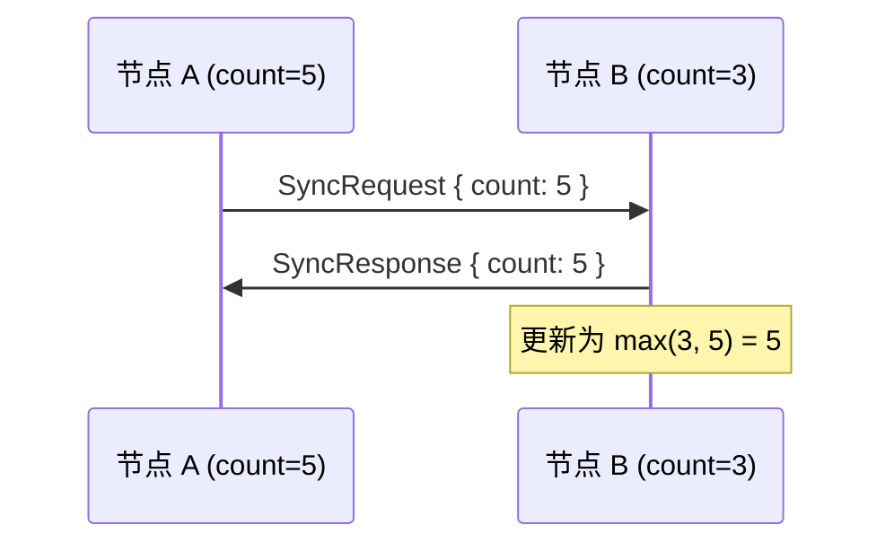

> 授人以鱼不如授人以渔。
> ——中国谚语

学习了 Ping、Identify、Request-Response，你已经了解了 libp2p 协议的模式。现在是时候**创建自己的协议**了。

本章将从零开始，实现一个简单但完整的自定义协议——一个**分布式计数器**，节点可以相互同步计数值。

## 协议设计

### 功能需求

- 每个节点维护一个本地计数器
- 节点可以增加计数
- 节点之间同步计数值（取最大值）

### 消息设计



消息类型：
- `SyncRequest`：请求同步，携带本地计数值
- `SyncResponse`：响应同步，携带更新后的计数值

## 第一步：定义消息类型

```rust
use serde::{Deserialize, Serialize};

/// 协议名称
pub const PROTOCOL_NAME: &str = "/counter/1.0.0";

/// 同步请求
#[derive(Debug, Clone, Serialize, Deserialize)]
pub struct SyncRequest {
    pub count: u64,
}

/// 同步响应
#[derive(Debug, Clone, Serialize, Deserialize)]
pub struct SyncResponse {
    pub count: u64,
}

/// 协议事件（对外暴露）
#[derive(Debug)]
pub enum CounterEvent {
    /// 收到远程节点的计数值
    Received { peer: PeerId, count: u64 },
    /// 同步完成
    Synced { peer: PeerId, new_count: u64 },
    /// 发生错误
    Error { peer: PeerId, error: String },
}
```

## 第二步：实现编解码器

```rust
use libp2p::StreamProtocol;
use futures::{AsyncRead, AsyncReadExt, AsyncWrite, AsyncWriteExt};

/// 消息编解码
pub async fn write_message<T, W>(stream: &mut W, msg: &T) -> std::io::Result<()>
where
    T: Serialize,
    W: AsyncWrite + Unpin,
{
    let data = serde_json::to_vec(msg)
        .map_err(|e| std::io::Error::new(std::io::ErrorKind::InvalidData, e))?;

    // 长度前缀 (4 bytes)
    stream.write_all(&(data.len() as u32).to_be_bytes()).await?;
    stream.write_all(&data).await?;
    stream.flush().await
}

pub async fn read_message<T, R>(stream: &mut R) -> std::io::Result<T>
where
    T: for<'de> Deserialize<'de>,
    R: AsyncRead + Unpin,
{
    // 读取长度
    let mut len_buf = [0u8; 4];
    stream.read_exact(&mut len_buf).await?;
    let len = u32::from_be_bytes(len_buf) as usize;

    // 安全检查
    if len > 1024 * 1024 {
        return Err(std::io::Error::new(
            std::io::ErrorKind::InvalidData,
            "Message too large",
        ));
    }

    // 读取消息体
    let mut buf = vec![0u8; len];
    stream.read_exact(&mut buf).await?;

    serde_json::from_slice(&buf)
        .map_err(|e| std::io::Error::new(std::io::ErrorKind::InvalidData, e))
}
```

## 第三步：实现 ConnectionHandler

`ConnectionHandler` 是协议的核心，处理单个连接上的协议逻辑。

```rust
use libp2p::swarm::{
    ConnectionHandler, ConnectionHandlerEvent, StreamProtocol,
    SubstreamProtocol, Stream,
};
use libp2p::swarm::handler::{ConnectionEvent, FullyNegotiatedInbound, FullyNegotiatedOutbound};
use std::collections::VecDeque;
use std::task::{Context, Poll};

/// Handler 向 Behaviour 发送的事件
#[derive(Debug)]
pub enum HandlerEvent {
    Received { count: u64 },
    Synced { new_count: u64 },
    Error { error: String },
}

/// Behaviour 向 Handler 发送的命令
#[derive(Debug)]
pub enum HandlerCommand {
    Sync { local_count: u64 },
}

pub struct CounterHandler {
    /// 待处理的入站流
    inbound: VecDeque<Stream>,
    /// 待发送的出站请求
    outbound_requests: VecDeque<u64>,
    /// 待处理的出站流
    outbound: VecDeque<(Stream, u64)>,
    /// 产生的事件
    events: VecDeque<HandlerEvent>,
    /// 本地计数值（用于响应）
    local_count: u64,
}

impl CounterHandler {
    pub fn new(local_count: u64) -> Self {
        Self {
            inbound: VecDeque::new(),
            outbound_requests: VecDeque::new(),
            outbound: VecDeque::new(),
            events: VecDeque::new(),
            local_count,
        }
    }
}

impl ConnectionHandler for CounterHandler {
    type FromBehaviour = HandlerCommand;
    type ToBehaviour = HandlerEvent;
    type InboundProtocol = StreamProtocol;
    type OutboundProtocol = StreamProtocol;
    type InboundOpenInfo = ();
    type OutboundOpenInfo = u64;  // 携带要同步的计数值

    fn listen_protocol(&self) -> SubstreamProtocol<Self::InboundProtocol, Self::InboundOpenInfo> {
        SubstreamProtocol::new(
            StreamProtocol::new(PROTOCOL_NAME),
            (),
        )
    }

    fn on_behaviour_event(&mut self, event: Self::FromBehaviour) {
        match event {
            HandlerCommand::Sync { local_count } => {
                self.local_count = local_count;
                self.outbound_requests.push_back(local_count);
            }
        }
    }

    fn on_connection_event(&mut self, event: ConnectionEvent<..>) {
        match event {
            ConnectionEvent::FullyNegotiatedInbound(FullyNegotiatedInbound {
                protocol: stream, ..
            }) => {
                self.inbound.push_back(stream);
            }
            ConnectionEvent::FullyNegotiatedOutbound(FullyNegotiatedOutbound {
                protocol: stream,
                info: count,
            }) => {
                self.outbound.push_back((stream, count));
            }
            _ => {}
        }
    }

    fn poll(&mut self, cx: &mut Context<'_>) -> Poll<
        ConnectionHandlerEvent<Self::OutboundProtocol, Self::OutboundOpenInfo, Self::ToBehaviour>
    > {
        // 处理入站流
        if let Some(mut stream) = self.inbound.pop_front() {
            // 使用 spawn 处理，避免阻塞
            let local_count = self.local_count;
            tokio::spawn(async move {
                // 读取请求
                let req: SyncRequest = read_message(&mut stream).await?;
                // 计算新值
                let new_count = std::cmp::max(local_count, req.count);
                // 发送响应
                write_message(&mut stream, &SyncResponse { count: new_count }).await?;
                stream.close().await
            });
        }

        // 处理出站流
        if let Some((mut stream, count)) = self.outbound.pop_front() {
            let events = &mut self.events;
            tokio::spawn(async move {
                // 发送请求
                write_message(&mut stream, &SyncRequest { count }).await?;
                // 读取响应
                let resp: SyncResponse = read_message(&mut stream).await?;
                stream.close().await?;
                // 产生事件
                Ok::<_, std::io::Error>(resp.count)
            });
        }

        // 请求新的出站流
        if let Some(count) = self.outbound_requests.pop_front() {
            return Poll::Ready(ConnectionHandlerEvent::OutboundSubstreamRequest {
                protocol: SubstreamProtocol::new(
                    StreamProtocol::new(PROTOCOL_NAME),
                    count,
                ),
            });
        }

        // 返回事件
        if let Some(event) = self.events.pop_front() {
            return Poll::Ready(ConnectionHandlerEvent::NotifyBehaviour(event));
        }

        Poll::Pending
    }
}
```

:::caution[简化说明]
上面的代码是简化版本，实际实现需要更完整的错误处理和异步任务管理。完整实现请参考 libp2p 官方示例。
:::

## 第四步：实现 NetworkBehaviour

```rust
use libp2p::swarm::{NetworkBehaviour, ToSwarm, FromSwarm};
use libp2p::{PeerId, Multiaddr};
use std::collections::HashMap;
use std::task::{Context, Poll};

pub struct CounterBehaviour {
    /// 本地计数值
    count: u64,
    /// 已连接的节点
    connected_peers: HashMap<PeerId, ()>,
    /// 待发送的事件
    events: VecDeque<ToSwarm<CounterEvent, HandlerCommand>>,
}

impl CounterBehaviour {
    pub fn new() -> Self {
        Self {
            count: 0,
            connected_peers: HashMap::new(),
            events: VecDeque::new(),
        }
    }

    /// 增加计数
    pub fn increment(&mut self) {
        self.count += 1;
    }

    /// 获取当前计数
    pub fn count(&self) -> u64 {
        self.count
    }

    /// 向指定节点同步
    pub fn sync_with(&mut self, peer: PeerId) {
        self.events.push_back(ToSwarm::NotifyHandler {
            peer_id: peer,
            handler: NotifyHandler::Any,
            event: HandlerCommand::Sync { local_count: self.count },
        });
    }

    /// 向所有节点同步
    pub fn sync_all(&mut self) {
        let peers: Vec<_> = self.connected_peers.keys().cloned().collect();
        for peer in peers {
            self.sync_with(peer);
        }
    }
}

impl NetworkBehaviour for CounterBehaviour {
    type ConnectionHandler = CounterHandler;
    type ToSwarm = CounterEvent;

    fn handle_established_inbound_connection(
        &mut self,
        _: libp2p::swarm::ConnectionId,
        peer: PeerId,
        _: &Multiaddr,
        _: &Multiaddr,
    ) -> Result<Self::ConnectionHandler, libp2p::swarm::ConnectionDenied> {
        self.connected_peers.insert(peer, ());
        Ok(CounterHandler::new(self.count))
    }

    fn handle_established_outbound_connection(
        &mut self,
        _: libp2p::swarm::ConnectionId,
        peer: PeerId,
        _: &Multiaddr,
        _: libp2p::core::Endpoint,
        _: libp2p::core::connection::PortUse,
    ) -> Result<Self::ConnectionHandler, libp2p::swarm::ConnectionDenied> {
        self.connected_peers.insert(peer, ());
        Ok(CounterHandler::new(self.count))
    }

    fn on_swarm_event(&mut self, event: FromSwarm) {
        match event {
            FromSwarm::ConnectionClosed(info) => {
                self.connected_peers.remove(&info.peer_id);
            }
            _ => {}
        }
    }

    fn on_connection_handler_event(
        &mut self,
        peer_id: PeerId,
        _: libp2p::swarm::ConnectionId,
        event: HandlerEvent,
    ) {
        match event {
            HandlerEvent::Received { count } => {
                self.events.push_back(ToSwarm::GenerateEvent(
                    CounterEvent::Received { peer: peer_id, count }
                ));
            }
            HandlerEvent::Synced { new_count } => {
                // 更新本地计数
                self.count = std::cmp::max(self.count, new_count);
                self.events.push_back(ToSwarm::GenerateEvent(
                    CounterEvent::Synced { peer: peer_id, new_count }
                ));
            }
            HandlerEvent::Error { error } => {
                self.events.push_back(ToSwarm::GenerateEvent(
                    CounterEvent::Error { peer: peer_id, error }
                ));
            }
        }
    }

    fn poll(&mut self, _: &mut Context<'_>) -> Poll<ToSwarm<Self::ToSwarm, HandlerCommand>> {
        if let Some(event) = self.events.pop_front() {
            return Poll::Ready(event);
        }
        Poll::Pending
    }
}
```

## 第五步：使用自定义协议

```rust
use libp2p::{
    identity::Keypair,
    swarm::{NetworkBehaviour, SwarmEvent},
    noise, tcp, yamux, SwarmBuilder,
};
use std::time::Duration;
use futures::StreamExt;

#[derive(NetworkBehaviour)]
struct MyBehaviour {
    counter: CounterBehaviour,
    // 可以组合其他 Behaviour
}

#[tokio::main]
async fn main() -> anyhow::Result<()> {
    let keypair = Keypair::generate_ed25519();
    println!("PeerId: {}", keypair.public().to_peer_id());

    let mut swarm = SwarmBuilder::with_existing_identity(keypair)
        .with_tokio()
        .with_tcp(tcp::Config::default(), noise::Config::new, yamux::Config::default)?
        .with_behaviour(|_| MyBehaviour {
            counter: CounterBehaviour::new(),
        })?
        .with_swarm_config(|c| c.with_idle_connection_timeout(Duration::from_secs(60)))
        .build();

    swarm.listen_on("/ip4/0.0.0.0/tcp/0".parse()?)?;

    if let Some(addr) = std::env::args().nth(1) {
        swarm.dial(addr.parse::<libp2p::Multiaddr>()?)?;
    }

    // 定期增加计数并同步
    let mut interval = tokio::time::interval(Duration::from_secs(5));

    loop {
        tokio::select! {
            _ = interval.tick() => {
                swarm.behaviour_mut().counter.increment();
                println!("Count: {}", swarm.behaviour().counter.count());
                swarm.behaviour_mut().counter.sync_all();
            }
            event = swarm.select_next_some() => {
                match event {
                    SwarmEvent::NewListenAddr { address, .. } => {
                        println!("Listening on {address}");
                    }
                    SwarmEvent::ConnectionEstablished { peer_id, .. } => {
                        println!("Connected to {peer_id}");
                        // 连接后立即同步
                        swarm.behaviour_mut().counter.sync_with(peer_id);
                    }
                    SwarmEvent::Behaviour(MyBehaviourEvent::Counter(event)) => {
                        match event {
                            CounterEvent::Synced { peer, new_count } => {
                                println!("Synced with {peer}: count = {new_count}");
                            }
                            CounterEvent::Error { peer, error } => {
                                println!("Error with {peer}: {error}");
                            }
                            _ => {}
                        }
                    }
                    _ => {}
                }
            }
        }
    }
}
```

## 协议设计最佳实践

### 1. 协议版本化

```rust
// 在协议名称中包含版本
pub const PROTOCOL_V1: &str = "/counter/1.0.0";
pub const PROTOCOL_V2: &str = "/counter/2.0.0";

// 支持多版本
let protocols = vec![
    StreamProtocol::new(PROTOCOL_V2),
    StreamProtocol::new(PROTOCOL_V1),
];
```

### 2. 消息边界

始终使用长度前缀或其他明确的消息边界机制。

### 3. 错误处理

```rust
// 定义协议特定的错误类型
#[derive(Debug, thiserror::Error)]
pub enum CounterError {
    #[error("IO error: {0}")]
    Io(#[from] std::io::Error),
    #[error("Serialization error: {0}")]
    Serialization(#[from] serde_json::Error),
    #[error("Protocol error: {0}")]
    Protocol(String),
}
```

### 4. 超时处理

```rust
use tokio::time::timeout;

async fn sync_with_timeout(stream: &mut Stream, count: u64) -> Result<u64, Error> {
    timeout(Duration::from_secs(10), async {
        write_message(stream, &SyncRequest { count }).await?;
        let resp: SyncResponse = read_message(stream).await?;
        Ok(resp.count)
    }).await?
}
```

### 5. 资源限制

```rust
// 限制消息大小
const MAX_MESSAGE_SIZE: usize = 1024 * 1024;  // 1MB

// 限制并发连接
const MAX_CONNECTIONS: usize = 100;

// 限制每个连接的并发流
const MAX_STREAMS_PER_CONNECTION: usize = 10;
```

## 小结

本章展示了如何从零实现自定义 libp2p 协议：

1. **定义消息类型**：请求和响应的数据结构
2. **实现编解码器**：消息的序列化和反序列化
3. **实现 ConnectionHandler**：处理单个连接上的协议逻辑
4. **实现 NetworkBehaviour**：管理所有连接的协议状态
5. **组合使用**：与其他 Behaviour 组合

关键模式：
- **事件驱动**：Handler 产生事件，Behaviour 处理
- **命令模式**：Behaviour 向 Handler 发送命令
- **长度前缀**：明确消息边界

至此，第三篇「协议与流」完结。你已经掌握了：

| 章节 | 内容 |
|-----|------|
| 13 | Ping 协议深度解析 |
| 14 | Identify 节点信息交换 |
| 15 | 请求-响应模式 |
| 16 | 流管理与生命周期 |
| 17 | 自定义协议实现 |

下一篇，我们将进入**节点发现**——学习如何在 P2P 网络中找到其他节点。
