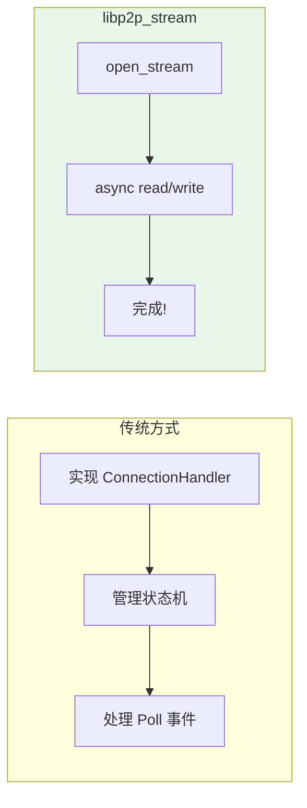
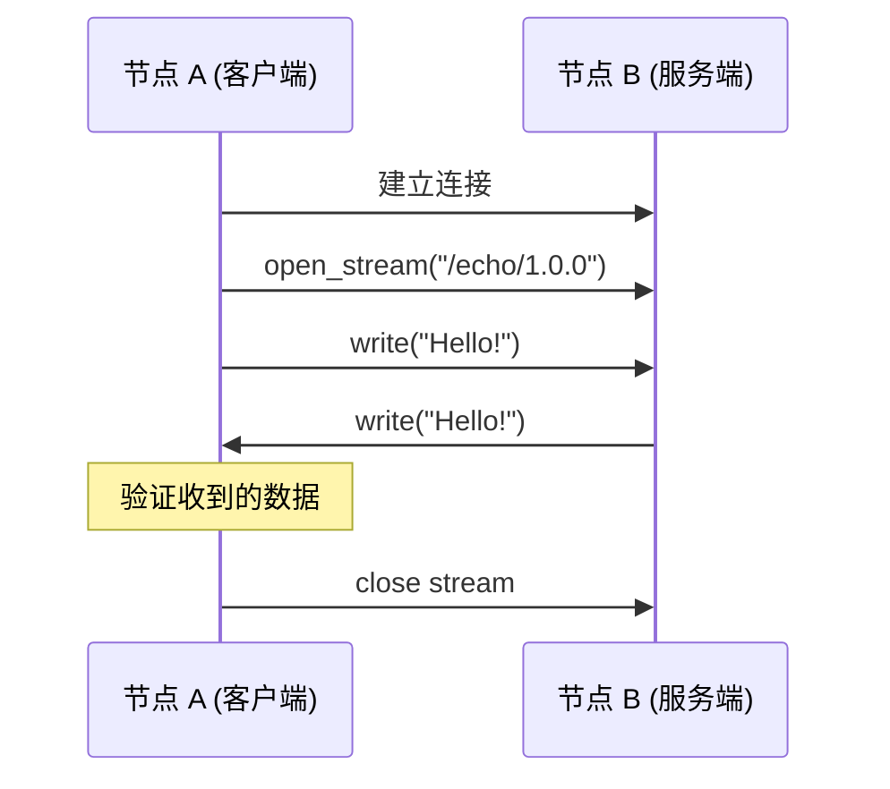
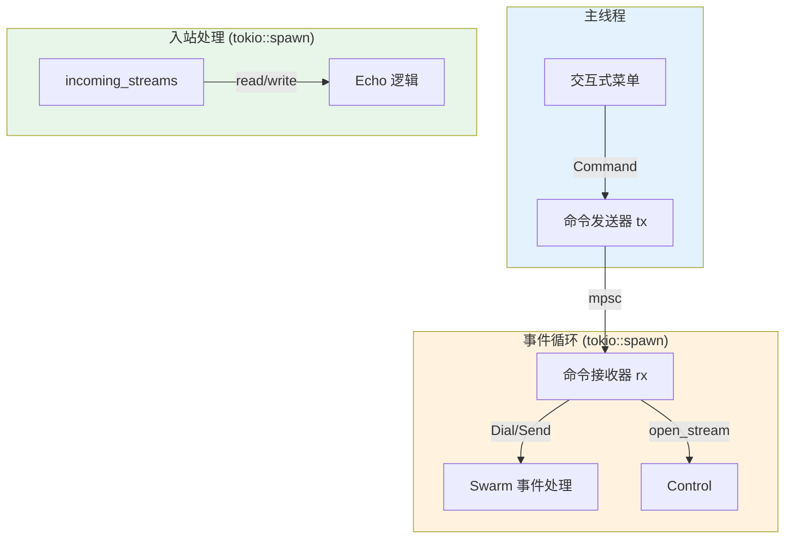
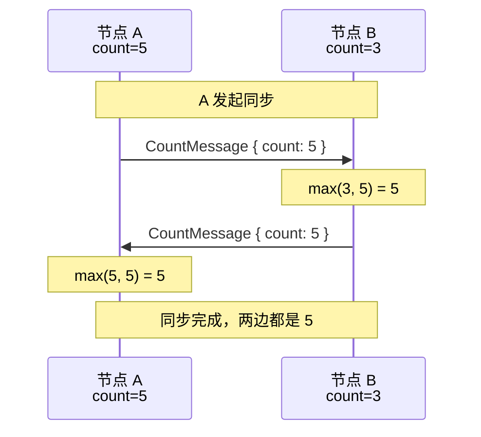
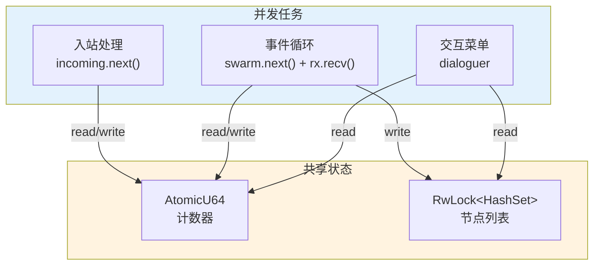
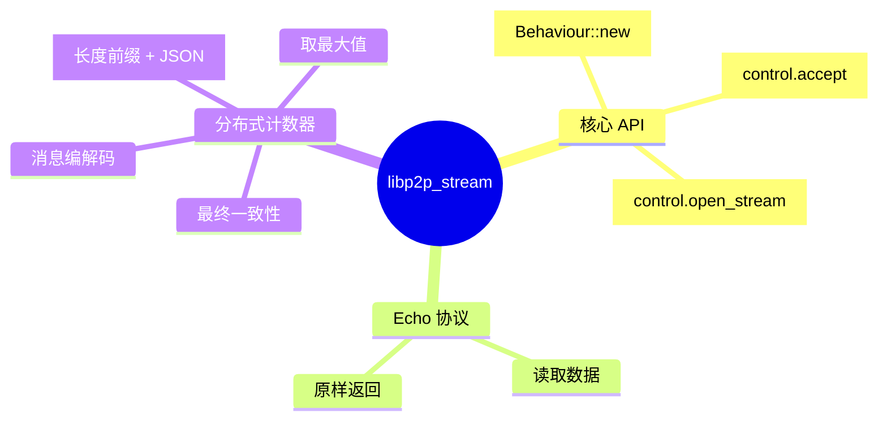

import { Steps, Tabs, TabItem, Code } from '@astrojs/starlight/components';
import echoCode from '../../../../../examples/echo/src/main.rs?raw';
import counterCode from '../../../../../examples/counter/src/main.rs?raw';

> 授人以鱼不如授人以渔。
> ——中国谚语

学习了 Ping、Identify、Request-Response，你已经了解了 libp2p 协议的模式。现在是时候**创建自己的协议**了。

本章使用 `libp2p_stream` 快速实现两个自定义协议：**Echo** 和**分布式计数器**。

## libp2p_stream 是什么？

`libp2p_stream` 是 rust-libp2p 提供的"逃生舱"（escape-hatch），让你可以用纯 `async/await` 风格编写协议，无需理解复杂的 `ConnectionHandler` 状态机。



对比一下两种方式的代码：

```rust
// ❌ 传统方式：需要实现 ConnectionHandler trait，管理状态机
impl ConnectionHandler for MyHandler {
    fn poll(&mut self, cx: &mut Context<'_>) -> Poll<...> {
        // 复杂的状态机逻辑...
    }
}

// ✅ libp2p_stream 方式：纯 async/await，简单直观
let stream = control.open_stream(peer, MY_PROTOCOL).await?;
stream.write_all(b"hello").await?;
```

:::tip[适用场景]

- 快速原型开发
- 学习和实验
- 简单的请求-响应协议
- async/await 风格的应用

:::

## 实现 Echo 协议

Echo 是最简单的协议：发送什么数据，就收到什么数据返回。

### 协议流程



### 核心概念

| 概念 | 说明 | 类比 |
|------|------|------|
| `Behaviour` | 协议行为，注册到 Swarm | 插件 |
| `Control` | 控制器，用于打开/接收流 | 遥控器 |
| `Stream` | 双向字节流，可读可写 | TCP 连接 |

### Echo 实现步骤

<Steps>

1. **定义协议名称**

   协议名称遵循 `/name/version` 格式：

   ```rust
   // 定义协议标识符，用于协商
   const ECHO_PROTOCOL: StreamProtocol = StreamProtocol::new("/echo/1.0.0");
   ```

2. **创建 Swarm，使用 libp2p_stream::Behaviour**

   ```rust
   let mut swarm = SwarmBuilder::with_new_identity()
       .with_tokio()
       .with_tcp(
           tcp::Config::default(),
           noise::Config::new,      // 加密
           yamux::Config::default,  // 多路复用
       )?
       // 使用 libp2p_stream 的 Behaviour
       .with_behaviour(|_| libp2p_stream::Behaviour::new())?
       .with_swarm_config(|c| c.with_idle_connection_timeout(Duration::from_secs(60)))
       .build();
   ```

3. **获取 Control，注册协议**

   `Control` 是操作流的遥控器，`accept()` 注册协议并返回入站流迭代器：

   ```rust
   // 获取控制器
   let mut control = swarm.behaviour().new_control();
   // 注册协议，返回入站流的异步迭代器
   let mut incoming_streams = control.accept(ECHO_PROTOCOL)?;
   ```

4. **处理入站流（服务端逻辑）**

   在独立任务中监听入站流，读取数据并原样返回：

   ```rust
   tokio::spawn(async move {
       // 持续监听入站流
       while let Some((peer_id, mut stream)) = incoming_streams.next().await {
           let mut buffer = [0; 1024];
           // 循环读取数据
           while let Ok(n) = stream.read(&mut buffer).await {
               if n == 0 { break; }  // 对端关闭
               // Echo: 原样返回收到的数据
               let _ = stream.write_all(&buffer[..n]).await;
           }
       }
   });
   ```

5. **发送消息（客户端逻辑）**

   使用 `open_stream` 打开到目标节点的流，发送数据并读取响应：

   ```rust
   async fn send_message(control: &mut Control, peer_id: PeerId, message: String) {
       // 打开到指定节点的流
       match control.open_stream(peer_id, ECHO_PROTOCOL).await {
           Ok(mut stream) => {
               // 发送消息
               stream.write_all(message.as_bytes()).await?;
               // 读取 echo 响应
               let mut buf = vec![0; message.len()];
               stream.read_exact(&mut buf).await?;
               println!("Echo: {}", String::from_utf8_lossy(&buf));
           }
           Err(e) => println!("Failed: {e}"),
       }
   }
   ```

</Steps>

### 代码架构



### 完整代码

<Code code={echoCode} lang="rust" title="examples/echo/src/main.rs" />

### 运行示例

<Tabs>
<TabItem label="终端 1">

```bash
cargo run -p echo

# 输出：
# Listening on /ip4/0.0.0.0/tcp/xxxxx
```

</TabItem>
<TabItem label="终端 2">

```bash
cargo run -p echo

# 输入节点 A 的地址，然后选择 "Send to ..." 发送消息
```

</TabItem>
</Tabs>

## 实现分布式计数器

Echo 太简单了，让我们实现一个更有意义的协议——**分布式计数器**。

### 设计思路

多个节点各自维护一个计数器，通过同步取最大值来达成**最终一致性**：



:::note[为什么用 max？]
使用 `max` 操作有几个好处：

- **幂等性**：重复执行结果相同
- **交换律**：`max(a, b) = max(b, a)`
- **最终一致**：只要网络连通，所有节点最终收敛到相同值

:::

### 消息编解码

使用**长度前缀 + JSON** 的方式编解码结构化数据：


### 计数器实现步骤

<Steps>

1. **定义消息结构**

   ```rust
   #[derive(Debug, Clone, Serialize, Deserialize)]
   pub struct CountMessage {
       pub count: u64,
   }
   ```

2. **实现消息编解码 trait**

   使用扩展 trait 为 Stream 添加消息读写能力：

   ```rust
   pub trait MessageExt: AsyncWriteExt + AsyncReadExt + Unpin {
       // 写入消息：长度前缀 + JSON
       fn write_msg<M: Serialize>(&mut self, msg: &M) -> impl Future<Output = Result<()>>
       where Self: Send {
           let data = serde_json::to_vec(msg);
           async move {
               let data = data?;
               // 写入 4 字节长度（大端序）
               self.write_all(&(data.len() as u32).to_be_bytes()).await?;
               // 写入 JSON 数据
               self.write_all(&data).await?;
               Ok(())
           }
       }

       // 读取消息：先读长度，再读数据
       fn read_msg<M: for<'de> Deserialize<'de>>(&mut self) -> impl Future<Output = Result<M>>
       where Self: Send {
           async move {
               // 读取 4 字节长度
               let mut len = [0u8; 4];
               self.read_exact(&mut len).await?;
               // 读取 JSON 数据
               let mut buf = vec![0u8; u32::from_be_bytes(len) as usize];
               self.read_exact(&mut buf).await?;
               Ok(serde_json::from_slice(&buf)?)
           }
       }
   }

   // 为所有实现了 AsyncReadExt + AsyncWriteExt 的类型自动实现
   impl<T: AsyncWriteExt + AsyncReadExt + Unpin> MessageExt for T {}
   ```

3. **创建共享计数器**

   使用原子类型保证线程安全：

   ```rust
   // 原子计数器，可在多个任务间安全共享
   let counter = Arc::new(AtomicU64::new(0));
   ```

4. **处理入站同步请求**

   收到对端计数后，取最大值并返回：

   ```rust
   let counter_in = counter.clone();
   tokio::spawn(async move {
       while let Some((peer, mut stream)) = incoming.next().await {
           // 读取对端的计数
           let msg: CountMessage = stream.read_msg().await?;
           // 取最大值
           let local = counter_in.load(Ordering::SeqCst);
           let new_val = std::cmp::max(local, msg.count);
           counter_in.store(new_val, Ordering::SeqCst);
           // 返回更新后的值
           stream.write_msg(&CountMessage { count: new_val }).await?;
       }
   });
   ```

5. **主动发起同步**

   打开流，发送本地计数，接收响应后更新：

   ```rust
   // 读取本地计数
   let local = counter.load(Ordering::SeqCst);
   // 打开到对端的流
   let mut stream = control.open_stream(peer_id, COUNTER_PROTOCOL).await?;
   // 发送本地计数
   stream.write_msg(&CountMessage { count: local }).await?;
   // 读取对端响应
   let resp: CountMessage = stream.read_msg().await?;
   // 取最大值更新本地
   let new_val = std::cmp::max(local, resp.count);
   counter.store(new_val, Ordering::SeqCst);
   ```

</Steps>

### 并发任务架构



### 完整代码

<Code code={counterCode} lang="rust" title="examples/counter/src/main.rs" />

### 运行示例

<Tabs>
<TabItem label="终端 1">

```bash
cargo run -p counter
# 选择 "Increment" 多次，比如加到 5
```

</TabItem>
<TabItem label="终端 2">

```bash
cargo run -p counter
# 输入节点 A 的地址连接
# 选择 "Sync with ..."
# 观察计数器同步到 5
```

</TabItem>
</Tabs>

## libp2p_stream vs ConnectionHandler

| 特性 | libp2p_stream | ConnectionHandler |
|------|---------------|-------------------|
| 学习曲线 | 简单 | 复杂 |
| 子流复用 | 每次新建 | 可以复用 |
| 内置定时器 | 需外部管理 | Handler 内置 |
| 超时处理 | 需手动包装 | 可内置 |
| 背压控制 | 需小心处理 | 自然支持 |
| 状态管理 | 分散在各处 | 集中在 Handler |

:::caution[生产环境注意]
`libp2p_stream` 的 README 明确指出它是一个"逃生舱"（escape-hatch），适合原型开发和实验。对于生产级协议，建议使用 `ConnectionHandler` 方式。
:::

## 小结

本章使用 `libp2p_stream` 实现了两个自定义协议：



**关键要点**：

1. **协议定义**：使用 `StreamProtocol::new("/name/version")` 定义协议名称
2. **入站处理**：`control.accept(protocol)` 注册协议，返回入站流迭代器
3. **出站连接**：`control.open_stream(peer, protocol)` 打开到指定节点的流
4. **消息编解码**：长度前缀 + JSON 是简单有效的方案
5. **并发处理**：使用 `tokio::spawn` 处理每个流

下一章，我们将学习如何使用 `ConnectionHandler` 实现生产级协议。
