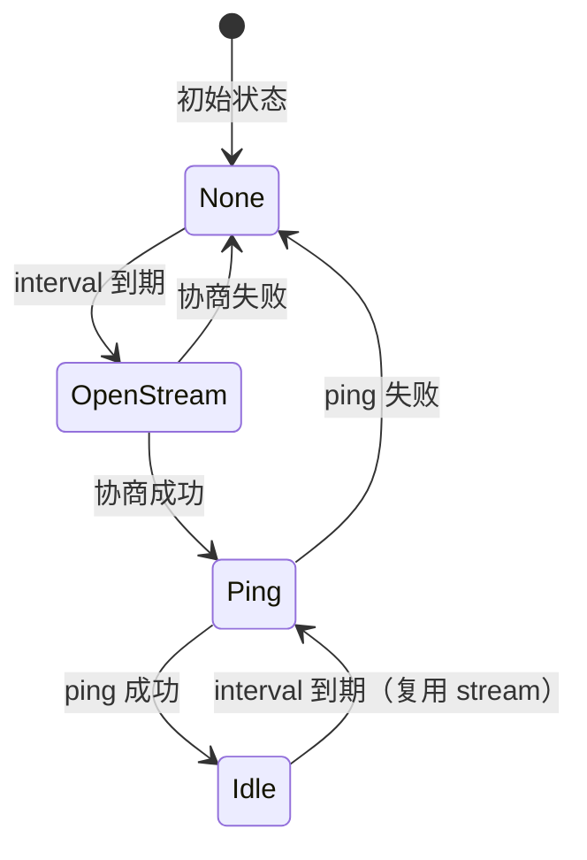

> 看懂一个好的实现，胜过写十个坏的。

上一章我们用 `libp2p_stream` 快速实现了自定义协议，但它有局限性：每次都新建子流、没有内置定时器、需要手动处理超时。

本章将深入分析 libp2p 官方 Ping 协议的源码，学习生产级协议的设计模式，然后用这些模式重构我们的计数器协议。

## 回顾：libp2p_stream 的问题

```rust
// libp2p_stream 方式：每次同步都新建子流
async fn sync_loop(peer: PeerId, mut control: stream::Control, counter: Arc<AtomicU64>) {
    loop {
        tokio::time::sleep(Duration::from_secs(5)).await;
        // 每次都要新建子流 ❌
        let stream = control.open_stream(peer, COUNTER_PROTOCOL).await?;
        do_sync(stream, &counter).await?;
        // stream 用完就丢弃 ❌
    }
}
```

问题：

- **子流开销**：每次请求都要协商新子流
- **定时器分散**：`tokio::time::sleep` 在外部管理
- **无超时保护**：如果对端不响应，会一直等待
- **状态分散**：计数器状态在外部 `Arc<AtomicU64>` 中

## Ping 协议源码分析

Ping 协议位于 [rust-libp2p/protocols/ping](https://github.com/libp2p/rust-libp2p/tree/master/protocols/ping)，是 libp2p 中最简单但最精致的协议实现。

### 三层架构

```text
┌─────────────────────────────────────────────────────────┐
│                  lib.rs (Behaviour)                      │
│  管理所有连接，收集事件向上报告                            │
└─────────────────────────────────────────────────────────┘
                           ↑↓
┌─────────────────────────────────────────────────────────┐
│                handler.rs (Handler)                      │
│  每连接一个实例，状态机管理子流生命周期                     │
└─────────────────────────────────────────────────────────┘
                           ↑↓
┌─────────────────────────────────────────────────────────┐
│               protocol.rs (Protocol)                     │
│  纯粹的消息编解码，无状态 async 函数                       │
└─────────────────────────────────────────────────────────┘
```

### Protocol 层：消息编解码

Ping 的协议层极其简单——发送 32 字节随机数据，期望收到相同的 32 字节：

```rust
// protocol.rs
const PING_SIZE: usize = 32;

/// 发送 ping，等待 pong
pub async fn send_ping<S>(mut stream: S) -> io::Result<(S, Duration)>
where
    S: AsyncRead + AsyncWrite + Unpin,
{
    // 生成 32 字节随机数据
    let payload: [u8; PING_SIZE] = thread_rng().sample(distributions::Standard);

    // 发送
    stream.write_all(&payload).await?;
    stream.flush().await?;

    // 开始计时
    let started = Instant::now();

    // 等待响应
    let mut recv_payload = [0u8; PING_SIZE];
    stream.read_exact(&mut recv_payload).await?;

    // 验证响应
    if recv_payload == payload {
        Ok((stream, started.elapsed()))  // 返回 stream 和 RTT
    } else {
        Err(io::Error::new(io::ErrorKind::InvalidData, "Ping payload mismatch"))
    }
}

/// 接收 ping，发送 pong
pub async fn recv_ping<S>(mut stream: S) -> io::Result<S>
where
    S: AsyncRead + AsyncWrite + Unpin,
{
    let mut payload = [0u8; PING_SIZE];
    stream.read_exact(&mut payload).await?;  // 读取
    stream.write_all(&payload).await?;       // 原样返回
    stream.flush().await?;
    Ok(stream)  // 返回 stream 以便复用
}
```

:::tip[关键设计]
**返回 Stream**：两个函数都返回 `stream`，这是实现子流复用的基础。
:::

### Handler 层：状态机

Handler 是 Ping 协议的核心，管理每个连接上的协议状态。

#### 出站状态机

```rust
// handler.rs
enum OutboundState {
    /// 正在协商新子流
    OpenStream,
    /// 空闲，持有子流等待下次使用
    Idle(Stream),
    /// 正在执行 ping
    Ping(PingFuture),
}
```

状态转换：



关键点：**Ping 成功后进入 `Idle(Stream)` 状态，保存 stream 以便下次复用**。

#### Handler 结构

```rust
pub struct Handler {
    config: Config,
    /// 定时器：控制 ping 间隔
    interval: Delay,
    /// 待处理的错误
    pending_errors: VecDeque<Failure>,
    /// 连续失败次数
    failures: u32,
    /// 出站状态
    outbound: Option<OutboundState>,
    /// 入站处理
    inbound: Option<PongFuture>,
    /// Handler 状态
    state: State,
}
```

#### poll 方法核心逻辑

```rust
fn poll(&mut self, cx: &mut Context<'_>) -> Poll<...> {
    // 1. 处理入站 ping（响应 pong）
    if let Some(fut) = self.inbound.as_mut() {
        match fut.poll_unpin(cx) {
            Poll::Ready(Ok(stream)) => {
                // 继续监听下一个 ping，复用 stream
                self.inbound = Some(protocol::recv_ping(stream).boxed());
            }
            Poll::Ready(Err(e)) => {
                self.inbound = None;
            }
            Poll::Pending => {}
        }
    }

    loop {
        // 2. 处理出站 ping
        match self.outbound.take() {
            // 正在执行 ping
            Some(OutboundState::Ping(mut ping)) => {
                match ping.poll_unpin(cx) {
                    Poll::Ready(Ok((stream, rtt))) => {
                        self.failures = 0;  // 重置失败计数
                        self.interval.reset(self.config.interval);
                        // 保存 stream 以便复用 ✅
                        self.outbound = Some(OutboundState::Idle(stream));
                        return Poll::Ready(NotifyBehaviour(Ok(rtt)));
                    }
                    Poll::Ready(Err(e)) => {
                        self.interval.reset(self.config.interval);
                        self.pending_errors.push_front(e);
                    }
                    Poll::Pending => {
                        self.outbound = Some(OutboundState::Ping(ping));
                        break;
                    }
                }
            }

            // 空闲状态，等待下次 ping
            Some(OutboundState::Idle(stream)) => {
                match self.interval.poll_unpin(cx) {
                    Poll::Ready(()) => {
                        // 复用已有的 stream！✅
                        self.outbound = Some(OutboundState::Ping(
                            send_ping(stream, self.config.timeout).boxed()
                        ));
                    }
                    Poll::Pending => {
                        self.outbound = Some(OutboundState::Idle(stream));
                        break;
                    }
                }
            }

            // 没有 stream，需要请求新的
            None => {
                match self.interval.poll_unpin(cx) {
                    Poll::Ready(()) => {
                        self.outbound = Some(OutboundState::OpenStream);
                        return Poll::Ready(OutboundSubstreamRequest { ... });
                    }
                    Poll::Pending => break,
                }
            }
        }
    }

    Poll::Pending
}
```

#### 超时处理

Ping 使用 `future::select` 实现超时：

```rust
async fn send_ping(stream: Stream, timeout: Duration) -> Result<(Stream, Duration), Failure> {
    let ping = protocol::send_ping(stream);
    futures::pin_mut!(ping);

    match future::select(ping, Delay::new(timeout)).await {
        Either::Left((Ok((stream, rtt)), _)) => Ok((stream, rtt)),
        Either::Left((Err(e), _)) => Err(Failure::other(e)),
        Either::Right(((), _)) => Err(Failure::Timeout),
    }
}
```

### Behaviour 层：协调

Behaviour 层非常简洁，主要职责是为每个连接创建 Handler，并收集事件：

```rust
// lib.rs
pub struct Behaviour {
    config: Config,
    events: VecDeque<Event>,
}

impl NetworkBehaviour for Behaviour {
    type ConnectionHandler = Handler;
    type ToSwarm = Event;

    // 为入站连接创建 Handler
    fn handle_established_inbound_connection(...) -> Result<Handler, _> {
        Ok(Handler::new(self.config.clone()))
    }

    // 为出站连接创建 Handler
    fn handle_established_outbound_connection(...) -> Result<Handler, _> {
        Ok(Handler::new(self.config.clone()))
    }

    // 收集 Handler 事件
    fn on_connection_handler_event(&mut self, peer, connection, result) {
        self.events.push_front(Event { peer, connection, result });
    }

    // 向上层报告事件
    fn poll(&mut self, _: &mut Context<'_>) -> Poll<ToSwarm<...>> {
        if let Some(e) = self.events.pop_back() {
            Poll::Ready(ToSwarm::GenerateEvent(e))
        } else {
            Poll::Pending
        }
    }
}
```

## 从 Ping 学到的设计模式

| 模式           | 实现方式                | 作用                 |
| -------------- | ----------------------- | -------------------- |
| **子流复用**   | `Idle(Stream)` 状态     | 减少子流协商开销     |
| **内置定时器** | Handler 持有 `Delay`    | 自动周期性执行       |
| **超时包装**   | `future::select`        | 防止无限等待         |
| **容错机制**   | `failures` 计数器       | 首次失败静默处理     |
| **状态机**     | `OutboundState` enum    | 清晰的生命周期管理   |
| **返回 Stream**| `Ok((stream, result))`  | 支持复用             |

## 重构计数器协议

现在用这些模式重构上一章的计数器协议。

### Protocol 层

```rust
// protocol.rs
use std::{io, time::Duration};

use futures::prelude::*;
use libp2p::StreamProtocol;
use serde::{Deserialize, Serialize};
use web_time::Instant;

pub const PROTOCOL_NAME: StreamProtocol = StreamProtocol::new("/counter/1.0.0");

#[derive(Debug, Clone, Serialize, Deserialize)]
pub struct SyncRequest {
    pub count: u64,
}

#[derive(Debug, Clone, Serialize, Deserialize)]
pub struct SyncResponse {
    pub count: u64,
}

/// 发送同步请求，返回 stream 以便复用
pub async fn send_sync<S>(mut stream: S, count: u64) -> io::Result<(S, u64)>
where
    S: AsyncRead + AsyncWrite + Unpin,
{
    // 写入请求
    let req = SyncRequest { count };
    let data = serde_json::to_vec(&req)
        .map_err(|e| io::Error::new(io::ErrorKind::InvalidData, e))?;
    stream.write_all(&(data.len() as u32).to_be_bytes()).await?;
    stream.write_all(&data).await?;
    stream.flush().await?;

    // 读取响应
    let mut len_buf = [0u8; 4];
    stream.read_exact(&mut len_buf).await?;
    let len = u32::from_be_bytes(len_buf) as usize;

    let mut buf = vec![0u8; len];
    stream.read_exact(&mut buf).await?;

    let resp: SyncResponse = serde_json::from_slice(&buf)
        .map_err(|e| io::Error::new(io::ErrorKind::InvalidData, e))?;

    Ok((stream, resp.count))  // 返回 stream！
}

/// 接收同步请求，发送响应
pub async fn recv_sync<S>(mut stream: S, local_count: u64) -> io::Result<(S, u64)>
where
    S: AsyncRead + AsyncWrite + Unpin,
{
    // 读取请求
    let mut len_buf = [0u8; 4];
    stream.read_exact(&mut len_buf).await?;
    let len = u32::from_be_bytes(len_buf) as usize;

    let mut buf = vec![0u8; len];
    stream.read_exact(&mut buf).await?;

    let req: SyncRequest = serde_json::from_slice(&buf)
        .map_err(|e| io::Error::new(io::ErrorKind::InvalidData, e))?;

    // 计算新值
    let new_count = std::cmp::max(local_count, req.count);

    // 发送响应
    let resp = SyncResponse { count: new_count };
    let data = serde_json::to_vec(&resp)
        .map_err(|e| io::Error::new(io::ErrorKind::InvalidData, e))?;
    stream.write_all(&(data.len() as u32).to_be_bytes()).await?;
    stream.write_all(&data).await?;
    stream.flush().await?;

    Ok((stream, req.count))  // 返回 stream 和对方的计数
}
```

### Handler 层

```rust
// handler.rs
use std::{
    collections::VecDeque,
    task::{Context, Poll},
    time::Duration,
};

use futures::{future::{BoxFuture, Either}, prelude::*};
use futures_timer::Delay;
use libp2p::swarm::{
    ConnectionHandler, ConnectionHandlerEvent, Stream, StreamProtocol,
    SubstreamProtocol, handler::{ConnectionEvent, FullyNegotiatedInbound, FullyNegotiatedOutbound},
};
use libp2p_core::upgrade::ReadyUpgrade;

use crate::protocol::{self, PROTOCOL_NAME};

#[derive(Debug, Clone)]
pub struct Config {
    pub timeout: Duration,
    pub interval: Duration,
}

impl Default for Config {
    fn default() -> Self {
        Self {
            timeout: Duration::from_secs(10),
            interval: Duration::from_secs(30),
        }
    }
}

#[derive(Debug)]
pub enum Failure {
    Timeout,
    Io(std::io::Error),
}

/// Handler 向 Behaviour 报告的事件
#[derive(Debug)]
pub enum ToBehaviour {
    Synced { remote_count: u64, new_count: u64 },
    InboundSync { remote_count: u64 },
    Error(Failure),
}

/// Behaviour 向 Handler 发送的命令
#[derive(Debug)]
pub enum FromBehaviour {
    Sync,
    UpdateCount(u64),
}

type SyncFuture = BoxFuture<'static, Result<(Stream, u64), Failure>>;
type InboundFuture = BoxFuture<'static, Result<(Stream, u64), std::io::Error>>;

/// 出站状态机
enum OutboundState {
    /// 正在协商新子流
    OpenStream,
    /// 空闲，持有子流等待下次使用
    Idle(Stream),
    /// 正在执行同步
    Syncing(SyncFuture),
}

pub struct Handler {
    config: Config,
    local_count: u64,
    /// 内置定时器
    interval: Delay,
    /// 出站状态机
    outbound: Option<OutboundState>,
    /// 入站处理
    inbound: Option<InboundFuture>,
    pending_events: VecDeque<ToBehaviour>,
    failures: u32,
}

impl Handler {
    pub fn new(config: Config, local_count: u64) -> Self {
        Self {
            config,
            local_count,
            interval: Delay::new(Duration::ZERO),  // 立即触发首次同步
            outbound: None,
            inbound: None,
            pending_events: VecDeque::new(),
            failures: 0,
        }
    }
}

impl ConnectionHandler for Handler {
    type FromBehaviour = FromBehaviour;
    type ToBehaviour = ToBehaviour;
    type InboundProtocol = ReadyUpgrade<StreamProtocol>;
    type OutboundProtocol = ReadyUpgrade<StreamProtocol>;
    type InboundOpenInfo = ();
    type OutboundOpenInfo = ();

    fn listen_protocol(&self) -> SubstreamProtocol<Self::InboundProtocol, ()> {
        SubstreamProtocol::new(ReadyUpgrade::new(PROTOCOL_NAME), ())
    }

    fn on_behaviour_event(&mut self, event: Self::FromBehaviour) {
        match event {
            FromBehaviour::Sync => {
                self.interval.reset(Duration::ZERO);
            }
            FromBehaviour::UpdateCount(count) => {
                self.local_count = count;
            }
        }
    }

    fn on_connection_event(
        &mut self,
        event: ConnectionEvent<Self::InboundProtocol, Self::OutboundProtocol>,
    ) {
        match event {
            ConnectionEvent::FullyNegotiatedInbound(FullyNegotiatedInbound {
                protocol: stream, ..
            }) => {
                let local_count = self.local_count;
                self.inbound = Some(protocol::recv_sync(stream, local_count).boxed());
            }
            ConnectionEvent::FullyNegotiatedOutbound(FullyNegotiatedOutbound {
                protocol: stream, ..
            }) => {
                let count = self.local_count;
                let timeout = self.config.timeout;
                self.outbound = Some(OutboundState::Syncing(
                    sync_with_timeout(stream, count, timeout).boxed()
                ));
            }
            _ => {}
        }
    }

    fn poll(&mut self, cx: &mut Context<'_>) -> Poll<
        ConnectionHandlerEvent<Self::OutboundProtocol, (), Self::ToBehaviour>
    > {
        // 1. 返回待处理事件
        if let Some(event) = self.pending_events.pop_front() {
            return Poll::Ready(ConnectionHandlerEvent::NotifyBehaviour(event));
        }

        // 2. 处理入站同步
        if let Some(fut) = self.inbound.as_mut() {
            match fut.poll_unpin(cx) {
                Poll::Ready(Ok((stream, remote_count))) => {
                    let new_count = std::cmp::max(self.local_count, remote_count);
                    self.local_count = new_count;
                    // 复用 stream 继续监听
                    self.inbound = Some(protocol::recv_sync(stream, self.local_count).boxed());
                    return Poll::Ready(ConnectionHandlerEvent::NotifyBehaviour(
                        ToBehaviour::InboundSync { remote_count }
                    ));
                }
                Poll::Ready(Err(_)) => {
                    self.inbound = None;
                }
                Poll::Pending => {}
            }
        }

        // 3. 出站状态机
        loop {
            match self.outbound.take() {
                Some(OutboundState::Syncing(mut fut)) => {
                    match fut.poll_unpin(cx) {
                        Poll::Ready(Ok((stream, remote_count))) => {
                            self.failures = 0;
                            self.interval.reset(self.config.interval);
                            let new_count = std::cmp::max(self.local_count, remote_count);
                            self.local_count = new_count;
                            // 保存 stream 以便复用 ✅
                            self.outbound = Some(OutboundState::Idle(stream));
                            return Poll::Ready(ConnectionHandlerEvent::NotifyBehaviour(
                                ToBehaviour::Synced { remote_count, new_count }
                            ));
                        }
                        Poll::Ready(Err(e)) => {
                            self.failures += 1;
                            self.interval.reset(self.config.interval);
                            if self.failures > 1 {
                                self.pending_events.push_back(ToBehaviour::Error(e));
                            }
                        }
                        Poll::Pending => {
                            self.outbound = Some(OutboundState::Syncing(fut));
                            break;
                        }
                    }
                }

                Some(OutboundState::Idle(stream)) => {
                    match self.interval.poll_unpin(cx) {
                        Poll::Ready(()) => {
                            // 复用 stream ✅
                            let count = self.local_count;
                            let timeout = self.config.timeout;
                            self.outbound = Some(OutboundState::Syncing(
                                sync_with_timeout(stream, count, timeout).boxed()
                            ));
                        }
                        Poll::Pending => {
                            self.outbound = Some(OutboundState::Idle(stream));
                            break;
                        }
                    }
                }

                Some(OutboundState::OpenStream) => {
                    self.outbound = Some(OutboundState::OpenStream);
                    break;
                }

                None => {
                    match self.interval.poll_unpin(cx) {
                        Poll::Ready(()) => {
                            self.outbound = Some(OutboundState::OpenStream);
                            return Poll::Ready(ConnectionHandlerEvent::OutboundSubstreamRequest {
                                protocol: SubstreamProtocol::new(ReadyUpgrade::new(PROTOCOL_NAME), ()),
                            });
                        }
                        Poll::Pending => break,
                    }
                }
            }
        }

        Poll::Pending
    }
}

/// 带超时的同步
async fn sync_with_timeout(stream: Stream, count: u64, timeout: Duration) -> Result<(Stream, u64), Failure> {
    let sync = protocol::send_sync(stream, count);
    futures::pin_mut!(sync);

    match futures::future::select(sync, Delay::new(timeout)).await {
        Either::Left((Ok(result), _)) => Ok(result),
        Either::Left((Err(e), _)) => Err(Failure::Io(e)),
        Either::Right(((), _)) => Err(Failure::Timeout),
    }
}
```

### Behaviour 层

```rust
// lib.rs
use std::{
    collections::HashMap,
    task::{Context, Poll},
};

use libp2p::swarm::{NetworkBehaviour, ToSwarm, FromSwarm, ConnectionId};
use libp2p::{PeerId, Multiaddr};
use libp2p_core::{transport::PortUse, Endpoint};

mod protocol;
mod handler;

pub use handler::{Config, Failure};
use handler::{Handler, ToBehaviour, FromBehaviour};

#[derive(Debug)]
pub struct Event {
    pub peer: PeerId,
    pub result: EventResult,
}

#[derive(Debug)]
pub enum EventResult {
    Synced { remote_count: u64, new_count: u64 },
    InboundSync { remote_count: u64 },
    Error(Failure),
}

pub struct Behaviour {
    config: Config,
    count: u64,
    connected_peers: HashMap<PeerId, ConnectionId>,
    events: std::collections::VecDeque<Event>,
}

impl Behaviour {
    pub fn new(config: Config) -> Self {
        Self {
            config,
            count: 0,
            connected_peers: HashMap::new(),
            events: std::collections::VecDeque::new(),
        }
    }

    pub fn count(&self) -> u64 {
        self.count
    }

    pub fn increment(&mut self) {
        self.count += 1;
    }
}

impl NetworkBehaviour for Behaviour {
    type ConnectionHandler = Handler;
    type ToSwarm = Event;

    fn handle_established_inbound_connection(
        &mut self,
        _: ConnectionId,
        peer: PeerId,
        _: &Multiaddr,
        _: &Multiaddr,
    ) -> Result<Handler, libp2p::swarm::ConnectionDenied> {
        self.connected_peers.insert(peer, ConnectionId::new_unchecked(0));
        Ok(Handler::new(self.config.clone(), self.count))
    }

    fn handle_established_outbound_connection(
        &mut self,
        connection: ConnectionId,
        peer: PeerId,
        _: &Multiaddr,
        _: Endpoint,
        _: PortUse,
    ) -> Result<Handler, libp2p::swarm::ConnectionDenied> {
        self.connected_peers.insert(peer, connection);
        Ok(Handler::new(self.config.clone(), self.count))
    }

    fn on_swarm_event(&mut self, event: FromSwarm) {
        if let FromSwarm::ConnectionClosed(info) = event {
            self.connected_peers.remove(&info.peer_id);
        }
    }

    fn on_connection_handler_event(
        &mut self,
        peer: PeerId,
        _: ConnectionId,
        event: ToBehaviour,
    ) {
        let result = match event {
            ToBehaviour::Synced { remote_count, new_count } => {
                self.count = std::cmp::max(self.count, new_count);
                EventResult::Synced { remote_count, new_count }
            }
            ToBehaviour::InboundSync { remote_count } => {
                self.count = std::cmp::max(self.count, remote_count);
                EventResult::InboundSync { remote_count }
            }
            ToBehaviour::Error(e) => EventResult::Error(e),
        };

        self.events.push_back(Event { peer, result });
    }

    fn poll(&mut self, _: &mut Context<'_>) -> Poll<ToSwarm<Self::ToSwarm, FromBehaviour>> {
        if let Some(event) = self.events.pop_front() {
            Poll::Ready(ToSwarm::GenerateEvent(event))
        } else {
            Poll::Pending
        }
    }
}
```

## 对比：libp2p_stream vs ConnectionHandler

| 特性         | libp2p_stream（上一章） | ConnectionHandler（本章） |
| ------------ | ----------------------- | ------------------------- |
| 子流管理     | 每次新建                | 复用 `Idle(Stream)`       |
| 定时同步     | 外部 `tokio::sleep`     | Handler 内置 `Delay`      |
| 超时处理     | 无                      | `future::select`          |
| 容错         | 无                      | 首次失败静默              |
| 状态管理     | 分散在 `Arc<AtomicU64>` | 集中在 Handler            |
| 代码复杂度   | 低                      | 高                        |
| 适用场景     | 原型/实验               | 生产环境                  |

## 小结

本章通过分析 Ping 协议源码，学习了生产级协议的设计模式：

1. **三层架构**：Protocol（编解码）→ Handler（状态机）→ Behaviour（协调）
2. **子流复用**：通过 `Idle(Stream)` 状态保存子流
3. **内置定时器**：Handler 自己管理周期性任务
4. **超时处理**：使用 `future::select` 实现
5. **容错机制**：失败计数器，首次失败静默

选择建议：

- **快速原型**：使用 `libp2p_stream`（上一章）
- **生产环境**：使用 `ConnectionHandler`（本章）

这些模式可以应用到任何自定义协议中，帮助你构建健壮的 P2P 应用。
