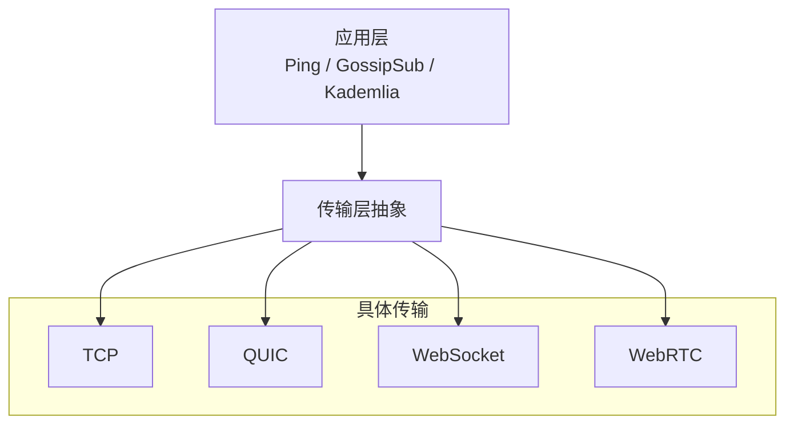
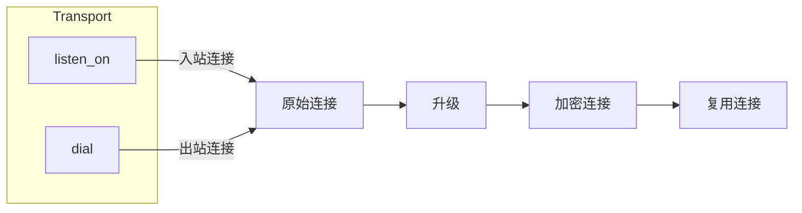
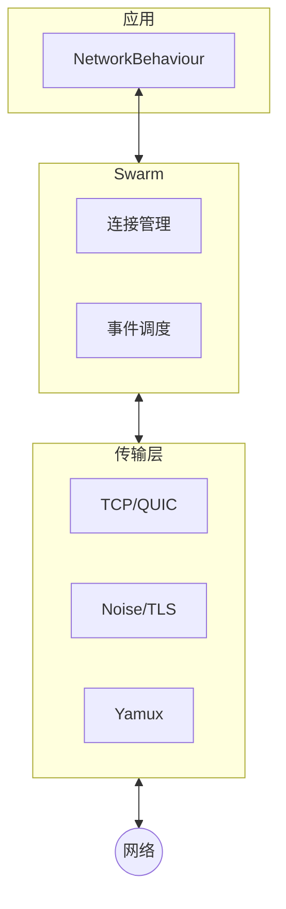

> 条条大路通罗马。
> ——西方谚语

古罗马帝国修建了四通八达的道路网络，无论你从哪里出发，走哪条路，最终都能抵达罗马。libp2p 的传输层也是如此：无论底层是 TCP、QUIC 还是 WebSocket，上层应用代码都无需改变。

在前一篇中，我们学习了 Swarm 和 NetworkBehaviour——它们负责连接管理和协议调度。但一个关键问题尚未深入：**数据是如何在网络上传输的？**

这就是本篇要探讨的主题：**传输层**。

## 为什么需要传输层抽象？

想象你要给朋友寄一封信。你可以选择：

- 普通邮政（便宜但慢）
- 快递公司（快但贵）
- 电子邮件（最快但需要网络）

无论选择哪种方式，信的内容（协议层）都不需要改变——你只是换了一种"传输方式"。

P2P 网络面临类似的选择：



**传输层抽象**让上层协议与底层网络解耦：

- 在数据中心，你可能用 TCP
- 在移动端，QUIC 更适合弱网环境
- 在浏览器中，只能用 WebSocket 或 WebRTC

有了抽象层，同一套代码可以运行在不同环境中。

## Transport trait

在 libp2p 中，传输层通过 `Transport` trait 定义。它的核心职责是：

1. **监听**：在指定地址等待入站连接
2. **拨号**：主动连接到远程地址
3. **升级**：将原始连接升级为安全、复用的连接



### 连接升级

原始的 TCP 连接只是字节流，libp2p 需要对其进行"升级"：

1. **安全升级**：添加加密层（Noise 或 TLS）
2. **复用升级**：添加流复用（Yamux）

这就是为什么 SwarmBuilder 的 `with_tcp` 需要三个参数：

```rust
.with_tcp(
    tcp::Config::default(),    // TCP 配置
    noise::Config::new,        // 安全层：Noise 加密
    yamux::Config::default,    // 复用层：Yamux
)?
```

## SwarmBuilder 与传输配置

回顾第一篇的 Ping 示例，我们用 `SwarmBuilder` 配置传输层：

```rust
let mut swarm = SwarmBuilder::with_existing_identity(keypair)
    .with_tokio()
    .with_tcp(
        tcp::Config::default(),
        noise::Config::new,
        yamux::Config::default,
    )?
    .with_behaviour(|_keypair| ping::Behaviour::default())?
    .build();
```

`SwarmBuilder` 提供了多种传输配置方法：

| 方法 | 传输类型 | 适用场景 |
|-----|---------|---------|
| `with_tcp(...)` | TCP | 最通用，服务器间通信 |
| `with_quic()` | QUIC | 移动端、弱网环境 |
| `with_quic_config(...)` | QUIC（自定义配置） | 需要调优的 QUIC |
| `with_websocket(...)` | WebSocket | 需要穿透 HTTP 代理 |
| `with_dns()` | DNS 解析 | 支持域名地址 |

### 组合多种传输

libp2p 的强大之处在于可以同时支持多种传输：

```rust
let swarm = SwarmBuilder::with_new_identity()
    .with_tokio()
    // TCP 传输
    .with_tcp(
        tcp::Config::default(),
        noise::Config::new,
        yamux::Config::default,
    )?
    // QUIC 传输
    .with_quic()
    // DNS 解析支持
    .with_dns()?
    .with_behaviour(|_| ping::Behaviour::default())?
    .build();
```

这样配置后，节点可以：

- 通过 TCP 连接：`/ip4/192.168.1.100/tcp/9000`
- 通过 QUIC 连接：`/ip4/192.168.1.100/udp/9000/quic-v1`
- 通过域名连接：`/dns4/example.com/tcp/9000`

Swarm 会根据 Multiaddr 自动选择合适的传输。

## 传输层的职责边界

理解传输层的职责边界很重要：

| 层次 | 职责 | 示例 |
|-----|------|-----|
| **传输层** | 建立连接、加密、复用 | TCP、QUIC、Noise、Yamux |
| **协议层** | 应用逻辑 | Ping、Identify、GossipSub |
| **Swarm** | 连接管理、事件调度 | dial、listen、事件循环 |

传输层只关心"如何建立安全可靠的连接"，不关心连接上传输什么内容。



## 常见传输对比

| 传输 | 协议 | 特点 | 适用场景 |
|-----|------|------|---------|
| **TCP** | TCP | 可靠、通用、广泛支持 | 服务器、桌面应用 |
| **QUIC** | UDP | 0-RTT 握手、内置加密和复用 | 移动端、弱网环境 |
| **WebSocket** | HTTP | 穿透防火墙、浏览器兼容 | Web 应用 |
| **WebRTC** | UDP | 浏览器原生支持、NAT 穿透 | 浏览器 P2P |

:::tip[如何选择？]
- 服务器部署：**TCP + QUIC** 双栈
- 移动应用：优先 **QUIC**
- 需要浏览器支持：**WebSocket** 或 **WebRTC**
- 开发测试：**TCP** 最简单
:::

## 小结

本章介绍了 libp2p 传输层的核心概念：

- **传输层抽象**让上层协议与底层网络解耦
- **Transport trait** 定义了监听、拨号、升级三个核心操作
- **SwarmBuilder** 提供了便捷的传输配置 API
- **多传输组合**让节点适应不同网络环境

传输层是 libp2p 模块化设计的典范——你可以自由选择和组合不同的传输方式，而上层代码无需修改。

接下来的章节，我们将深入两种最重要的传输：**TCP** 和 **QUIC**，对比它们的连接建立过程和性能特点。
