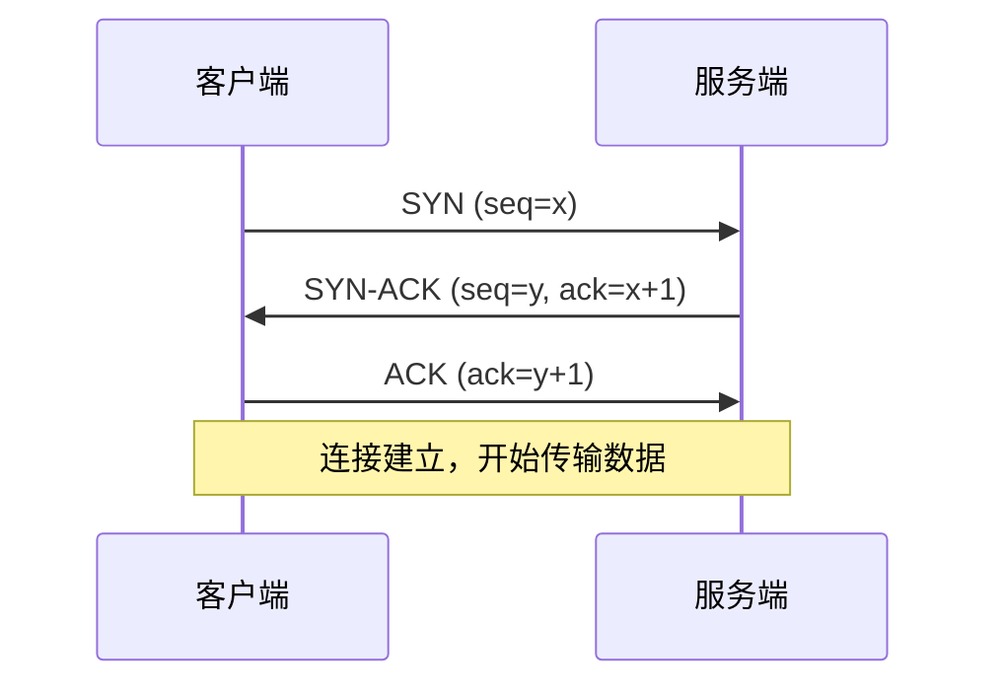
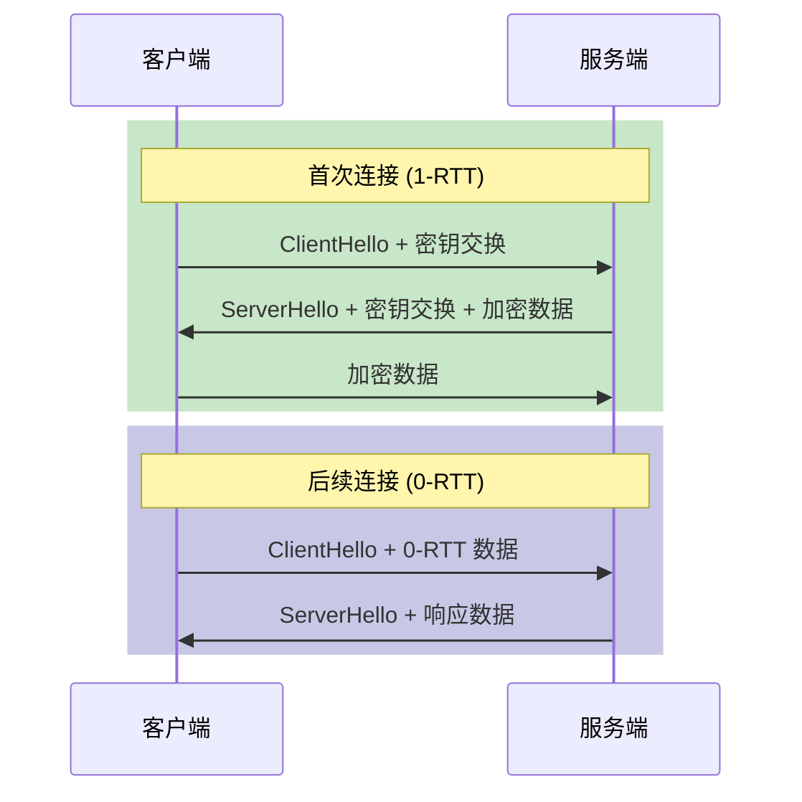
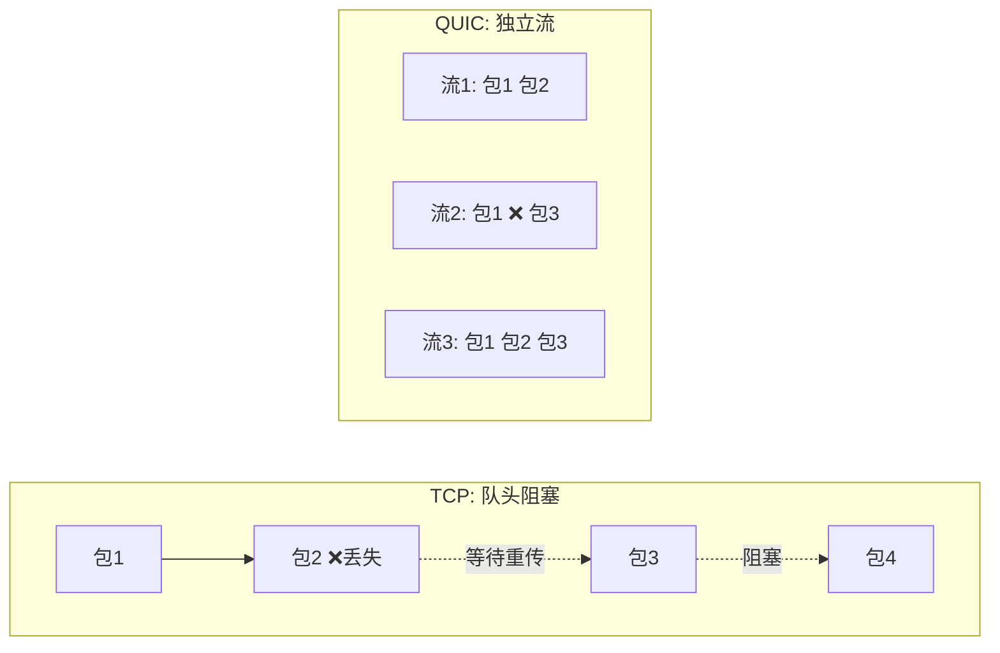
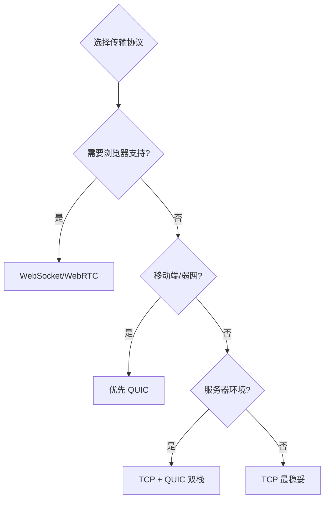
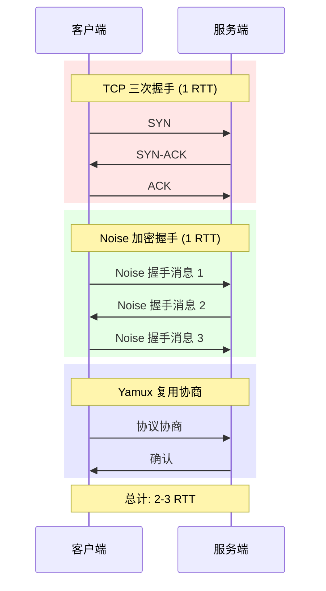
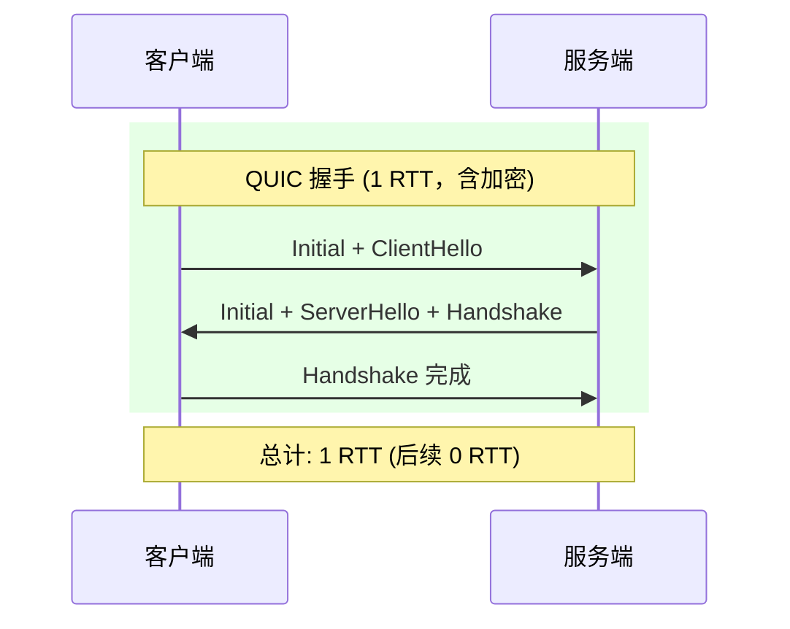

> 工欲善其事，必先利其器。
> ——《论语·卫灵公》

要做好一件事，先要有合适的工具。选择传输协议也是如此——TCP 稳定可靠，QUIC 快速灵活，各有千秋。理解它们的特点，才能在不同场景下做出正确选择。

上一章我们了解了传输层抽象。本章深入两种最重要的传输协议：**TCP** 和 **QUIC**。

## TCP：久经考验的老将

**TCP**（Transmission Control Protocol）诞生于 1974 年，是互联网的基石。它提供：

- **可靠传输**：保证数据按序、完整到达
- **拥塞控制**：自动调节发送速率
- **广泛支持**：几乎所有网络环境都支持

### TCP 连接建立：三次握手

TCP 使用经典的"三次握手"建立连接：



**为什么需要三次？**

1. **第一次**：客户端证明自己能发送
2. **第二次**：服务端证明自己能收发
3. **第三次**：客户端证明自己能接收

这就像打电话：
- "喂，听得到吗？"（SYN）
- "听得到，你呢？"（SYN-ACK）
- "我也听得到！"（ACK）

### 在 libp2p 中使用 TCP

```rust
use libp2p::{tcp, noise, yamux, SwarmBuilder};

let swarm = SwarmBuilder::with_new_identity()
    .with_tokio()
    .with_tcp(
        tcp::Config::default(),
        noise::Config::new,      // 加密层
        yamux::Config::default,  // 复用层
    )?
    .with_behaviour(|_| /* ... */)?
    .build();

// TCP 地址格式
swarm.listen_on("/ip4/0.0.0.0/tcp/9000".parse()?)?;
```

:::note[TCP 需要额外升级]
原始 TCP 只是字节流。libp2p 需要在其上添加：
1. **加密层**：Noise 或 TLS
2. **复用层**：Yamux

后续章节会详细介绍这两层。
:::

## QUIC：新时代的选择

**QUIC**（Quick UDP Internet Connections）由 Google 于 2012 年提出，2021 年成为 IETF 标准（RFC 9000）。它基于 UDP 构建，但提供了 TCP 的可靠性，并带来诸多改进。

### QUIC 的优势

| 特性 | TCP | QUIC |
|-----|-----|------|
| 握手延迟 | 1-2 RTT | 0-1 RTT |
| 加密 | 需要额外 TLS 握手 | 内置 TLS 1.3 |
| 流复用 | 需要额外协议 | 原生支持 |
| 队头阻塞 | 有 | 无 |
| 连接迁移 | 不支持 | 支持 |

### 0-RTT 握手

QUIC 最大的优势是握手速度。首次连接需要 1 RTT，但后续连接可以做到 **0-RTT**：



对于移动网络或高延迟环境，这个优化非常显著。

### 无队头阻塞

TCP 的一个问题是**队头阻塞**（Head-of-Line Blocking）：



在 TCP 中，如果一个包丢失，后续所有包都必须等待重传。而 QUIC 的每个流是独立的——一个流的丢包不影响其他流。

### 在 libp2p 中使用 QUIC

```rust
use libp2p::SwarmBuilder;

let swarm = SwarmBuilder::with_new_identity()
    .with_tokio()
    .with_quic()  // 就这么简单！
    .with_behaviour(|_| /* ... */)?
    .build();

// QUIC 地址格式
swarm.listen_on("/ip4/0.0.0.0/udp/9000/quic-v1".parse()?)?;
```

:::tip[QUIC 内置加密和复用]
注意 `with_quic()` 不需要指定加密和复用——QUIC 协议本身就包含了 TLS 1.3 加密和原生流复用。这也是为什么 QUIC 的 API 更简洁。
:::

### 自定义 QUIC 配置

需要调优时，使用 `with_quic_config`：

```rust
let swarm = SwarmBuilder::with_new_identity()
    .with_tokio()
    .with_quic_config(|mut config| {
        config.max_idle_timeout = 30_000;  // 30 秒空闲超时
        config
    })
    .with_behaviour(|_| /* ... */)?
    .build();
```

## TCP vs QUIC：如何选择？



### 推荐策略

| 场景 | 推荐 | 原因 |
|-----|------|------|
| 服务器部署 | TCP + QUIC | 最大兼容性 |
| 移动应用 | QUIC 优先 | 0-RTT、连接迁移 |
| 开发测试 | TCP | 调试简单 |
| 防火墙严格 | TCP | UDP 常被封锁 |
| 高延迟网络 | QUIC | 握手快、无队头阻塞 |

### 双栈配置示例

生产环境推荐同时支持 TCP 和 QUIC：

```rust
let swarm = SwarmBuilder::with_new_identity()
    .with_tokio()
    .with_tcp(
        tcp::Config::default(),
        noise::Config::new,
        yamux::Config::default,
    )?
    .with_quic()
    .with_behaviour(|_| /* ... */)?
    .build();

// 同时监听 TCP 和 QUIC
swarm.listen_on("/ip4/0.0.0.0/tcp/9000".parse()?)?;
swarm.listen_on("/ip4/0.0.0.0/udp/9000/quic-v1".parse()?)?;
```

节点会根据对方提供的 Multiaddr 自动选择合适的传输。

## 连接建立时序对比

让我们对比完整的连接建立过程：

### TCP + Noise + Yamux



### QUIC



QUIC 将 TCP 握手、TLS 握手、流复用协商合并为一个 1-RTT 的过程。

## 小结

本章对比了 TCP 和 QUIC 两种核心传输协议：

| 方面 | TCP | QUIC |
|-----|-----|------|
| 成熟度 | 50 年历史，非常稳定 | 较新，但已是 IETF 标准 |
| 握手延迟 | 2-3 RTT | 1 RTT（可 0-RTT） |
| 加密 | 需要额外协议 | 内置 TLS 1.3 |
| 复用 | 需要额外协议 | 原生支持 |
| 防火墙 | 友好 | UDP 可能被封锁 |
| libp2p 配置 | `with_tcp(...)` | `with_quic()` |

**关键要点**：
- **TCP** 稳定可靠，是默认选择
- **QUIC** 性能更好，适合移动端和弱网环境
- **生产环境** 推荐 TCP + QUIC 双栈

下一章，我们将深入 **Noise 协议**——了解 libp2p 如何在 TCP 连接上建立加密通道。
