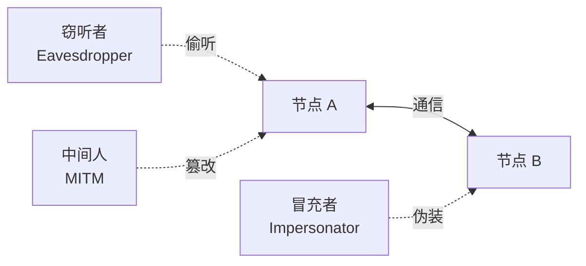
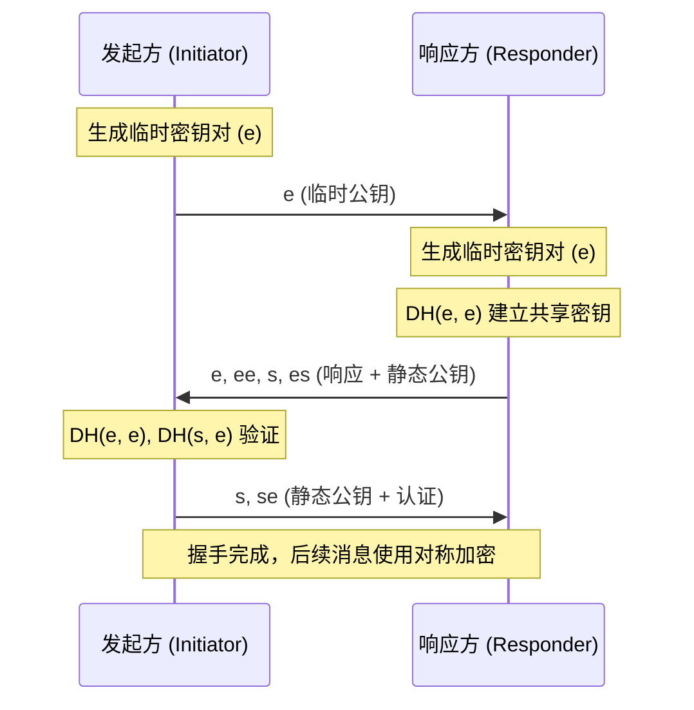
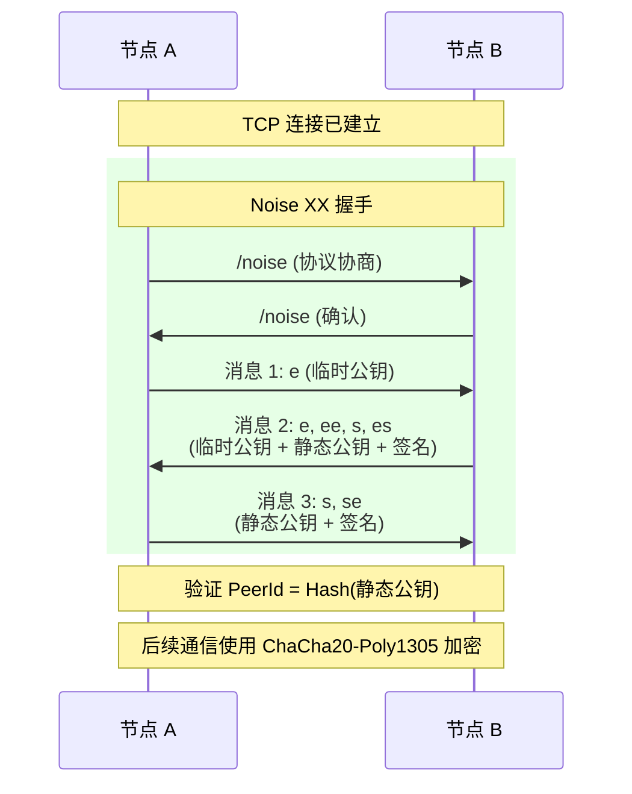
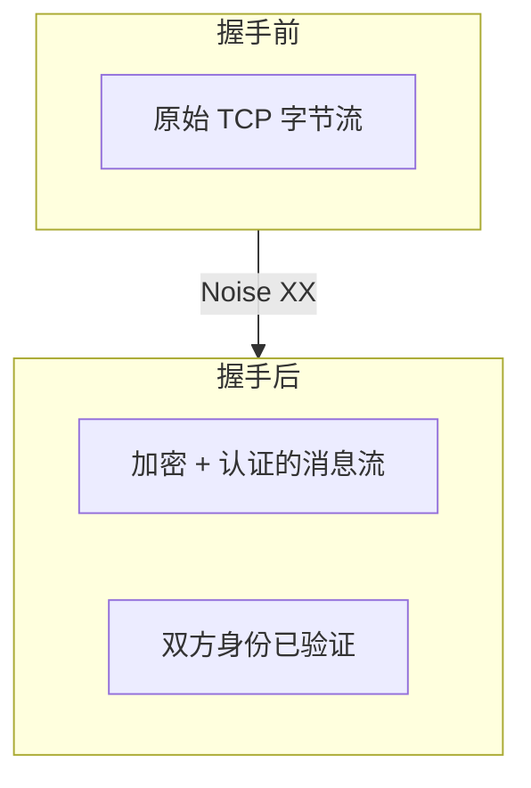

> 君子慎独。
> ——《礼记·中庸》

即使无人监督，君子也会谨慎行事。在 P2P 网络中，节点之间的通信可能穿越不可信的网络——即使没有人"监督"，我们也必须确保通信的安全。

上一章我们了解了 TCP 和 QUIC。TCP 只是原始字节流，需要额外的安全层。本章介绍 libp2p 的加密方案：**Noise 协议**。

## 为什么需要加密？

P2P 网络面临三大安全威胁：



| 威胁 | 描述 | 解决方案 |
|-----|------|---------|
| **窃听** | 第三方读取通信内容 | 加密 |
| **篡改** | 第三方修改消息 | 消息认证 |
| **冒充** | 第三方伪装成合法节点 | 身份验证 |

加密协议需要同时解决这三个问题。

## Noise 协议框架

**Noise** 是一个现代化的加密协议框架，由 Signal 的作者 Trevor Perrin 设计。它的特点是：

- **简洁**：核心规范只有 35 页
- **灵活**：支持多种握手模式
- **安全**：经过形式化验证
- **高效**：最少 1 RTT 完成握手

libp2p 使用 **Noise XX** 模式——双方都不预先知道对方的公钥，需要在握手过程中交换。

### Noise XX 握手流程



三条消息的含义：

| 消息 | 内容 | 作用 |
|-----|------|------|
| **→ e** | 发起方临时公钥 | 开始密钥交换 |
| **← e, ee, s, es** | 响应方临时公钥 + 静态公钥 | 完成密钥交换 + 响应方认证 |
| **→ s, se** | 发起方静态公钥 | 发起方认证 |

:::note[DH 密钥交换]
`ee`、`es`、`se` 表示 Diffie-Hellman 密钥交换：
- `ee`：双方临时密钥交换
- `es`：发起方临时 × 响应方静态
- `se`：发起方静态 × 响应方临时

多次 DH 操作的结果混合后，生成最终的会话密钥。
:::

## libp2p 中的 Noise

libp2p 的 Noise 实现有一个重要扩展：**在握手过程中验证 PeerId**。

### 静态密钥与 PeerId 绑定

回顾第一篇，PeerId 是节点公钥的哈希：

```
PeerId = Hash(PublicKey)
```

Noise 握手交换静态公钥后，双方会验证：

```rust
// 伪代码
let received_public_key = noise_handshake.remote_static_key();
let expected_peer_id = PeerId::from_public_key(&received_public_key);

if expected_peer_id != dial_peer_id {
    return Err("PeerId mismatch!");
}
```

这确保了连接到的确实是目标节点，而非冒充者。

### 配置 Noise

```rust
use libp2p::{tcp, noise, yamux, SwarmBuilder};

let swarm = SwarmBuilder::with_new_identity()
    .with_tokio()
    .with_tcp(
        tcp::Config::default(),
        noise::Config::new,      // 默认 Noise 配置
        yamux::Config::default,
    )?
    .with_behaviour(|_| /* ... */)?
    .build();
```

`noise::Config::new` 是一个函数，接收 keypair 并返回配置：

```rust
// noise::Config::new 的签名
pub fn new(keypair: &Keypair) -> Result<Config, Error>
```

SwarmBuilder 会自动将身份密钥传递给它。

## Noise vs TLS

libp2p 支持两种加密协议：Noise 和 TLS 1.3。

| 特性 | Noise | TLS 1.3 |
|-----|-------|---------|
| 握手延迟 | 1 RTT | 1-2 RTT |
| 证书依赖 | 无 | 可选 |
| 实现复杂度 | 低 | 高 |
| 前向安全性 | ✓ | ✓ |
| libp2p 默认 | ✓ | — |

### 何时使用 TLS？

- **QUIC 传输**：QUIC 内置 TLS 1.3，不使用 Noise
- **Web 兼容**：与现有 Web 基础设施集成
- **企业环境**：需要证书管理的场景

### 配置 TLS

```rust
use libp2p::{tcp, tls, yamux, SwarmBuilder};

let swarm = SwarmBuilder::with_new_identity()
    .with_tokio()
    .with_tcp(
        tcp::Config::default(),
        tls::Config::new,  // 使用 TLS 而非 Noise
        yamux::Config::default,
    )?
    .with_behaviour(|_| /* ... */)?
    .build();
```

### 双加密支持

可以同时支持 Noise 和 TLS，让节点自动协商：

```rust
use libp2p::{tcp, tls, noise, yamux, SwarmBuilder};

let swarm = SwarmBuilder::with_new_identity()
    .with_tokio()
    .with_tcp(
        tcp::Config::default(),
        (tls::Config::new, noise::Config::new),  // 双加密
        yamux::Config::default,
    )?
    .with_behaviour(|_| /* ... */)?
    .build();
```

节点会通过协议协商（multistream-select）选择双方都支持的加密方式。

## 加密握手详解

让我们更详细地看看 Noise XX 在 libp2p 中的实际流程：



### 关键安全属性

Noise 握手完成后，双方获得：

1. **机密性**：通信内容加密，窃听者无法读取
2. **完整性**：消息带认证标签，篡改会被检测
3. **身份认证**：双方都验证了对方的 PeerId
4. **前向安全**：即使长期密钥泄露，历史通信仍安全



## 常见问题

### Q: 为什么不直接用 TLS？

libp2p 最初选择 Noise 是因为：
1. **更简洁**：没有证书链、CA 等复杂概念
2. **更适合 P2P**：节点用自己的密钥对，不需要第三方颁发证书
3. **更灵活**：容易集成到 libp2p 的身份系统

### Q: Noise 安全吗？

是的。Noise 协议经过：
- **形式化验证**：用 ProVerif 证明了安全属性
- **广泛使用**：Signal、WireGuard、Lightning Network 都使用 Noise
- **持续审计**：多次安全审计

### Q: 可以禁用加密吗？

不建议。libp2p 的设计理念是**默认安全**。所有传输都必须加密，这是防止网络攻击的基础。

## 小结

本章介绍了 libp2p 的加密层——Noise 协议：

- **Noise XX** 是 libp2p 在 TCP 上的默认加密方案
- **1 RTT 握手**完成密钥交换和身份认证
- **PeerId 验证**确保连接到正确的节点
- **TLS 1.3** 是另一选项，QUIC 强制使用

加密层解决了"通信安全"的问题。但一个 TCP 连接只是单一通道——如何在一个连接上运行多个协议？

下一章，我们将学习**流复用**——理解如何在单个连接上创建多个独立的逻辑流。
