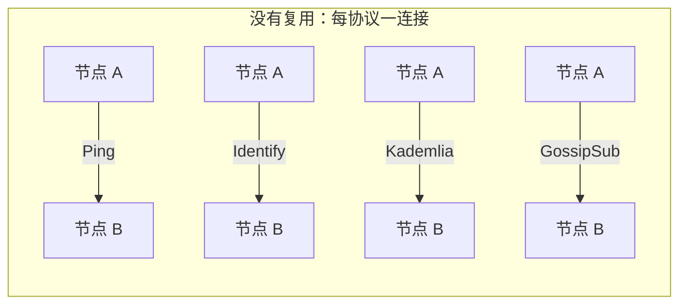
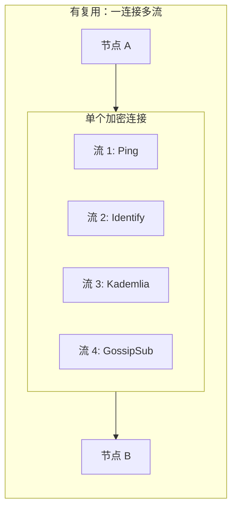
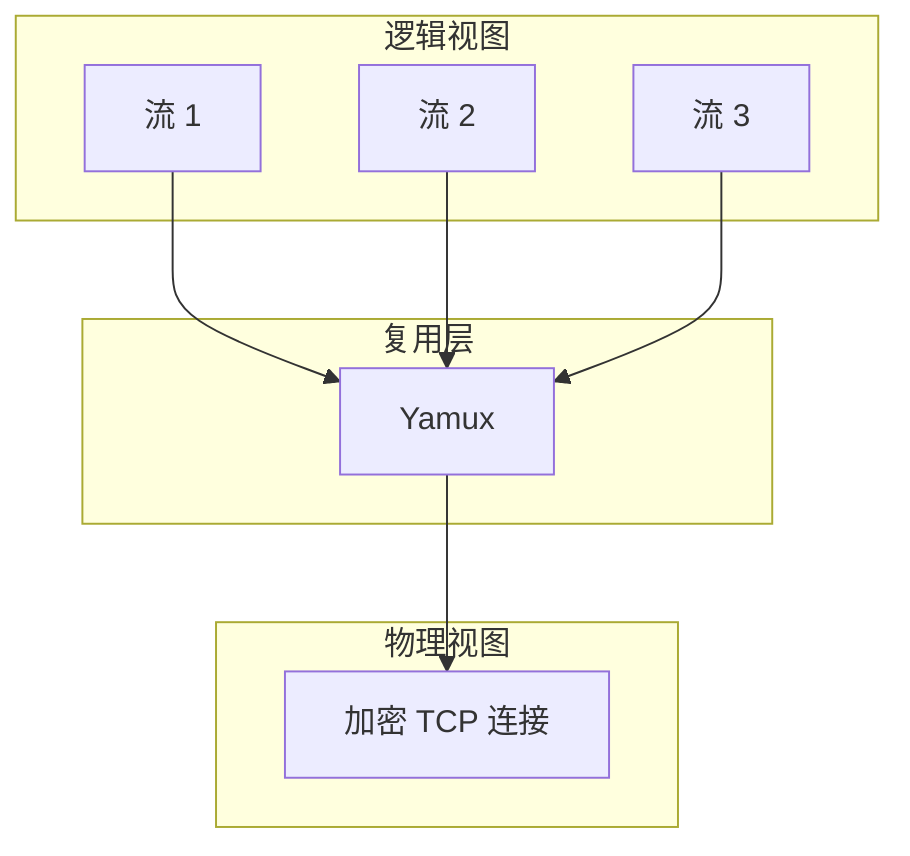
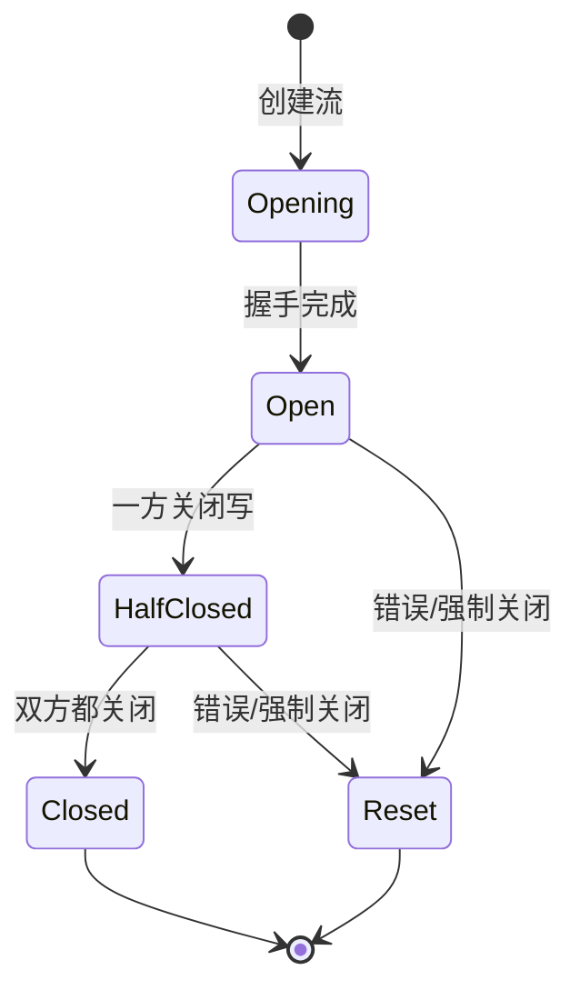
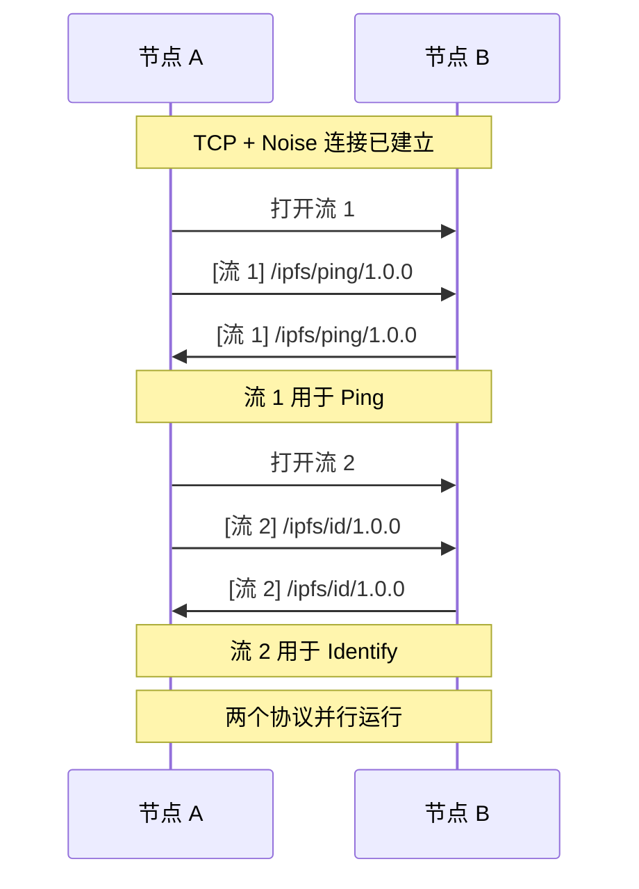
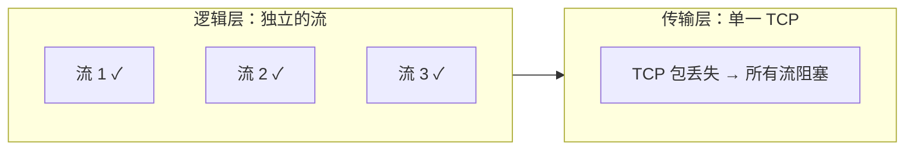
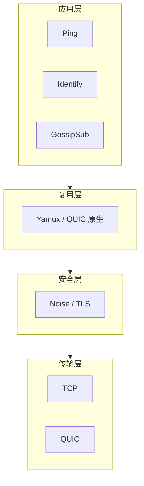

> 一生二，二生三，三生万物。
> ——《道德经》

老子说，道生一，一生二，二生三，三生万物。网络连接也是如此：一个 TCP 连接，可以"生出"无数个逻辑流，每个流承载不同的协议，最终构成丰富多彩的 P2P 通信。

上一章我们学习了 Noise 加密。加密后的连接是安全的，但仍然是单一通道。本章介绍**流复用**——如何在一个连接上运行多个协议。

## 为什么需要流复用？

一个 libp2p 节点通常需要同时运行多个协议：

- **Ping**：心跳检测
- **Identify**：身份交换
- **Kademlia**：节点发现
- **GossipSub**：消息广播

如果每个协议都需要单独的 TCP 连接，会带来严重问题：



问题：
- **资源浪费**：每个连接占用文件描述符、内存
- **握手开销**：每个连接都要重复 TCP + 加密握手
- **端口消耗**：客户端端口是有限资源

**流复用**解决了这个问题：



## 流复用的工作原理

流复用协议将一个底层连接"虚拟化"为多个独立的流：



### 核心概念

| 概念 | 说明 |
|-----|------|
| **流（Stream）** | 虚拟的双向通道，有独立的读写缓冲区 |
| **帧（Frame）** | 在连接上传输的数据单元，带流 ID |
| **窗口（Window）** | 流量控制机制，防止发送过快 |

### 帧格式

复用协议将数据打包成帧，每个帧标记所属的流：

```
+----------------+----------------+----------------+
|   Stream ID    |     Flags      |    Length      |
|    (4 bytes)   |   (2 bytes)    |   (4 bytes)    |
+----------------+----------------+----------------+
|                    Payload                       |
|                  (变长数据)                       |
+--------------------------------------------------+
```

接收方根据 Stream ID 将帧分发到对应的逻辑流。

## Yamux：libp2p 的默认选择

libp2p 使用 **Yamux**（Yet another Multiplexer）作为默认流复用协议。它由 HashiCorp 设计，具有：

- **轻量级**：协议开销小
- **高效**：支持流量控制和心跳
- **可靠**：处理各种边界情况

### Yamux 特性

| 特性 | 说明 |
|-----|------|
| 流数量 | 最多 2^31 个并发流 |
| 流量控制 | 每流独立的滑动窗口（默认 256KB） |
| 心跳 | 可配置的 keep-alive |
| 优雅关闭 | 支持半关闭（FIN） |

### 在 libp2p 中配置 Yamux

```rust
use libp2p::{tcp, noise, yamux, SwarmBuilder};

let swarm = SwarmBuilder::with_new_identity()
    .with_tokio()
    .with_tcp(
        tcp::Config::default(),
        noise::Config::new,
        yamux::Config::default,  // 默认配置
    )?
    .with_behaviour(|_| /* ... */)?
    .build();
```

自定义配置：

```rust
use libp2p::yamux;

let yamux_config = yamux::Config::default()
    .set_receive_window_size(1024 * 1024)  // 1MB 接收窗口
    .set_max_buffer_size(2 * 1024 * 1024); // 2MB 最大缓冲
```

## 流的生命周期

一个流从创建到关闭，经历完整的生命周期：



### 流操作

在 libp2p 中，流是通过 `NetworkBehaviour` 间接管理的。但理解底层概念有助于调试：

```rust
// 这是概念性的伪代码
// 实际使用中，你通过 Behaviour 的事件与流交互

// 创建新流
let stream = connection.open_stream().await?;

// 写入数据
stream.write_all(b"Hello").await?;

// 读取数据
let mut buf = [0u8; 1024];
let n = stream.read(&mut buf).await?;

// 关闭流
stream.close().await?;
```

## 流复用与协议的关系

流复用解决"如何在一个连接上创建多个通道"，但每个通道运行什么协议由**协议协商**决定：



每个新流都会经过协议协商（下一章会详细介绍），确定该流承载什么协议。

## QUIC 的原生流复用

还记得上一章提到 QUIC 不需要指定复用层吗？这是因为 QUIC 协议**原生支持流复用**：

```rust
// TCP 需要指定复用层
.with_tcp(
    tcp::Config::default(),
    noise::Config::new,
    yamux::Config::default,  // 需要
)?

// QUIC 不需要
.with_quic()  // 流复用已内置
```

QUIC 的流复用与 Yamux 类似，但有一些优势：

| 特性 | Yamux over TCP | QUIC 原生流 |
|-----|----------------|------------|
| 队头阻塞 | 有（TCP 层面） | 无 |
| 握手延迟 | 单独协商 | 与 QUIC 握手合并 |
| 流创建 | 应用层 | 传输层原生 |

## 流复用的局限

流复用虽然强大，但也有一些需要注意的点：

### 1. TCP 队头阻塞

即使使用 Yamux，底层 TCP 的队头阻塞仍然存在：



解决方案：使用 QUIC。

### 2. 连接开销

虽然避免了多次握手，但单个连接承载过多流可能导致：
- 拥塞时所有流都受影响
- 调试困难

### 3. 资源限制

每个流需要维护状态，过多并发流会消耗内存。Yamux 默认限制可以调整：

```rust
let yamux_config = yamux::Config::default()
    .set_max_num_streams(1000);  // 限制最大流数量
```

## 小结

本章介绍了流复用的概念和 Yamux 协议：

- **流复用**让一个连接承载多个独立的逻辑流
- **Yamux** 是 libp2p 在 TCP 上的默认复用协议
- **QUIC** 原生支持流复用，不需要额外协议
- 每个流可以运行不同的协议

回顾 libp2p 的传输层架构：



我们已经理解了传输层的各个组件。但还有一个关键问题：节点如何就"使用什么协议"达成一致？

下一章，我们将学习**连接升级与协议协商**——理解 libp2p 如何优雅地处理协议版本和兼容性。
