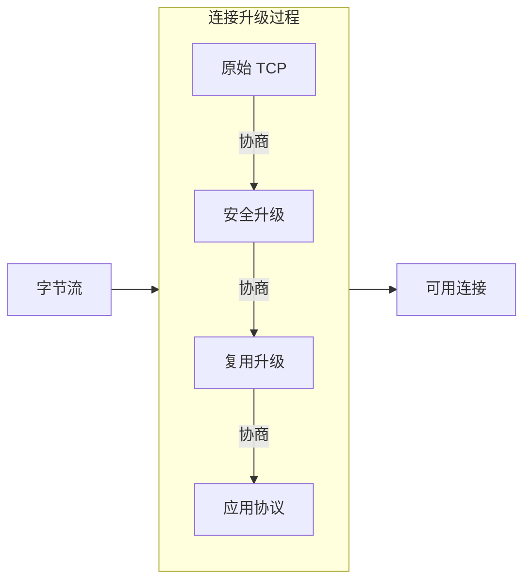
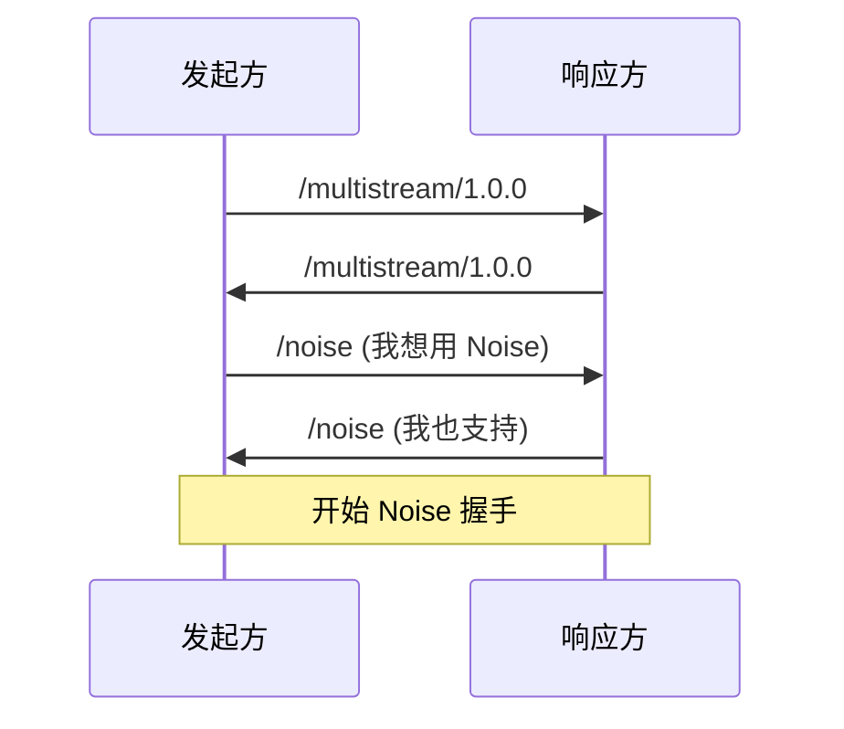
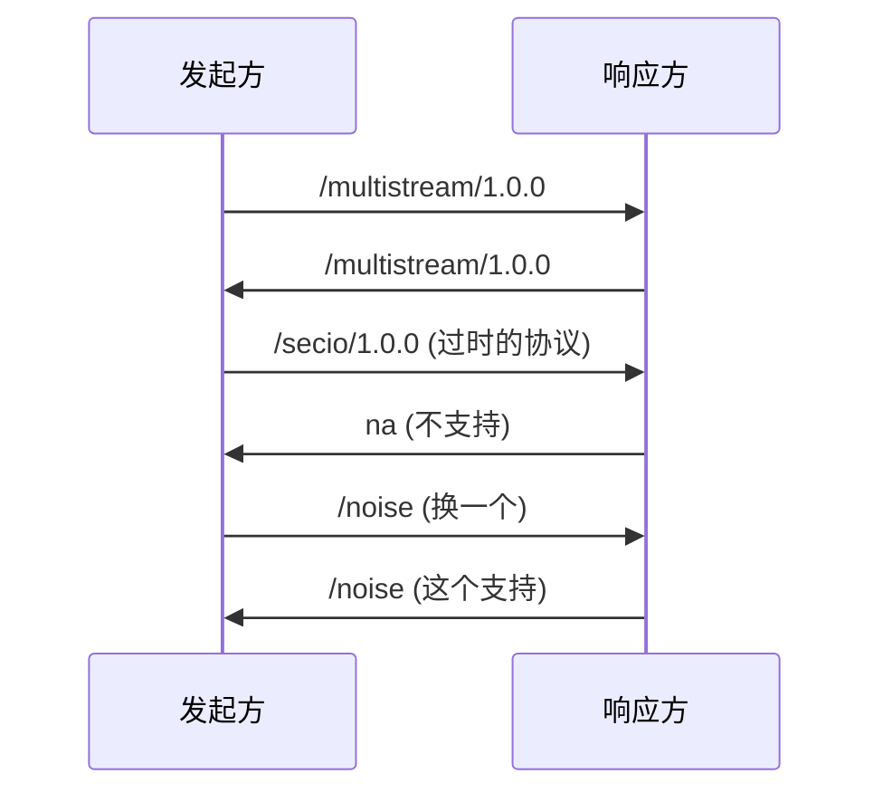
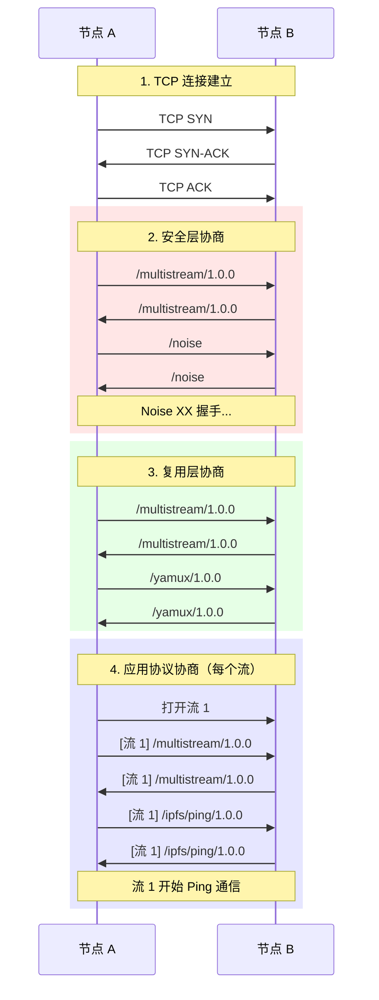
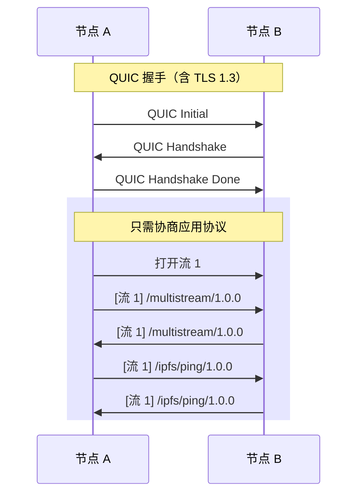

> 和而不同。
> ——《论语·子路》

孔子说，君子和谐相处，但保持各自特色。P2P 网络中的节点也是如此：它们可能支持不同的协议版本、不同的加密方式，但仍能通过协商找到共同语言。

前几章我们学习了 TCP、Noise 加密、Yamux 复用。但一个关键问题是：双方如何就使用什么协议达成一致？

这就是**协议协商**要解决的问题。

## 连接升级的全景

让我们先看看一个 TCP 连接从建立到可用的完整过程：



每一步升级都需要**协议协商**——双方交换支持的协议列表，选择都支持的那个。

## multistream-select 协议

libp2p 使用 **multistream-select** 进行协议协商。它的设计非常简洁：

1. 发起方发送希望使用的协议
2. 响应方回复是否支持
3. 如果不支持，发起方尝试下一个

### 握手流程



如果不支持，响应方回复 `na`（not available）：



### 协议标识符

libp2p 的协议用路径格式标识：

| 协议 | 标识符 |
|-----|--------|
| Noise 加密 | `/noise` |
| TLS 加密 | `/tls/1.0.0` |
| Yamux 复用 | `/yamux/1.0.0` |
| Ping | `/ipfs/ping/1.0.0` |
| Identify | `/ipfs/id/1.0.0` |
| Kademlia | `/ipfs/kad/1.0.0` |
| GossipSub | `/meshsub/1.1.0` |

这种格式的好处是：
- 人类可读
- 可以包含版本号
- 支持命名空间（如 `/ipfs/`）

## 完整的连接升级流程

让我们看一个完整的示例：节点 A 通过 TCP 连接到节点 B，最终建立可用的 P2P 连接。



### 三层协商

注意协议协商发生在三个层次：

| 层次 | 时机 | 协商内容 |
|-----|------|---------|
| **安全层** | TCP 连接后 | Noise / TLS |
| **复用层** | 加密握手后 | Yamux / mplex |
| **应用层** | 每个新流 | Ping / Identify / ... |

## 在 SwarmBuilder 中配置

回顾 SwarmBuilder 的配置，现在你应该能理解每个参数的含义了：

```rust
let swarm = SwarmBuilder::with_new_identity()
    .with_tokio()
    .with_tcp(
        tcp::Config::default(),      // TCP 传输配置
        noise::Config::new,          // 安全升级：Noise
        yamux::Config::default,      // 复用升级：Yamux
    )?
    .with_behaviour(|_key| {         // 应用层协议
        MyBehaviour {
            ping: ping::Behaviour::default(),
            identify: identify::Behaviour::new(/* ... */),
        }
    })?
    .build();
```

### 支持多个选项

可以配置多个备选协议，让节点自动协商：

```rust
// 安全层：优先 TLS，fallback 到 Noise
.with_tcp(
    tcp::Config::default(),
    (tls::Config::new, noise::Config::new),  // 多个选项
    yamux::Config::default,
)?
```

协商顺序就是配置顺序——TLS 优先，如果对方不支持则尝试 Noise。

## 协议版本管理

随着协议演进，版本管理变得重要。multistream-select 支持这个场景：

### 版本号约定

libp2p 使用语义化版本：

- `/ipfs/ping/1.0.0` - 主版本.次版本.补丁
- 主版本变化 = 不兼容改动
- 次版本变化 = 向后兼容的新功能

### 向后兼容策略

节点可以同时支持多个版本：

```rust
// 概念性示例
let protocols = vec![
    "/my-protocol/2.0.0",  // 新版本优先
    "/my-protocol/1.0.0",  // 保持旧版本兼容
];
```

协商时，双方会选择都支持的最高版本。

## QUIC 的简化

QUIC 传输简化了升级流程，因为：

1. **加密内置**：QUIC 必须使用 TLS 1.3，不需要协商
2. **复用内置**：QUIC 原生流复用，不需要协商



所以 QUIC 配置更简洁：

```rust
.with_quic()  // 不需要指定加密和复用
```

## 调试协议协商

当协商失败时，libp2p 会产生明确的错误。常见问题：

### 1. 协议不匹配

```
Error: Protocol not supported: /secio/1.0.0
```

原因：对方不支持你请求的协议。

解决：检查双方节点的版本，确保协议兼容。

### 2. 超时

```
Error: Negotiation timeout
```

原因：对方响应太慢或网络问题。

解决：增加超时配置或检查网络连接。

### 3. 版本不兼容

```
Error: No common protocol version
```

原因：双方支持的版本没有交集。

解决：升级一方的节点，或添加旧版本支持。

## 小结

本章介绍了 libp2p 的协议协商机制：

- **multistream-select** 是 libp2p 的协议协商协议
- **协商发生在三层**：安全、复用、应用
- **协议用路径标识**：如 `/noise`、`/yamux/1.0.0`
- **QUIC 简化了流程**：加密和复用内置

回顾第二篇的完整学习路径：


至此，你已经完整理解了 libp2p 的传输层：

| 章节 | 内容 |
|-----|------|
| 08 | 传输层抽象与 Transport trait |
| 09 | TCP 与 QUIC 对比 |
| 10 | Noise 加密握手 |
| 11 | Yamux 流复用 |
| 12 | 协议协商与连接升级 |

有了传输层的基础，下一篇我们将进入**协议与流**——深入了解 libp2p 的各种内置协议，并学习如何实现自定义协议。
