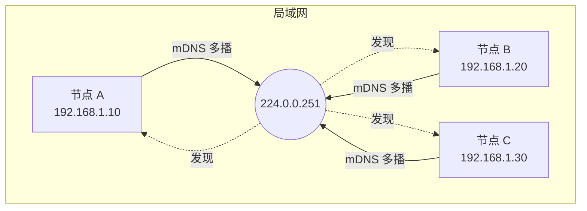
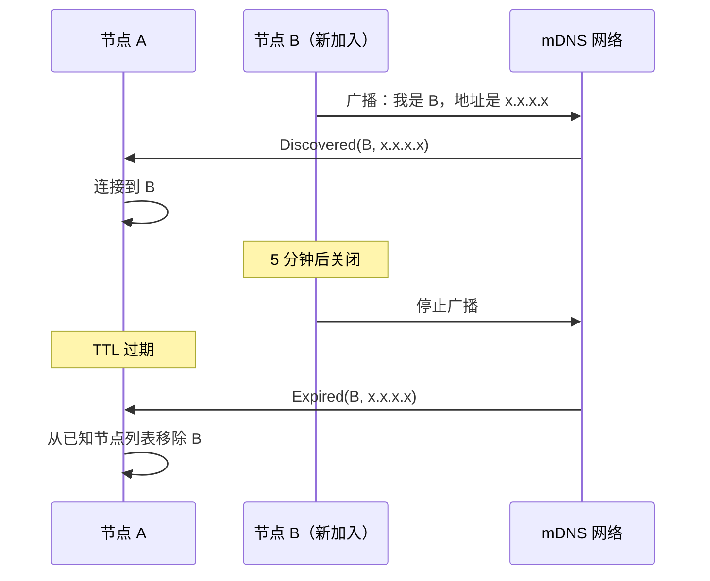
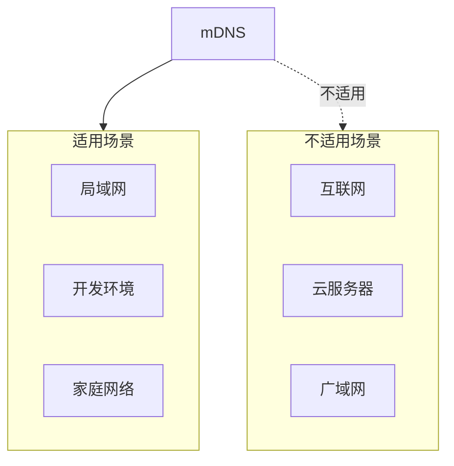

> 远亲不如近邻。
> ——中国谚语

远方的亲戚不如身边的邻居来得亲近。在 P2P 网络中也是如此——同一局域网内的节点往往有着最低的延迟和最高的带宽。**mDNS（多播DNS）** 让节点能够自动发现这些"邻居"。

## 什么是 mDNS？

mDNS（Multicast DNS）是一种零配置网络协议，让设备能够在没有传统 DNS 服务器的情况下互相发现。



### 工作原理

1. **多播地址**：所有 mDNS 消息发送到 `224.0.0.251:5353`（IPv4）或 `ff02::fb:5353`（IPv6）
2. **服务发现**：节点广播自己的服务信息
3. **自动发现**：同一网段的节点自动收到通知

### libp2p 的 mDNS

libp2p 使用 mDNS 来发现同一局域网内的节点：

```
服务名称: _p2p._udp.local
```

当节点启动时，它会：
1. 广播自己的 PeerId 和监听地址
2. 监听其他节点的广播
3. 自动触发连接

## 配置 mDNS Behaviour

```rust
use libp2p::mdns;
use std::time::Duration;

// 默认配置
let mdns = mdns::tokio::Behaviour::new(
    mdns::Config::default(),
    local_peer_id,
)?;

// 自定义配置
let mdns = mdns::tokio::Behaviour::new(
    mdns::Config {
        ttl: Duration::from_secs(300),           // DNS 记录生存时间
        query_interval: Duration::from_secs(60), // 查询间隔
        enable_ipv6: false,                      // 是否启用 IPv6
    },
    local_peer_id,
)?;
```

### 配置选项

| 选项 | 说明 | 默认值 |
|-----|------|--------|
| `ttl` | DNS 记录的生存时间 | 300 秒 |
| `query_interval` | 定期查询间隔 | 300 秒 |
| `enable_ipv6` | 是否启用 IPv6 mDNS | true |

## 事件处理

mDNS 产生两种事件：

```rust
use libp2p::mdns;

loop {
    match swarm.select_next_some().await {
        SwarmEvent::Behaviour(MyBehaviourEvent::Mdns(event)) => {
            match event {
                // 发现新节点
                mdns::Event::Discovered(peers) => {
                    for (peer_id, addr) in peers {
                        println!("Discovered {peer_id} at {addr}");
                        // 可以选择主动连接
                        swarm.dial(addr)?;
                    }
                }
                // 节点过期（离开网络）
                mdns::Event::Expired(peers) => {
                    for (peer_id, addr) in peers {
                        println!("Peer {peer_id} expired (was at {addr})");
                    }
                }
            }
        }
        _ => {}
    }
}
```

### Discovered vs Expired



## 完整示例

```rust
use libp2p::{
    identity::Keypair,
    mdns,
    swarm::{NetworkBehaviour, SwarmEvent},
    noise, tcp, yamux, SwarmBuilder,
};
use std::time::Duration;
use futures::StreamExt;

#[derive(NetworkBehaviour)]
struct MyBehaviour {
    mdns: mdns::tokio::Behaviour,
}

#[tokio::main]
async fn main() -> anyhow::Result<()> {
    // 初始化日志
    tracing_subscriber::fmt::init();

    let keypair = Keypair::generate_ed25519();
    let local_peer_id = keypair.public().to_peer_id();
    println!("Local PeerId: {local_peer_id}");

    let mut swarm = SwarmBuilder::with_existing_identity(keypair)
        .with_tokio()
        .with_tcp(
            tcp::Config::default(),
            noise::Config::new,
            yamux::Config::default,
        )?
        .with_behaviour(|key| {
            let mdns = mdns::tokio::Behaviour::new(
                mdns::Config::default(),
                key.public().to_peer_id(),
            )?;
            Ok(MyBehaviour { mdns })
        })?
        .with_swarm_config(|cfg| {
            cfg.with_idle_connection_timeout(Duration::from_secs(60))
        })
        .build();

    // 监听所有接口
    swarm.listen_on("/ip4/0.0.0.0/tcp/0".parse()?)?;

    println!("Waiting for mDNS discoveries...");

    loop {
        match swarm.select_next_some().await {
            SwarmEvent::NewListenAddr { address, .. } => {
                println!("Listening on {address}");
            }
            SwarmEvent::Behaviour(MyBehaviourEvent::Mdns(event)) => {
                match event {
                    mdns::Event::Discovered(peers) => {
                        for (peer_id, addr) in peers {
                            println!("Discovered: {peer_id}");
                            println!("   Address: {addr}");

                            // 自动拨号
                            if let Err(e) = swarm.dial(addr.clone()) {
                                println!("   Failed to dial: {e}");
                            }
                        }
                    }
                    mdns::Event::Expired(peers) => {
                        for (peer_id, _) in peers {
                            println!("Expired: {peer_id}");
                        }
                    }
                }
            }
            SwarmEvent::ConnectionEstablished { peer_id, .. } => {
                println!("Connected to {peer_id}");
            }
            SwarmEvent::ConnectionClosed { peer_id, .. } => {
                println!("Disconnected from {peer_id}");
            }
            _ => {}
        }
    }
}
```

运行多个实例，你会看到它们自动发现并连接：

```bash
# 终端 1
cargo run

# 终端 2
cargo run

# 终端 3
cargo run
```

## mDNS 与其他协议配合

### 与 Identify 配合

发现节点后，通过 Identify 交换详细信息：

```rust
#[derive(NetworkBehaviour)]
struct MyBehaviour {
    mdns: mdns::tokio::Behaviour,
    identify: identify::Behaviour,
}

// 处理事件
match event {
    MyBehaviourEvent::Mdns(mdns::Event::Discovered(peers)) => {
        for (peer_id, addr) in peers {
            swarm.dial(addr)?;
        }
    }
    MyBehaviourEvent::Identify(identify::Event::Received { peer_id, info }) => {
        println!("Full info for {peer_id}:");
        println!("  Agent: {}", info.agent_version);
        println!("  Protocols: {:?}", info.protocols);
    }
    _ => {}
}
```

### 与 Kademlia 配合

将 mDNS 发现的节点添加到 Kademlia 路由表：

```rust
#[derive(NetworkBehaviour)]
struct MyBehaviour {
    mdns: mdns::tokio::Behaviour,
    kademlia: kad::Behaviour<MemoryStore>,
}

// mDNS 发现后添加到 Kademlia
match event {
    MyBehaviourEvent::Mdns(mdns::Event::Discovered(peers)) => {
        for (peer_id, addr) in peers {
            swarm.behaviour_mut().kademlia.add_address(&peer_id, addr);
        }
    }
    _ => {}
}
```

## mDNS 的适用场景

### 适合

| 场景 | 说明 |
|-----|------|
| **开发测试** | 本地多节点测试，无需配置 |
| **家庭网络** | 智能家居设备互联 |
| **企业内网** | 同一办公室的节点发现 |
| **临时网络** | 会议、活动中的即时组网 |

### 不适合

| 场景 | 原因 |
|-----|------|
| **跨网络** | mDNS 仅限于同一广播域 |
| **公网部署** | 多播不能穿越路由器 |
| **大规模网络** | 多播风暴会影响网络性能 |



## 故障排查

### 常见问题

1. **发现不到节点**

```bash
# 检查防火墙是否允许 mDNS
# Linux
sudo ufw allow 5353/udp

# macOS - 通常默认允许
# Windows - 检查 Windows Defender 防火墙
```

2. **虚拟机/容器中不工作**

```bash
# Docker 需要使用 host 网络模式
docker run --network host my-p2p-app

# 或配置多播路由
```

3. **IPv6 问题**

```rust
// 如果 IPv6 有问题，可以禁用
let mdns = mdns::tokio::Behaviour::new(
    mdns::Config {
        enable_ipv6: false,
        ..Default::default()
    },
    local_peer_id,
)?;
```

### 调试日志

```rust
// 启用 mDNS 调试日志
std::env::set_var("RUST_LOG", "libp2p_mdns=debug");
tracing_subscriber::fmt::init();
```

## 小结

本章介绍了 mDNS 局域网发现：

- **工作原理**：通过多播自动发现同一网段的节点
- **零配置**：无需中心服务器，即插即用
- **事件驱动**：Discovered 和 Expired 事件
- **适用场景**：开发测试、局域网应用

mDNS 是最简单的节点发现方式，但仅限于局域网。对于跨网络的节点发现，我们需要更强大的工具。

下一章，我们将学习 **Kademlia DHT**——一种能够在整个互联网上发现节点的分布式哈希表。
