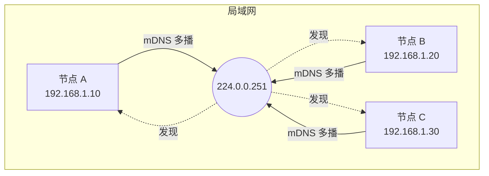
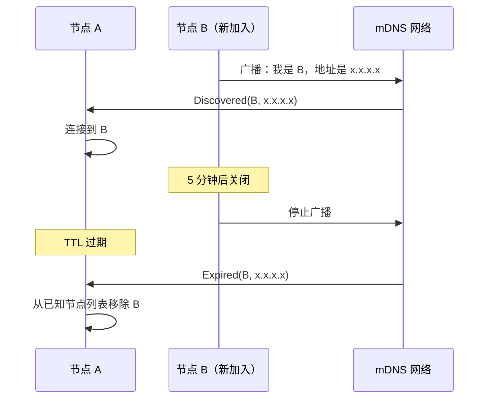
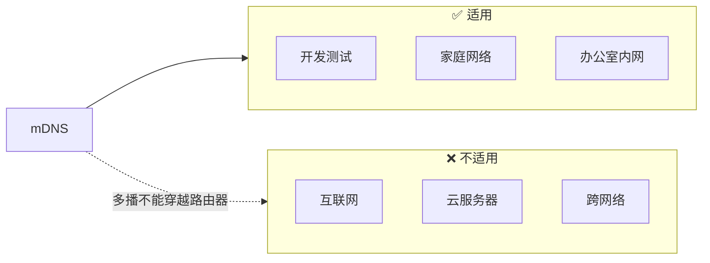

import { Steps, Tabs, TabItem } from '@astrojs/starlight/components';

> 远亲不如近邻。
> ——中国谚语

远方的亲戚不如身边的邻居来得亲近。在 P2P 网络中也是如此——同一局域网内的节点往往有着最低的延迟和最高的带宽。**mDNS（多播DNS）** 让节点能够自动发现这些"邻居"。

## 什么是 mDNS？

mDNS（Multicast DNS）是一种零配置网络协议，让设备能够在没有传统 DNS 服务器的情况下互相发现。



### 工作原理

| 步骤 | 说明 |
|-----|------|
| **多播地址** | 所有 mDNS 消息发送到 `224.0.0.251:5353`（IPv4） |
| **服务发现** | 节点广播自己的服务信息 |
| **自动发现** | 同一网段的节点自动收到通知 |

libp2p 使用 mDNS 来发现同一局域网内的节点，服务名称为 `_p2p._udp.local`。

## mDNS 事件

mDNS Behaviour 产生两种事件：



| 事件 | 触发时机 | 处理方式 |
|-----|---------|---------|
| `Discovered` | 发现新节点 | 主动连接 |
| `Expired` | 节点 TTL 过期 | 从列表移除 |

## 动手实践

:::tip[配套工具]
本教程配套的桌面应用内置了 mDNS 发现功能。你可以打开多个应用实例，观察它们自动发现彼此——无需任何配置。
:::

让我们基于 [Identify 协议](/02-protocols/07-identify) 的代码，添加 mDNS 自动发现功能。

<Steps>

1. **添加依赖** — 在 `Cargo.toml` 中添加 `mdns` feature

   ```toml ins="mdns"
   [dependencies]
   libp2p = { version = "0.56", features = ["tcp", "noise", "yamux", "identify", "mdns", "macros", "tokio"] }
   ```

2. **扩展组合行为** — 添加 mDNS Behaviour

   原来只有 Identify：

   ```rust del={4-5}
   #[derive(NetworkBehaviour)]
   pub struct MyBehaviour {
       identify: identify::Behaviour,
   }
   ```

   添加 mDNS：

   ```rust ins={4-5}
   #[derive(NetworkBehaviour)]
   pub struct MyBehaviour {
       identify: identify::Behaviour,
       mdns: mdns::tokio::Behaviour,
   }
   ```

3. **修改 Swarm 构建** — 实例化 mDNS Behaviour

   ```rust ins={6-9}
   let mut swarm = SwarmBuilder::with_existing_identity(keypair)
       .with_tokio()
       .with_tcp(tcp::Config::default(), noise::Config::new, yamux::Config::default)?
       .with_behaviour(|key| {
           let local_peer_id = key.public().to_peer_id();
           Ok(MyBehaviour {
               identify: identify::Behaviour::new(
                   identify::Config::new("/my-app/1.0.0".into(), key.public()),
               ),
               mdns: mdns::tokio::Behaviour::new(
                   mdns::Config::default(),
                   local_peer_id,
               )?,
           })
       })?
       .build();
   ```

4. **处理 mDNS 事件** — 发现节点后自动连接

   ```rust ins={3-15}
   loop {
       match swarm.select_next_some().await {
           SwarmEvent::Behaviour(MyBehaviourEvent::Mdns(event)) => {
               match event {
                   mdns::Event::Discovered(peers) => {
                       for (peer_id, addr) in peers {
                           println!("Discovered {peer_id} at {addr}");
                           let _ = swarm.dial(addr);
                       }
                   }
                   mdns::Event::Expired(peers) => {
                       for (peer_id, _) in peers {
                           println!("Peer {peer_id} expired");
                       }
                   }
               }
           }
           // ... 其他事件处理
       }
   }
   ```

</Steps>

## 完整代码

```rust
use anyhow::Result;
use libp2p::{
    futures::StreamExt, identify, mdns, noise, swarm::NetworkBehaviour,
    swarm::SwarmEvent, tcp, yamux, Multiaddr, SwarmBuilder,
};
use std::time::Duration;

#[derive(NetworkBehaviour)]
struct MyBehaviour {
    identify: identify::Behaviour,
    mdns: mdns::tokio::Behaviour,
}

#[tokio::main]
async fn main() -> Result<()> {
    tracing_subscriber::fmt().init();

    let keypair = libp2p::identity::Keypair::generate_ed25519();
    let local_peer_id = keypair.public().to_peer_id();
    println!("Local PeerId: {local_peer_id}");

    let mut swarm = SwarmBuilder::with_existing_identity(keypair)
        .with_tokio()
        .with_tcp(
            tcp::Config::default(),
            noise::Config::new,
            yamux::Config::default,
        )?
        .with_behaviour(|key| {
            let local_peer_id = key.public().to_peer_id();
            Ok(MyBehaviour {
                identify: identify::Behaviour::new(
                    identify::Config::new("/mdns-demo/1.0.0".into(), key.public())
                        .with_interval(Duration::from_secs(30)),
                ),
                mdns: mdns::tokio::Behaviour::new(
                    mdns::Config::default(),
                    local_peer_id,
                )?,
            })
        })?
        .with_swarm_config(|cfg| cfg.with_idle_connection_timeout(Duration::from_secs(60)))
        .build();

    swarm.listen_on("/ip4/0.0.0.0/tcp/0".parse()?)?;

    println!("Waiting for mDNS discoveries...\n");

    loop {
        match swarm.select_next_some().await {
            SwarmEvent::NewListenAddr { address, .. } => {
                println!("Listening on {address}");
            }
            SwarmEvent::Behaviour(MyBehaviourEvent::Mdns(event)) => match event {
                mdns::Event::Discovered(peers) => {
                    for (peer_id, addr) in peers {
                        println!("+ Discovered: {peer_id}");
                        println!("  Address: {addr}");
                        if let Err(e) = swarm.dial(addr.clone()) {
                            println!("  Dial failed: {e}");
                        }
                    }
                }
                mdns::Event::Expired(peers) => {
                    for (peer_id, _) in peers {
                        println!("- Expired: {peer_id}");
                    }
                }
            },
            SwarmEvent::Behaviour(MyBehaviourEvent::Identify(
                identify::Event::Received { peer_id, info, .. },
            )) => {
                println!("Identified {peer_id}:");
                println!("  Agent: {}", info.agent_version);
                println!("  Protocols: {:?}", info.protocols);
            }
            SwarmEvent::ConnectionEstablished { peer_id, .. } => {
                println!("Connected to {peer_id}");
            }
            SwarmEvent::ConnectionClosed { peer_id, .. } => {
                println!("Disconnected from {peer_id}");
            }
            _ => {}
        }
    }
}
```

## 运行测试

<Tabs>
<TabItem label="终端 1">

```bash
cargo run
```

输出：

```text
Local PeerId: 12D3KooWAbCd...
Listening on /ip4/127.0.0.1/tcp/54321
Waiting for mDNS discoveries...
```

</TabItem>
<TabItem label="终端 2">

```bash
cargo run
```

输出：

```text
Local PeerId: 12D3KooWXyZw...
Listening on /ip4/127.0.0.1/tcp/54322
Waiting for mDNS discoveries...
+ Discovered: 12D3KooWAbCd...
  Address: /ip4/192.168.1.100/tcp/54321
Connected to 12D3KooWAbCd...
```

</TabItem>
</Tabs>

两个节点会自动发现并连接——完全不需要手动输入地址！

## 配置选项

```rust
let mdns = mdns::tokio::Behaviour::new(
    mdns::Config {
        ttl: Duration::from_secs(300),           // DNS 记录生存时间
        query_interval: Duration::from_secs(60), // 查询间隔
        enable_ipv6: false,                      // 是否启用 IPv6
    },
    local_peer_id,
)?;
```

| 选项 | 说明 | 默认值 |
|-----|------|--------|
| `ttl` | DNS 记录的生存时间 | 300 秒 |
| `query_interval` | 定期查询间隔 | 300 秒 |
| `enable_ipv6` | 是否启用 IPv6 mDNS | true |

## 适用场景



:::caution[局限性]
mDNS 仅限于同一广播域（通常是同一网段）。对于跨网络的节点发现，需要使用 Kademlia DHT 或引导节点。
:::

## 故障排查

<Steps>

1. **检查防火墙** — 确保允许 mDNS 流量

   <Tabs>
   <TabItem label="Linux">
   ```bash
   sudo ufw allow 5353/udp
   ```
   </TabItem>
   <TabItem label="macOS">
   macOS 默认允许 mDNS，通常不需要配置。
   </TabItem>
   <TabItem label="Windows">
   检查 Windows Defender 防火墙，确保允许 UDP 5353 端口。
   </TabItem>
   </Tabs>

2. **虚拟机/容器** — 使用 host 网络模式

   ```bash
   # Docker 需要使用 host 网络模式
   docker run --network host my-p2p-app
   ```

3. **IPv6 问题** — 如果有问题，可以禁用 IPv6

   ```rust
   mdns::Config {
       enable_ipv6: false,
       ..Default::default()
   }
   ```

4. **启用调试日志**

   ```rust
   std::env::set_var("RUST_LOG", "libp2p_mdns=debug");
   tracing_subscriber::fmt::init();
   ```

</Steps>

## 小结

本章介绍了 mDNS 局域网发现：

- **零配置**：无需中心服务器，即插即用
- **事件驱动**：`Discovered` 和 `Expired` 事件
- **自动连接**：发现节点后可直接拨号
- **适用场景**：开发测试、局域网应用

mDNS 是最简单的节点发现方式，但仅限于局域网。对于跨网络的节点发现，我们需要更强大的工具。

下一章，我们将学习 **Kademlia DHT**——一种能够在整个互联网上发现节点的分布式哈希表。
