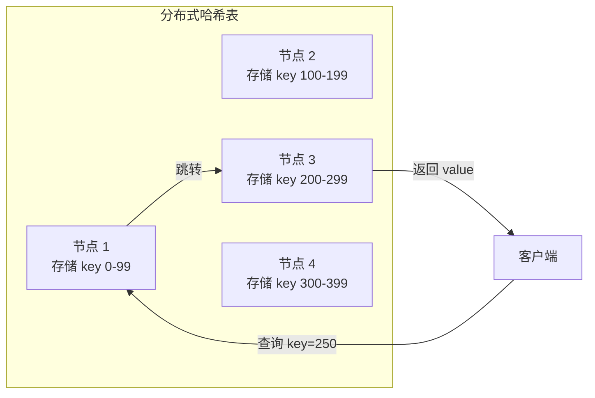
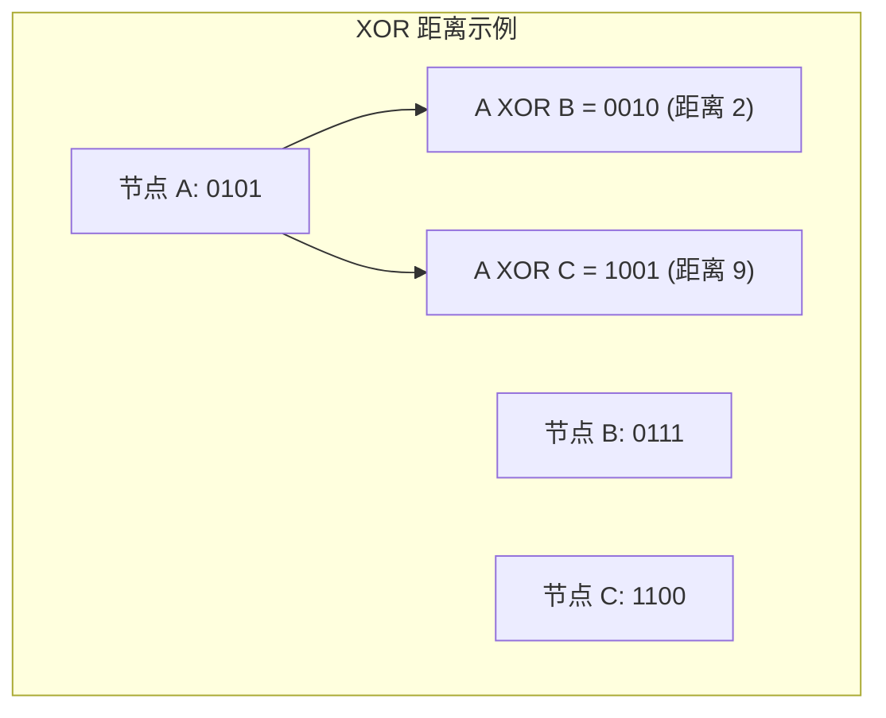
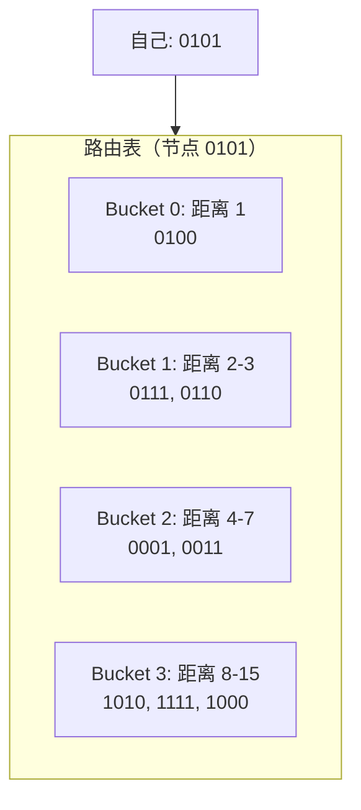
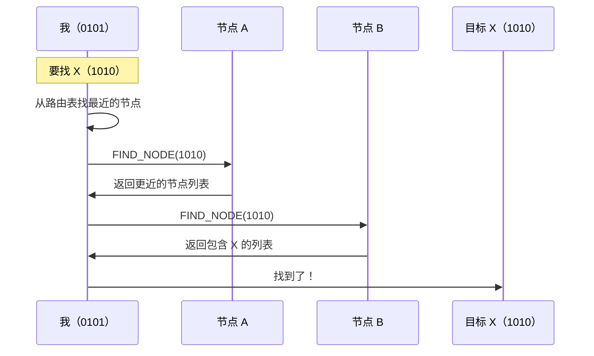
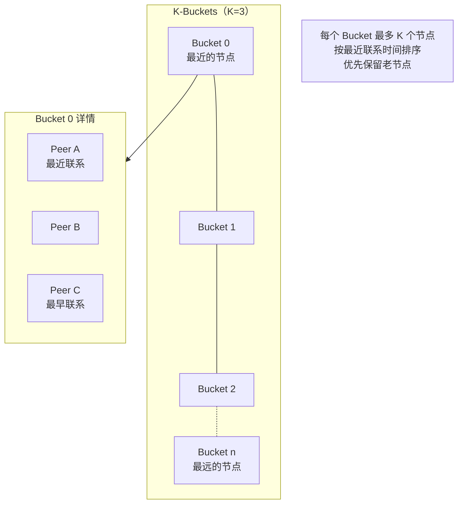

> 千里之行，始于足下。
> ——《老子》

无论目的地多远，都从脚下第��步开始。Kademlia 正是这样工作的——即使网络有百万节点，也能通过几步"跳跃"找到任何节点。这就是**分布式哈希表（DHT）** 的魔力。

## 什么是 DHT？

DHT（Distributed Hash Table）是一种去中心化的键值存储系统，数据分布在网络中的所有节点上。



### DHT 的核心思想

1. **键空间划分**：每个节点负责存储一部分键
2. **分布式路由**：知道"谁离目标更近"
3. **对数复杂度**：O(log n) 步找到任意数据

## Kademlia 原理

Kademlia 是最流行的 DHT 算法，由 Petar Maymounkov 和 David Mazières 在 2002 年提出。

### XOR 距离

Kademlia 的核心创新是使用 **XOR** 计算节点之间的"距离"：

```
distance(A, B) = A XOR B
```



XOR 距离的优秀特性：
- **对称性**：d(A,B) = d(B,A)
- **三角不等式**：d(A,B) + d(B,C) >= d(A,C)
- **唯一性**：d(A,A) = 0

### K-Bucket

每个节点维护一个**路由表**，按距离分成多个"桶"（K-Bucket）：



每个桶存储 K 个节点（默认 K=20），特点：
- 离自己近的节点知道得多
- 离自己远的节点知道得少（但足够找到路）

### 节点查找算法

查找节点 X 的过程：



每次查询都离目标更近一半距离，所以只需 **O(log n)** 步。

## libp2p 中的 Kademlia

libp2p 的 Kademlia 实现在 `libp2p::kad` 模块中。

### 创建 Kademlia Behaviour

```rust
use libp2p::kad::{self, store::MemoryStore, Mode};

let local_peer_id = keypair.public().to_peer_id();

// 创建内存存储
let store = MemoryStore::new(local_peer_id);

// 创建 Kademlia Behaviour
let kademlia = kad::Behaviour::new(local_peer_id, store);
```

### 配置选项

```rust
use libp2p::kad::{Config, Behaviour, store::MemoryStore};
use std::time::Duration;

let config = Config::new(StreamProtocol::new("/my-app/kad/1.0.0"))
    .set_query_timeout(Duration::from_secs(60))      // 查询超时
    .set_replication_factor(20.try_into().unwrap())  // 复制因子（K值）
    .set_parallelism(3.try_into().unwrap())          // 并行查询数（alpha）
    .set_record_ttl(Some(Duration::from_secs(3600))) // 记录生存时间
    .set_provider_record_ttl(Some(Duration::from_secs(86400))); // Provider 记录 TTL

let kademlia = Behaviour::with_config(local_peer_id, store, config);
```

### 配置参数说明

| 参数 | 说明 | 默认值 |
| --- | --- | --- |
| `replication_factor` | 每条记录存储的节点数（K） | 20 |
| `parallelism` | 并行查询的节点数（α） | 3 |
| `query_timeout` | 查询超时时间 | 60 秒 |
| `record_ttl` | 键值记录的生存时间 | 36 小时 |
| `provider_record_ttl` | Provider 记录的生存时间 | 24 小时 |

## Kademlia 模式

Kademlia 有两种模式：

```rust
use libp2p::kad::Mode;

// 服务器模式：响应其他节点的查询
swarm.behaviour_mut().kademlia.set_mode(Some(Mode::Server));

// 客户端模式：只查询，不响应
swarm.behaviour_mut().kademlia.set_mode(Some(Mode::Client));
```

### 模式选择

| 模式 | 适用场景 |
| --- | --- |
| **Server** | 公网节点，有稳定地址 |
| **Client** | NAT 后的节点，不可直接访问 |

:::tip[自动模式检测]
libp2p 可以配合 AutoNAT 自动检测并切换模式。
:::

## 核心操作

### 添加已知节点

```rust
use libp2p::Multiaddr;

// 添加引导节点
let bootstrap_peer: PeerId = "12D3Koo...".parse()?;
let bootstrap_addr: Multiaddr = "/ip4/104.131.131.82/tcp/4001".parse()?;

swarm.behaviour_mut()
    .kademlia
    .add_address(&bootstrap_peer, bootstrap_addr);
```

### 引导（Bootstrap）

```rust
// 启动引导过程，发现更多节点
swarm.behaviour_mut().kademlia.bootstrap()?;
```

引导过程：
1. 向已知节点查询自己的 PeerId
2. 发现离自己近的节点
3. 填充路由表

### 查找节点

```rust
use libp2p::kad::QueryId;

// 查找特定节点
let query_id: QueryId = swarm.behaviour_mut()
    .kademlia
    .get_closest_peers(target_peer_id);
```

### 存储和获取数据

```rust
use libp2p::kad::{Record, RecordKey};

// 存储数据
let key = RecordKey::new(&b"my-key"[..]);
let record = Record {
    key: key.clone(),
    value: b"my-value".to_vec(),
    publisher: None,
    expires: None,
};
swarm.behaviour_mut().kademlia.put_record(record, kad::Quorum::One)?;

// 获取数据
swarm.behaviour_mut().kademlia.get_record(key);
```

### Provider 机制

Provider 机制用于声明"我有某个资源"：

```rust
use libp2p::kad::RecordKey;

// 声明自己是某个 key 的 provider
let key = RecordKey::new(&b"file-hash-xxx"[..]);
swarm.behaviour_mut().kademlia.start_providing(key)?;

// 查找某个 key 的 providers
swarm.behaviour_mut().kademlia.get_providers(key);
```

## 事件处理

```rust
use libp2p::kad::{self, Event, QueryResult};

loop {
    match swarm.select_next_some().await {
        SwarmEvent::Behaviour(MyBehaviourEvent::Kademlia(event)) => {
            match event {
                // 路由表更新
                Event::RoutingUpdated { peer, addresses, .. } => {
                    println!("Routing updated: {peer} at {addresses:?}");
                }

                // 入站请求
                Event::InboundRequest { request, .. } => {
                    println!("Inbound request: {request:?}");
                }

                // 查询完成
                Event::OutboundQueryProgressed { id, result, .. } => {
                    match result {
                        // 找到最近的节点
                        QueryResult::GetClosestPeers(Ok(ok)) => {
                            println!("Found {} closest peers", ok.peers.len());
                            for peer in ok.peers {
                                println!("  - {peer}");
                            }
                        }

                        // 获取记录成功
                        QueryResult::GetRecord(Ok(ok)) => {
                            for record in ok.records {
                                println!("Found record: {:?}", record.record.value);
                            }
                        }

                        // 存储记录成功
                        QueryResult::PutRecord(Ok(ok)) => {
                            println!("Record stored: {:?}", ok.key);
                        }

                        // 找到 Providers
                        QueryResult::GetProviders(Ok(ok)) => {
                            println!("Found {} providers", ok.providers.len());
                        }

                        // 成为 Provider
                        QueryResult::StartProviding(Ok(ok)) => {
                            println!("Now providing: {:?}", ok.key);
                        }

                        // 引导完成
                        QueryResult::Bootstrap(Ok(ok)) => {
                            println!("Bootstrap done, {} remaining", ok.num_remaining);
                        }

                        // 处理错误
                        QueryResult::GetClosestPeers(Err(e)) => {
                            println!("GetClosestPeers error: {e:?}");
                        }
                        _ => {}
                    }
                }

                // 模式变化
                Event::ModeChanged { new_mode } => {
                    println!("Kademlia mode changed to: {new_mode:?}");
                }

                _ => {}
            }
        }
        _ => {}
    }
}
```

## 完整示例

```rust
use libp2p::{
    identity::Keypair,
    kad::{self, store::MemoryStore, Mode, QueryResult},
    swarm::{NetworkBehaviour, SwarmEvent},
    noise, tcp, yamux, Multiaddr, PeerId, StreamProtocol, SwarmBuilder,
};
use std::time::Duration;
use futures::StreamExt;

#[derive(NetworkBehaviour)]
struct MyBehaviour {
    kademlia: kad::Behaviour<MemoryStore>,
}

#[tokio::main]
async fn main() -> anyhow::Result<()> {
    tracing_subscriber::fmt::init();

    let keypair = Keypair::generate_ed25519();
    let local_peer_id = keypair.public().to_peer_id();
    println!("Local PeerId: {local_peer_id}");

    let mut swarm = SwarmBuilder::with_existing_identity(keypair)
        .with_tokio()
        .with_tcp(
            tcp::Config::default(),
            noise::Config::new,
            yamux::Config::default,
        )?
        .with_behaviour(|key| {
            let local_peer_id = key.public().to_peer_id();
            let store = MemoryStore::new(local_peer_id);
            let config = kad::Config::new(StreamProtocol::new("/example/kad/1.0.0"));
            let mut kademlia = kad::Behaviour::with_config(local_peer_id, store, config);

            // 设置为服务器模式
            kademlia.set_mode(Some(Mode::Server));

            Ok(MyBehaviour { kademlia })
        })?
        .with_swarm_config(|cfg| {
            cfg.with_idle_connection_timeout(Duration::from_secs(60))
        })
        .build();

    swarm.listen_on("/ip4/0.0.0.0/tcp/0".parse()?)?;

    // 如果提供了引导节点地址，则连接
    if let Some(addr) = std::env::args().nth(1) {
        let remote: Multiaddr = addr.parse()?;

        // 从地址中提取 PeerId
        if let Some(peer_id) = extract_peer_id(&remote) {
            swarm.behaviour_mut().kademlia.add_address(&peer_id, remote.clone());
            swarm.dial(remote)?;
        }
    }

    let mut bootstrap_done = false;

    loop {
        match swarm.select_next_some().await {
            SwarmEvent::NewListenAddr { address, .. } => {
                println!("Listening on {address}/p2p/{local_peer_id}");
            }

            SwarmEvent::ConnectionEstablished { peer_id, .. } => {
                println!("Connected to {peer_id}");

                // 连接建立后启动引导
                if !bootstrap_done {
                    if let Ok(_) = swarm.behaviour_mut().kademlia.bootstrap() {
                        println!("Bootstrap started");
                        bootstrap_done = true;
                    }
                }
            }

            SwarmEvent::Behaviour(MyBehaviourEvent::Kademlia(event)) => {
                match event {
                    kad::Event::RoutingUpdated { peer, addresses, .. } => {
                        println!("Routing updated: {peer}");
                        for addr in addresses.iter() {
                            println!("  - {addr}");
                        }
                    }

                    kad::Event::OutboundQueryProgressed { result, .. } => {
                        match result {
                            QueryResult::Bootstrap(Ok(ok)) => {
                                if ok.num_remaining == 0 {
                                    println!("Bootstrap complete!");

                                    // 查看路由表
                                    for bucket in swarm.behaviour().kademlia.kbuckets() {
                                        for entry in bucket.iter() {
                                            println!("Routing table: {} at {:?}",
                                                entry.node.key.preimage(),
                                                entry.node.value
                                            );
                                        }
                                    }
                                }
                            }
                            QueryResult::GetClosestPeers(Ok(ok)) => {
                                println!("Found {} closest peers:", ok.peers.len());
                                for peer in ok.peers {
                                    println!("  - {peer}");
                                }
                            }
                            _ => {}
                        }
                    }

                    _ => {}
                }
            }

            _ => {}
        }
    }
}

// 从 Multiaddr 中提取 PeerId
fn extract_peer_id(addr: &Multiaddr) -> Option<PeerId> {
    addr.iter().find_map(|p| {
        if let libp2p::multiaddr::Protocol::P2p(peer_id) = p {
            Some(peer_id)
        } else {
            None
        }
    })
}
```

## 路由表可视化



## Kademlia 与其他协议配合

### 与 Identify 配合

```rust
#[derive(NetworkBehaviour)]
struct MyBehaviour {
    kademlia: kad::Behaviour<MemoryStore>,
    identify: identify::Behaviour,
}

// Identify 收到地址后添加到 Kademlia
match event {
    MyBehaviourEvent::Identify(identify::Event::Received { peer_id, info }) => {
        for addr in info.listen_addrs {
            swarm.behaviour_mut().kademlia.add_address(&peer_id, addr);
        }
    }
    _ => {}
}
```

### 与 mDNS 配合

```rust
// mDNS 发现后添加到 Kademlia
match event {
    MyBehaviourEvent::Mdns(mdns::Event::Discovered(peers)) => {
        for (peer_id, addr) in peers {
            swarm.behaviour_mut().kademlia.add_address(&peer_id, addr);
        }
    }
    _ => {}
}
```

## 小结

本章介绍了 Kademlia DHT：

- **XOR 距离**：节点之间的逻辑距离度量
- **K-Bucket**：按距离分层的路由表
- **O(log n) 查找**：高效的分布式路由
- **核心操作**：Bootstrap、GetClosestPeers、Put/Get Record、Provider

Kademlia 是 P2P 网络中最重要的基础设施之一。它让节点无需中心服务器就能发现彼此、存储和检索数据。

下一章，我们将学习 **Bootstrap（引导）**——如何让新节点加入 Kademlia 网络。
