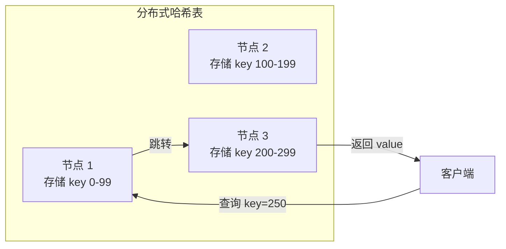
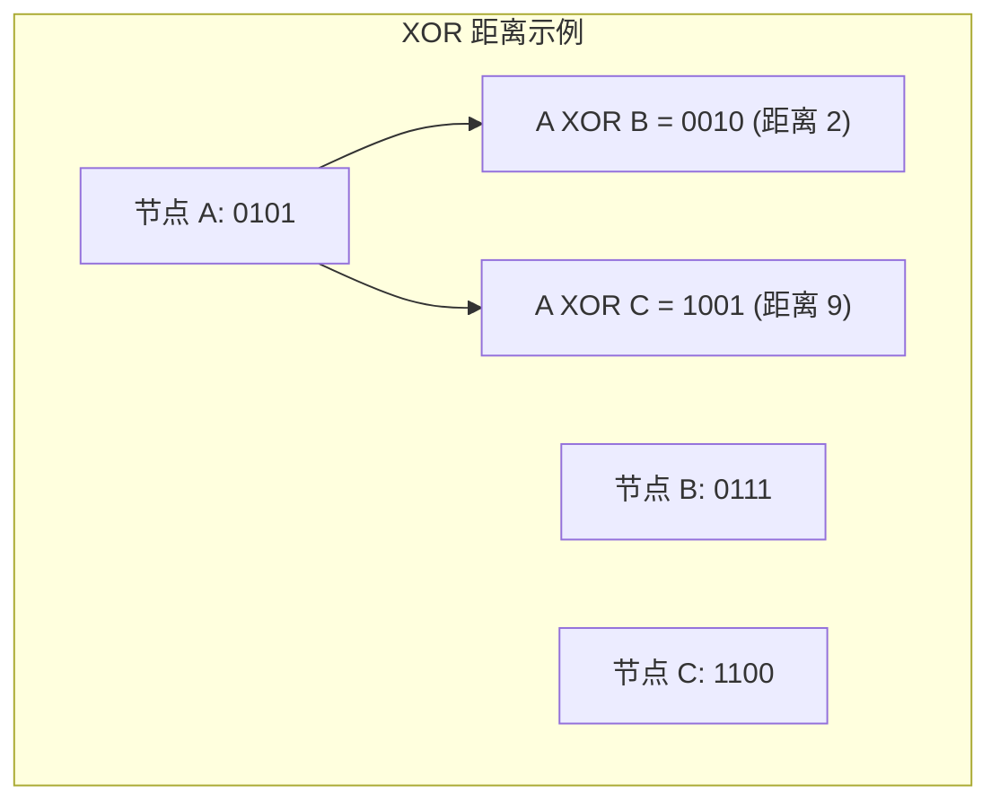
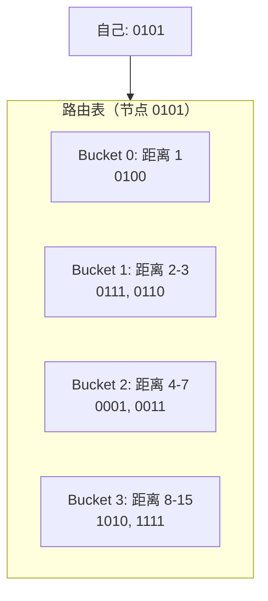
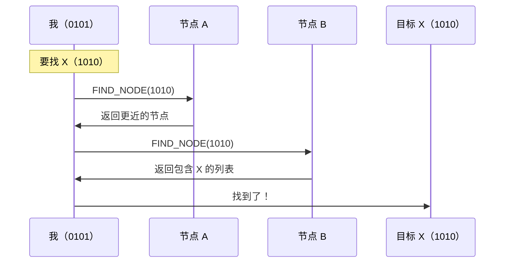

import { Steps, Tabs, TabItem } from '@astrojs/starlight/components';

> 千里之行，始于足下。
> ——《老子》

无论目的地多远，都从脚下第一步开始。Kademlia 正是这样工作的——即使网络有百万节点，也能通过几步"跳跃"找到任何节点。这就是**分布式哈希表（DHT）** 的魔力。

## 什么是 DHT？

DHT（Distributed Hash Table）是一种去中心化的键值存储系统，数据分布在网络中的所有节点上。



### 核心思想

| 概念 | 说明 |
|-----|------|
| **键空间划分** | 每个节点负责存储一部分键 |
| **分布式路由** | 知道"谁离目标更近" |
| **对数复杂度** | O(log n) 步找到任意数据 |

## Kademlia 原理

Kademlia 是最流行的 DHT 算法，核心创新是使用 **XOR** 计算节点之间的"距离"：



XOR 距离的特性：
- **对称性**：d(A,B) = d(B,A)
- **三角不等式**：d(A,B) + d(B,C) >= d(A,C)
- **唯一性**：d(A,A) = 0

### K-Bucket 路由表

每个节点维护一个**路由表**，按距离分成多个"桶"：



每个桶存储 K 个节点（默认 K=20）：
- 离自己近的节点知道得多
- 离自己远的节点知道得少（但足够找到路）

### 节点查找



每次查询都离目标更近一半距离，只需 **O(log n)** 步。

## 动手实践

:::tip[配套工具]
本教程配套的桌面应用提供了 Kademlia 可视化功能。你可以观察路由表的填充过程、执行节点查找——直观理解 DHT 的工作原理。
:::

让我们基于 mDNS 示例，添加 Kademlia DHT 支持。

<Steps>

1. **添加依赖** — 启用 `kad` feature

   ```toml ins="kad"
   [dependencies]
   libp2p = { version = "0.56", features = ["tcp", "noise", "yamux", "identify", "mdns", "kad", "macros", "tokio"] }
   ```

2. **扩展组合行为** — 添加 Kademlia Behaviour

   ```rust ins={5-6}
   #[derive(NetworkBehaviour)]
   struct MyBehaviour {
       identify: identify::Behaviour,
       mdns: mdns::tokio::Behaviour,
       kademlia: kad::Behaviour<MemoryStore>,
   }
   ```

3. **修改 Swarm 构建** — 实例化 Kademlia

   ```rust ins={12-17}
   let mut swarm = SwarmBuilder::with_existing_identity(keypair)
       .with_tokio()
       .with_tcp(tcp::Config::default(), noise::Config::new, yamux::Config::default)?
       .with_behaviour(|key| {
           let local_peer_id = key.public().to_peer_id();
           Ok(MyBehaviour {
               identify: identify::Behaviour::new(
                   identify::Config::new("/my-app/1.0.0".into(), key.public()),
               ),
               mdns: mdns::tokio::Behaviour::new(mdns::Config::default(), local_peer_id)?,
               kademlia: {
                   let store = MemoryStore::new(local_peer_id);
                   let config = kad::Config::new(StreamProtocol::new("/my-app/kad/1.0.0"));
                   let mut kad = kad::Behaviour::with_config(local_peer_id, store, config);
                   kad.set_mode(Some(kad::Mode::Server));
                   kad
               },
           })
       })?
       .build();
   ```

4. **整合发现机制** — mDNS 发现的节点添加到 Kademlia

   ```rust ins={5-6}
   SwarmEvent::Behaviour(MyBehaviourEvent::Mdns(mdns::Event::Discovered(peers))) => {
       for (peer_id, addr) in peers {
           println!("mDNS discovered: {peer_id}");
           let _ = swarm.dial(addr.clone());
           // 添加到 Kademlia 路由表
           swarm.behaviour_mut().kademlia.add_address(&peer_id, addr);
       }
   }
   ```

5. **启动引导** — 连接建立后填充路由表

   ```rust ins={4-6}
   SwarmEvent::ConnectionEstablished { peer_id, .. } => {
       println!("Connected to {peer_id}");
       // 连接建立后启动 Kademlia 引导
       if let Err(e) = swarm.behaviour_mut().kademlia.bootstrap() {
           println!("Bootstrap error: {e:?}");
       }
   }
   ```

6. **处理 Kademlia 事件**

   ```rust ins={3-20}
   loop {
       match swarm.select_next_some().await {
           SwarmEvent::Behaviour(MyBehaviourEvent::Kademlia(event)) => {
               match event {
                   kad::Event::RoutingUpdated { peer, .. } => {
                       println!("Routing updated: {peer}");
                   }
                   kad::Event::OutboundQueryProgressed { result, .. } => {
                       match result {
                           kad::QueryResult::Bootstrap(Ok(ok)) => {
                               if ok.num_remaining == 0 {
                                   println!("Bootstrap complete!");
                               }
                           }
                           _ => {}
                       }
                   }
                   _ => {}
               }
           }
           // ... 其他事件
       }
   }
   ```

</Steps>

## 完整代码

```rust
use anyhow::Result;
use libp2p::{
    futures::StreamExt, identify, kad::{self, store::MemoryStore}, mdns,
    noise, swarm::NetworkBehaviour, swarm::SwarmEvent, tcp, yamux,
    Multiaddr, PeerId, StreamProtocol, SwarmBuilder,
};
use std::time::Duration;

#[derive(NetworkBehaviour)]
struct MyBehaviour {
    identify: identify::Behaviour,
    mdns: mdns::tokio::Behaviour,
    kademlia: kad::Behaviour<MemoryStore>,
}

#[tokio::main]
async fn main() -> Result<()> {
    tracing_subscriber::fmt().init();

    let keypair = libp2p::identity::Keypair::generate_ed25519();
    let local_peer_id = keypair.public().to_peer_id();
    println!("Local PeerId: {local_peer_id}");

    let mut swarm = SwarmBuilder::with_existing_identity(keypair)
        .with_tokio()
        .with_tcp(
            tcp::Config::default(),
            noise::Config::new,
            yamux::Config::default,
        )?
        .with_behaviour(|key| {
            let local_peer_id = key.public().to_peer_id();
            Ok(MyBehaviour {
                identify: identify::Behaviour::new(
                    identify::Config::new("/kad-demo/1.0.0".into(), key.public())
                        .with_interval(Duration::from_secs(30)),
                ),
                mdns: mdns::tokio::Behaviour::new(mdns::Config::default(), local_peer_id)?,
                kademlia: {
                    let store = MemoryStore::new(local_peer_id);
                    let config = kad::Config::new(StreamProtocol::new("/kad-demo/kad/1.0.0"));
                    let mut kad = kad::Behaviour::with_config(local_peer_id, store, config);
                    kad.set_mode(Some(kad::Mode::Server));
                    kad
                },
            })
        })?
        .with_swarm_config(|cfg| cfg.with_idle_connection_timeout(Duration::from_secs(60)))
        .build();

    swarm.listen_on("/ip4/0.0.0.0/tcp/0".parse()?)?;

    // 如果提供了远程地址，则连接
    if let Some(addr) = std::env::args().nth(1) {
        let remote: Multiaddr = addr.parse()?;
        if let Some(peer_id) = extract_peer_id(&remote) {
            swarm.behaviour_mut().kademlia.add_address(&peer_id, remote.clone());
        }
        swarm.dial(remote)?;
    }

    println!("Waiting for peers...\n");

    loop {
        match swarm.select_next_some().await {
            SwarmEvent::NewListenAddr { address, .. } => {
                println!("Listening on {address}/p2p/{local_peer_id}");
            }
            SwarmEvent::ConnectionEstablished { peer_id, .. } => {
                println!("Connected to {peer_id}");
                let _ = swarm.behaviour_mut().kademlia.bootstrap();
            }
            SwarmEvent::Behaviour(MyBehaviourEvent::Mdns(event)) => match event {
                mdns::Event::Discovered(peers) => {
                    for (peer_id, addr) in peers {
                        println!("+ mDNS discovered: {peer_id}");
                        swarm.behaviour_mut().kademlia.add_address(&peer_id, addr.clone());
                        let _ = swarm.dial(addr);
                    }
                }
                mdns::Event::Expired(peers) => {
                    for (peer_id, _) in peers {
                        println!("- mDNS expired: {peer_id}");
                    }
                }
            },
            SwarmEvent::Behaviour(MyBehaviourEvent::Identify(
                identify::Event::Received { peer_id, info, .. },
            )) => {
                // Identify 发现的地址也添加到 Kademlia
                for addr in info.listen_addrs {
                    swarm.behaviour_mut().kademlia.add_address(&peer_id, addr);
                }
            }
            SwarmEvent::Behaviour(MyBehaviourEvent::Kademlia(event)) => match event {
                kad::Event::RoutingUpdated { peer, addresses, .. } => {
                    println!("Kademlia routing updated: {peer}");
                    for addr in addresses.iter() {
                        println!("  {addr}");
                    }
                }
                kad::Event::OutboundQueryProgressed { result, .. } => match result {
                    kad::QueryResult::Bootstrap(Ok(ok)) => {
                        println!("Bootstrap progress: {} remaining", ok.num_remaining);
                        if ok.num_remaining == 0 {
                            println!("Bootstrap complete!");
                            print_routing_table(&swarm);
                        }
                    }
                    kad::QueryResult::GetClosestPeers(Ok(ok)) => {
                        println!("Found {} closest peers", ok.peers.len());
                    }
                    _ => {}
                },
                _ => {}
            },
            _ => {}
        }
    }
}

fn extract_peer_id(addr: &Multiaddr) -> Option<PeerId> {
    addr.iter().find_map(|p| {
        if let libp2p::multiaddr::Protocol::P2p(peer_id) = p {
            Some(peer_id)
        } else {
            None
        }
    })
}

fn print_routing_table(swarm: &libp2p::Swarm<MyBehaviour>) {
    println!("\n--- Routing Table ---");
    for bucket in swarm.behaviour().kademlia.kbuckets() {
        for entry in bucket.iter() {
            println!("  {} -> {:?}", entry.node.key.preimage(), entry.node.value);
        }
    }
    println!("---\n");
}
```

## 运行测试

<Tabs>
<TabItem label="终端 1（第一个节点）">

```bash
cargo run
```

输出：

```text
Local PeerId: 12D3KooWAbCd...
Listening on /ip4/127.0.0.1/tcp/54321/p2p/12D3KooWAbCd...
Waiting for peers...
```

</TabItem>
<TabItem label="终端 2（连接第一个）">

```bash
cargo run -- /ip4/127.0.0.1/tcp/54321/p2p/12D3KooWAbCd...
```

输出：

```text
Local PeerId: 12D3KooWXyZw...
Connected to 12D3KooWAbCd...
Kademlia routing updated: 12D3KooWAbCd...
Bootstrap complete!

--- Routing Table ---
  12D3KooWAbCd... -> [/ip4/127.0.0.1/tcp/54321]
---
```

</TabItem>
</Tabs>

## Kademlia 模式

| 模式 | 说明 | 适用场景 |
|-----|------|---------|
| `Server` | 响应其他节点的查询 | 公网节点，有稳定地址 |
| `Client` | 只查询，不响应 | NAT 后的节点 |

```rust
// 设置模式
swarm.behaviour_mut().kademlia.set_mode(Some(kad::Mode::Server));
```

:::note[自动模式]
配合 AutoNAT 可以自动检测并切换模式——公网节点使用 Server 模式，NAT 后节点使用 Client 模式。
:::

## 核心操作

### 存储数据

```rust
use libp2p::kad::{Record, RecordKey, Quorum};

let key = RecordKey::new(&b"my-key"[..]);
let record = Record {
    key: key.clone(),
    value: b"my-value".to_vec(),
    publisher: None,
    expires: None,
};

swarm.behaviour_mut().kademlia.put_record(record, Quorum::One)?;
```

### 获取数据

```rust
let key = RecordKey::new(&b"my-key"[..]);
swarm.behaviour_mut().kademlia.get_record(key);

// 处理结果
kad::QueryResult::GetRecord(Ok(ok)) => {
    for record in ok.records {
        println!("Found: {:?}", String::from_utf8_lossy(&record.record.value));
    }
}
```

### Provider 机制

声明"我有某个资源"：

```rust
// 成为 Provider
let key = RecordKey::new(&b"file-hash-xxx"[..]);
swarm.behaviour_mut().kademlia.start_providing(key)?;

// 查找 Provider
swarm.behaviour_mut().kademlia.get_providers(key);
```

## 配置参数

```rust
let config = kad::Config::new(StreamProtocol::new("/my-app/kad/1.0.0"))
    .set_query_timeout(Duration::from_secs(60))
    .set_replication_factor(20.try_into().unwrap())  // K 值
    .set_parallelism(3.try_into().unwrap());         // α 值
```

| 参数 | 说明 | 默认值 |
|-----|------|--------|
| `replication_factor` | 每条记录存储的节点数（K） | 20 |
| `parallelism` | 并行查询数（α） | 3 |
| `query_timeout` | 查询超时 | 60 秒 |
| `record_ttl` | 记录生存时间 | 36 小时 |

## 小结

本章介绍了 Kademlia DHT：

- **XOR 距离**：节点之间的逻辑距离度量
- **K-Bucket**：按距离分层的路由表
- **O(log n) 查找**：高效的分布式路由
- **核心操作**：Bootstrap、Put/Get Record、Provider

Kademlia 是 P2P 网络中最重要的基础设施之一。它让节点无需中心服务器就能发现彼此、存储和检索数据。

下一章，我们将学习 **Bootstrap（引导）**——如何让新节点加入 Kademlia 网络。
