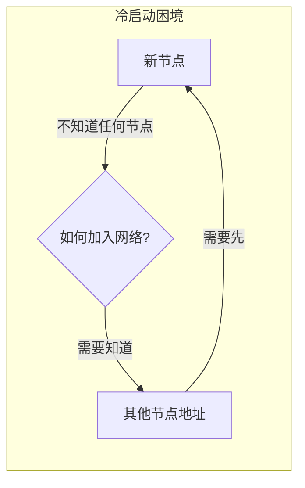
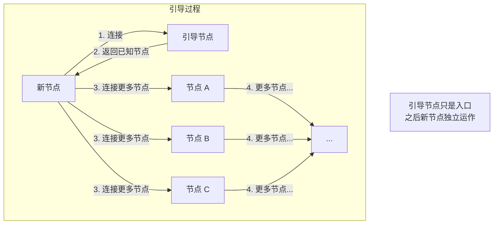
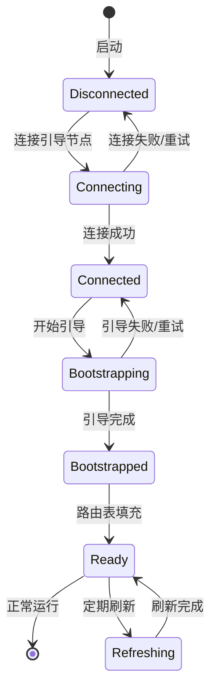

> 师父领进门，修行在个人。
> ——中国谚语

初学者需要师父指引入门，之后才能独立成长。在 P2P 网络中，**引导节点（Bootstrap Node）** 扮演着"师父"的角色——帮助新节点加入网络，之后新节点就能独立运作。

## 冷启动问题

P2P 网络面临一个鸡生蛋的问题：



解决方案是预先配置一些**引导节点**——它们的地址是已知的，新节点可以先连接它们，然后发现更多节点。

## 引导节点的角色



引导节点的特点：

- **公开地址**：地址硬编码在代码或配置中
- **高可用**：通常由项目方运营，保持在线
- **可替代**：可以有多个引导节点，任一可用即可

## 引导节点 vs 普通节点

| 特性 | 引导节点 | 普通节点 |
| --- | --- | --- |
| 地址 | 固定、公开 | 动态、私密 |
| 可用性 | 高（持续在线） | 不保证 |
| 角色 | 入口点 | 网络参与者 |
| 数量 | 少量（几个到几十个） | 无限 |

:::note[引导节点不是中心]
引导节点只在加入时使用一次。加入后，节点可以完全独立运作，即使所有引导节点都下线也不影响已加入的网络。
:::

## 配置引导节点

### 硬编码方式

```rust
use libp2p::{Multiaddr, PeerId};

// 引导节点列表
const BOOTSTRAP_NODES: &[&str] = &[
    "/ip4/104.131.131.82/tcp/4001/p2p/QmaCpDMGvV2BGHeYERUEnRQAwe3N8SzbUtfsmvsqQLuvuJ",
    "/ip4/104.236.179.241/tcp/4001/p2p/QmSoLPppuBtQSGwKDZT2M73ULpjvfd3aZ6ha4oFGL1KrGM",
    "/dnsaddr/bootstrap.libp2p.io/p2p/QmNnooDu7bfjPFoTZYxMNLWUQJyrVwtbZg5gBMjTezGAJN",
];

fn get_bootstrap_peers() -> Vec<(PeerId, Multiaddr)> {
    BOOTSTRAP_NODES
        .iter()
        .filter_map(|addr| {
            let multiaddr: Multiaddr = addr.parse().ok()?;
            let peer_id = extract_peer_id(&multiaddr)?;
            Some((peer_id, multiaddr))
        })
        .collect()
}
```

### 配置文件方式

```toml
# config.toml
[network]
bootstrap_nodes = [
    "/ip4/104.131.131.82/tcp/4001/p2p/QmaCpDMGvV2BGHeYERUEnRQAwe3N8SzbUtfsmvsqQLuvuJ",
    "/ip4/104.236.179.241/tcp/4001/p2p/QmSoLPppuBtQSGwKDZT2M73ULpjvfd3aZ6ha4oFGL1KrGM",
]
```

```rust
use serde::Deserialize;

#[derive(Deserialize)]
struct NetworkConfig {
    bootstrap_nodes: Vec<String>,
}

fn load_bootstrap_nodes() -> anyhow::Result<Vec<(PeerId, Multiaddr)>> {
    let config: NetworkConfig = toml::from_str(&std::fs::read_to_string("config.toml")?)?;

    let peers = config.bootstrap_nodes
        .iter()
        .filter_map(|addr| {
            let multiaddr: Multiaddr = addr.parse().ok()?;
            let peer_id = extract_peer_id(&multiaddr)?;
            Some((peer_id, multiaddr))
        })
        .collect();

    Ok(peers)
}
```

### DNS 解析方式

使用 `dnsaddr` 可以动态解析引导节点：

```rust
// dnsaddr 会解析为多个实际地址
let bootstrap = "/dnsaddr/bootstrap.libp2p.io/p2p/QmNnooDu7bfjPFoTZYxMNLWUQJyrVwtbZg5gBMjTezGAJN";
```

优点：

- 引导节点 IP 变化时无需更新代码
- 可以实现负载均衡
- 便于运维

## 引导流程实现

### 完整示例

```rust
use libp2p::{
    identity::Keypair,
    kad::{self, store::MemoryStore, Mode, QueryResult},
    identify,
    swarm::{NetworkBehaviour, SwarmEvent},
    noise, tcp, yamux, Multiaddr, PeerId, StreamProtocol, SwarmBuilder,
};
use std::time::Duration;
use futures::StreamExt;

// 引导节点列表
const BOOTSTRAP_NODES: &[&str] = &[
    // 这里使用示例地址，实际使用时替换为真实地址
    "/ip4/127.0.0.1/tcp/9000/p2p/12D3KooWxxxxxxxxxxxxxxxxxxxxxxxxxxxxxxxxxxxxxxxxx",
];

#[derive(NetworkBehaviour)]
struct MyBehaviour {
    kademlia: kad::Behaviour<MemoryStore>,
    identify: identify::Behaviour,
}

#[tokio::main]
async fn main() -> anyhow::Result<()> {
    tracing_subscriber::fmt::init();

    let keypair = Keypair::generate_ed25519();
    let local_peer_id = keypair.public().to_peer_id();
    println!("Local PeerId: {local_peer_id}");

    let mut swarm = SwarmBuilder::with_existing_identity(keypair.clone())
        .with_tokio()
        .with_tcp(
            tcp::Config::default(),
            noise::Config::new,
            yamux::Config::default,
        )?
        .with_behaviour(|key| {
            let local_peer_id = key.public().to_peer_id();

            // Kademlia
            let store = MemoryStore::new(local_peer_id);
            let config = kad::Config::new(StreamProtocol::new("/example/kad/1.0.0"));
            let mut kademlia = kad::Behaviour::with_config(local_peer_id, store, config);
            kademlia.set_mode(Some(Mode::Server));

            // Identify
            let identify = identify::Behaviour::new(
                identify::Config::new("/example/id/1.0.0".into(), key.public())
            );

            Ok(MyBehaviour { kademlia, identify })
        })?
        .with_swarm_config(|cfg| {
            cfg.with_idle_connection_timeout(Duration::from_secs(60))
        })
        .build();

    swarm.listen_on("/ip4/0.0.0.0/tcp/0".parse()?)?;

    // 添加引导节点
    let bootstrap_peers = parse_bootstrap_nodes(BOOTSTRAP_NODES);
    for (peer_id, addr) in &bootstrap_peers {
        swarm.behaviour_mut().kademlia.add_address(peer_id, addr.clone());
        println!("Added bootstrap node: {peer_id}");
    }

    // 连接引导节点
    for (_, addr) in &bootstrap_peers {
        if let Err(e) = swarm.dial(addr.clone()) {
            println!("Failed to dial bootstrap: {e}");
        }
    }

    let mut bootstrap_started = false;

    loop {
        match swarm.select_next_some().await {
            SwarmEvent::NewListenAddr { address, .. } => {
                println!("Listening on {address}/p2p/{local_peer_id}");
            }

            SwarmEvent::ConnectionEstablished { peer_id, .. } => {
                println!("Connected to {peer_id}");

                // 首次连接成功后启动引导
                if !bootstrap_started {
                    match swarm.behaviour_mut().kademlia.bootstrap() {
                        Ok(_) => {
                            println!("Kademlia bootstrap started");
                            bootstrap_started = true;
                        }
                        Err(e) => println!("Bootstrap failed: {e:?}"),
                    }
                }
            }

            SwarmEvent::Behaviour(MyBehaviourEvent::Kademlia(event)) => {
                handle_kademlia_event(event);
            }

            SwarmEvent::Behaviour(MyBehaviourEvent::Identify(event)) => {
                if let identify::Event::Received { peer_id, info } = event {
                    // 将 Identify 发现的地址添加到 Kademlia
                    for addr in info.listen_addrs {
                        swarm.behaviour_mut().kademlia.add_address(&peer_id, addr);
                    }
                }
            }

            _ => {}
        }
    }
}

fn parse_bootstrap_nodes(nodes: &[&str]) -> Vec<(PeerId, Multiaddr)> {
    nodes
        .iter()
        .filter_map(|addr| {
            let multiaddr: Multiaddr = addr.parse().ok()?;
            let peer_id = extract_peer_id(&multiaddr)?;
            Some((peer_id, multiaddr))
        })
        .collect()
}

fn extract_peer_id(addr: &Multiaddr) -> Option<PeerId> {
    addr.iter().find_map(|p| {
        if let libp2p::multiaddr::Protocol::P2p(peer_id) = p {
            Some(peer_id)
        } else {
            None
        }
    })
}

fn handle_kademlia_event(event: kad::Event) {
    match event {
        kad::Event::OutboundQueryProgressed { result, .. } => {
            match result {
                QueryResult::Bootstrap(Ok(ok)) => {
                    println!("Bootstrap progress: {} remaining", ok.num_remaining);
                    if ok.num_remaining == 0 {
                        println!("Bootstrap complete!");
                    }
                }
                QueryResult::Bootstrap(Err(e)) => {
                    println!("Bootstrap error: {e:?}");
                }
                _ => {}
            }
        }
        kad::Event::RoutingUpdated { peer, .. } => {
            println!("Discovered peer: {peer}");
        }
        _ => {}
    }
}
```

## 引导策略

### 重试机制

```rust
use std::time::Duration;
use tokio::time::sleep;

async fn bootstrap_with_retry(
    swarm: &mut Swarm<MyBehaviour>,
    bootstrap_peers: &[(PeerId, Multiaddr)],
    max_retries: u32,
) -> anyhow::Result<()> {
    for attempt in 1..=max_retries {
        println!("Bootstrap attempt {attempt}/{max_retries}");

        // 尝试连接所有引导节点
        let mut connected = false;
        for (peer_id, addr) in bootstrap_peers {
            swarm.behaviour_mut().kademlia.add_address(peer_id, addr.clone());
            if swarm.dial(addr.clone()).is_ok() {
                connected = true;
            }
        }

        if connected {
            // 等待连接建立
            sleep(Duration::from_secs(5)).await;

            // 启动引导
            if swarm.behaviour_mut().kademlia.bootstrap().is_ok() {
                return Ok(());
            }
        }

        // 指数退避
        let delay = Duration::from_secs(2u64.pow(attempt));
        println!("Retrying in {delay:?}");
        sleep(delay).await;
    }

    anyhow::bail!("Bootstrap failed after {max_retries} attempts")
}
```

### 多引导节点容错

```rust
// 使用多个引导节点提高可靠性
const BOOTSTRAP_NODES: &[&str] = &[
    // 主引导节点
    "/ip4/104.131.131.82/tcp/4001/p2p/QmaCpDMGvV2BGHeYERUEnRQAwe3N8SzbUtfsmvsqQLuvuJ",
    // 备用引导节点 1
    "/ip4/104.236.179.241/tcp/4001/p2p/QmSoLPppuBtQSGwKDZT2M73ULpjvfd3aZ6ha4oFGL1KrGM",
    // 备用引导节点 2
    "/ip4/178.62.158.247/tcp/4001/p2p/QmSoLer265NRgSp2LA3dPaeykiS1J6DifTC88f5uVQKNAd",
];

// 随机选择引导节点避免单点负载
fn select_bootstrap_nodes(nodes: &[(PeerId, Multiaddr)], count: usize) -> Vec<(PeerId, Multiaddr)> {
    use rand::seq::SliceRandom;
    let mut rng = rand::thread_rng();
    let mut shuffled = nodes.to_vec();
    shuffled.shuffle(&mut rng);
    shuffled.into_iter().take(count).collect()
}
```

## 运营自己的引导节点

### 引导节点配置

```rust
use libp2p::kad::Mode;

// 引导节点应该：
// 1. 使用固定密钥（保持 PeerId 不变）
// 2. 监听固定端口
// 3. 设置为 Server 模式

let keypair = load_or_create_keypair("bootstrap-key.pem")?;
let local_peer_id = keypair.public().to_peer_id();

// 监听固定端口
swarm.listen_on("/ip4/0.0.0.0/tcp/4001".parse()?)?;

// 设置为 Server 模式
swarm.behaviour_mut().kademlia.set_mode(Some(Mode::Server));

println!("Bootstrap node running:");
println!("  PeerId: {local_peer_id}");
println!("  Address: /ip4/<YOUR_IP>/tcp/4001/p2p/{local_peer_id}");
```

### 密钥持久化

```rust
use libp2p::identity::Keypair;
use std::path::Path;

fn load_or_create_keypair(path: &str) -> anyhow::Result<Keypair> {
    let path = Path::new(path);

    if path.exists() {
        // 加载已有密钥
        let bytes = std::fs::read(path)?;
        let keypair = Keypair::from_protobuf_encoding(&bytes)?;
        println!("Loaded existing keypair");
        Ok(keypair)
    } else {
        // 生成新密钥并保存
        let keypair = Keypair::generate_ed25519();
        let bytes = keypair.to_protobuf_encoding()?;
        std::fs::write(path, bytes)?;
        println!("Generated new keypair");
        Ok(keypair)
    }
}
```

## 引导状态机



## 小结

本章介绍了引导节点与网络加入：

- **冷启动问题**：新节点需要已知入口点
- **引导节点角色**：公开地址、高可用、只用于入门
- **引导流程**：连接 → 发现 → 填充路由表
- **容错策略**：多节点、重试、随机选择

引导节点是 P2P 网络的"门卫"——帮助新节点进门后，新节点就成为网络的一员，可以独立发现和连接其他节点。

下一章，我们将学习 **Rendezvous 协议**——一种更灵活的节点发现机制。
