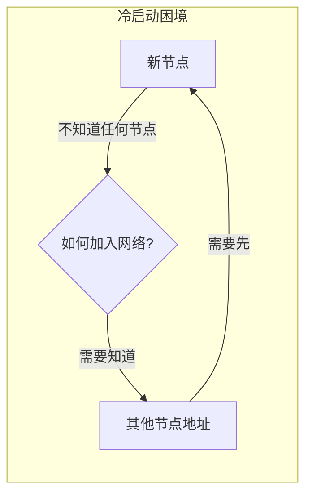
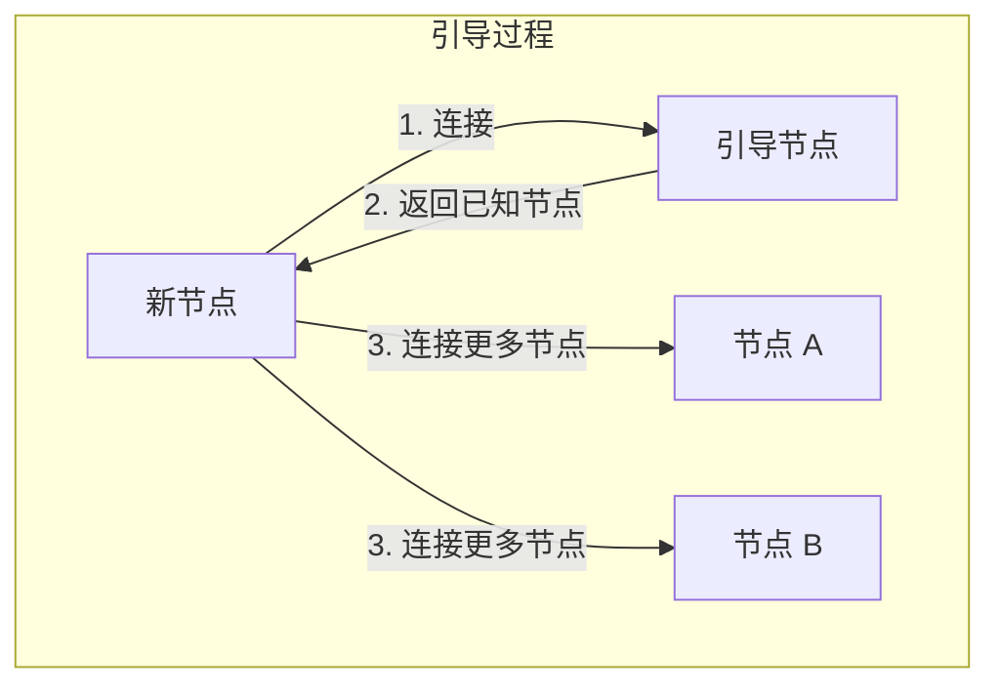
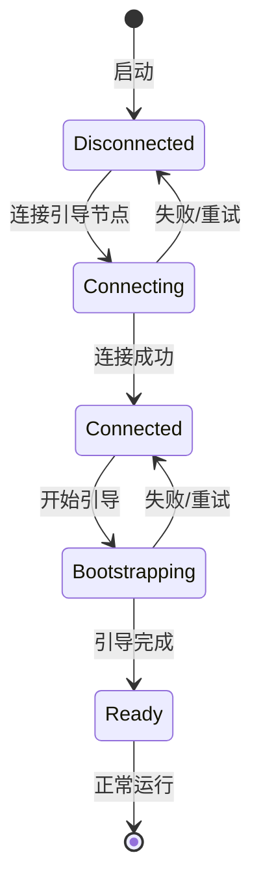

import { Steps, Tabs, TabItem } from '@astrojs/starlight/components';

> 师父领进门，修行在个人。
> ——中国谚语

初学者需要师父指引入门，之后才能独立成长。在 P2P 网络中，**引导节点（Bootstrap Node）** 扮演着"师父"的角色——帮助新节点加入网络，之后新节点就能独立运作。

## 冷启动问题

P2P 网络面临一个鸡生蛋的问题：



解决方案是预先配置一些**引导节点**——它们的地址是已知的，新节点可以先连接它们，然后发现更多节点。

## 引导节点的角色



| 特性 | 引导节点 | 普通节点 |
|-----|---------|---------|
| 地址 | 固定、公开 | 动态、私密 |
| 可用性 | 高（持续在线） | 不保证 |
| 角色 | 入口点 | 网络参与者 |
| 数量 | 少量（几个） | 无限 |

:::note[引导节点不是中心]
引导节点只在加入时使用一次。加入后，节点完全独立运作，即使所有引导节点下线也不影响已加入的网络。
:::

## 动手实践

:::tip[配套工具]
本教程配套的桌面应用可以作为引导节点使用。你可以用它启动一个节点，然后让你的程序连接它来加入网络。
:::

让我们实现一个完整的引导流程。

<Steps>

1. **配置引导节点列表**

   ```rust
   // 硬编码方式
   const BOOTSTRAP_NODES: &[&str] = &[
       "/ip4/104.131.131.82/tcp/4001/p2p/QmaCpDMGvV2BGHeYERUEnRQAwe3N8SzbUtfsmvsqQLuvuJ",
       "/dnsaddr/bootstrap.libp2p.io/p2p/QmNnooDu7bfjPFoTZYxMNLWUQJyrVwtbZg5gBMjTezGAJN",
   ];

   fn parse_bootstrap_nodes(nodes: &[&str]) -> Vec<(PeerId, Multiaddr)> {
       nodes.iter().filter_map(|addr| {
           let multiaddr: Multiaddr = addr.parse().ok()?;
           let peer_id = extract_peer_id(&multiaddr)?;
           Some((peer_id, multiaddr))
       }).collect()
   }
   ```

2. **添加引导节点到 Kademlia**

   ```rust ins={5-6}
   let bootstrap_peers = parse_bootstrap_nodes(BOOTSTRAP_NODES);

   for (peer_id, addr) in &bootstrap_peers {
       // 添加到 Kademlia 路由表
       swarm.behaviour_mut().kademlia.add_address(peer_id, addr.clone());
       println!("Added bootstrap node: {peer_id}");
   }
   ```

3. **连接引导节点**

   ```rust ins={3-5}
   // 连接引导节点
   for (_, addr) in &bootstrap_peers {
       if let Err(e) = swarm.dial(addr.clone()) {
           println!("Failed to dial bootstrap: {e}");
       }
   }
   ```

4. **连接成功后启动引导**

   ```rust ins={4-7}
   SwarmEvent::ConnectionEstablished { peer_id, .. } => {
       println!("Connected to {peer_id}");

       // 首次连接成功后启动 Kademlia 引导
       if !bootstrap_started {
           match swarm.behaviour_mut().kademlia.bootstrap() {
               Ok(_) => {
                   println!("Kademlia bootstrap started");
                   bootstrap_started = true;
               }
               Err(e) => println!("Bootstrap failed: {e:?}"),
           }
       }
   }
   ```

5. **处理引导完成事件**

   ```rust ins={3-10}
   kad::Event::OutboundQueryProgressed { result, .. } => {
       match result {
           kad::QueryResult::Bootstrap(Ok(ok)) => {
               println!("Bootstrap progress: {} remaining", ok.num_remaining);
               if ok.num_remaining == 0 {
                   println!("Bootstrap complete! Ready to participate in the network.");
               }
           }
           kad::QueryResult::Bootstrap(Err(e)) => {
               println!("Bootstrap error: {e:?}");
           }
           _ => {}
       }
   }
   ```

</Steps>

## 完整代码

```rust
use anyhow::Result;
use libp2p::{
    futures::StreamExt, identify, kad::{self, store::MemoryStore},
    noise, swarm::NetworkBehaviour, swarm::SwarmEvent, tcp, yamux,
    Multiaddr, PeerId, StreamProtocol, SwarmBuilder,
};
use std::time::Duration;

// 引导节点列表（示例地址，请替换为实际地址）
const BOOTSTRAP_NODES: &[&str] = &[
    // 本地测试可以用配套工具启动的节点地址
    // "/ip4/127.0.0.1/tcp/9000/p2p/12D3KooW..."
];

#[derive(NetworkBehaviour)]
struct MyBehaviour {
    identify: identify::Behaviour,
    kademlia: kad::Behaviour<MemoryStore>,
}

#[tokio::main]
async fn main() -> Result<()> {
    tracing_subscriber::fmt().init();

    let keypair = libp2p::identity::Keypair::generate_ed25519();
    let local_peer_id = keypair.public().to_peer_id();
    println!("Local PeerId: {local_peer_id}");

    let mut swarm = SwarmBuilder::with_existing_identity(keypair)
        .with_tokio()
        .with_tcp(
            tcp::Config::default(),
            noise::Config::new,
            yamux::Config::default,
        )?
        .with_behaviour(|key| {
            let local_peer_id = key.public().to_peer_id();
            Ok(MyBehaviour {
                identify: identify::Behaviour::new(
                    identify::Config::new("/bootstrap-demo/1.0.0".into(), key.public()),
                ),
                kademlia: {
                    let store = MemoryStore::new(local_peer_id);
                    let config = kad::Config::new(StreamProtocol::new("/bootstrap-demo/kad/1.0.0"));
                    let mut kad = kad::Behaviour::with_config(local_peer_id, store, config);
                    kad.set_mode(Some(kad::Mode::Server));
                    kad
                },
            })
        })?
        .with_swarm_config(|cfg| cfg.with_idle_connection_timeout(Duration::from_secs(60)))
        .build();

    swarm.listen_on("/ip4/0.0.0.0/tcp/0".parse()?)?;

    // 添加引导节点
    let bootstrap_peers = parse_bootstrap_nodes(BOOTSTRAP_NODES);
    for (peer_id, addr) in &bootstrap_peers {
        swarm.behaviour_mut().kademlia.add_address(peer_id, addr.clone());
        println!("Added bootstrap: {peer_id}");
    }

    // 也支持命令行参数指定引导节点
    if let Some(addr) = std::env::args().nth(1) {
        let remote: Multiaddr = addr.parse()?;
        if let Some(peer_id) = extract_peer_id(&remote) {
            swarm.behaviour_mut().kademlia.add_address(&peer_id, remote.clone());
        }
        swarm.dial(remote)?;
        println!("Dialing bootstrap from command line...");
    } else {
        // 连接硬编码的引导节点
        for (_, addr) in &bootstrap_peers {
            let _ = swarm.dial(addr.clone());
        }
    }

    let mut bootstrap_started = false;

    loop {
        match swarm.select_next_some().await {
            SwarmEvent::NewListenAddr { address, .. } => {
                println!("Listening on {address}/p2p/{local_peer_id}");
            }
            SwarmEvent::ConnectionEstablished { peer_id, .. } => {
                println!("Connected to {peer_id}");

                if !bootstrap_started {
                    match swarm.behaviour_mut().kademlia.bootstrap() {
                        Ok(_) => {
                            println!("Kademlia bootstrap started");
                            bootstrap_started = true;
                        }
                        Err(e) => println!("Bootstrap error: {e:?}"),
                    }
                }
            }
            SwarmEvent::Behaviour(MyBehaviourEvent::Identify(
                identify::Event::Received { peer_id, info, .. },
            )) => {
                for addr in info.listen_addrs {
                    swarm.behaviour_mut().kademlia.add_address(&peer_id, addr);
                }
            }
            SwarmEvent::Behaviour(MyBehaviourEvent::Kademlia(event)) => match event {
                kad::Event::RoutingUpdated { peer, .. } => {
                    println!("Discovered peer: {peer}");
                }
                kad::Event::OutboundQueryProgressed { result, .. } => match result {
                    kad::QueryResult::Bootstrap(Ok(ok)) => {
                        println!("Bootstrap progress: {} remaining", ok.num_remaining);
                        if ok.num_remaining == 0 {
                            println!("\n✅ Bootstrap complete!");
                            println!("Now part of the P2P network.\n");
                        }
                    }
                    kad::QueryResult::Bootstrap(Err(e)) => {
                        println!("Bootstrap error: {e:?}");
                    }
                    _ => {}
                },
                _ => {}
            },
            _ => {}
        }
    }
}

fn parse_bootstrap_nodes(nodes: &[&str]) -> Vec<(PeerId, Multiaddr)> {
    nodes.iter().filter_map(|addr| {
        let multiaddr: Multiaddr = addr.parse().ok()?;
        let peer_id = extract_peer_id(&multiaddr)?;
        Some((peer_id, multiaddr))
    }).collect()
}

fn extract_peer_id(addr: &Multiaddr) -> Option<PeerId> {
    addr.iter().find_map(|p| {
        if let libp2p::multiaddr::Protocol::P2p(peer_id) = p {
            Some(peer_id)
        } else {
            None
        }
    })
}
```

## 运行测试

<Tabs>
<TabItem label="终端 1（引导节点）">

```bash
cargo run
```

输出：

```text
Local PeerId: 12D3KooWAbCd...
Listening on /ip4/127.0.0.1/tcp/54321/p2p/12D3KooWAbCd...
```

复制这个完整地址。

</TabItem>
<TabItem label="终端 2（新节点加入）">

```bash
cargo run -- /ip4/127.0.0.1/tcp/54321/p2p/12D3KooWAbCd...
```

输出：

```text
Local PeerId: 12D3KooWXyZw...
Dialing bootstrap from command line...
Connected to 12D3KooWAbCd...
Kademlia bootstrap started
Bootstrap progress: 1 remaining
Bootstrap progress: 0 remaining

✅ Bootstrap complete!
Now part of the P2P network.
```

</TabItem>
</Tabs>

## 引导策略

### 多节点容错

```rust
// 使用多个引导节点提高可靠性
const BOOTSTRAP_NODES: &[&str] = &[
    "/ip4/104.131.131.82/tcp/4001/p2p/QmaCp...",   // 主节点
    "/ip4/104.236.179.241/tcp/4001/p2p/QmSoL...", // 备用 1
    "/ip4/178.62.158.247/tcp/4001/p2p/QmSoL...",  // 备用 2
];
```

### 重试机制

```rust
async fn bootstrap_with_retry(
    swarm: &mut Swarm<MyBehaviour>,
    bootstrap_peers: &[(PeerId, Multiaddr)],
    max_retries: u32,
) -> Result<()> {
    for attempt in 1..=max_retries {
        println!("Bootstrap attempt {attempt}/{max_retries}");

        for (peer_id, addr) in bootstrap_peers {
            swarm.behaviour_mut().kademlia.add_address(peer_id, addr.clone());
            let _ = swarm.dial(addr.clone());
        }

        tokio::time::sleep(Duration::from_secs(5)).await;

        if swarm.behaviour_mut().kademlia.bootstrap().is_ok() {
            return Ok(());
        }

        // 指数退避
        tokio::time::sleep(Duration::from_secs(2u64.pow(attempt))).await;
    }

    anyhow::bail!("Bootstrap failed after {max_retries} attempts")
}
```

## 运营自己的引导节点

<Steps>

1. **使用固定密钥** — 保持 PeerId 不变

   ```rust
   fn load_or_create_keypair(path: &str) -> Result<Keypair> {
       let path = std::path::Path::new(path);
       if path.exists() {
           let bytes = std::fs::read(path)?;
           Ok(Keypair::from_protobuf_encoding(&bytes)?)
       } else {
           let keypair = Keypair::generate_ed25519();
           std::fs::write(path, keypair.to_protobuf_encoding()?)?;
           Ok(keypair)
       }
   }
   ```

2. **监听固定端口**

   ```rust
   swarm.listen_on("/ip4/0.0.0.0/tcp/4001".parse()?)?;
   ```

3. **设置为 Server 模式**

   ```rust
   swarm.behaviour_mut().kademlia.set_mode(Some(kad::Mode::Server));
   ```

</Steps>

## 引导状态机



## 小结

本章介绍了引导节点与网络加入：

- **冷启动问题**：新节点需要已知入口点
- **引导节点角色**：公开地址、高可用、只用于入门
- **引导流程**：连接 → 发现 → 填充路由表
- **容错策略**：多节点、重试、指数退避

引导节点是 P2P 网络的"门卫"——帮助新节点进门后，新节点就成为网络的一员，可以独立发现和连接其他节点。

下一章，我们将学习 **Rendezvous 协议**——一种更灵活的节点发现机制。
