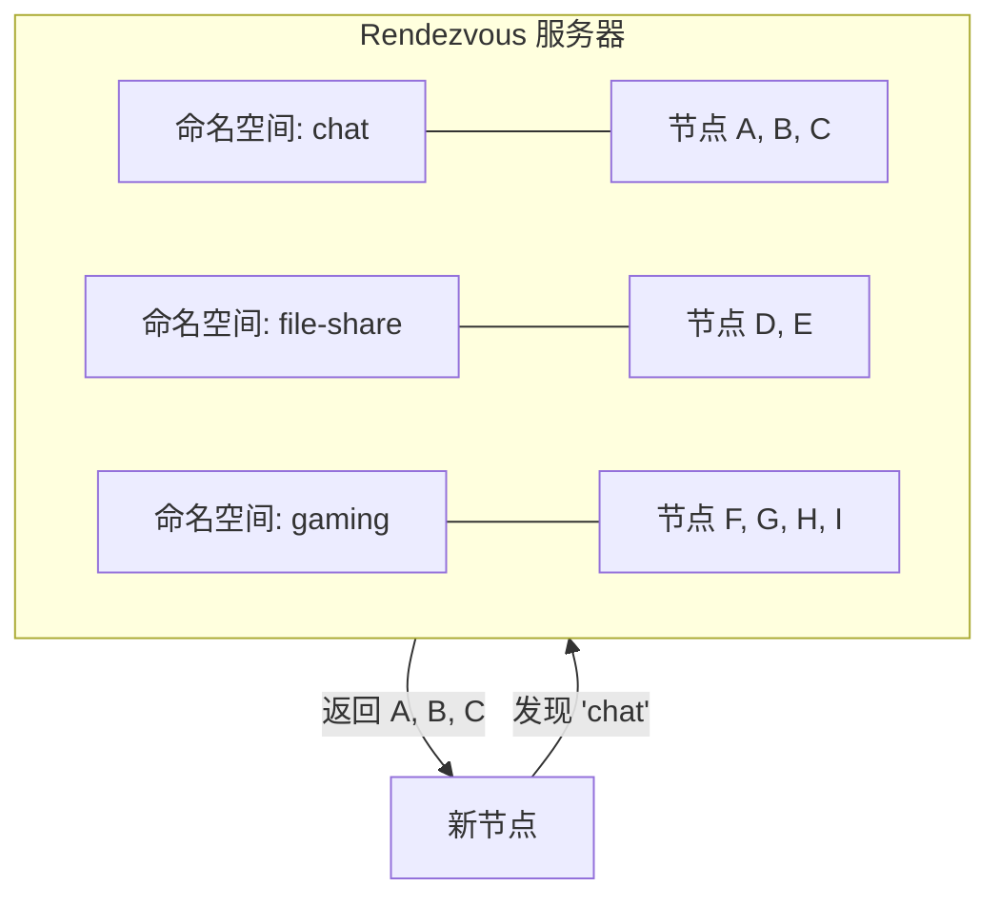
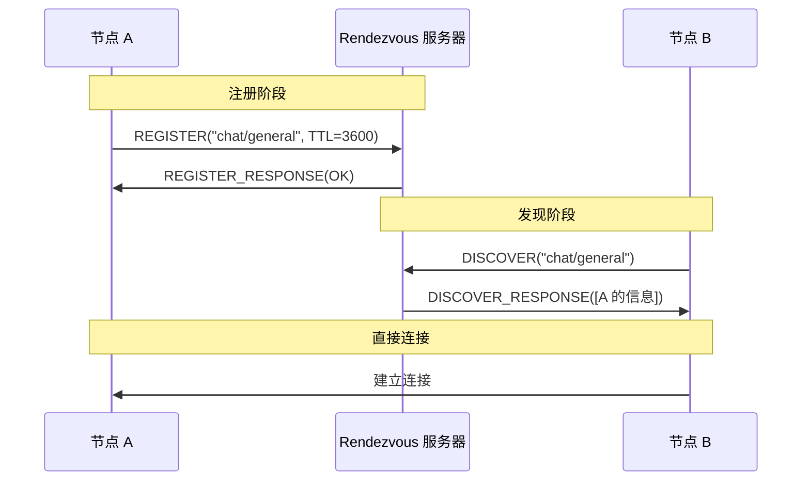
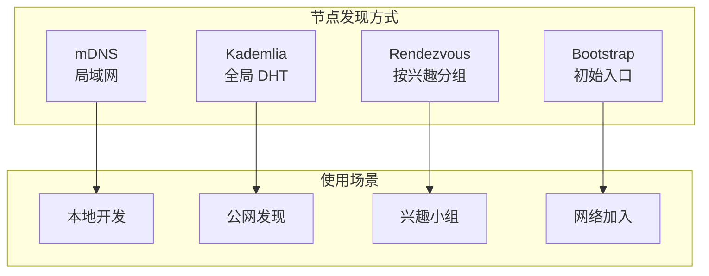

> 三军可夺帅也，匹夫不可夺志也。
> ——《论语·子罕》

即使千军万马，也能找到那个特定的将帅。在 P2P 网络中，**Rendezvous（会合点）协议** 就是这样的定向寻人系统——不是漫无目的地寻找，而是按"名字"精准定位。

## 什么是 Rendezvous？

Rendezvous 是一种**基于命名空间（Namespace）** 的节点发现协议。节点可以注册到特定的命名空间，其他节点可以查询该命名空间来发现它们。



### 与 Kademlia 的区别

| 特性 | Kademlia | Rendezvous |
| --- | --- | --- |
| 发现方式 | 按 PeerId 距离 | 按命名空间 |
| 用途 | 通用节点发现 | 按兴趣/功能分组 |
| 服务器 | 无中心 | 需要 Rendezvous 点 |
| 注册 | 自动 | 主动注册 |

### 使用场景

- **聊天室**：注册到 `chat/room-name`
- **文件共享**：注册到 `file/hash`
- **游戏匹配**：注册到 `game/lobby-id`
- **服务发现**：注册到 `service/api-name`

## Rendezvous 协议流程



### 协议消息

| 消息类型 | 方向 | 说明 |
| --- | --- | --- |
| `REGISTER` | Client → Server | 注册到命名空间 |
| `REGISTER_RESPONSE` | Server → Client | 注册结果 |
| `UNREGISTER` | Client → Server | 取消注册 |
| `DISCOVER` | Client → Server | 查询命名空间 |
| `DISCOVER_RESPONSE` | Server → Client | 返回注册的节点 |

## 配置 Rendezvous

### 作为客户端

```rust
use libp2p::rendezvous;
use std::time::Duration;

// 创建 Rendezvous 客户端 Behaviour
let rendezvous = rendezvous::client::Behaviour::new(keypair.clone());
```

### 作为服务器

```rust
use libp2p::rendezvous;

// 创建 Rendezvous 服务器 Behaviour
let rendezvous = rendezvous::server::Behaviour::new(
    rendezvous::server::Config::default()
        .with_min_ttl(60)           // 最小 TTL（秒）
        .with_max_ttl(3600)         // 最大 TTL（秒）
);
```

### 服务器配置选项

| 选项 | 说明 | 默认值 |
| --- | --- | --- |
| `min_ttl` | 注册的最小生存时间 | 60 秒 |
| `max_ttl` | 注册的最大生存时间 | 7200 秒 |

## 客户端操作

### 注册到命名空间

```rust
use libp2p::rendezvous::{self, Namespace};

// 连接到 Rendezvous 服务器后
let namespace = Namespace::from_static("my-app/lobby");
let ttl = Some(3600); // 1 小时

swarm.behaviour_mut()
    .rendezvous
    .register(namespace, rendezvous_peer_id, ttl)?;
```

### 发现节点

```rust
use libp2p::rendezvous::{Cookie, Namespace};

let namespace = Namespace::from_static("my-app/lobby");

// 首次发现
swarm.behaviour_mut()
    .rendezvous
    .discover(
        Some(namespace),
        None,  // Cookie（用于分页）
        None,  // 限制数量
        rendezvous_peer_id,
    );
```

### 取消注册

```rust
let namespace = Namespace::from_static("my-app/lobby");

swarm.behaviour_mut()
    .rendezvous
    .unregister(namespace, rendezvous_peer_id);
```

## 事件处理

### 客户端事件

```rust
use libp2p::rendezvous::client;

loop {
    match swarm.select_next_some().await {
        SwarmEvent::Behaviour(MyBehaviourEvent::Rendezvous(event)) => {
            match event {
                // 注册成功
                client::Event::Registered { namespace, ttl, rendezvous_node } => {
                    println!("Registered in '{namespace}' for {ttl}s at {rendezvous_node}");
                }

                // 注册失败
                client::Event::RegisterFailed { namespace, rendezvous_node, error } => {
                    println!("Failed to register in '{namespace}': {error:?}");
                }

                // 发现结果
                client::Event::Discovered { registrations, cookie, rendezvous_node } => {
                    println!("Discovered {} peers", registrations.len());

                    for registration in registrations {
                        println!("  Peer: {}", registration.record.peer_id());
                        for addr in registration.record.addresses() {
                            println!("    Address: {addr}");
                        }
                    }

                    // 保存 cookie 用于后续分页查询
                    // saved_cookie = Some(cookie);
                }

                // TTL 即将过期
                client::Event::Expired { peer } => {
                    println!("Registration expired for {peer}");
                    // 需要重新注册
                }

                _ => {}
            }
        }
        _ => {}
    }
}
```

### 服务器事件

```rust
use libp2p::rendezvous::server;

loop {
    match swarm.select_next_some().await {
        SwarmEvent::Behaviour(MyBehaviourEvent::Rendezvous(event)) => {
            match event {
                // 节点注册
                server::Event::PeerRegistered { peer, registration } => {
                    println!("Peer {peer} registered in namespace '{}'",
                        registration.namespace);
                }

                // 节点取消注册
                server::Event::PeerUnregistered { peer, namespace } => {
                    println!("Peer {peer} unregistered from '{namespace}'");
                }

                // 注册过期
                server::Event::RegistrationExpired(registration) => {
                    println!("Registration expired: {} in '{}'",
                        registration.record.peer_id(),
                        registration.namespace);
                }

                // 发现请求
                server::Event::DiscoverServed { enquirer, registrations } => {
                    println!("Served {} registrations to {enquirer}",
                        registrations.len());
                }

                _ => {}
            }
        }
        _ => {}
    }
}
```

## 完整示例：聊天室发现

### 服务器端

```rust
use libp2p::{
    identity::Keypair,
    rendezvous,
    swarm::{NetworkBehaviour, SwarmEvent},
    noise, tcp, yamux, SwarmBuilder,
};
use std::time::Duration;
use futures::StreamExt;

#[derive(NetworkBehaviour)]
struct ServerBehaviour {
    rendezvous: rendezvous::server::Behaviour,
}

#[tokio::main]
async fn main() -> anyhow::Result<()> {
    tracing_subscriber::fmt::init();

    let keypair = Keypair::generate_ed25519();
    let local_peer_id = keypair.public().to_peer_id();
    println!("Rendezvous Server PeerId: {local_peer_id}");

    let mut swarm = SwarmBuilder::with_existing_identity(keypair)
        .with_tokio()
        .with_tcp(
            tcp::Config::default(),
            noise::Config::new,
            yamux::Config::default,
        )?
        .with_behaviour(|_| {
            let config = rendezvous::server::Config::default();
            Ok(ServerBehaviour {
                rendezvous: rendezvous::server::Behaviour::new(config),
            })
        })?
        .with_swarm_config(|cfg| {
            cfg.with_idle_connection_timeout(Duration::from_secs(60))
        })
        .build();

    // 监听固定端口
    swarm.listen_on("/ip4/0.0.0.0/tcp/62649".parse()?)?;

    loop {
        match swarm.select_next_some().await {
            SwarmEvent::NewListenAddr { address, .. } => {
                println!("Server listening on {address}/p2p/{local_peer_id}");
            }
            SwarmEvent::Behaviour(ServerBehaviourEvent::Rendezvous(event)) => {
                match event {
                    rendezvous::server::Event::PeerRegistered { peer, registration } => {
                        println!("+ {peer} registered in '{}'", registration.namespace);
                    }
                    rendezvous::server::Event::PeerUnregistered { peer, namespace } => {
                        println!("- {peer} unregistered from '{namespace}'");
                    }
                    rendezvous::server::Event::DiscoverServed { enquirer, registrations } => {
                        println!("? Served {} registrations to {enquirer}",
                            registrations.len());
                    }
                    _ => {}
                }
            }
            _ => {}
        }
    }
}
```

### 客户端

```rust
use libp2p::{
    identity::Keypair,
    rendezvous::{self, Namespace},
    identify,
    swarm::{NetworkBehaviour, SwarmEvent},
    noise, tcp, yamux, Multiaddr, PeerId, SwarmBuilder,
};
use std::time::Duration;
use futures::StreamExt;

#[derive(NetworkBehaviour)]
struct ClientBehaviour {
    rendezvous: rendezvous::client::Behaviour,
    identify: identify::Behaviour,
}

const NAMESPACE: &str = "chat/general";

#[tokio::main]
async fn main() -> anyhow::Result<()> {
    tracing_subscriber::fmt::init();

    let keypair = Keypair::generate_ed25519();
    let local_peer_id = keypair.public().to_peer_id();
    println!("Client PeerId: {local_peer_id}");

    // Rendezvous 服务器地址（从命令行参数获取）
    let rendezvous_addr: Multiaddr = std::env::args()
        .nth(1)
        .expect("Usage: client <rendezvous-addr>")
        .parse()?;

    let rendezvous_peer = extract_peer_id(&rendezvous_addr)
        .expect("Rendezvous address must contain peer ID");

    let mut swarm = SwarmBuilder::with_existing_identity(keypair.clone())
        .with_tokio()
        .with_tcp(
            tcp::Config::default(),
            noise::Config::new,
            yamux::Config::default,
        )?
        .with_behaviour(|key| {
            Ok(ClientBehaviour {
                rendezvous: rendezvous::client::Behaviour::new(key.clone()),
                identify: identify::Behaviour::new(
                    identify::Config::new("/example/1.0.0".into(), key.public())
                ),
            })
        })?
        .with_swarm_config(|cfg| {
            cfg.with_idle_connection_timeout(Duration::from_secs(60))
        })
        .build();

    swarm.listen_on("/ip4/0.0.0.0/tcp/0".parse()?)?;

    // 连接到 Rendezvous 服务器
    swarm.dial(rendezvous_addr)?;

    let mut registered = false;
    let mut discovered = false;

    loop {
        match swarm.select_next_some().await {
            SwarmEvent::NewListenAddr { address, .. } => {
                println!("Listening on {address}");
            }

            SwarmEvent::ConnectionEstablished { peer_id, .. } if peer_id == rendezvous_peer => {
                println!("Connected to Rendezvous server");

                // 先发现已有节点
                let namespace = Namespace::new(NAMESPACE.to_string())?;
                swarm.behaviour_mut().rendezvous.discover(
                    Some(namespace),
                    None,
                    None,
                    rendezvous_peer,
                );
            }

            SwarmEvent::Behaviour(ClientBehaviourEvent::Rendezvous(event)) => {
                match event {
                    rendezvous::client::Event::Discovered { registrations, .. } => {
                        println!("Discovered {} peers in '{NAMESPACE}':", registrations.len());

                        for registration in &registrations {
                            let peer = registration.record.peer_id();
                            println!("  - {peer}");

                            // 连接发现的节点
                            if peer != local_peer_id {
                                for addr in registration.record.addresses() {
                                    let _ = swarm.dial(addr.clone());
                                }
                            }
                        }

                        discovered = true;

                        // 发现后注册自己
                        if !registered {
                            let namespace = Namespace::new(NAMESPACE.to_string())?;
                            swarm.behaviour_mut().rendezvous.register(
                                namespace,
                                rendezvous_peer,
                                Some(3600), // 1 小时 TTL
                            )?;
                        }
                    }

                    rendezvous::client::Event::Registered { namespace, ttl, .. } => {
                        println!("Registered in '{namespace}' for {ttl}s");
                        registered = true;
                    }

                    rendezvous::client::Event::RegisterFailed { error, .. } => {
                        println!("Registration failed: {error:?}");
                    }

                    rendezvous::client::Event::Expired { peer } => {
                        println!("Registration expired, re-registering...");
                        let namespace = Namespace::new(NAMESPACE.to_string())?;
                        swarm.behaviour_mut().rendezvous.register(
                            namespace,
                            peer,
                            Some(3600),
                        )?;
                    }

                    _ => {}
                }
            }

            SwarmEvent::ConnectionEstablished { peer_id, .. } if peer_id != rendezvous_peer => {
                println!("Connected to peer: {peer_id}");
            }

            _ => {}
        }
    }
}

fn extract_peer_id(addr: &Multiaddr) -> Option<PeerId> {
    addr.iter().find_map(|p| {
        if let libp2p::multiaddr::Protocol::P2p(peer_id) = p {
            Some(peer_id)
        } else {
            None
        }
    })
}
```

## 命名空间设计

### 层级结构

```
my-app/
├── chat/
│   ├── general
│   ├── random
│   └── tech
├── file/
│   └── <file-hash>
└── service/
    ├── api
    └── relay
```

### 命名规范

```rust
// 好的命名
"my-app/chat/general"
"my-app/v1/users"
"my-app/game/lobby-123"

// 避免的命名
"chat"           // 太通用，可能冲突
"x"              // 无意义
"my app/chat"    // 包含空格
```

## Rendezvous vs 其他发现机制



### 组合使用

```rust
#[derive(NetworkBehaviour)]
struct FullBehaviour {
    // 局域网发现
    mdns: mdns::tokio::Behaviour,
    // 全局 DHT
    kademlia: kad::Behaviour<MemoryStore>,
    // 兴趣组发现
    rendezvous: rendezvous::client::Behaviour,
    // 节点信息交换
    identify: identify::Behaviour,
}
```

## 小结

本章介绍了 Rendezvous 协议：

- **基于命名空间**：按兴趣/功能分组发现节点
- **注册机制**：主动注册到特定命名空间
- **TTL 管理**：注册有生存时间，需要定期续约
- **服务器/客户端**：需要 Rendezvous 点作为会合中心

Rendezvous 是对 Kademlia 的补充——Kademlia 帮你找到"任意节点"，Rendezvous 帮你找到"特定类型的节点"。

第四篇节点发现到此结束。下一篇，我们将进入 **消息传播**——学习如何在 P2P 网络中广播消息。
