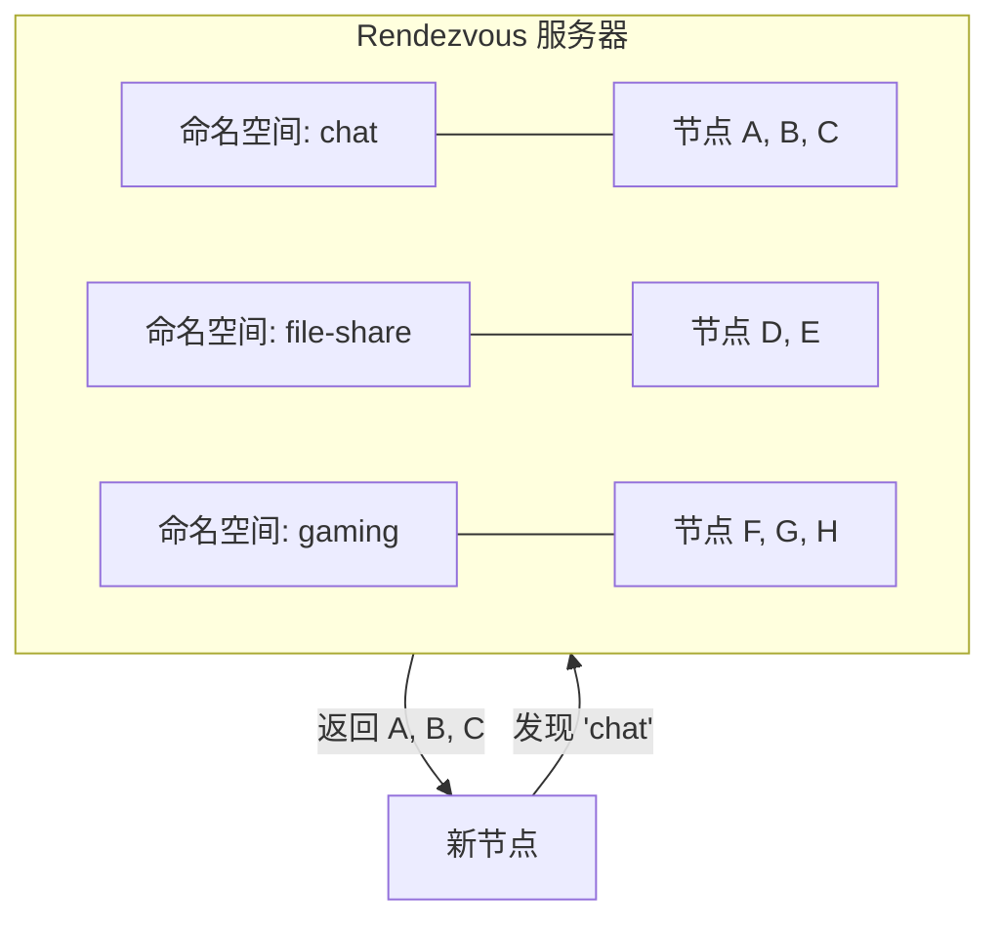
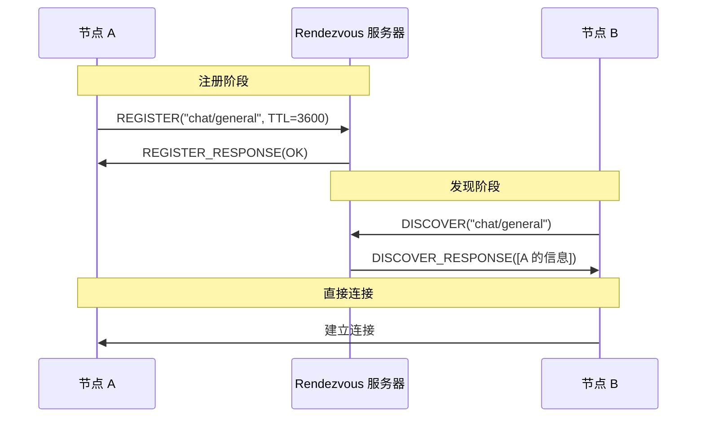
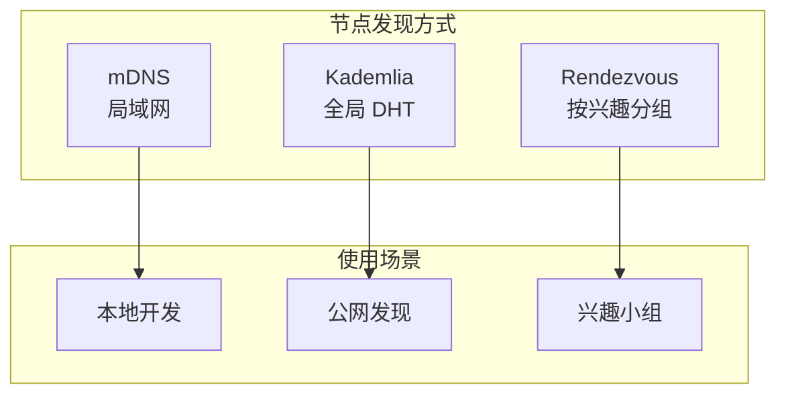

import { Steps, Tabs, TabItem } from '@astrojs/starlight/components';

> 三军可夺帅也，匹夫不可夺志也。
> ——《论语·子罕》

即使千军万马，也能找到那个特定的将帅。在 P2P 网络中，**Rendezvous（会合点）协议** 就是这样的定向寻人系统——不是漫无目的地寻找，而是按"名字"精准定位。

## 什么是 Rendezvous？

Rendezvous 是一种**基于命名空间（Namespace）** 的节点发现协议。节点可以注册到特定的命名空间，其他节点可以查询该命名空间来发现它们。



### 与 Kademlia 的区别

| 特性 | Kademlia | Rendezvous |
|-----|---------|------------|
| 发现方式 | 按 PeerId 距离 | 按命名空间 |
| 用途 | 通用节点发现 | 按兴趣/功能分组 |
| 服务器 | 无中心 | 需要 Rendezvous 点 |
| 注册 | 自动 | 主动注册 |

### 使用场景

| 场景 | 命名空间示例 |
|-----|------------|
| 聊天室 | `chat/room-name` |
| 文件共享 | `file/hash` |
| 游戏匹配 | `game/lobby-id` |
| 服务发现 | `service/api-name` |

## 协议流程



## 动手实践

:::tip[配套工具]
本教程配套的桌面应用支持 Rendezvous 协议。你可以用它作为 Rendezvous 服务器，观察节点的注册和发现过程。
:::

Rendezvous 有两个角色：**服务器**和**客户端**。让我们分别实现。

### 服务器端

<Steps>

1. **添加依赖**

   ```toml ins="rendezvous"
   [dependencies]
   libp2p = { version = "0.56", features = ["tcp", "noise", "yamux", "rendezvous", "macros", "tokio"] }
   ```

2. **创建服务器 Behaviour**

   ```rust ins={4-5}
   #[derive(NetworkBehaviour)]
   struct ServerBehaviour {
       rendezvous: rendezvous::server::Behaviour,
   }
   ```

3. **实例化服务器**

   ```rust ins={3-6}
   .with_behaviour(|_| {
       let config = rendezvous::server::Config::default()
           .with_min_ttl(60)      // 最小 TTL
           .with_max_ttl(3600);   // 最大 TTL
       Ok(ServerBehaviour {
           rendezvous: rendezvous::server::Behaviour::new(config),
       })
   })?
   ```

4. **处理服务器事件**

   ```rust ins={3-12}
   SwarmEvent::Behaviour(ServerBehaviourEvent::Rendezvous(event)) => {
       match event {
           rendezvous::server::Event::PeerRegistered { peer, registration } => {
               println!("+ {peer} registered in '{}'", registration.namespace);
           }
           rendezvous::server::Event::PeerUnregistered { peer, namespace } => {
               println!("- {peer} unregistered from '{namespace}'");
           }
           rendezvous::server::Event::DiscoverServed { enquirer, registrations } => {
               println!("? Served {} registrations to {enquirer}", registrations.len());
           }
           _ => {}
       }
   }
   ```

</Steps>

### 客户端

<Steps>

1. **创建客户端 Behaviour**

   ```rust ins={4-6}
   #[derive(NetworkBehaviour)]
   struct ClientBehaviour {
       rendezvous: rendezvous::client::Behaviour,
       identify: identify::Behaviour,
   }
   ```

2. **连接服务器后发现节点**

   ```rust ins={5-10}
   SwarmEvent::ConnectionEstablished { peer_id, .. } if peer_id == rendezvous_peer => {
       println!("Connected to Rendezvous server");

       // 发现命名空间中的节点
       let namespace = Namespace::new("chat/general".to_string())?;
       swarm.behaviour_mut().rendezvous.discover(
           Some(namespace),
           None,  // Cookie（分页用）
           None,  // 限制数量
           rendezvous_peer,
       );
   }
   ```

3. **注册自己**

   ```rust ins={3-7}
   // 发现完成后注册自己
   rendezvous::client::Event::Discovered { .. } => {
       let namespace = Namespace::new("chat/general".to_string())?;
       swarm.behaviour_mut().rendezvous.register(
           namespace,
           rendezvous_peer,
           Some(3600), // 1 小时 TTL
       )?;
   }
   ```

4. **处理发现结果**

   ```rust ins={3-12}
   rendezvous::client::Event::Discovered { registrations, .. } => {
       println!("Discovered {} peers:", registrations.len());

       for registration in &registrations {
           let peer = registration.record.peer_id();
           println!("  - {peer}");

           // 连接发现的节点
           for addr in registration.record.addresses() {
               let _ = swarm.dial(addr.clone());
           }
       }
   }
   ```

</Steps>

## 完整代码

<Tabs>
<TabItem label="服务器">

```rust
use anyhow::Result;
use libp2p::{
    futures::StreamExt, noise, rendezvous, swarm::NetworkBehaviour,
    swarm::SwarmEvent, tcp, yamux, SwarmBuilder,
};
use std::time::Duration;

#[derive(NetworkBehaviour)]
struct ServerBehaviour {
    rendezvous: rendezvous::server::Behaviour,
}

#[tokio::main]
async fn main() -> Result<()> {
    tracing_subscriber::fmt().init();

    let keypair = libp2p::identity::Keypair::generate_ed25519();
    let local_peer_id = keypair.public().to_peer_id();
    println!("Rendezvous Server: {local_peer_id}");

    let mut swarm = SwarmBuilder::with_existing_identity(keypair)
        .with_tokio()
        .with_tcp(
            tcp::Config::default(),
            noise::Config::new,
            yamux::Config::default,
        )?
        .with_behaviour(|_| {
            let config = rendezvous::server::Config::default();
            Ok(ServerBehaviour {
                rendezvous: rendezvous::server::Behaviour::new(config),
            })
        })?
        .with_swarm_config(|cfg| cfg.with_idle_connection_timeout(Duration::from_secs(60)))
        .build();

    swarm.listen_on("/ip4/0.0.0.0/tcp/62649".parse()?)?;

    loop {
        match swarm.select_next_some().await {
            SwarmEvent::NewListenAddr { address, .. } => {
                println!("Listening on {address}/p2p/{local_peer_id}");
            }
            SwarmEvent::Behaviour(ServerBehaviourEvent::Rendezvous(event)) => match event {
                rendezvous::server::Event::PeerRegistered { peer, registration } => {
                    println!("+ {peer} registered in '{}'", registration.namespace);
                }
                rendezvous::server::Event::PeerUnregistered { peer, namespace } => {
                    println!("- {peer} unregistered from '{namespace}'");
                }
                rendezvous::server::Event::DiscoverServed { enquirer, registrations } => {
                    println!("? Served {} registrations to {enquirer}", registrations.len());
                }
                _ => {}
            },
            _ => {}
        }
    }
}
```

</TabItem>
<TabItem label="客户端">

```rust
use anyhow::Result;
use libp2p::{
    futures::StreamExt, identify, noise, rendezvous::{self, Namespace},
    swarm::NetworkBehaviour, swarm::SwarmEvent, tcp, yamux,
    Multiaddr, PeerId, SwarmBuilder,
};
use std::time::Duration;

#[derive(NetworkBehaviour)]
struct ClientBehaviour {
    rendezvous: rendezvous::client::Behaviour,
    identify: identify::Behaviour,
}

const NAMESPACE: &str = "chat/general";

#[tokio::main]
async fn main() -> Result<()> {
    tracing_subscriber::fmt().init();

    let keypair = libp2p::identity::Keypair::generate_ed25519();
    let local_peer_id = keypair.public().to_peer_id();
    println!("Client: {local_peer_id}");

    // Rendezvous 服务器地址
    let rendezvous_addr: Multiaddr = std::env::args()
        .nth(1)
        .expect("Usage: client <rendezvous-addr>")
        .parse()?;

    let rendezvous_peer = extract_peer_id(&rendezvous_addr)
        .expect("Address must contain peer ID");

    let mut swarm = SwarmBuilder::with_existing_identity(keypair.clone())
        .with_tokio()
        .with_tcp(
            tcp::Config::default(),
            noise::Config::new,
            yamux::Config::default,
        )?
        .with_behaviour(|key| {
            Ok(ClientBehaviour {
                rendezvous: rendezvous::client::Behaviour::new(key.clone()),
                identify: identify::Behaviour::new(
                    identify::Config::new("/rendezvous-demo/1.0.0".into(), key.public()),
                ),
            })
        })?
        .with_swarm_config(|cfg| cfg.with_idle_connection_timeout(Duration::from_secs(60)))
        .build();

    swarm.listen_on("/ip4/0.0.0.0/tcp/0".parse()?)?;
    swarm.dial(rendezvous_addr)?;

    let mut registered = false;

    loop {
        match swarm.select_next_some().await {
            SwarmEvent::NewListenAddr { address, .. } => {
                println!("Listening on {address}");
            }
            SwarmEvent::ConnectionEstablished { peer_id, .. } if peer_id == rendezvous_peer => {
                println!("Connected to Rendezvous server");

                // 先发现已有节点
                let namespace = Namespace::new(NAMESPACE.to_string())?;
                swarm.behaviour_mut().rendezvous.discover(
                    Some(namespace),
                    None,
                    None,
                    rendezvous_peer,
                );
            }
            SwarmEvent::Behaviour(ClientBehaviourEvent::Rendezvous(event)) => match event {
                rendezvous::client::Event::Discovered { registrations, .. } => {
                    println!("Discovered {} peers in '{NAMESPACE}':", registrations.len());

                    for registration in &registrations {
                        let peer = registration.record.peer_id();
                        if peer != local_peer_id {
                            println!("  - {peer}");
                            for addr in registration.record.addresses() {
                                let _ = swarm.dial(addr.clone());
                            }
                        }
                    }

                    // 注册自己
                    if !registered {
                        let namespace = Namespace::new(NAMESPACE.to_string())?;
                        swarm.behaviour_mut().rendezvous.register(
                            namespace,
                            rendezvous_peer,
                            Some(3600),
                        )?;
                    }
                }
                rendezvous::client::Event::Registered { namespace, ttl, .. } => {
                    println!("✅ Registered in '{namespace}' for {ttl}s");
                    registered = true;
                }
                rendezvous::client::Event::RegisterFailed { error, .. } => {
                    println!("❌ Registration failed: {error:?}");
                }
                rendezvous::client::Event::Expired { peer } => {
                    println!("Registration expired, re-registering...");
                    let namespace = Namespace::new(NAMESPACE.to_string())?;
                    swarm.behaviour_mut().rendezvous.register(namespace, peer, Some(3600))?;
                }
                _ => {}
            },
            SwarmEvent::ConnectionEstablished { peer_id, .. } if peer_id != rendezvous_peer => {
                println!("Connected to peer: {peer_id}");
            }
            _ => {}
        }
    }
}

fn extract_peer_id(addr: &Multiaddr) -> Option<PeerId> {
    addr.iter().find_map(|p| {
        if let libp2p::multiaddr::Protocol::P2p(peer_id) = p {
            Some(peer_id)
        } else {
            None
        }
    })
}
```

</TabItem>
</Tabs>

## 运行测试

<Steps>

1. **启动服务器**

   ```bash
   cargo run --bin server
   ```

   输出：

   ```text
   Rendezvous Server: 12D3KooWRvServer...
   Listening on /ip4/127.0.0.1/tcp/62649/p2p/12D3KooWRvServer...
   ```

2. **启动客户端 A**

   ```bash
   cargo run --bin client -- /ip4/127.0.0.1/tcp/62649/p2p/12D3KooWRvServer...
   ```

   输出：

   ```text
   Client: 12D3KooWClientA...
   Connected to Rendezvous server
   Discovered 0 peers in 'chat/general':
   ✅ Registered in 'chat/general' for 3600s
   ```

3. **启动客户端 B**

   ```bash
   cargo run --bin client -- /ip4/127.0.0.1/tcp/62649/p2p/12D3KooWRvServer...
   ```

   输出：

   ```text
   Client: 12D3KooWClientB...
   Connected to Rendezvous server
   Discovered 1 peers in 'chat/general':
     - 12D3KooWClientA...
   Connected to peer: 12D3KooWClientA...
   ✅ Registered in 'chat/general' for 3600s
   ```

</Steps>

## 命名空间设计

```text
my-app/
├── chat/
│   ├── general
│   ├── random
│   └── tech
├── file/
│   └── <file-hash>
└── service/
    ├── api
    └── relay
```

:::note[命名规范]
- 使用应用前缀避免冲突：`my-app/chat/general`
- 避免空格和特殊字符
- 使用层级结构组织
:::

## Rendezvous vs 其他发现机制



## 小结

本章介绍了 Rendezvous 协议：

- **基于命名空间**：按兴趣/功能分组发现节点
- **注册机制**：主动注册到特定命名空间
- **TTL 管理**：注册有生存时间，需要定期续约
- **服务器/客户端**：需要 Rendezvous 点作为会合中心

Rendezvous 是对 Kademlia 的补充——Kademlia 帮你找到"任意节点"，Rendezvous 帮你找到"特定类型的节点"。

第四篇节点发现到此结束。下一篇，我们将进入 **消息传播**——学习如何在 P2P 网络中广播消息。
