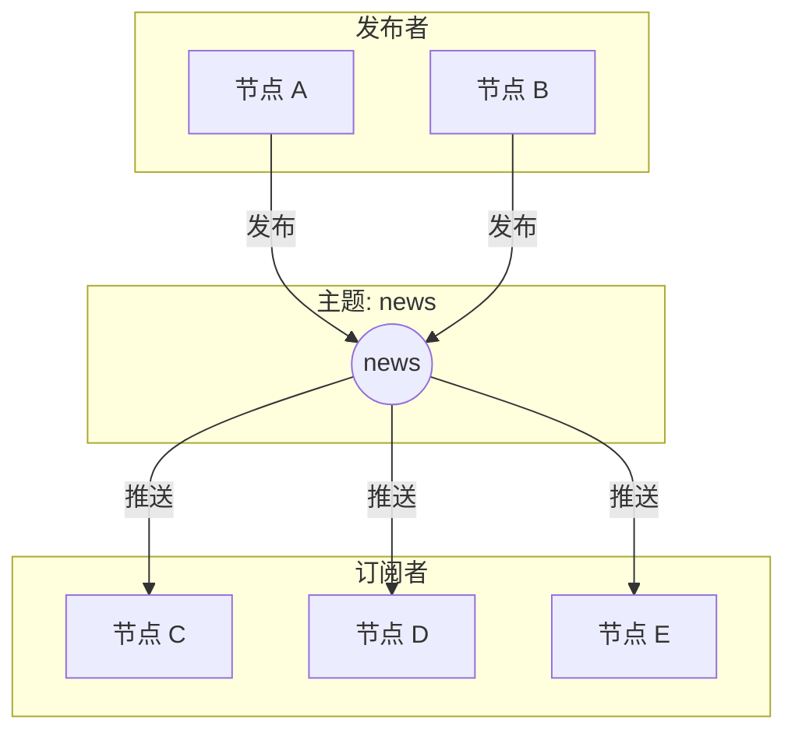
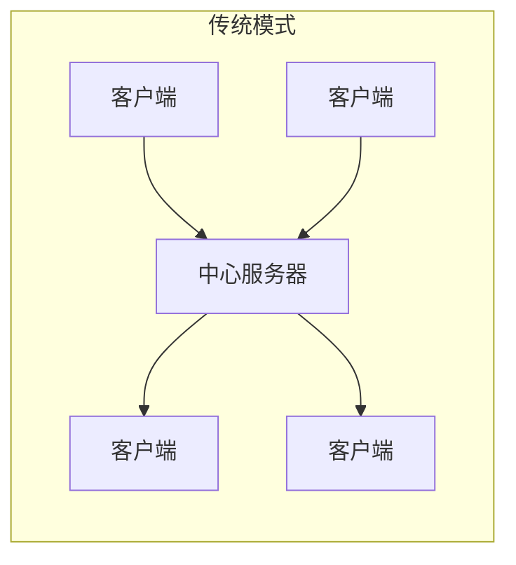
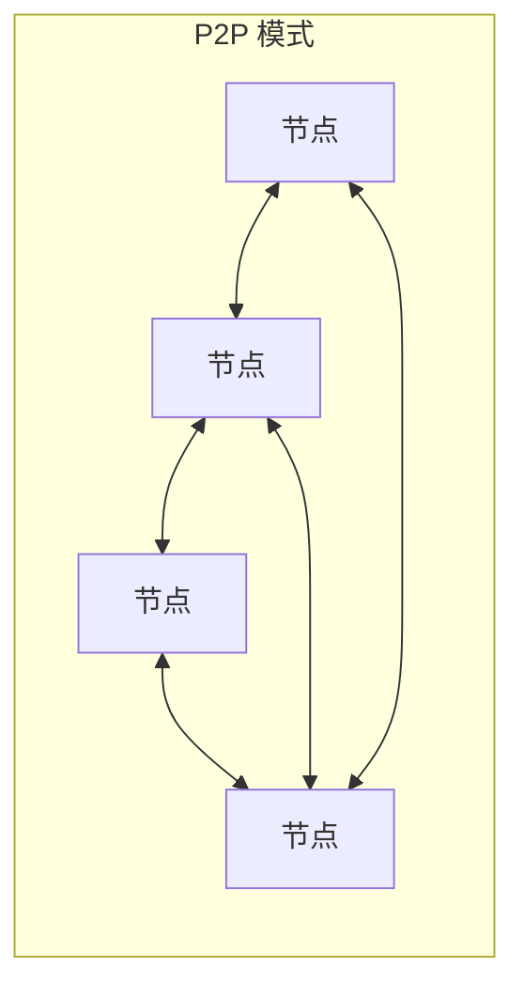
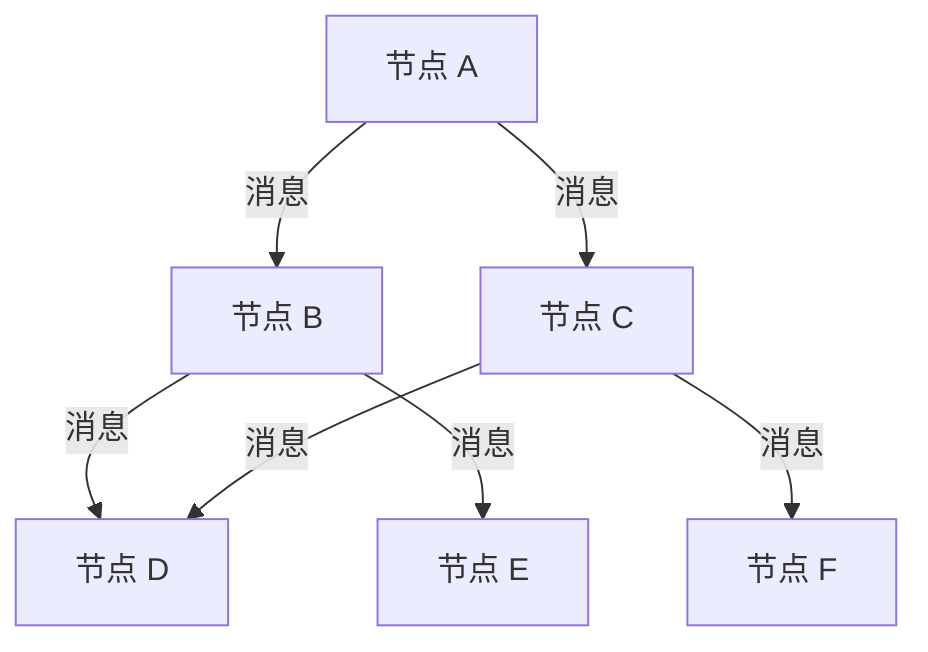
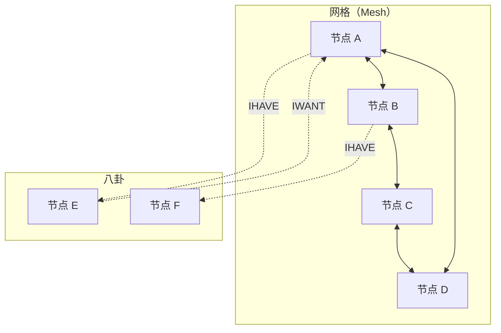

> 一石激起千层浪。
> ——中国谚语

一颗石子投入水中，涟漪向四面八方扩散。在 P2P 网络中，**发布-订阅（Pub/Sub）** 模式正是这样工作的——一条消息发出，所有订阅者都能收到。

## 什么是 Pub/Sub？

Pub/Sub（Publish-Subscribe）是一种消息传递模式，发送者（发布者）不直接发送消息给特定接收者，而是发布到"主题"，所有订阅该主题的节点都会收到消息。



### 核心概念

| 概念 | 说明 |
| --- | --- |
| **Topic（主题）** | 消息的分类标识 |
| **Publisher（发布者）** | 向主题发送消息的节点 |
| **Subscriber（订阅者）** | 订阅主题、接收消息的节点 |
| **Message（消息）** | 发布的数据内容 |

### 与请求-响应的区别

| 特性 | 请求-响应 | Pub/Sub |
| --- | --- | --- |
| 通信方式 | 一对一 | 一对多 |
| 耦合度 | 发送方需知道接收方 | 完全解耦 |
| 消息流向 | 双向 | 单向广播 |
| 适用场景 | RPC、查询 | 事件通知、状态同步 |

## P2P 中的 Pub/Sub 挑战

在传统客户端-服务器架构中，Pub/Sub 很简单——有个中心服务器转发消息。但在 P2P 网络中：





P2P Pub/Sub 面临的挑战：

1. **无中心**：没有服务器转发消息
2. **动态拓扑**：节点随时加入/离开
3. **可扩展性**：网络可能有成千上万节点
4. **可靠性**：消息不能丢失
5. **效率**：避免消息重复、减少带宽

## libp2p 的 Pub/Sub 方案

libp2p 提供了多种 Pub/Sub 实现：

| 实现 | 特点 | 适用场景 |
| --- | --- | --- |
| **FloodSub** | 简单泛洪 | 小型网络、测试 |
| **GossipSub** | 八卦协议 | 生产环境、大规模网络 |
| **EpiSub** | 流行病协议 | 实验性 |

### FloodSub：简单泛洪

最简单的实现——收到消息后转发给所有已知节点。



问题：

- 消息重复严重
- 带宽浪费
- 不适合大规模网络

### GossipSub：智能八卦

GossipSub 是 libp2p 推荐的 Pub/Sub 实现，通过"八卦"策略优化消息传播。



核心思想：

1. **网格（Mesh）**：每个主题维护一个小型全连接网络
2. **八卦（Gossip）**：向网格外节点发送"我有消息"的通知
3. **按需拉取**：收到通知的节点可以主动拉取消息

## 基本使用

### 创建 GossipSub Behaviour

```rust
use libp2p::gossipsub::{self, IdentTopic, MessageAuthenticity};
use std::time::Duration;

// 消息 ID 生成函数
let message_id_fn = |message: &gossipsub::Message| {
    // 使用消息内容的哈希作为 ID
    let mut hasher = std::collections::hash_map::DefaultHasher::new();
    std::hash::Hash::hash(&message.data, &mut hasher);
    gossipsub::MessageId::from(std::hash::Hasher::finish(&hasher).to_be_bytes().to_vec())
};

// 配置
let config = gossipsub::ConfigBuilder::default()
    .heartbeat_interval(Duration::from_secs(1))  // 心跳间隔
    .validation_mode(gossipsub::ValidationMode::Strict)  // 严格验证
    .message_id_fn(message_id_fn)  // 消息 ID 函数
    .build()
    .expect("Valid config");

// 创建 Behaviour
let gossipsub = gossipsub::Behaviour::new(
    MessageAuthenticity::Signed(keypair.clone()),  // 消息签名
    config,
)?;
```

### 订阅主题

```rust
use libp2p::gossipsub::IdentTopic;

// 创建主题
let topic = IdentTopic::new("my-app/chat");

// 订阅
swarm.behaviour_mut().gossipsub.subscribe(&topic)?;

// 取消订阅
swarm.behaviour_mut().gossipsub.unsubscribe(&topic)?;
```

### 发布消息

```rust
let topic = IdentTopic::new("my-app/chat");
let message = b"Hello, P2P world!";

swarm.behaviour_mut()
    .gossipsub
    .publish(topic, message.to_vec())?;
```

### 处理事件

```rust
use libp2p::gossipsub;

loop {
    match swarm.select_next_some().await {
        SwarmEvent::Behaviour(MyBehaviourEvent::Gossipsub(event)) => {
            match event {
                // 收到消息
                gossipsub::Event::Message {
                    propagation_source,
                    message_id,
                    message,
                } => {
                    println!("Received message from {propagation_source}:");
                    println!("  Topic: {}", message.topic);
                    println!("  Data: {:?}", String::from_utf8_lossy(&message.data));
                }

                // 订阅事件
                gossipsub::Event::Subscribed { peer_id, topic } => {
                    println!("{peer_id} subscribed to {topic}");
                }

                // 取消订阅事件
                gossipsub::Event::Unsubscribed { peer_id, topic } => {
                    println!("{peer_id} unsubscribed from {topic}");
                }

                // 八卦元数据
                gossipsub::Event::GossipsubNotSupported { peer_id } => {
                    println!("{peer_id} doesn't support GossipSub");
                }
            }
        }
        _ => {}
    }
}
```

## 完整示例：简易聊天室

```rust
use libp2p::{
    gossipsub::{self, IdentTopic, MessageAuthenticity},
    identity::Keypair,
    mdns,
    swarm::{NetworkBehaviour, SwarmEvent},
    noise, tcp, yamux, SwarmBuilder,
};
use std::time::Duration;
use futures::StreamExt;
use tokio::io::{self, AsyncBufReadExt};

#[derive(NetworkBehaviour)]
struct ChatBehaviour {
    gossipsub: gossipsub::Behaviour,
    mdns: mdns::tokio::Behaviour,
}

#[tokio::main]
async fn main() -> anyhow::Result<()> {
    let keypair = Keypair::generate_ed25519();
    let local_peer_id = keypair.public().to_peer_id();
    println!("PeerId: {local_peer_id}");

    // 消息 ID 函数
    let message_id_fn = |message: &gossipsub::Message| {
        use std::hash::{Hash, Hasher};
        let mut hasher = std::collections::hash_map::DefaultHasher::new();
        message.data.hash(&mut hasher);
        message.source.hash(&mut hasher);
        gossipsub::MessageId::from(hasher.finish().to_be_bytes().to_vec())
    };

    let gossipsub_config = gossipsub::ConfigBuilder::default()
        .heartbeat_interval(Duration::from_secs(1))
        .validation_mode(gossipsub::ValidationMode::Strict)
        .message_id_fn(message_id_fn)
        .build()
        .expect("Valid config");

    let mut swarm = SwarmBuilder::with_existing_identity(keypair.clone())
        .with_tokio()
        .with_tcp(
            tcp::Config::default(),
            noise::Config::new,
            yamux::Config::default,
        )?
        .with_behaviour(|key| {
            let gossipsub = gossipsub::Behaviour::new(
                MessageAuthenticity::Signed(key.clone()),
                gossipsub_config,
            )?;

            let mdns = mdns::tokio::Behaviour::new(
                mdns::Config::default(),
                key.public().to_peer_id(),
            )?;

            Ok(ChatBehaviour { gossipsub, mdns })
        })?
        .with_swarm_config(|cfg| {
            cfg.with_idle_connection_timeout(Duration::from_secs(60))
        })
        .build();

    // 订阅聊天主题
    let topic = IdentTopic::new("chat/room");
    swarm.behaviour_mut().gossipsub.subscribe(&topic)?;

    swarm.listen_on("/ip4/0.0.0.0/tcp/0".parse()?)?;

    // 异步读取标准输入
    let mut stdin = io::BufReader::new(io::stdin()).lines();

    println!("Chat room started. Type messages and press Enter to send.");
    println!("---");

    loop {
        tokio::select! {
            // 处理用户输入
            line = stdin.next_line() => {
                if let Ok(Some(line)) = line {
                    if !line.is_empty() {
                        // 发布消息
                        if let Err(e) = swarm
                            .behaviour_mut()
                            .gossipsub
                            .publish(topic.clone(), line.as_bytes())
                        {
                            println!("Publish error: {e:?}");
                        }
                    }
                }
            }

            // 处理网络事件
            event = swarm.select_next_some() => {
                match event {
                    SwarmEvent::NewListenAddr { address, .. } => {
                        println!("Listening on {address}");
                    }

                    SwarmEvent::Behaviour(ChatBehaviourEvent::Mdns(event)) => {
                        match event {
                            mdns::Event::Discovered(peers) => {
                                for (peer_id, addr) in peers {
                                    swarm.behaviour_mut().gossipsub.add_explicit_peer(&peer_id);
                                    println!("Discovered: {peer_id}");
                                }
                            }
                            mdns::Event::Expired(peers) => {
                                for (peer_id, _) in peers {
                                    swarm.behaviour_mut().gossipsub.remove_explicit_peer(&peer_id);
                                }
                            }
                        }
                    }

                    SwarmEvent::Behaviour(ChatBehaviourEvent::Gossipsub(
                        gossipsub::Event::Message { message, propagation_source, .. }
                    )) => {
                        let msg = String::from_utf8_lossy(&message.data);
                        let peer = message.source.unwrap_or(propagation_source);
                        println!("[{peer}]: {msg}");
                    }

                    _ => {}
                }
            }
        }
    }
}
```

运行多个终端实例，它们会通过 mDNS 自动发现并加入同一个聊天室。

## 主题设计

### 命名规范

```rust
// 好的主题命名
"my-app/v1/chat"
"my-app/v1/notifications"
"my-app/v1/events/user-joined"

// 避免的命名
"chat"           // 太通用
"1"              // 无意义
"/my-app/chat"   // 不要以斜杠开头
```

### 主题层级

```text
my-app/
├── chat/
│   ├── general
│   ├── random
│   └── private/<user-id>
├── events/
│   ├── user-joined
│   └── user-left
└── sync/
    └── state
```

## 小结

本章介绍了 Pub/Sub 消息模型：

- **发布-订阅模式**：一对多的消息传递
- **主题（Topic）**：消息的分类标识
- **P2P 挑战**：无中心、动态拓扑、可扩展性
- **GossipSub**：libp2p 推荐的 Pub/Sub 实现

Pub/Sub 是构建实时应用的基础——聊天室、协作编辑、状态同步都依赖它。

下一章，我们将深入 **GossipSub 协议**——了解它的工作原理和高级配置。
