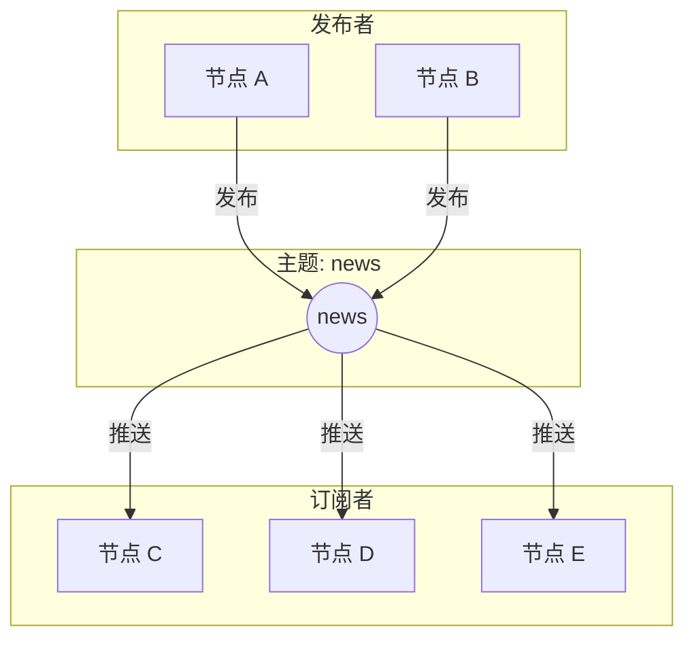
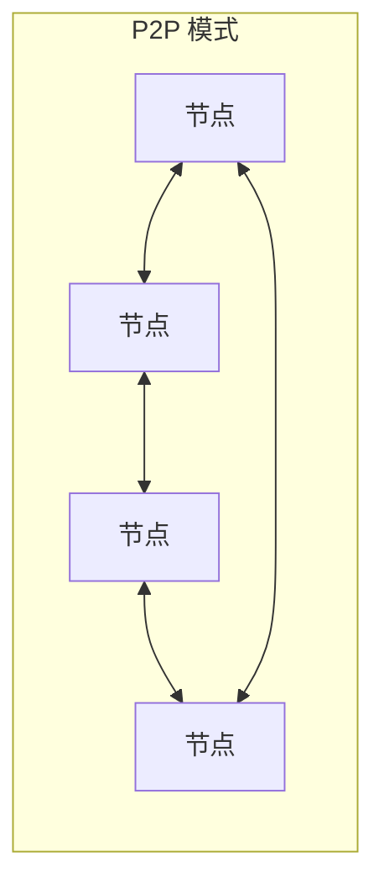
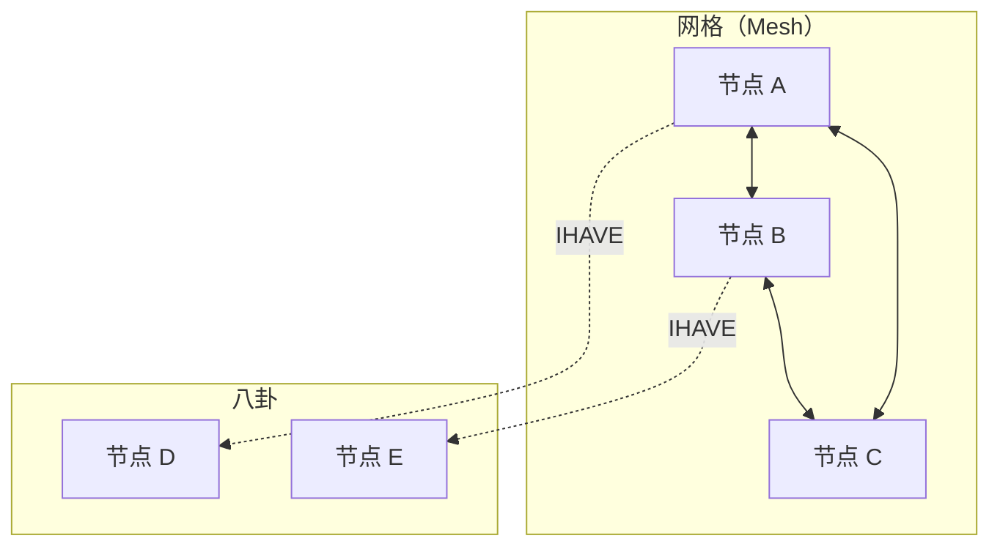

import { Steps, Tabs, TabItem } from '@astrojs/starlight/components';

> 一石激起千层浪。
> ——中国谚语

一颗石子投入水中，涟漪向四面八方扩散。在 P2P 网络中，**发布-订阅（Pub/Sub）** 模式正是这样工作的——一条消息发出，所有订阅者都能收到。

## 什么是 Pub/Sub？

Pub/Sub（Publish-Subscribe）是一种消息传递模式，发送者（发布者）不直接发送消息给特定接收者，而是发布到"主题"，所有订阅该主题的节点都会收到消息。



### 核心概念

| 概念 | 说明 |
|-----|------|
| **Topic（主题）** | 消息的分类标识 |
| **Publisher（发布者）** | 向主题发送消息的节点 |
| **Subscriber（订阅者）** | 订阅主题、接收消息的节点 |
| **Message（消息）** | 发布的数据内容 |

### 与请求-响应的区别

| 特性 | 请求-响应 | Pub/Sub |
|-----|---------|---------|
| 通信方式 | 一对一 | 一对多 |
| 耦合度 | 发送方需知道接收方 | 完全解耦 |
| 消息流向 | 双向 | 单向广播 |
| 适用场景 | RPC、查询 | 事件通知、状态同步 |

## P2P 中的 Pub/Sub 挑战

在传统客户端-服务器架构中，Pub/Sub 很简单——有个中心服务器转发消息。但在 P2P 网络中：



P2P Pub/Sub 面临的挑战：

| 挑战 | 说明 |
|-----|------|
| 无中心 | 没有服务器转发消息 |
| 动态拓扑 | 节点随时加入/离开 |
| 可扩展性 | 网络可能有成千上万节点 |
| 可靠性 | 消息不能丢失 |
| 效率 | 避免消息重复、减少带宽 |

## libp2p 的 Pub/Sub 方案

libp2p 提供了多种 Pub/Sub 实现：

| 实现 | 特点 | 适用场景 |
|-----|------|---------|
| **FloodSub** | 简单泛洪 | 小型网络、测试 |
| **GossipSub** | 八卦协议 | 生产环境、大规模网络 |

**GossipSub** 是推荐的实现，通过"八卦"策略优化消息传播：



核心思想：
1. **网格（Mesh）**：每个主题维护一个小型全连接网络
2. **八卦（Gossip）**：向网格外节点发送"我有消息"的通知
3. **按需拉取**：收到通知的节点可以主动拉取消息

## 动手实践

:::tip[配套工具]
本教程配套的桌面应用提供了可视化的 Pub/Sub 功能。你可以用它订阅主题、发布消息——直观体验 P2P 广播。
:::

让我们实现一个简单的 P2P 聊天室。

<Steps>

1. **添加依赖**

   ```toml ins="gossipsub"
   [dependencies]
   libp2p = { version = "0.56", features = ["tcp", "noise", "yamux", "gossipsub", "mdns", "macros", "tokio"] }
   tokio = { version = "1", features = ["full"] }
   futures = "0.3"
   ```

2. **定义组合行为**

   ```rust ins={4-5}
   #[derive(NetworkBehaviour)]
   struct ChatBehaviour {
       gossipsub: gossipsub::Behaviour,
       mdns: mdns::tokio::Behaviour,
   }
   ```

3. **配置 GossipSub**

   ```rust ins={3-12}
   .with_behaviour(|key| {
       let local_peer_id = key.public().to_peer_id();

       // 消息 ID 函数（用于去重）
       let message_id_fn = |message: &gossipsub::Message| {
           use std::hash::{Hash, Hasher};
           let mut hasher = std::collections::hash_map::DefaultHasher::new();
           message.data.hash(&mut hasher);
           message.source.hash(&mut hasher);
           gossipsub::MessageId::from(hasher.finish().to_be_bytes().to_vec())
       };

       let config = gossipsub::ConfigBuilder::default()
           .heartbeat_interval(Duration::from_secs(1))
           .validation_mode(gossipsub::ValidationMode::Strict)
           .message_id_fn(message_id_fn)
           .build()?;

       let gossipsub = gossipsub::Behaviour::new(
           gossipsub::MessageAuthenticity::Signed(key.clone()),
           config,
       )?;

       let mdns = mdns::tokio::Behaviour::new(mdns::Config::default(), local_peer_id)?;

       Ok(ChatBehaviour { gossipsub, mdns })
   })?
   ```

4. **订阅主题**

   ```rust ins={3-4}
   // 创建并订阅主题
   let topic = gossipsub::IdentTopic::new("chat/room");
   swarm.behaviour_mut().gossipsub.subscribe(&topic)?;
   ```

5. **发布消息**

   ```rust ins={3-5}
   // 发布消息到主题
   let message = "Hello, P2P world!";
   swarm.behaviour_mut()
       .gossipsub
       .publish(topic.clone(), message.as_bytes())?;
   ```

6. **处理接收的消息**

   ```rust ins={3-8}
   gossipsub::Event::Message { message, propagation_source, .. } => {
       let msg = String::from_utf8_lossy(&message.data);
       let peer = message.source.unwrap_or(propagation_source);
       println!("[{peer}]: {msg}");
   }
   ```

</Steps>

## 完整代码

```rust
use anyhow::Result;
use libp2p::{
    futures::StreamExt, gossipsub, mdns, noise, swarm::NetworkBehaviour,
    swarm::SwarmEvent, tcp, yamux, SwarmBuilder,
};
use std::time::Duration;
use tokio::io::{self, AsyncBufReadExt};

#[derive(NetworkBehaviour)]
struct ChatBehaviour {
    gossipsub: gossipsub::Behaviour,
    mdns: mdns::tokio::Behaviour,
}

#[tokio::main]
async fn main() -> Result<()> {
    let keypair = libp2p::identity::Keypair::generate_ed25519();
    let local_peer_id = keypair.public().to_peer_id();
    println!("PeerId: {local_peer_id}");

    // 消息 ID 函数
    let message_id_fn = |message: &gossipsub::Message| {
        use std::hash::{Hash, Hasher};
        let mut hasher = std::collections::hash_map::DefaultHasher::new();
        message.data.hash(&mut hasher);
        message.source.hash(&mut hasher);
        gossipsub::MessageId::from(hasher.finish().to_be_bytes().to_vec())
    };

    let gossipsub_config = gossipsub::ConfigBuilder::default()
        .heartbeat_interval(Duration::from_secs(1))
        .validation_mode(gossipsub::ValidationMode::Strict)
        .message_id_fn(message_id_fn)
        .build()?;

    let mut swarm = SwarmBuilder::with_existing_identity(keypair.clone())
        .with_tokio()
        .with_tcp(
            tcp::Config::default(),
            noise::Config::new,
            yamux::Config::default,
        )?
        .with_behaviour(|key| {
            let local_peer_id = key.public().to_peer_id();
            Ok(ChatBehaviour {
                gossipsub: gossipsub::Behaviour::new(
                    gossipsub::MessageAuthenticity::Signed(key.clone()),
                    gossipsub_config,
                )?,
                mdns: mdns::tokio::Behaviour::new(mdns::Config::default(), local_peer_id)?,
            })
        })?
        .with_swarm_config(|cfg| cfg.with_idle_connection_timeout(Duration::from_secs(60)))
        .build();

    // 订阅聊天主题
    let topic = gossipsub::IdentTopic::new("chat/room");
    swarm.behaviour_mut().gossipsub.subscribe(&topic)?;

    swarm.listen_on("/ip4/0.0.0.0/tcp/0".parse()?)?;

    // 异步读取标准输入
    let mut stdin = io::BufReader::new(io::stdin()).lines();

    println!("Chat room started. Type messages and press Enter.\n---");

    loop {
        tokio::select! {
            // 处理用户输入
            line = stdin.next_line() => {
                if let Ok(Some(line)) = line {
                    if !line.is_empty() {
                        if let Err(e) = swarm
                            .behaviour_mut()
                            .gossipsub
                            .publish(topic.clone(), line.as_bytes())
                        {
                            println!("Publish error: {e:?}");
                        }
                    }
                }
            }

            // 处理网络事件
            event = swarm.select_next_some() => {
                match event {
                    SwarmEvent::NewListenAddr { address, .. } => {
                        println!("Listening on {address}");
                    }
                    SwarmEvent::Behaviour(ChatBehaviourEvent::Mdns(event)) => {
                        match event {
                            mdns::Event::Discovered(peers) => {
                                for (peer_id, _) in peers {
                                    swarm.behaviour_mut().gossipsub.add_explicit_peer(&peer_id);
                                    println!("+ Discovered: {peer_id}");
                                }
                            }
                            mdns::Event::Expired(peers) => {
                                for (peer_id, _) in peers {
                                    swarm.behaviour_mut().gossipsub.remove_explicit_peer(&peer_id);
                                }
                            }
                        }
                    }
                    SwarmEvent::Behaviour(ChatBehaviourEvent::Gossipsub(
                        gossipsub::Event::Message { message, propagation_source, .. }
                    )) => {
                        let msg = String::from_utf8_lossy(&message.data);
                        let peer = message.source.unwrap_or(propagation_source);
                        println!("[{}]: {msg}", &peer.to_string()[..8]);
                    }
                    _ => {}
                }
            }
        }
    }
}
```

## 运行测试

<Tabs>
<TabItem label="终端 1">

```bash
cargo run
```

输出：

```text
PeerId: 12D3KooWAbCd...
Listening on /ip4/127.0.0.1/tcp/54321
Chat room started. Type messages and press Enter.
---
```

</TabItem>
<TabItem label="终端 2">

```bash
cargo run
```

输出：

```text
PeerId: 12D3KooWXyZw...
Listening on /ip4/127.0.0.1/tcp/54322
Chat room started. Type messages and press Enter.
---
+ Discovered: 12D3KooWAbCd...
```

</TabItem>
</Tabs>

现在在任一终端输入消息，另一个终端会收到！

## 主题设计

### 命名规范

```rust
// 好的主题命名
"my-app/v1/chat"
"my-app/v1/notifications"
"my-app/v1/events/user-joined"

// 避免的命名
"chat"           // 太通用
"1"              // 无意义
"/my-app/chat"   // 不要以斜杠开头
```

### 主题层级

```text
my-app/
├── chat/
│   ├── general
│   ├── random
│   └── private/<user-id>
├── events/
│   ├── user-joined
│   └── user-left
└── sync/
    └── state
```

## GossipSub 事件

| 事件 | 说明 |
|-----|------|
| `Message` | 收到消息 |
| `Subscribed` | 节点订阅了主题 |
| `Unsubscribed` | 节点取消订阅 |
| `GossipsubNotSupported` | 对端不支持 GossipSub |

## 小结

本章介绍了 Pub/Sub 消息模型：

- **发布-订阅模式**：一对多的消息传递
- **主题（Topic）**：消息的分类标识
- **GossipSub**：libp2p 推荐的 Pub/Sub 实现
- **自动发现**：配合 mDNS 实现局域网自动组网

Pub/Sub 是构建实时应用的基础——聊天室、协作编辑、状态同步都依赖它。

下一章，我们将深入 **GossipSub 协议**——了解它的工作原理和高级配置。
