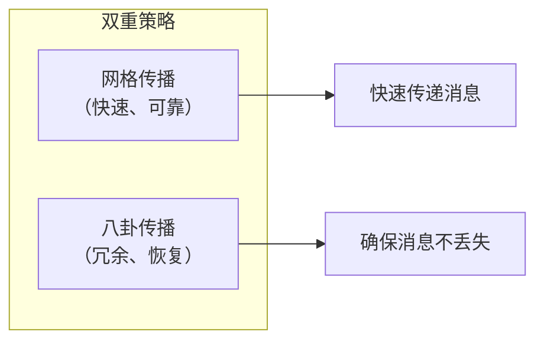
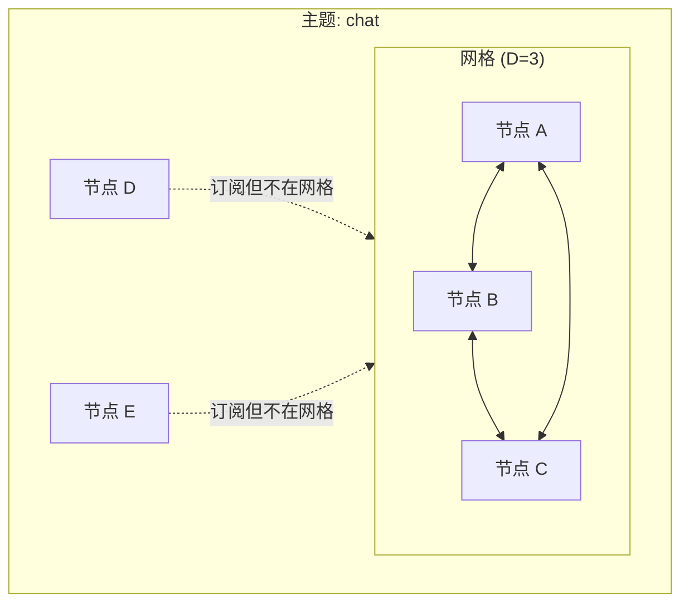
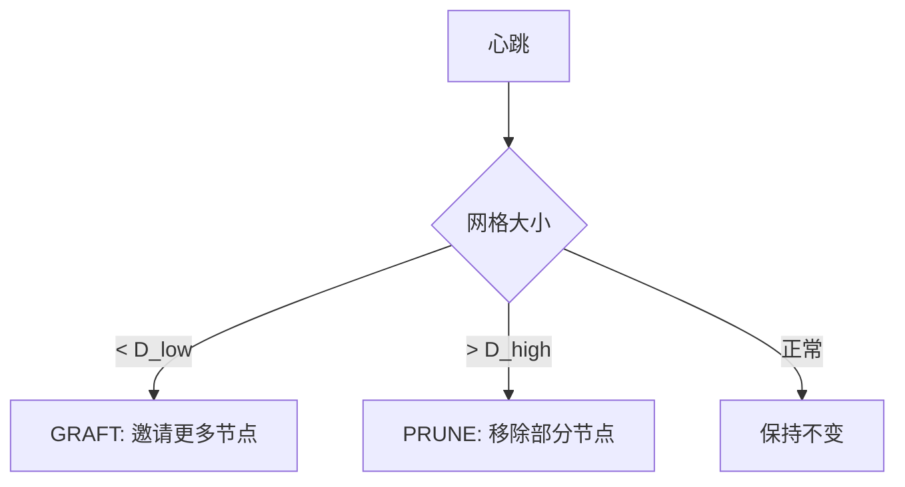
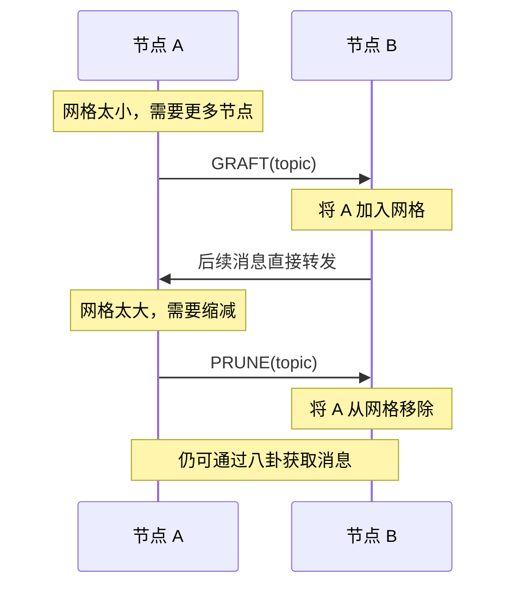
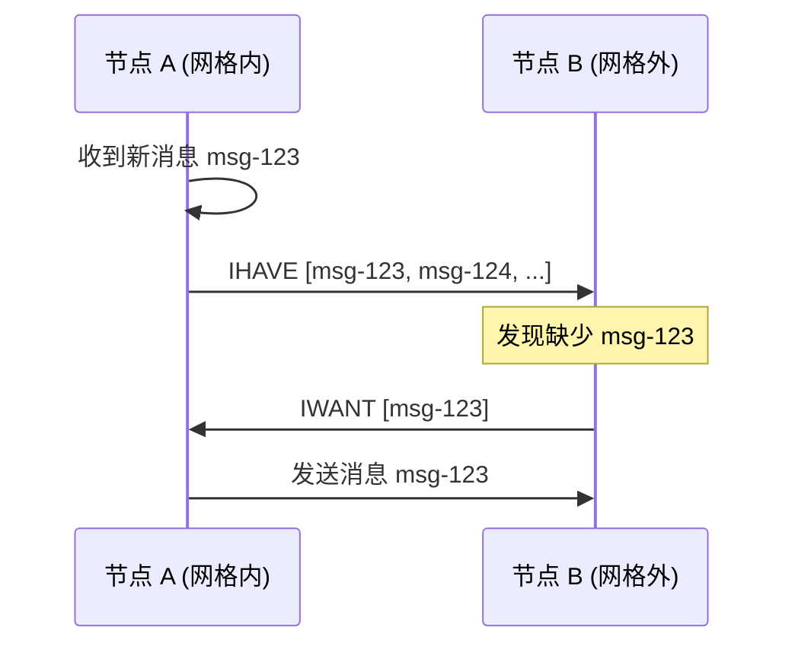
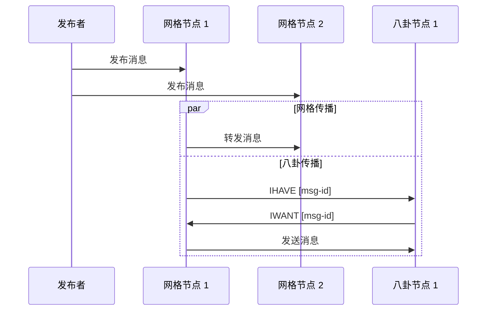
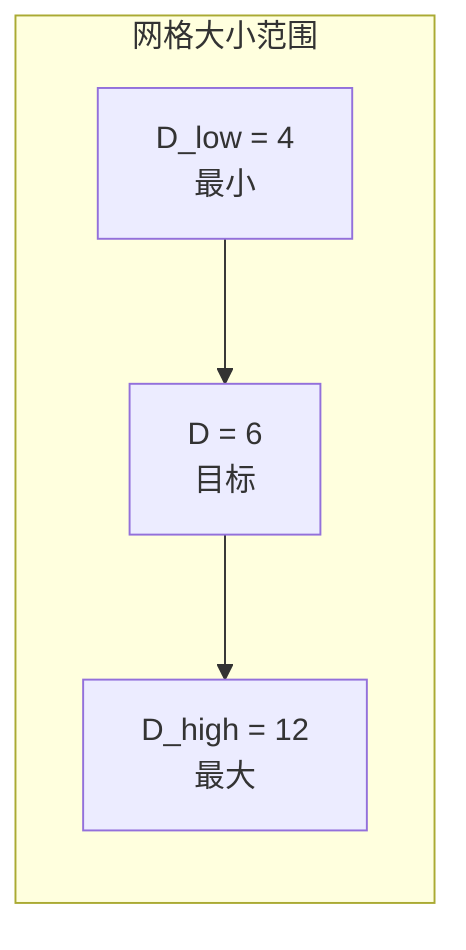

> 好事不出门，坏事传千里。
> ——中国谚语

消息像八卦一样传播——这就是 GossipSub 的核心思想。通过智能的"八卦"策略，消息能够高效、可靠地传遍整个网络。

## GossipSub 概览

GossipSub 是 libp2p 中最成熟的 Pub/Sub 实现，由 Protocol Labs 设计。它结合了两种策略：



### 核心概念

| 概念 | 说明 |
| --- | --- |
| **Mesh（网格）** | 每个主题的全连接子网 |
| **Gossip（八卦）** | 向网格外节点发送消息摘要 |
| **GRAFT** | 请求加入网格 |
| **PRUNE** | 请求离开网格 |
| **IHAVE** | "我有这些消息" |
| **IWANT** | "我想要这些消息" |

## 网格（Mesh）机制

每个主题维护一个**网格**——一组全连接的节点。



### 网格参数

| 参数 | 说明 | 默认值 |
| --- | --- | --- |
| **D** | 网格目标大小 | 6 |
| **D_low** | 网格最小大小 | 4 |
| **D_high** | 网格最大大小 | 12 |
| **D_lazy** | 八卦目标数量 | 6 |

### 网格维护

GossipSub 通过心跳定期维护网格：



### GRAFT 和 PRUNE



## 八卦（Gossip）机制

网格外的节点通过八卦获取消息。



### 消息 ID

消息 ID 用于去重和八卦：

```rust
// 默认：基于内容哈希
let message_id_fn = |message: &gossipsub::Message| {
    use std::hash::{Hash, Hasher};
    let mut hasher = std::collections::hash_map::DefaultHasher::new();
    message.data.hash(&mut hasher);
    gossipsub::MessageId::from(hasher.finish().to_be_bytes().to_vec())
};

// 包含源节点（允许相同内容的不同消息）
let message_id_fn = |message: &gossipsub::Message| {
    use std::hash::{Hash, Hasher};
    let mut hasher = std::collections::hash_map::DefaultHasher::new();
    message.data.hash(&mut hasher);
    message.source.hash(&mut hasher);  // 加入源节点
    message.sequence_number.hash(&mut hasher);  // 加入序号
    gossipsub::MessageId::from(hasher.finish().to_be_bytes().to_vec())
};
```

## 消息传播流程



## 配置详解

### 完整配置示例

```rust
use libp2p::gossipsub::{self, ConfigBuilder, ValidationMode, MessageAuthenticity};
use std::time::Duration;

let config = ConfigBuilder::default()
    // 网格参数
    .mesh_n(6)                    // D: 网格目标大小
    .mesh_n_low(4)                // D_low: 最小大小
    .mesh_n_high(12)              // D_high: 最大大小
    .mesh_outbound_min(2)         // 最少出站连接

    // 八卦参数
    .gossip_lazy(6)               // D_lazy: 八卦目标数
    .gossip_factor(0.25)          // 八卦比例

    // 心跳
    .heartbeat_interval(Duration::from_secs(1))
    .heartbeat_initial_delay(Duration::from_secs(5))

    // 消息
    .max_transmit_size(65536)     // 最大消息大小
    .history_length(5)            // 历史消息保留轮数
    .history_gossip(3)            // 八卦历史轮数

    // 验证
    .validation_mode(ValidationMode::Strict)

    // 消息 ID
    .message_id_fn(|msg: &gossipsub::Message| {
        use std::hash::{Hash, Hasher};
        let mut h = std::collections::hash_map::DefaultHasher::new();
        msg.data.hash(&mut h);
        gossipsub::MessageId::from(h.finish().to_be_bytes().to_vec())
    })

    // 订阅过滤
    .max_subscriptions_per_message(10)

    .build()
    .expect("Valid config");

let gossipsub = gossipsub::Behaviour::new(
    MessageAuthenticity::Signed(keypair),
    config,
)?;
```

### 重要参数说明

#### 网格大小参数



- 太小：消息传播慢，容易断裂
- 太大：带宽浪费，消息重复

#### 心跳间隔

```rust
.heartbeat_interval(Duration::from_secs(1))
```

- 控制网格维护频率
- 影响节点加入/离开的响应速度
- 太快浪费带宽，太慢响应迟钝

#### 消息大小限制

```rust
.max_transmit_size(65536)  // 64KB
```

- 限制单条消息的最大大小
- 超过限制的消息会被拒绝
- 大文件应该分片或使用其他协议

## 消息认证

GossipSub 支持多种认证模式：

```rust
use libp2p::gossipsub::MessageAuthenticity;

// 签名认证（推荐）
let auth = MessageAuthenticity::Signed(keypair);

// 作者认证（仅包含 PeerId，不签名）
let auth = MessageAuthenticity::Author(local_peer_id);

// 随机作者（测试用）
let auth = MessageAuthenticity::RandomAuthor;

// 匿名（无作者信息）
let auth = MessageAuthenticity::Anonymous;
```

### 签名验证

```rust
// 配置严格验证
let config = ConfigBuilder::default()
    .validation_mode(ValidationMode::Strict)  // 拒绝无效签名
    .build()?;

// 或宽松验证
let config = ConfigBuilder::default()
    .validation_mode(ValidationMode::Permissive)  // 接受无签名消息
    .build()?;
```

## 对等节点评分（Peer Scoring）

GossipSub v1.1 引入了对等节点评分系统，惩罚恶意节点。

```rust
use libp2p::gossipsub::{PeerScoreParams, PeerScoreThresholds, TopicScoreParams};

// 主题评分参数
let topic_params = TopicScoreParams {
    topic_weight: 1.0,
    time_in_mesh_weight: 0.01,
    time_in_mesh_quantum: Duration::from_secs(1),
    time_in_mesh_cap: 100.0,
    first_message_deliveries_weight: 1.0,
    first_message_deliveries_cap: 50.0,
    first_message_deliveries_decay: 0.5,
    mesh_message_deliveries_weight: -1.0,
    mesh_message_deliveries_decay: 0.5,
    mesh_message_deliveries_threshold: 10.0,
    mesh_message_deliveries_cap: 100.0,
    mesh_message_deliveries_activation: Duration::from_secs(30),
    mesh_message_deliveries_window: Duration::from_secs(5),
    mesh_failure_penalty_weight: -1.0,
    mesh_failure_penalty_decay: 0.5,
    invalid_message_deliveries_weight: -100.0,
    invalid_message_deliveries_decay: 0.3,
};

// 全局评分参数
let params = PeerScoreParams {
    topics: std::collections::HashMap::from([
        (topic.hash(), topic_params),
    ]),
    app_specific_weight: 1.0,
    ip_colocation_factor_weight: -10.0,
    ip_colocation_factor_threshold: 3.0,
    behaviour_penalty_weight: -1.0,
    behaviour_penalty_decay: 0.9,
    decay_interval: Duration::from_secs(1),
    decay_to_zero: 0.01,
    retain_score: Duration::from_secs(3600),
    ..Default::default()
};

// 评分阈值
let thresholds = PeerScoreThresholds {
    gossip_threshold: -100.0,       // 低于此值不发送八卦
    publish_threshold: -1000.0,     // 低于此值不接受消息
    graylist_threshold: -10000.0,   // 低于此值完全忽略
    accept_px_threshold: 100.0,     // 高于此值接受 PX
    opportunistic_graft_threshold: 5.0,
};

// 应用评分
let gossipsub = gossipsub::Behaviour::new_with_scoring(
    MessageAuthenticity::Signed(keypair),
    config,
    params,
    thresholds,
)?;
```

### 评分因素

| 因素 | 影响 |
| --- | --- |
| **网格时间** | 在网格中时间越长，分数越高 |
| **消息传递** | 及时传递消息加分 |
| **无效消息** | 发送无效消息严重扣分 |
| **IP 聚集** | 同一 IP 多节点扣分（防 Sybil） |

## 显式对等节点

可以手动管理网格成员：

```rust
// 添加显式对等节点（始终在网格中）
swarm.behaviour_mut().gossipsub.add_explicit_peer(&peer_id);

// 移除显式对等节点
swarm.behaviour_mut().gossipsub.remove_explicit_peer(&peer_id);

// 黑名单节点
swarm.behaviour_mut().gossipsub.blacklist_peer(&peer_id);
swarm.behaviour_mut().gossipsub.remove_blacklisted_peer(&peer_id);
```

## 调试与监控

### 启用日志

```rust
std::env::set_var("RUST_LOG", "libp2p_gossipsub=debug");
tracing_subscriber::fmt::init();
```

### 获取网格状态

```rust
// 获取主题的网格成员
let mesh_peers = swarm.behaviour().gossipsub.mesh_peers(&topic.hash());
println!("Mesh peers for {}: {:?}", topic, mesh_peers.collect::<Vec<_>>());

// 获取所有主题
let topics = swarm.behaviour().gossipsub.topics();
for topic in topics {
    println!("Topic: {topic}");
}

// 获取所有对等节点
let peers = swarm.behaviour().gossipsub.all_peers();
for (peer, topics) in peers {
    println!("Peer {peer}: {:?}", topics.collect::<Vec<_>>());
}
```

## 完整示例：带评分的 GossipSub

```rust
use libp2p::{
    gossipsub::{self, IdentTopic, MessageAuthenticity, ValidationMode},
    identity::Keypair,
    swarm::{NetworkBehaviour, SwarmEvent},
    noise, tcp, yamux, SwarmBuilder,
};
use std::time::Duration;
use futures::StreamExt;

#[derive(NetworkBehaviour)]
struct MyBehaviour {
    gossipsub: gossipsub::Behaviour,
}

#[tokio::main]
async fn main() -> anyhow::Result<()> {
    tracing_subscriber::fmt::init();

    let keypair = Keypair::generate_ed25519();
    let local_peer_id = keypair.public().to_peer_id();
    println!("PeerId: {local_peer_id}");

    // 消息 ID 函数
    let message_id_fn = |message: &gossipsub::Message| {
        use std::hash::{Hash, Hasher};
        let mut hasher = std::collections::hash_map::DefaultHasher::new();
        message.data.hash(&mut hasher);
        message.sequence_number.hash(&mut hasher);
        gossipsub::MessageId::from(hasher.finish().to_be_bytes().to_vec())
    };

    // 配置
    let config = gossipsub::ConfigBuilder::default()
        .heartbeat_interval(Duration::from_secs(1))
        .validation_mode(ValidationMode::Strict)
        .message_id_fn(message_id_fn)
        .mesh_n(3)
        .mesh_n_low(2)
        .mesh_n_high(6)
        .gossip_lazy(3)
        .build()
        .expect("Valid config");

    let mut swarm = SwarmBuilder::with_existing_identity(keypair.clone())
        .with_tokio()
        .with_tcp(
            tcp::Config::default(),
            noise::Config::new,
            yamux::Config::default,
        )?
        .with_behaviour(|key| {
            let gossipsub = gossipsub::Behaviour::new(
                MessageAuthenticity::Signed(key.clone()),
                config,
            )?;
            Ok(MyBehaviour { gossipsub })
        })?
        .with_swarm_config(|cfg| {
            cfg.with_idle_connection_timeout(Duration::from_secs(60))
        })
        .build();

    // 订阅主题
    let topic = IdentTopic::new("example/gossipsub");
    swarm.behaviour_mut().gossipsub.subscribe(&topic)?;

    swarm.listen_on("/ip4/0.0.0.0/tcp/0".parse()?)?;

    // 如果有远程地址，连接
    if let Some(addr) = std::env::args().nth(1) {
        swarm.dial(addr.parse::<libp2p::Multiaddr>()?)?;
    }

    let mut publish_interval = tokio::time::interval(Duration::from_secs(5));

    loop {
        tokio::select! {
            _ = publish_interval.tick() => {
                // 定期发布消息
                let msg = format!("Hello from {} at {:?}", local_peer_id, std::time::Instant::now());
                match swarm.behaviour_mut().gossipsub.publish(topic.clone(), msg.as_bytes()) {
                    Ok(id) => println!("Published: {id}"),
                    Err(e) => println!("Publish error: {e:?}"),
                }
            }

            event = swarm.select_next_some() => {
                match event {
                    SwarmEvent::NewListenAddr { address, .. } => {
                        println!("Listening on {address}/p2p/{local_peer_id}");
                    }
                    SwarmEvent::Behaviour(MyBehaviourEvent::Gossipsub(event)) => {
                        match event {
                            gossipsub::Event::Message { message, .. } => {
                                let msg = String::from_utf8_lossy(&message.data);
                                println!("Received: {msg}");
                            }
                            gossipsub::Event::Subscribed { peer_id, topic } => {
                                println!("{peer_id} subscribed to {topic}");
                            }
                            _ => {}
                        }
                    }
                    _ => {}
                }
            }
        }
    }
}
```

## 小结

本章深入介绍了 GossipSub 协议：

- **双重策略**：网格传播 + 八卦补充
- **网格维护**：GRAFT/PRUNE 动态调整
- **消息 ID**：去重和八卦的基础
- **对等节点评分**：惩罚恶意节点
- **配置优化**：根据场景调整参数

GossipSub 是生产环境中最可靠的 P2P Pub/Sub 实现。理解它的工作原理，能帮助你构建健壮的分布式应用。

下一章，我们将学习 **消息验证**——如何确保消息的有效性和安全性。
