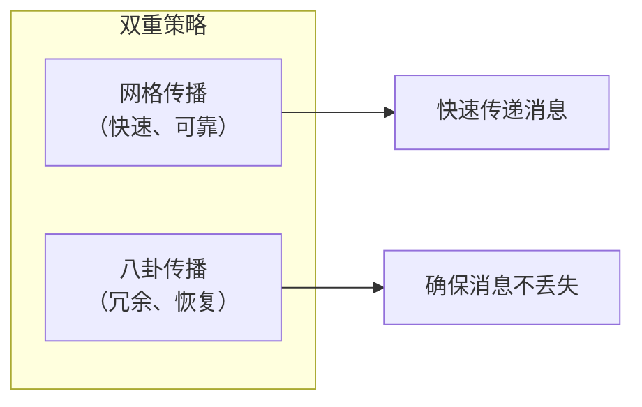
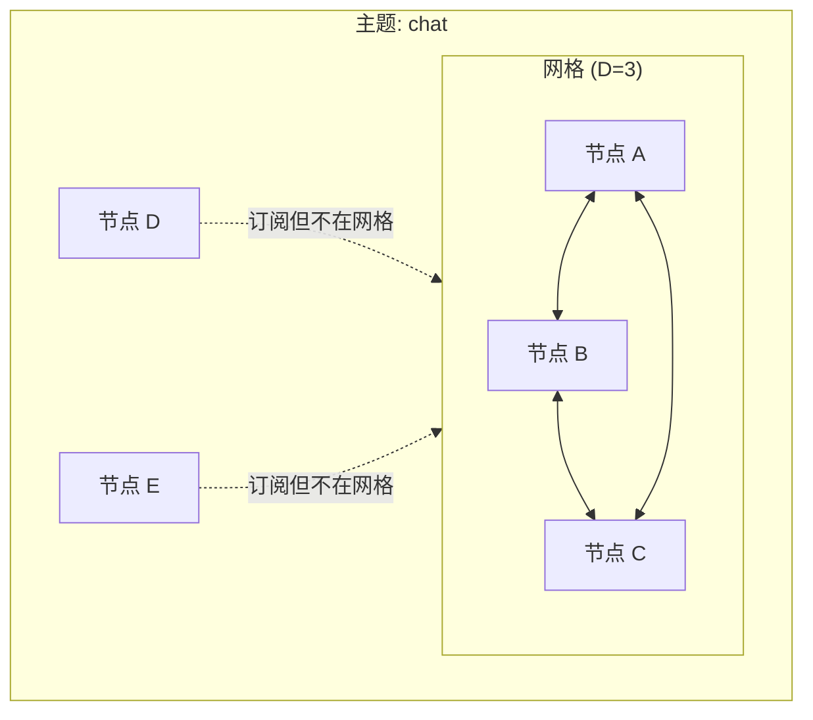
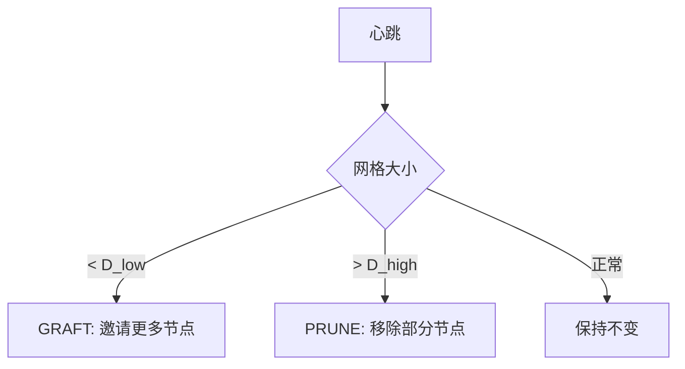
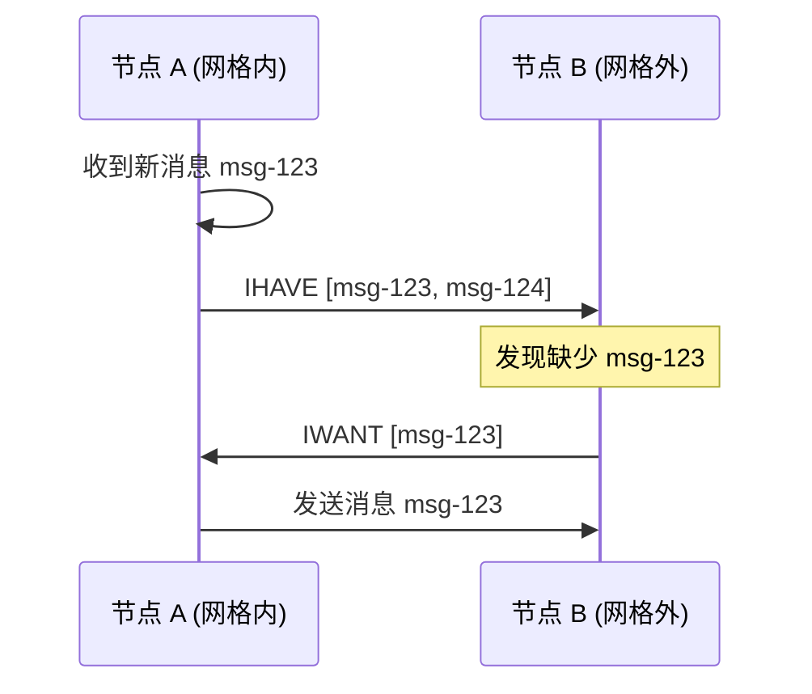
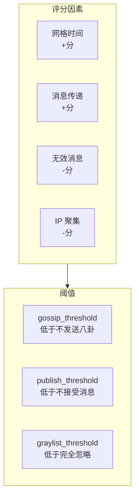

import { Steps, Tabs, TabItem } from '@astrojs/starlight/components';

> 好事不出门，坏事传千里。
> ——中国谚语

消息像八卦一样传播——这就是 GossipSub 的核心思想。通过智能的"八卦"策略，消息能够高效、可靠地传遍整个网络。

## GossipSub 概览

GossipSub 是 libp2p 中最成熟的 Pub/Sub 实现，结合了两种策略：



### 核心概念

| 概念 | 说明 |
|-----|------|
| **Mesh（网格）** | 每个主题的全连接子网 |
| **Gossip（八卦）** | 向网格外节点发送消息摘要 |
| **GRAFT** | 请求加入网格 |
| **PRUNE** | 请求离开网格 |
| **IHAVE** | "我有这些消息" |
| **IWANT** | "我想要这些消息" |

## 网格（Mesh）机制

每个主题维护一个**网格**——一组全连接的节点。



### 网格参数

| 参数 | 说明 | 默认值 |
|-----|------|--------|
| **D** | 网格目标大小 | 6 |
| **D_low** | 网格最小大小 | 4 |
| **D_high** | 网格最大大小 | 12 |
| **D_lazy** | 八卦目标数量 | 6 |

### 网格维护

GossipSub 通过心跳定期维护网格：



## 八卦（Gossip）机制

网格外的节点通过八卦获取消息：



## 动手实践

:::tip[配套工具]
本教程配套的桌面应用提供了 GossipSub 调试界面，你可以观察网格的形成和消息的传播路径。
:::

让我们配置一个完整的 GossipSub 节点。

<Steps>

1. **自定义消息 ID**

   消息 ID 用于去重和八卦：

   ```rust ins={3-9}
   // 基于内容和来源的消息 ID
   let message_id_fn = |message: &gossipsub::Message| {
       use std::hash::{Hash, Hasher};
       let mut hasher = std::collections::hash_map::DefaultHasher::new();
       message.data.hash(&mut hasher);
       message.source.hash(&mut hasher);
       message.sequence_number.hash(&mut hasher);
       gossipsub::MessageId::from(hasher.finish().to_be_bytes().to_vec())
   };
   ```

2. **配置网格参数**

   ```rust ins={3-10}
   let config = gossipsub::ConfigBuilder::default()
       // 网格参数
       .mesh_n(6)                    // D: 网格目标大小
       .mesh_n_low(4)                // D_low: 最小大小
       .mesh_n_high(12)              // D_high: 最大大小
       .mesh_outbound_min(2)         // 最少出站连接
       // 八卦参数
       .gossip_lazy(6)               // D_lazy: 八卦目标数
       .gossip_factor(0.25)          // 八卦比例
       // 心跳
       .heartbeat_interval(Duration::from_secs(1))
       // 消息
       .max_transmit_size(65536)     // 最大消息大小
       .validation_mode(ValidationMode::Strict)
       .message_id_fn(message_id_fn)
       .build()?;
   ```

3. **选择认证模式**

   ```rust ins={3-4}
   let gossipsub = gossipsub::Behaviour::new(
       // 签名认证（推荐）
       gossipsub::MessageAuthenticity::Signed(keypair),
       config,
   )?;
   ```

4. **管理显式节点**

   ```rust ins={3-6}
   // mDNS 发现后添加为显式节点
   mdns::Event::Discovered(peers) => {
       for (peer_id, _) in peers {
           swarm.behaviour_mut().gossipsub.add_explicit_peer(&peer_id);
       }
   }
   ```

</Steps>

## 消息认证模式

| 模式 | 说明 | 适用场景 |
|-----|------|---------|
| `Signed` | 使用私钥签名 | 生产环境（推荐） |
| `Author` | 仅包含 PeerId | 轻量级场景 |
| `RandomAuthor` | 随机作者 | 测试用 |
| `Anonymous` | 无作者信息 | 匿名场景 |

```rust
// 签名认证
gossipsub::MessageAuthenticity::Signed(keypair)

// 作者认证
gossipsub::MessageAuthenticity::Author(local_peer_id)
```

## 对等节点评分

GossipSub v1.1 引入了评分系统，惩罚恶意节点：



### 配置评分

```rust
use libp2p::gossipsub::{PeerScoreParams, PeerScoreThresholds};

let thresholds = PeerScoreThresholds {
    gossip_threshold: -100.0,       // 低于此值不发送八卦
    publish_threshold: -1000.0,     // 低于此值不接受消息
    graylist_threshold: -10000.0,   // 低于此值完全忽略
    ..Default::default()
};
```

## 调试与监控

### 获取网格状态

```rust
// 获取主题的网格成员
let mesh_peers = swarm.behaviour().gossipsub.mesh_peers(&topic.hash());
println!("Mesh peers: {:?}", mesh_peers.collect::<Vec<_>>());

// 获取所有主题
let topics = swarm.behaviour().gossipsub.topics();
for topic in topics {
    println!("Topic: {topic}");
}

// 获取所有对等节点
let peers = swarm.behaviour().gossipsub.all_peers();
for (peer, topics) in peers {
    println!("Peer {peer}: {:?}", topics.collect::<Vec<_>>());
}
```

### 启用日志

```rust
std::env::set_var("RUST_LOG", "libp2p_gossipsub=debug");
tracing_subscriber::fmt::init();
```

## 完整代码

```rust
use anyhow::Result;
use libp2p::{
    futures::StreamExt, gossipsub::{self, ValidationMode}, mdns, noise,
    swarm::NetworkBehaviour, swarm::SwarmEvent, tcp, yamux, SwarmBuilder,
};
use std::time::Duration;

#[derive(NetworkBehaviour)]
struct MyBehaviour {
    gossipsub: gossipsub::Behaviour,
    mdns: mdns::tokio::Behaviour,
}

#[tokio::main]
async fn main() -> Result<()> {
    tracing_subscriber::fmt().init();

    let keypair = libp2p::identity::Keypair::generate_ed25519();
    let local_peer_id = keypair.public().to_peer_id();
    println!("PeerId: {local_peer_id}");

    // 消息 ID 函数
    let message_id_fn = |message: &gossipsub::Message| {
        use std::hash::{Hash, Hasher};
        let mut hasher = std::collections::hash_map::DefaultHasher::new();
        message.data.hash(&mut hasher);
        message.sequence_number.hash(&mut hasher);
        gossipsub::MessageId::from(hasher.finish().to_be_bytes().to_vec())
    };

    // 配置
    let config = gossipsub::ConfigBuilder::default()
        .heartbeat_interval(Duration::from_secs(1))
        .validation_mode(ValidationMode::Strict)
        .message_id_fn(message_id_fn)
        .mesh_n(3)
        .mesh_n_low(2)
        .mesh_n_high(6)
        .gossip_lazy(3)
        .build()?;

    let mut swarm = SwarmBuilder::with_existing_identity(keypair.clone())
        .with_tokio()
        .with_tcp(
            tcp::Config::default(),
            noise::Config::new,
            yamux::Config::default,
        )?
        .with_behaviour(|key| {
            let local_peer_id = key.public().to_peer_id();
            Ok(MyBehaviour {
                gossipsub: gossipsub::Behaviour::new(
                    gossipsub::MessageAuthenticity::Signed(key.clone()),
                    config,
                )?,
                mdns: mdns::tokio::Behaviour::new(mdns::Config::default(), local_peer_id)?,
            })
        })?
        .with_swarm_config(|cfg| cfg.with_idle_connection_timeout(Duration::from_secs(60)))
        .build();

    // 订阅主题
    let topic = gossipsub::IdentTopic::new("example/gossipsub");
    swarm.behaviour_mut().gossipsub.subscribe(&topic)?;

    swarm.listen_on("/ip4/0.0.0.0/tcp/0".parse()?)?;

    // 如果有远程地址，连接
    if let Some(addr) = std::env::args().nth(1) {
        swarm.dial(addr.parse::<libp2p::Multiaddr>()?)?;
    }

    let mut publish_interval = tokio::time::interval(Duration::from_secs(5));

    loop {
        tokio::select! {
            _ = publish_interval.tick() => {
                // 定期发布消息
                let msg = format!("Hello from {}", &local_peer_id.to_string()[..8]);
                match swarm.behaviour_mut().gossipsub.publish(topic.clone(), msg.as_bytes()) {
                    Ok(id) => println!("Published: {id}"),
                    Err(e) => println!("Publish error: {e:?}"),
                }

                // 打印网格状态
                let mesh: Vec<_> = swarm.behaviour().gossipsub.mesh_peers(&topic.hash()).collect();
                println!("Mesh peers: {}", mesh.len());
            }

            event = swarm.select_next_some() => {
                match event {
                    SwarmEvent::NewListenAddr { address, .. } => {
                        println!("Listening on {address}/p2p/{local_peer_id}");
                    }
                    SwarmEvent::Behaviour(MyBehaviourEvent::Mdns(event)) => {
                        match event {
                            mdns::Event::Discovered(peers) => {
                                for (peer_id, _) in peers {
                                    swarm.behaviour_mut().gossipsub.add_explicit_peer(&peer_id);
                                    println!("+ {peer_id}");
                                }
                            }
                            mdns::Event::Expired(peers) => {
                                for (peer_id, _) in peers {
                                    swarm.behaviour_mut().gossipsub.remove_explicit_peer(&peer_id);
                                }
                            }
                        }
                    }
                    SwarmEvent::Behaviour(MyBehaviourEvent::Gossipsub(event)) => {
                        match event {
                            gossipsub::Event::Message { message, .. } => {
                                let msg = String::from_utf8_lossy(&message.data);
                                println!("Received: {msg}");
                            }
                            gossipsub::Event::Subscribed { peer_id, topic } => {
                                println!("{peer_id} subscribed to {topic}");
                            }
                            _ => {}
                        }
                    }
                    _ => {}
                }
            }
        }
    }
}
```

## 运行测试

<Tabs>
<TabItem label="终端 1">

```bash
cargo run
```

</TabItem>
<TabItem label="终端 2">

```bash
cargo run
```

</TabItem>
<TabItem label="终端 3">

```bash
cargo run
```

</TabItem>
</Tabs>

三个节点会自动形成网格，并通过八卦同步消息。

## 配置建议

| 场景 | D | D_low | D_high | 心跳间隔 |
|-----|---|-------|--------|---------|
| 小型网络 | 3 | 2 | 6 | 1s |
| 中型网络 | 6 | 4 | 12 | 1s |
| 大型网络 | 8 | 6 | 16 | 500ms |

:::caution[参数调优]
- 太小：消息传播慢，容易断裂
- 太大：带宽浪费，消息重复
- 建议在测试环境中验证后再部署到生产
:::

## 小结

本章深入介绍了 GossipSub 协议：

- **双重策略**：网格传播 + 八卦补充
- **网格维护**：GRAFT/PRUNE 动态调整
- **消息 ID**：去重和八卦的基础
- **对等节点评分**：惩罚恶意节点

GossipSub 是生产环境中最可靠的 P2P Pub/Sub 实现。理解它的工作原理，能帮助你构建健壮的分布式应用。

下一章，我们将学习 **消息验证**——如何确保消息的有效性和安全性。
