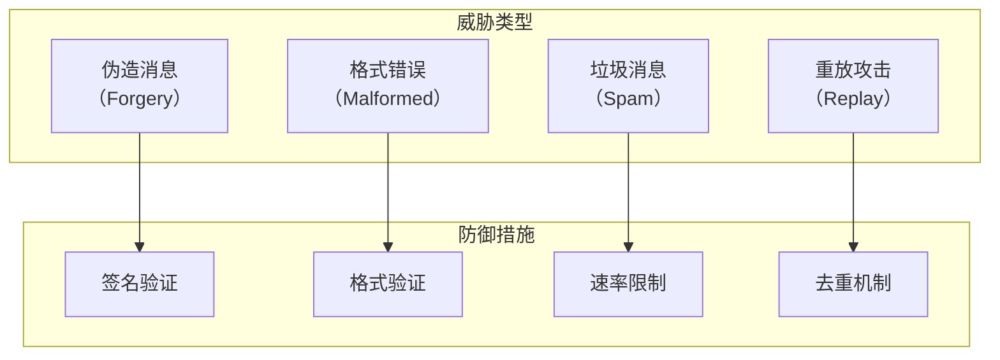
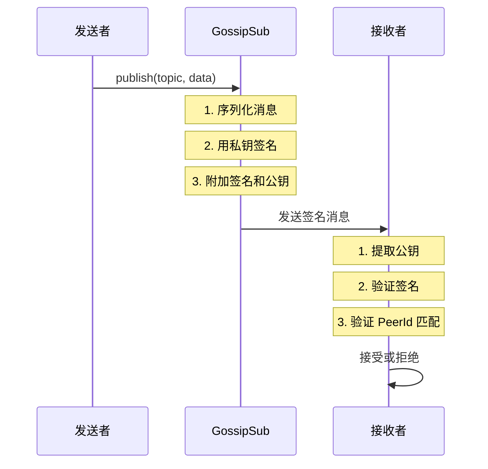
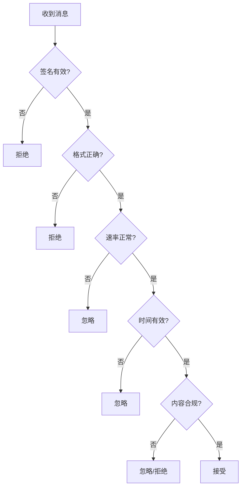

> 耳听为虚，眼见为实。
> ——中国谚语

在 P2P 网络中，任何节点都可以发送消息——这既是优势也是风险。**消息验证**确保我们只接受有效、可信的消息，过滤掉垃圾、欺骗和恶意内容。

## 为什么需要消息验证？

在开放的 P2P 网络中，节点面临多种威胁：



## GossipSub 的验证层次

GossipSub 提供多层验证：

| 层次 | 验证内容 | 时机 |
| --- | --- | --- |
| **签名验证** | 消息来源可信 | 收到消息时 |
| **格式验证** | 消息结构正确 | 反序列化时 |
| **业务验证** | 内容符合规则 | 应用层处理 |

## 消息签名

### 配置签名模式

```rust
use libp2p::gossipsub::MessageAuthenticity;

// 签名模式（推荐）
let gossipsub = gossipsub::Behaviour::new(
    MessageAuthenticity::Signed(keypair),  // 使用私钥签名
    config,
)?;
```

### 签名工作流程



### 验证模式

```rust
use libp2p::gossipsub::ValidationMode;

// 严格模式（推荐）
let config = gossipsub::ConfigBuilder::default()
    .validation_mode(ValidationMode::Strict)
    .build()?;

// 宽松模式
let config = gossipsub::ConfigBuilder::default()
    .validation_mode(ValidationMode::Permissive)
    .build()?;

// 无验证（不推荐）
let config = gossipsub::ConfigBuilder::default()
    .validation_mode(ValidationMode::None)
    .build()?;
```

| 模式 | 说明 |
| --- | --- |
| **Strict** | 拒绝无签名或签名无效的消息 |
| **Permissive** | 接受无签名消息，但验证有签名的 |
| **None** | 不验证签名 |

## 自定义验证器

GossipSub 支持自定义验证逻辑。

### 同步验证

```rust
use libp2p::gossipsub::{self, Message, MessageAcceptance};

// 创建带验证的 Behaviour
let gossipsub = gossipsub::Behaviour::new(
    MessageAuthenticity::Signed(keypair),
    config,
)?;

// 在事件循环中验证
loop {
    match swarm.select_next_some().await {
        SwarmEvent::Behaviour(MyBehaviourEvent::Gossipsub(
            gossipsub::Event::Message { message_id, message, propagation_source }
        )) => {
            // 自定义验证逻辑
            let acceptance = validate_message(&message);

            // 报告验证结果
            swarm.behaviour_mut()
                .gossipsub
                .report_message_validation_result(
                    &message_id,
                    &propagation_source,
                    acceptance,
                )?;
        }
        _ => {}
    }
}

fn validate_message(message: &Message) -> MessageAcceptance {
    // 检查消息大小
    if message.data.len() > 1024 * 1024 {
        return MessageAcceptance::Reject;
    }

    // 检查消息格式
    if let Ok(text) = String::from_utf8(message.data.clone()) {
        if text.contains("spam") {
            return MessageAcceptance::Ignore;
        }
    } else {
        return MessageAcceptance::Reject;
    }

    MessageAcceptance::Accept
}
```

### MessageAcceptance 类型

| 类型 | 说明 | 对发送者的影响 |
| --- | --- | --- |
| **Accept** | 接受并转发 | 无 |
| **Ignore** | 不转发，但不惩罚 | 无 |
| **Reject** | 拒绝并惩罚 | 评分降低 |

### 异步验证

对于需要异步操作的验证（如查询数据库）：

```rust
use tokio::sync::mpsc;

#[derive(Debug)]
struct ValidationRequest {
    message_id: gossipsub::MessageId,
    propagation_source: PeerId,
    message: gossipsub::Message,
}

#[tokio::main]
async fn main() -> anyhow::Result<()> {
    let (tx, mut rx) = mpsc::channel::<ValidationRequest>(100);

    // 验证任务
    let validation_handle = tokio::spawn(async move {
        while let Some(req) = rx.recv().await {
            // 异步验证（如查询数据库）
            let result = async_validate(&req.message).await;
            // 结果需要通过其他方式传回主循环
            // 例如使用另一个 channel
        }
    });

    loop {
        match swarm.select_next_some().await {
            SwarmEvent::Behaviour(MyBehaviourEvent::Gossipsub(
                gossipsub::Event::Message { message_id, message, propagation_source }
            )) => {
                // 发送到验证任务
                let _ = tx.send(ValidationRequest {
                    message_id,
                    propagation_source,
                    message,
                }).await;
            }
            _ => {}
        }
    }
}

async fn async_validate(message: &gossipsub::Message) -> MessageAcceptance {
    // 模拟异步操作
    tokio::time::sleep(std::time::Duration::from_millis(10)).await;

    // 验证逻辑
    MessageAcceptance::Accept
}
```

## 消息格式验证

使用 serde 验证消息结构：

```rust
use serde::{Deserialize, Serialize};

#[derive(Debug, Serialize, Deserialize)]
struct ChatMessage {
    sender: String,
    content: String,
    timestamp: u64,
}

fn validate_chat_message(data: &[u8]) -> MessageAcceptance {
    // 尝试反序列化
    let message: ChatMessage = match serde_json::from_slice(data) {
        Ok(m) => m,
        Err(_) => return MessageAcceptance::Reject,
    };

    // 验证字段
    if message.sender.is_empty() {
        return MessageAcceptance::Reject;
    }

    if message.content.len() > 1000 {
        return MessageAcceptance::Reject;
    }

    // 验证时间戳（不能太旧或太新）
    let now = std::time::SystemTime::now()
        .duration_since(std::time::UNIX_EPOCH)
        .unwrap()
        .as_secs();

    if message.timestamp < now - 300 || message.timestamp > now + 60 {
        return MessageAcceptance::Ignore;  // 可能是时钟偏差
    }

    MessageAcceptance::Accept
}
```

## 速率限制

防止节点发送过多消息：

```rust
use std::collections::HashMap;
use std::time::{Duration, Instant};

struct RateLimiter {
    limits: HashMap<PeerId, Vec<Instant>>,
    max_messages: usize,
    window: Duration,
}

impl RateLimiter {
    fn new(max_messages: usize, window: Duration) -> Self {
        Self {
            limits: HashMap::new(),
            max_messages,
            window,
        }
    }

    fn check(&mut self, peer: &PeerId) -> bool {
        let now = Instant::now();
        let timestamps = self.limits.entry(*peer).or_default();

        // 清理过期记录
        timestamps.retain(|t| now.duration_since(*t) < self.window);

        // 检查是否超过限制
        if timestamps.len() >= self.max_messages {
            return false;
        }

        timestamps.push(now);
        true
    }
}

// 使用
let mut rate_limiter = RateLimiter::new(10, Duration::from_secs(60));

fn validate_with_rate_limit(
    peer: &PeerId,
    rate_limiter: &mut RateLimiter,
) -> MessageAcceptance {
    if !rate_limiter.check(peer) {
        return MessageAcceptance::Ignore;
    }
    MessageAcceptance::Accept
}
```

## 完整验证示例

```rust
use libp2p::{
    gossipsub::{self, IdentTopic, MessageAcceptance, MessageAuthenticity, ValidationMode},
    identity::Keypair,
    mdns,
    swarm::{NetworkBehaviour, SwarmEvent},
    noise, tcp, yamux, PeerId, SwarmBuilder,
};
use serde::{Deserialize, Serialize};
use std::{collections::HashMap, time::{Duration, Instant}};
use futures::StreamExt;

#[derive(Debug, Serialize, Deserialize)]
struct AppMessage {
    msg_type: String,
    payload: String,
    timestamp: u64,
}

#[derive(NetworkBehaviour)]
struct MyBehaviour {
    gossipsub: gossipsub::Behaviour,
    mdns: mdns::tokio::Behaviour,
}

struct MessageValidator {
    rate_limits: HashMap<PeerId, Vec<Instant>>,
    seen_messages: HashMap<String, Instant>,
}

impl MessageValidator {
    fn new() -> Self {
        Self {
            rate_limits: HashMap::new(),
            seen_messages: HashMap::new(),
        }
    }

    fn validate(
        &mut self,
        source: &PeerId,
        message: &gossipsub::Message,
    ) -> MessageAcceptance {
        // 1. 速率限制
        if !self.check_rate_limit(source) {
            println!("Rate limit exceeded for {source}");
            return MessageAcceptance::Ignore;
        }

        // 2. 解析消息
        let app_msg: AppMessage = match serde_json::from_slice(&message.data) {
            Ok(m) => m,
            Err(e) => {
                println!("Invalid message format: {e}");
                return MessageAcceptance::Reject;
            }
        };

        // 3. 验证消息类型
        if !["chat", "event", "sync"].contains(&app_msg.msg_type.as_str()) {
            println!("Unknown message type: {}", app_msg.msg_type);
            return MessageAcceptance::Reject;
        }

        // 4. 验证 payload 长度
        if app_msg.payload.len() > 10000 {
            println!("Payload too large");
            return MessageAcceptance::Reject;
        }

        // 5. 验证时间戳
        let now = std::time::SystemTime::now()
            .duration_since(std::time::UNIX_EPOCH)
            .unwrap()
            .as_secs();

        if app_msg.timestamp < now.saturating_sub(600) {
            println!("Message too old");
            return MessageAcceptance::Ignore;
        }

        if app_msg.timestamp > now + 120 {
            println!("Message from future");
            return MessageAcceptance::Ignore;
        }

        // 6. 内容检查（示例：过滤敏感词）
        if app_msg.payload.to_lowercase().contains("spam") {
            println!("Spam detected");
            return MessageAcceptance::Ignore;
        }

        MessageAcceptance::Accept
    }

    fn check_rate_limit(&mut self, peer: &PeerId) -> bool {
        let now = Instant::now();
        let window = Duration::from_secs(60);
        let max_messages = 30;

        let timestamps = self.rate_limits.entry(*peer).or_default();
        timestamps.retain(|t| now.duration_since(*t) < window);

        if timestamps.len() >= max_messages {
            return false;
        }

        timestamps.push(now);
        true
    }

    fn cleanup(&mut self) {
        let now = Instant::now();
        let expire = Duration::from_secs(300);

        self.seen_messages.retain(|_, t| now.duration_since(*t) < expire);
        self.rate_limits.retain(|_, v| !v.is_empty());
    }
}

#[tokio::main]
async fn main() -> anyhow::Result<()> {
    tracing_subscriber::fmt::init();

    let keypair = Keypair::generate_ed25519();
    let local_peer_id = keypair.public().to_peer_id();
    println!("PeerId: {local_peer_id}");

    let message_id_fn = |message: &gossipsub::Message| {
        use std::hash::{Hash, Hasher};
        let mut h = std::collections::hash_map::DefaultHasher::new();
        message.data.hash(&mut h);
        message.sequence_number.hash(&mut h);
        gossipsub::MessageId::from(h.finish().to_be_bytes().to_vec())
    };

    let config = gossipsub::ConfigBuilder::default()
        .heartbeat_interval(Duration::from_secs(1))
        .validation_mode(ValidationMode::Strict)
        .message_id_fn(message_id_fn)
        .build()?;

    let mut swarm = SwarmBuilder::with_existing_identity(keypair.clone())
        .with_tokio()
        .with_tcp(
            tcp::Config::default(),
            noise::Config::new,
            yamux::Config::default,
        )?
        .with_behaviour(|key| {
            let gossipsub = gossipsub::Behaviour::new(
                MessageAuthenticity::Signed(key.clone()),
                config,
            )?;

            let mdns = mdns::tokio::Behaviour::new(
                mdns::Config::default(),
                key.public().to_peer_id(),
            )?;

            Ok(MyBehaviour { gossipsub, mdns })
        })?
        .with_swarm_config(|cfg| {
            cfg.with_idle_connection_timeout(Duration::from_secs(60))
        })
        .build();

    let topic = IdentTopic::new("validated-chat");
    swarm.behaviour_mut().gossipsub.subscribe(&topic)?;

    swarm.listen_on("/ip4/0.0.0.0/tcp/0".parse()?)?;

    let mut validator = MessageValidator::new();
    let mut cleanup_interval = tokio::time::interval(Duration::from_secs(60));

    loop {
        tokio::select! {
            _ = cleanup_interval.tick() => {
                validator.cleanup();
            }

            event = swarm.select_next_some() => {
                match event {
                    SwarmEvent::NewListenAddr { address, .. } => {
                        println!("Listening on {address}");
                    }

                    SwarmEvent::Behaviour(MyBehaviourEvent::Mdns(event)) => {
                        match event {
                            mdns::Event::Discovered(peers) => {
                                for (peer_id, _) in peers {
                                    swarm.behaviour_mut().gossipsub.add_explicit_peer(&peer_id);
                                }
                            }
                            mdns::Event::Expired(peers) => {
                                for (peer_id, _) in peers {
                                    swarm.behaviour_mut().gossipsub.remove_explicit_peer(&peer_id);
                                }
                            }
                        }
                    }

                    SwarmEvent::Behaviour(MyBehaviourEvent::Gossipsub(
                        gossipsub::Event::Message {
                            message_id,
                            message,
                            propagation_source,
                        }
                    )) => {
                        // 验证消息
                        let acceptance = validator.validate(&propagation_source, &message);

                        // 报告验证结果
                        if let Err(e) = swarm.behaviour_mut().gossipsub
                            .report_message_validation_result(
                                &message_id,
                                &propagation_source,
                                acceptance,
                            )
                        {
                            println!("Validation report error: {e}");
                        }

                        // 如果接受，处理消息
                        if matches!(acceptance, MessageAcceptance::Accept) {
                            if let Ok(msg) = serde_json::from_slice::<AppMessage>(&message.data) {
                                println!("[{}] {}: {}",
                                    msg.msg_type,
                                    message.source.map(|p| p.to_string()).unwrap_or_default(),
                                    msg.payload
                                );
                            }
                        }
                    }

                    _ => {}
                }
            }
        }
    }
}
```

## 验证最佳实践

### 验证清单



### 验证策略

| 策略 | 说明 |
| --- | --- |
| **快速失败** | 先做简单检查，减少计算 |
| **分层验证** | 先格式，后签名，再业务 |
| **适度惩罚** | Reject 影响评分，慎用 |
| **日志记录** | 记录拒绝原因，便于调试 |

## 小结

本章介绍了消息验证与签名：

- **签名验证**：确保消息来源可信
- **格式验证**：确保消息结构正确
- **速率限制**：防止消息泛滥
- **自定义验证**：实现业务规则

消息验证是 P2P 应用安全的重要防线。合理的验证策略既能保护网络，又不会过度惩罚正常节点。

第五篇消息传播到此结束。下一篇，我们将进入 **生产环境**——学习 NAT 穿透、中继和监控。
