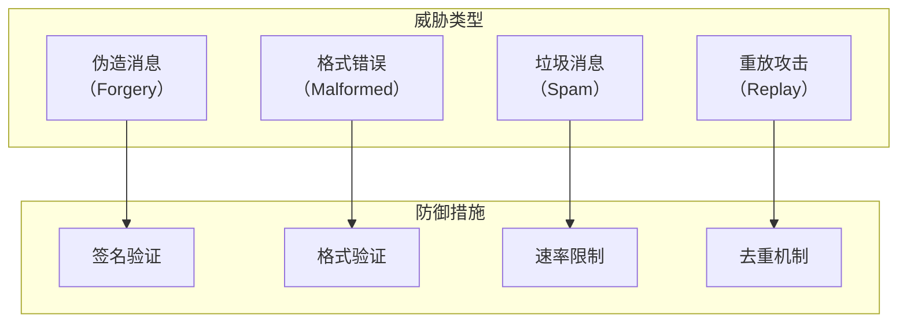
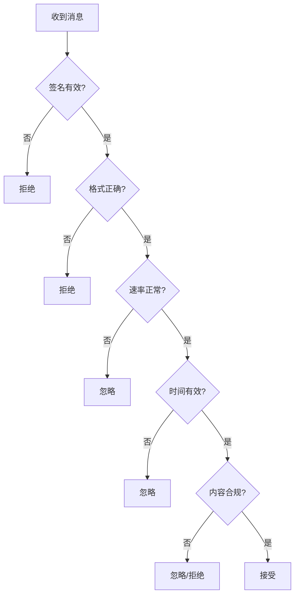

import { Steps, Tabs, TabItem } from '@astrojs/starlight/components';

> 耳听为虚，眼见为实。
> ——中国谚语

在 P2P 网络中，任何节点都可以发送消息——这既是优势也是风险。**消息验证**确保我们只接受有效、可信的消息，过滤掉垃圾、欺骗和恶意内容。

## 为什么需要消息验证？

在开放的 P2P 网络中，节点面临多种威胁：



## GossipSub 的验证层次

| 层次 | 验证内容 | 时机 |
|-----|---------|------|
| **签名验证** | 消息来源可信 | 收到消息时 |
| **格式验证** | 消息结构正确 | 反序列化时 |
| **业务验证** | 内容符合规则 | 应用层处理 |

## 动手实践

:::tip[配套工具]
本教程配套的桌面应用支持消息签名验证。你可以观察签名验证的过程，以及无效消息是如何被拒绝的。
:::

<Steps>

1. **配置签名模式**

   ```rust ins={3-4}
   let gossipsub = gossipsub::Behaviour::new(
       // 使用私钥签名（推荐）
       gossipsub::MessageAuthenticity::Signed(keypair),
       config,
   )?;
   ```

2. **设置验证模式**

   ```rust ins={3-4}
   let config = gossipsub::ConfigBuilder::default()
       // 严格模式：拒绝无签名或签名无效的消息
       .validation_mode(gossipsub::ValidationMode::Strict)
       .build()?;
   ```

3. **实现自定义验证器**

   ```rust ins={3-15}
   gossipsub::Event::Message { message_id, message, propagation_source } => {
       // 自定义验证逻辑
       let acceptance = validate_message(&message);

       // 报告验证结果
       swarm.behaviour_mut()
           .gossipsub
           .report_message_validation_result(
               &message_id,
               &propagation_source,
               acceptance,
           )?;

       // 如果接受，处理消息
       if matches!(acceptance, MessageAcceptance::Accept) {
           process_message(&message);
       }
   }
   ```

</Steps>

### 验证模式

| 模式 | 说明 |
|-----|------|
| `Strict` | 拒绝无签名或签名无效的消息 |
| `Permissive` | 接受无签名消息，但验证有签名的 |
| `None` | 不验证签名 |

### MessageAcceptance 类型

| 类型 | 说明 | 对发送者的影响 |
|-----|------|---------------|
| `Accept` | 接受并转发 | 无 |
| `Ignore` | 不转发，但不惩罚 | 无 |
| `Reject` | 拒绝并惩罚 | 评分降低 |

## 消息格式验证

使用 serde 验证消息结构：

```rust
use serde::{Deserialize, Serialize};

#[derive(Debug, Serialize, Deserialize)]
struct ChatMessage {
    sender: String,
    content: String,
    timestamp: u64,
}

fn validate_chat_message(data: &[u8]) -> MessageAcceptance {
    // 1. 尝试反序列化
    let message: ChatMessage = match serde_json::from_slice(data) {
        Ok(m) => m,
        Err(_) => return MessageAcceptance::Reject,
    };

    // 2. 验证字段
    if message.sender.is_empty() {
        return MessageAcceptance::Reject;
    }

    if message.content.len() > 1000 {
        return MessageAcceptance::Reject;
    }

    // 3. 验证时间戳（不能太旧或太新）
    let now = std::time::SystemTime::now()
        .duration_since(std::time::UNIX_EPOCH)
        .unwrap()
        .as_secs();

    if message.timestamp < now - 300 || message.timestamp > now + 60 {
        return MessageAcceptance::Ignore; // 可能是时钟偏差
    }

    MessageAcceptance::Accept
}
```

## 速率限制

防止节点发送过多消息：

```rust
use std::collections::HashMap;
use std::time::{Duration, Instant};

struct RateLimiter {
    limits: HashMap<PeerId, Vec<Instant>>,
    max_messages: usize,
    window: Duration,
}

impl RateLimiter {
    fn new(max_messages: usize, window: Duration) -> Self {
        Self { limits: HashMap::new(), max_messages, window }
    }

    fn check(&mut self, peer: &PeerId) -> bool {
        let now = Instant::now();
        let timestamps = self.limits.entry(*peer).or_default();

        // 清理过期记录
        timestamps.retain(|t| now.duration_since(*t) < self.window);

        // 检查是否超过限制
        if timestamps.len() >= self.max_messages {
            return false;
        }

        timestamps.push(now);
        true
    }
}

// 使用
let mut rate_limiter = RateLimiter::new(10, Duration::from_secs(60));

fn validate_with_rate_limit(peer: &PeerId, rate_limiter: &mut RateLimiter) -> MessageAcceptance {
    if !rate_limiter.check(peer) {
        return MessageAcceptance::Ignore;
    }
    MessageAcceptance::Accept
}
```

## 完整验证示例

```rust
use anyhow::Result;
use libp2p::{
    futures::StreamExt, gossipsub::{self, MessageAcceptance, ValidationMode},
    mdns, noise, swarm::NetworkBehaviour, swarm::SwarmEvent, tcp, yamux,
    PeerId, SwarmBuilder,
};
use serde::{Deserialize, Serialize};
use std::collections::HashMap;
use std::time::{Duration, Instant};

#[derive(Debug, Serialize, Deserialize)]
struct AppMessage {
    msg_type: String,
    payload: String,
    timestamp: u64,
}

#[derive(NetworkBehaviour)]
struct MyBehaviour {
    gossipsub: gossipsub::Behaviour,
    mdns: mdns::tokio::Behaviour,
}

struct MessageValidator {
    rate_limits: HashMap<PeerId, Vec<Instant>>,
}

impl MessageValidator {
    fn new() -> Self {
        Self { rate_limits: HashMap::new() }
    }

    fn validate(&mut self, source: &PeerId, message: &gossipsub::Message) -> MessageAcceptance {
        // 1. 速率限制
        if !self.check_rate_limit(source) {
            println!("Rate limit exceeded for {source}");
            return MessageAcceptance::Ignore;
        }

        // 2. 解析消息
        let app_msg: AppMessage = match serde_json::from_slice(&message.data) {
            Ok(m) => m,
            Err(e) => {
                println!("Invalid message format: {e}");
                return MessageAcceptance::Reject;
            }
        };

        // 3. 验证消息类型
        if !["chat", "event", "sync"].contains(&app_msg.msg_type.as_str()) {
            println!("Unknown message type: {}", app_msg.msg_type);
            return MessageAcceptance::Reject;
        }

        // 4. 验证 payload 长度
        if app_msg.payload.len() > 10000 {
            println!("Payload too large");
            return MessageAcceptance::Reject;
        }

        // 5. 验证时间戳
        let now = std::time::SystemTime::now()
            .duration_since(std::time::UNIX_EPOCH)
            .unwrap()
            .as_secs();

        if app_msg.timestamp < now.saturating_sub(600) {
            println!("Message too old");
            return MessageAcceptance::Ignore;
        }

        if app_msg.timestamp > now + 120 {
            println!("Message from future");
            return MessageAcceptance::Ignore;
        }

        MessageAcceptance::Accept
    }

    fn check_rate_limit(&mut self, peer: &PeerId) -> bool {
        let now = Instant::now();
        let window = Duration::from_secs(60);
        let max_messages = 30;

        let timestamps = self.rate_limits.entry(*peer).or_default();
        timestamps.retain(|t| now.duration_since(*t) < window);

        if timestamps.len() >= max_messages {
            return false;
        }

        timestamps.push(now);
        true
    }
}

#[tokio::main]
async fn main() -> Result<()> {
    tracing_subscriber::fmt().init();

    let keypair = libp2p::identity::Keypair::generate_ed25519();
    let local_peer_id = keypair.public().to_peer_id();
    println!("PeerId: {local_peer_id}");

    let message_id_fn = |message: &gossipsub::Message| {
        use std::hash::{Hash, Hasher};
        let mut h = std::collections::hash_map::DefaultHasher::new();
        message.data.hash(&mut h);
        message.sequence_number.hash(&mut h);
        gossipsub::MessageId::from(h.finish().to_be_bytes().to_vec())
    };

    let config = gossipsub::ConfigBuilder::default()
        .heartbeat_interval(Duration::from_secs(1))
        .validation_mode(ValidationMode::Strict)
        .message_id_fn(message_id_fn)
        .build()?;

    let mut swarm = SwarmBuilder::with_existing_identity(keypair.clone())
        .with_tokio()
        .with_tcp(
            tcp::Config::default(),
            noise::Config::new,
            yamux::Config::default,
        )?
        .with_behaviour(|key| {
            let local_peer_id = key.public().to_peer_id();
            Ok(MyBehaviour {
                gossipsub: gossipsub::Behaviour::new(
                    gossipsub::MessageAuthenticity::Signed(key.clone()),
                    config,
                )?,
                mdns: mdns::tokio::Behaviour::new(mdns::Config::default(), local_peer_id)?,
            })
        })?
        .with_swarm_config(|cfg| cfg.with_idle_connection_timeout(Duration::from_secs(60)))
        .build();

    let topic = gossipsub::IdentTopic::new("validated-chat");
    swarm.behaviour_mut().gossipsub.subscribe(&topic)?;

    swarm.listen_on("/ip4/0.0.0.0/tcp/0".parse()?)?;

    let mut validator = MessageValidator::new();

    loop {
        match swarm.select_next_some().await {
            SwarmEvent::NewListenAddr { address, .. } => {
                println!("Listening on {address}");
            }
            SwarmEvent::Behaviour(MyBehaviourEvent::Mdns(event)) => match event {
                mdns::Event::Discovered(peers) => {
                    for (peer_id, _) in peers {
                        swarm.behaviour_mut().gossipsub.add_explicit_peer(&peer_id);
                    }
                }
                mdns::Event::Expired(peers) => {
                    for (peer_id, _) in peers {
                        swarm.behaviour_mut().gossipsub.remove_explicit_peer(&peer_id);
                    }
                }
            },
            SwarmEvent::Behaviour(MyBehaviourEvent::Gossipsub(
                gossipsub::Event::Message { message_id, message, propagation_source }
            )) => {
                // 验证消息
                let acceptance = validator.validate(&propagation_source, &message);

                // 报告验证结果
                if let Err(e) = swarm.behaviour_mut().gossipsub
                    .report_message_validation_result(&message_id, &propagation_source, acceptance)
                {
                    println!("Validation report error: {e}");
                }

                // 如果接受，处理消息
                if matches!(acceptance, MessageAcceptance::Accept) {
                    if let Ok(msg) = serde_json::from_slice::<AppMessage>(&message.data) {
                        println!("[{}] {}: {}",
                            msg.msg_type,
                            message.source.map(|p| p.to_string()).unwrap_or_default(),
                            msg.payload
                        );
                    }
                }
            }
            _ => {}
        }
    }
}
```

## 验证流程



## 验证策略

| 策略 | 说明 |
|-----|------|
| **快速失败** | 先做简单检查，减少计算 |
| **分层验证** | 先格式，后签名，再业务 |
| **适度惩罚** | Reject 影响评分，慎用 |
| **日志记录** | 记录拒绝原因，便于调试 |

## 小结

本章介绍了消息验证与签名：

- **签名验证**：确保消息来源可信
- **格式验证**：确保消息结构正确
- **速率限制**：防止消息泛滥
- **自定义验证**：实现业务规则

消息验证是 P2P 应用安全的重要防线。合理的验证策略既能保护网络，又不会过度惩罚正常节点。

第五篇消息传播到此结束。下一篇，我们将进入 **生产环境**——学习 NAT 穿透、中继和监控。
