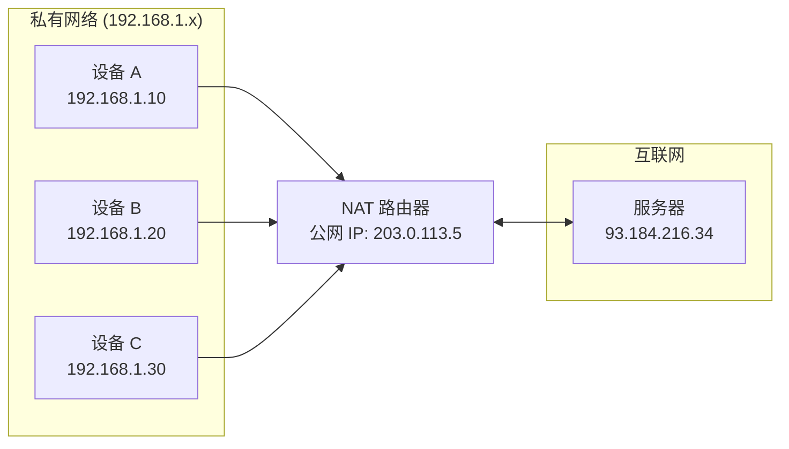
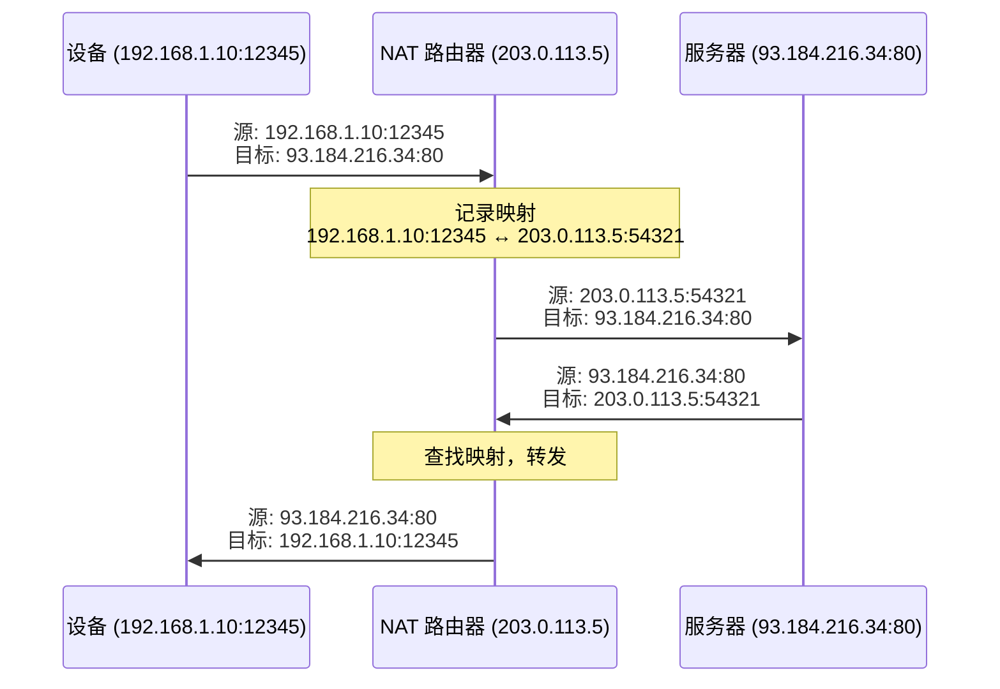
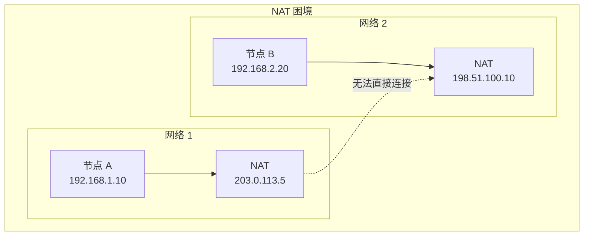
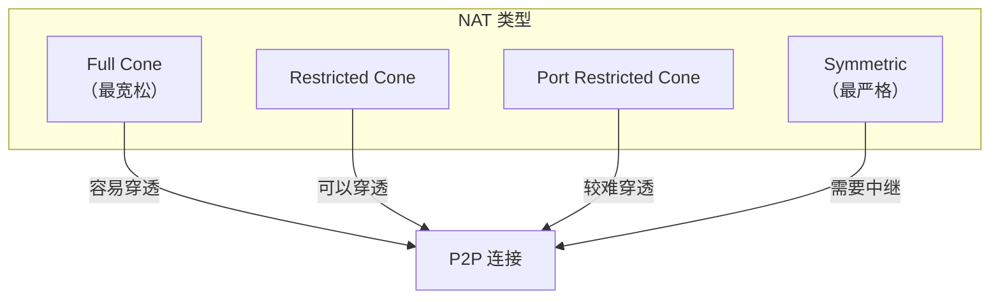
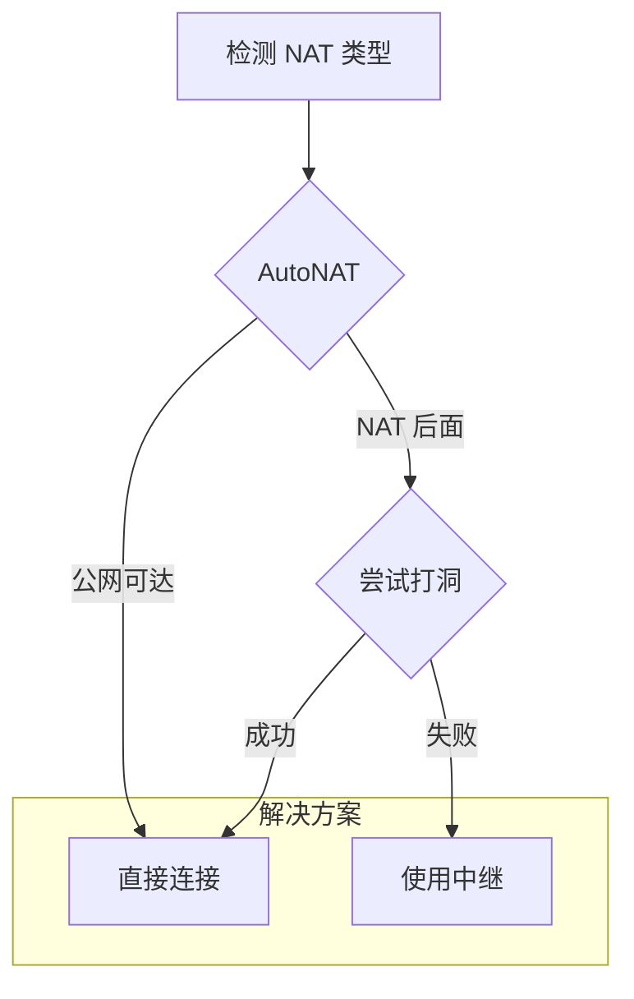
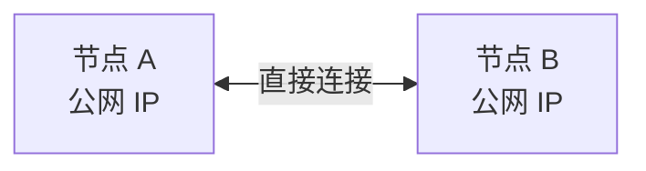
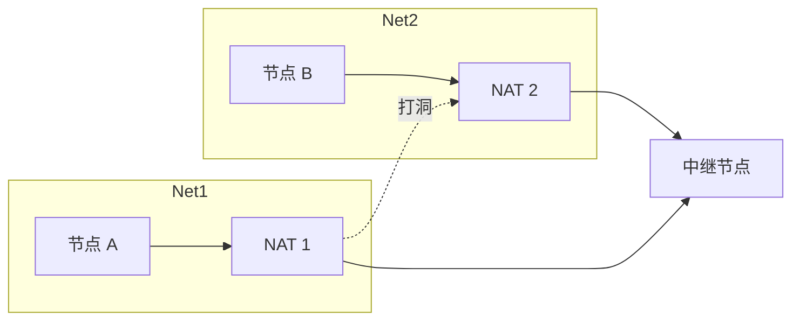

> 山重水复疑无路，柳暗花明又一村。
> ——陆游《游山西村》

P2P 网络的最大障碍不是技术复杂度，而是 **NAT（网络地址转换）**。大多数设备都在 NAT 后面，无法直接被外部访问。但正如诗中所言，困境之后总有出路——libp2p 提供了多种 NAT 穿透方案。

## 什么是 NAT？

NAT（Network Address Translation）将私有 IP 地址转换为公网 IP 地址，让多个设备共享一个公网 IP。



### NAT 的工作原理

当内网设备访问外网时：



## P2P 的 NAT 困境

P2P 需要节点能够**互相连接**，但 NAT 阻止了入站连接：



### 为什么无法直接连接？

1. **无端口映射**：NAT 只有在内部设备主动连接时才创建映射
2. **私有地址不可路由**：192.168.x.x 在公网上无法寻址
3. **防火墙阻挡**：多数 NAT 默认阻止入站连接

## NAT 类型

不同类型的 NAT 对 P2P 的影响不同：

| NAT 类型 | 描述 | P2P 友好度 |
| --- | --- | --- |
| **Full Cone** | 任何外部地址都能通过映射端口访问 | 高 |
| **Restricted Cone** | 只有内部访问过的 IP 能回连 | 中 |
| **Port Restricted Cone** | 只有内部访问过的 IP:Port 能回连 | 中 |
| **Symmetric** | 每个目标创建不同映射，最难穿透 | 低 |



## libp2p 的 NAT 穿透方案

libp2p 提供多层防御策略：



### 方案概览

| 方案 | 说明 | 延迟 | 可靠性 |
| --- | --- | --- | --- |
| **AutoNAT** | 检测自己是否可达 | - | - |
| **Hole Punching (DCUtR)** | 协调打洞，建立直连 | 低 | 中 |
| **Relay** | 通过第三方节点转发 | 高 | 高 |

## 检测 NAT 状态

在实现穿透之前，需要先知道自己的 NAT 状态。

### 观察地址

Identify 协议返回的 `observed_addr` 是检测的关键：

```rust
SwarmEvent::Behaviour(MyBehaviourEvent::Identify(
    identify::Event::Received { peer_id, info }
)) => {
    if let Some(observed) = info.observed_addr {
        println!("对方看到我的地址: {observed}");

        // 如果多个节点报告相同的公网地址，说明在 NAT 后面
        // 但这个地址可能是可达的
    }
}
```

### 地址分类

```rust
use libp2p::Multiaddr;
use std::net::IpAddr;

fn classify_address(addr: &Multiaddr) -> AddressType {
    for proto in addr.iter() {
        match proto {
            libp2p::multiaddr::Protocol::Ip4(ip) => {
                if ip.is_private() {
                    return AddressType::Private;
                } else if ip.is_loopback() {
                    return AddressType::Loopback;
                } else {
                    return AddressType::Public;
                }
            }
            libp2p::multiaddr::Protocol::Ip6(ip) => {
                if ip.is_loopback() {
                    return AddressType::Loopback;
                }
                // IPv6 通常是公网地址
                return AddressType::Public;
            }
            _ => continue,
        }
    }
    AddressType::Unknown
}

enum AddressType {
    Public,
    Private,
    Loopback,
    Unknown,
}
```

## NAT 穿透时序

完整的 NAT 穿透流程：

```mermaid
sequenceDiagram
    participant A as 节点 A (NAT 后)
    participant Relay as 中继节点
    participant B as 节点 B (NAT 后)

    Note over A: 1. 检测 NAT 状态

    A->>Relay: 连接中继
    A->>Relay: 预订中继槽位

    B->>A: 想连接 A（通过中继地址）
    A->>B: 返回直连地址

    Note over A,B: 2. 尝试打洞 (DCUtR)

    A->>B: 同时发起连接
    B->>A: 同时发起连接

    alt 打洞成功
        A<-->B: 直接通信
    else 打洞失败
        A->>Relay: 数据
        Relay->>B: 转发数据
    end
```

## 配置示例

### 完整的 NAT 穿透配置

```rust
use libp2p::{
    autonat, dcutr, identify, relay,
    identity::Keypair,
    swarm::NetworkBehaviour,
    noise, tcp, yamux, SwarmBuilder,
};
use std::time::Duration;

#[derive(NetworkBehaviour)]
struct MyBehaviour {
    // 身份识别
    identify: identify::Behaviour,
    // NAT 检测
    autonat: autonat::Behaviour,
    // 中继客户端
    relay_client: relay::client::Behaviour,
    // 打洞协调
    dcutr: dcutr::Behaviour,
}

#[tokio::main]
async fn main() -> anyhow::Result<()> {
    let keypair = Keypair::generate_ed25519();
    let local_peer_id = keypair.public().to_peer_id();

    let mut swarm = SwarmBuilder::with_existing_identity(keypair.clone())
        .with_tokio()
        .with_tcp(
            tcp::Config::default(),
            noise::Config::new,
            yamux::Config::default,
        )?
        .with_relay_client(noise::Config::new, yamux::Config::default)?
        .with_behaviour(|key, relay_client| {
            Ok(MyBehaviour {
                identify: identify::Behaviour::new(
                    identify::Config::new("/my-app/1.0.0".into(), key.public())
                ),
                autonat: autonat::Behaviour::new(
                    local_peer_id,
                    autonat::Config::default(),
                ),
                relay_client,
                dcutr: dcutr::Behaviour::new(local_peer_id),
            })
        })?
        .with_swarm_config(|cfg| {
            cfg.with_idle_connection_timeout(Duration::from_secs(60))
        })
        .build();

    // 监听
    swarm.listen_on("/ip4/0.0.0.0/tcp/0".parse()?)?;

    // 连接到中继节点
    let relay_addr = "/ip4/xxx.xxx.xxx.xxx/tcp/4001/p2p/QmRelay...";
    swarm.dial(relay_addr.parse()?)?;

    // 事件循环处理 NAT 穿透逻辑
    // ...

    Ok(())
}
```

## 常见 NAT 场景

### 场景 1：两个公网节点



无需穿透，直接连接。

### 场景 2：一方在 NAT 后


NAT 后的节点主动连接公网节点。

### 场景 3：双方都在 NAT 后



需要中继协调，尝试打洞。

## 小结

本章介绍了 NAT 问题：

- **NAT 原理**：私有地址转换为公网地址
- **P2P 困境**：NAT 阻止入站连接
- **NAT 类型**：Full Cone、Restricted、Symmetric
- **解决方案**：AutoNAT、Relay、Hole Punching

理解 NAT 问题是构建生产级 P2P 应用的前提。接下来几章，我们将详细介绍每种穿透方案的实现。

下一章，我们将学习 **AutoNAT**——自动检测节点的 NAT 状态。
