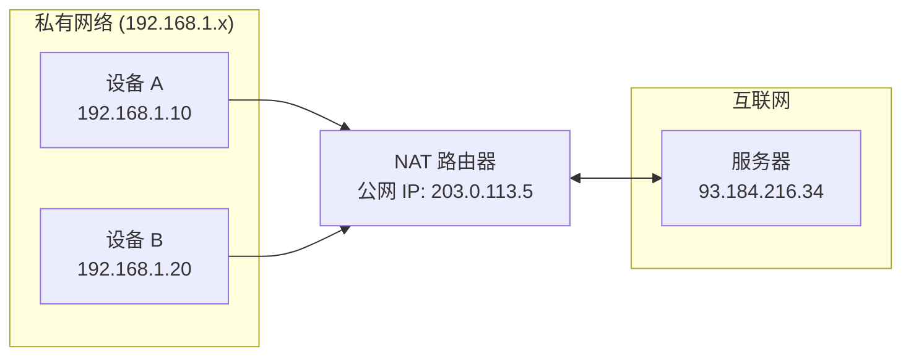
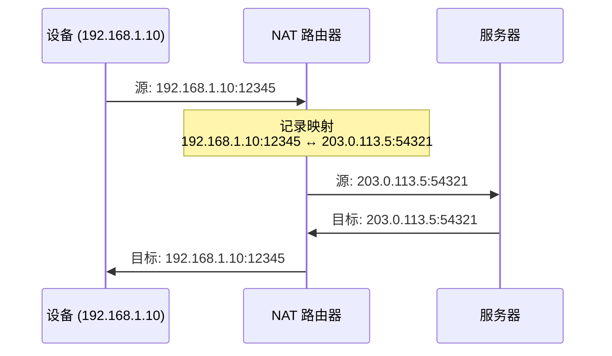
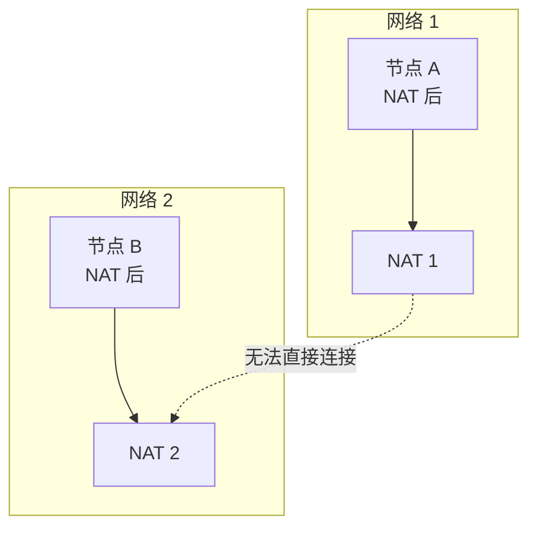
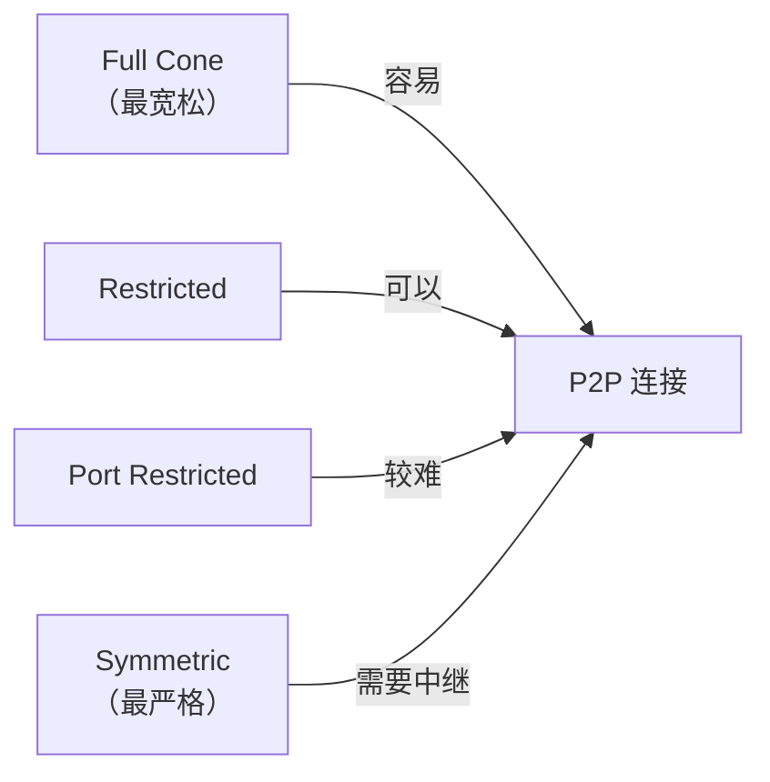
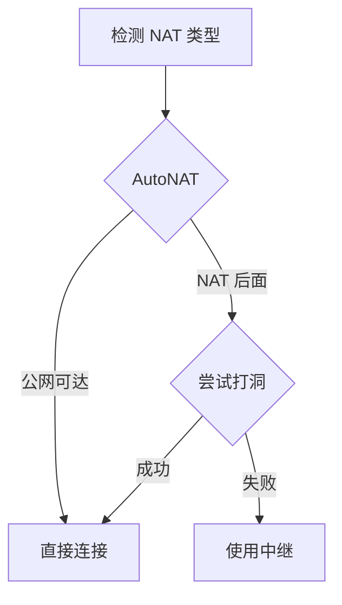
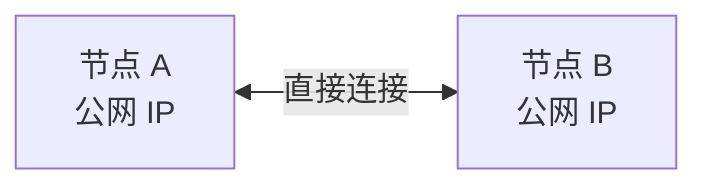
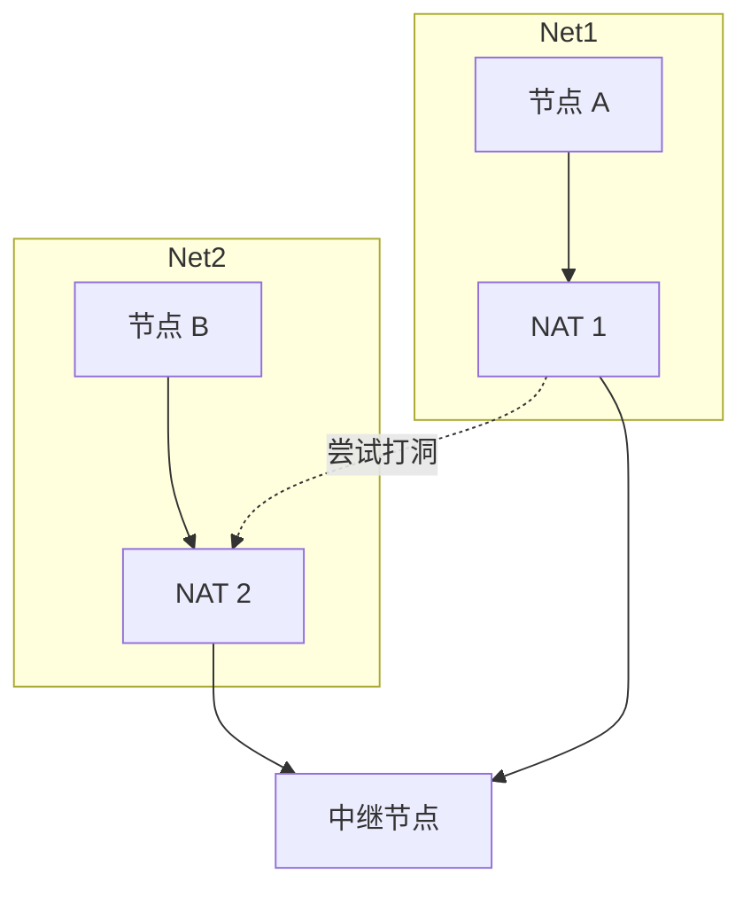

import { Steps, Tabs, TabItem } from '@astrojs/starlight/components';

> 山重水复疑无路，柳暗花明又一村。
> ——陆游《游山西村》

P2P 网络的最大障碍不是技术复杂度，而是 **NAT（网络地址转换）**。大多数设备都在 NAT 后面，无法直接被外部访问。但正如诗中所言，困境之后总有出路——libp2p 提供了多种 NAT 穿透方案。

## 什么是 NAT？

NAT（Network Address Translation）将私有 IP 地址转换为公网 IP 地址，让多个设备共享一个公网 IP。



### NAT 的工作原理



## P2P 的 NAT 困境

P2P 需要节点能够**互相连接**，但 NAT 阻止了入站连接：



### 为什么无法直接连接？

| 原因 | 说明 |
|-----|------|
| 无端口映射 | NAT 只有在内部设备主动连接时才创建映射 |
| 私有地址不可路由 | 192.168.x.x 在公网上无法寻址 |
| 防火墙阻挡 | 多数 NAT 默认阻止入站连接 |

## NAT 类型

不同类型的 NAT 对 P2P 的影响不同：

| NAT 类型 | 描述 | P2P 友好度 |
|---------|------|-----------|
| **Full Cone** | 任何外部地址都能通过映射端口访问 | ✅ 高 |
| **Restricted Cone** | 只有内部访问过的 IP 能回连 | ⚠️ 中 |
| **Port Restricted** | 只有内部访问过的 IP:Port 能回连 | ⚠️ 中 |
| **Symmetric** | 每个目标创建不同映射，最难穿透 | ❌ 低 |



## libp2p 的 NAT 穿透方案

libp2p 提供多层防御策略：



### 方案概览

| 方案 | 说明 | 延迟 | 可靠性 |
|-----|------|------|--------|
| **AutoNAT** | 检测自己是否可达 | - | - |
| **DCUtR** | 协调打洞，建立直连 | 低 | 中 |
| **Relay** | 通过第三方节点转发 | 高 | 高 |

## 常见 NAT 场景

<Tabs>
<TabItem label="场景 1：两个公网节点">



无需穿透，直接连接。

</TabItem>
<TabItem label="场景 2：一方在 NAT 后">


NAT 后的节点主动连接公网节点即可。

</TabItem>
<TabItem label="场景 3：双方都在 NAT 后">



需要中继协调，尝试打洞。

</TabItem>
</Tabs>

## NAT 穿透配置预览

:::tip[配套工具]
本教程配套的桌面应用内置了 NAT 检测功能。打开应用后，可以直接查看你的 NAT 状态。
:::

一个完整的 NAT 穿透配置需要以下组件：

```rust
#[derive(NetworkBehaviour)]
struct MyBehaviour {
    // 身份识别
    identify: identify::Behaviour,
    // NAT 检测
    autonat: autonat::Behaviour,
    // 中继客户端
    relay_client: relay::client::Behaviour,
    // 打洞协调
    dcutr: dcutr::Behaviour,
}
```

## NAT 穿透时序

```mermaid
sequenceDiagram
    participant A as 节点 A (NAT 后)
    participant Relay as 中继节点
    participant B as 节点 B (NAT 后)

    Note over A: 1. 检测 NAT 状态 (AutoNAT)
    A->>Relay: 连接并预订中继

    B->>Relay: 想连接 A
    Relay->>A: 转发连接请求

    Note over A,B: 2. 尝试打洞 (DCUtR)
    A->>B: 同时发起连接
    B->>A: 同时发起连接

    alt 打洞成功
        A<-->B: 直接通信
    else 打洞失败
        A->>Relay: 数据
        Relay->>B: 转发数据
    end
```

## 小结

本章介绍了 NAT 问题：

- **NAT 原理**：私有地址转换为公网地址
- **P2P 困境**：NAT 阻止入站连接
- **NAT 类型**：Full Cone、Restricted、Symmetric
- **解决方案**：AutoNAT、Relay、DCUtR

理解 NAT 问题是构建生产级 P2P 应用的前提。接下来几章，我们将详细介绍每种穿透方案的实现。

下一章，我们将学习 **AutoNAT**——自动检测节点的 NAT 状态。
