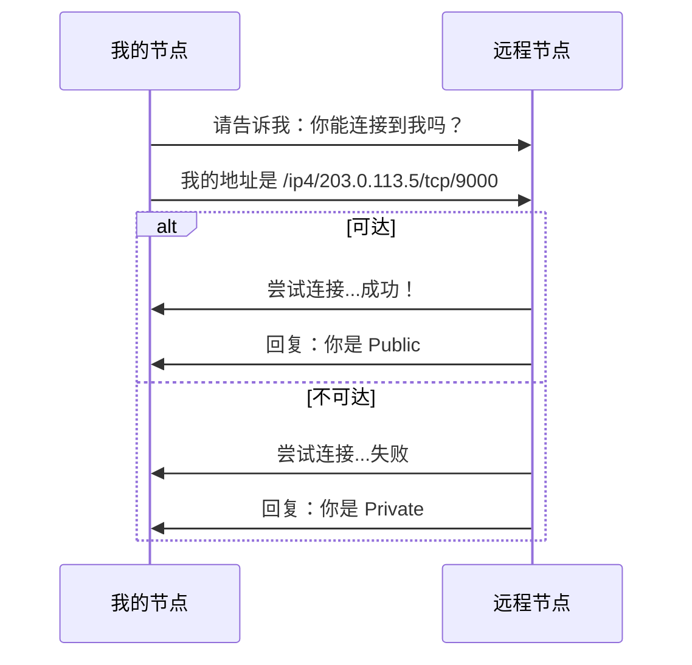
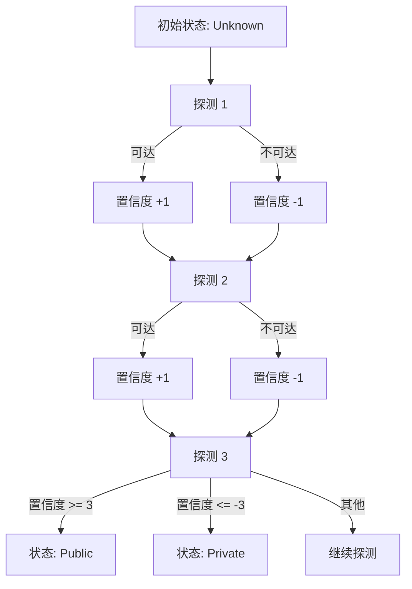

> 知己知彼，百战不殆。
> ——《孙子兵法》

要突破 NAT 的限制，首先要了解自己的处境。**AutoNAT** 协议帮助节点自动检测自己是否可以被外部直接访问——这是制定正确穿透策略的前提。

## AutoNAT 原理

AutoNAT 通过请求其他节点"回拨"来测试自己的可达性：



### 协议标识符

```
/libp2p/autonat/1.0.0
```

### NAT 状态

AutoNAT 检测的结果：

| 状态 | 说明 |
| --- | --- |
| **Public** | 可从外部直接访问 |
| **Private** | 在 NAT 后面，无法直接访问 |
| **Unknown** | 尚未确定（初始状态） |

## 配置 AutoNAT

### 基本配置

```rust
use libp2p::autonat;

let autonat = autonat::Behaviour::new(
    local_peer_id,
    autonat::Config::default(),
);
```

### 自定义配置

```rust
use libp2p::autonat;
use std::time::Duration;

let config = autonat::Config {
    // 重试间隔
    retry_interval: Duration::from_secs(90),
    // 刷新间隔（重新检测）
    refresh_interval: Duration::from_secs(900),
    // 置信度阈值（需要多少确认）
    confidence_max: 3,
    // 启动延迟
    boot_delay: Duration::from_secs(15),
    // 节流配置
    throttle_server_period: Duration::from_secs(1),
    // 只使用全局 IP
    only_global_ips: true,
    ..Default::default()
};

let autonat = autonat::Behaviour::new(local_peer_id, config);
```

### 配置参数说明

| 参数 | 说明 | 默认值 |
| --- | --- | --- |
| `retry_interval` | 检测失败后重试间隔 | 90 秒 |
| `refresh_interval` | 状态确认后刷新间隔 | 15 分钟 |
| `confidence_max` | 需要的确认次数 | 3 |
| `boot_delay` | 启动后等待时间 | 15 秒 |
| `only_global_ips` | 只检测全局 IP | true |

## 事件处理

```rust
use libp2p::autonat;

loop {
    match swarm.select_next_some().await {
        SwarmEvent::Behaviour(MyBehaviourEvent::AutoNat(event)) => {
            match event {
                // NAT 状态变化
                autonat::Event::StatusChanged { old, new } => {
                    println!("NAT status changed: {old:?} -> {new:?}");

                    match new {
                        autonat::NatStatus::Public(addr) => {
                            println!("We are publicly reachable at {addr}");
                            // 可以作为服务器
                        }
                        autonat::NatStatus::Private => {
                            println!("We are behind NAT");
                            // 需要使用中继
                        }
                        autonat::NatStatus::Unknown => {
                            println!("NAT status unknown");
                        }
                    }
                }

                // 入站探测请求
                autonat::Event::InboundProbe(probe) => {
                    match probe {
                        autonat::InboundProbeEvent::Request { peer, .. } => {
                            println!("Received probe request from {peer}");
                        }
                        autonat::InboundProbeEvent::Response { peer, .. } => {
                            println!("Sent probe response to {peer}");
                        }
                        autonat::InboundProbeEvent::Error { peer, error, .. } => {
                            println!("Probe error for {peer}: {error}");
                        }
                    }
                }

                // 出站探测请求
                autonat::Event::OutboundProbe(probe) => {
                    match probe {
                        autonat::OutboundProbeEvent::Request { peer, .. } => {
                            println!("Sent probe request to {peer}");
                        }
                        autonat::OutboundProbeEvent::Response { peer, address, .. } => {
                            println!("Probe response from {peer}: reachable at {address:?}");
                        }
                        autonat::OutboundProbeEvent::Error { peer, error, .. } => {
                            println!("Probe error from {peer}: {error:?}");
                        }
                    }
                }
            }
        }
        _ => {}
    }
}
```

## 完整示例

```rust
use libp2p::{
    autonat, identify,
    identity::Keypair,
    swarm::{NetworkBehaviour, SwarmEvent},
    noise, tcp, yamux, SwarmBuilder,
};
use std::time::Duration;
use futures::StreamExt;

#[derive(NetworkBehaviour)]
struct MyBehaviour {
    identify: identify::Behaviour,
    autonat: autonat::Behaviour,
}

#[tokio::main]
async fn main() -> anyhow::Result<()> {
    tracing_subscriber::fmt::init();

    let keypair = Keypair::generate_ed25519();
    let local_peer_id = keypair.public().to_peer_id();
    println!("Local PeerId: {local_peer_id}");

    let mut swarm = SwarmBuilder::with_existing_identity(keypair.clone())
        .with_tokio()
        .with_tcp(
            tcp::Config::default(),
            noise::Config::new,
            yamux::Config::default,
        )?
        .with_behaviour(|key| {
            let local_peer_id = key.public().to_peer_id();

            // Identify 用于交换地址信息
            let identify = identify::Behaviour::new(
                identify::Config::new("/autonat-example/1.0.0".into(), key.public())
            );

            // AutoNAT 配置
            let autonat_config = autonat::Config {
                boot_delay: Duration::from_secs(10),
                refresh_interval: Duration::from_secs(60),
                retry_interval: Duration::from_secs(30),
                ..Default::default()
            };
            let autonat = autonat::Behaviour::new(local_peer_id, autonat_config);

            Ok(MyBehaviour { identify, autonat })
        })?
        .with_swarm_config(|cfg| {
            cfg.with_idle_connection_timeout(Duration::from_secs(60))
        })
        .build();

    swarm.listen_on("/ip4/0.0.0.0/tcp/0".parse()?)?;

    // 连接到远程节点进行测试
    if let Some(addr) = std::env::args().nth(1) {
        swarm.dial(addr.parse::<libp2p::Multiaddr>()?)?;
    }

    println!("Waiting for AutoNAT detection...");

    loop {
        match swarm.select_next_some().await {
            SwarmEvent::NewListenAddr { address, .. } => {
                println!("Listening on {address}");
            }

            SwarmEvent::ConnectionEstablished { peer_id, .. } => {
                println!("Connected to {peer_id}");
            }

            SwarmEvent::Behaviour(MyBehaviourEvent::Identify(
                identify::Event::Received { peer_id, info }
            )) => {
                println!("Identified {peer_id}:");
                if let Some(addr) = info.observed_addr {
                    println!("  Observed address: {addr}");
                }
            }

            SwarmEvent::Behaviour(MyBehaviourEvent::AutoNat(event)) => {
                match event {
                    autonat::Event::StatusChanged { old, new } => {
                        println!("\n=== NAT Status Changed ===");
                        println!("  Old: {old:?}");
                        println!("  New: {new:?}");

                        match new {
                            autonat::NatStatus::Public(addr) => {
                                println!("  Result: PUBLIC at {addr}");
                                println!("  Action: Can accept incoming connections");
                            }
                            autonat::NatStatus::Private => {
                                println!("  Result: PRIVATE (behind NAT)");
                                println!("  Action: Need relay for incoming connections");
                            }
                            autonat::NatStatus::Unknown => {
                                println!("  Result: UNKNOWN");
                                println!("  Action: Waiting for more probes");
                            }
                        }
                    }

                    autonat::Event::OutboundProbe(probe) => {
                        match probe {
                            autonat::OutboundProbeEvent::Response { peer, address, .. } => {
                                println!("Probe response from {peer}:");
                                if let Some(addr) = address {
                                    println!("  Reachable at: {addr}");
                                } else {
                                    println!("  Not reachable");
                                }
                            }
                            autonat::OutboundProbeEvent::Error { error, .. } => {
                                println!("Probe error: {error:?}");
                            }
                            _ => {}
                        }
                    }

                    _ => {}
                }
            }

            _ => {}
        }
    }
}
```

## AutoNAT 与其他协议配合

### 与 Identify 配合

AutoNAT 需要知道自己的外部地址，Identify 提供这个信息：

```rust
#[derive(NetworkBehaviour)]
struct MyBehaviour {
    identify: identify::Behaviour,  // 必需：提供地址信息
    autonat: autonat::Behaviour,
}
```

### 与 Kademlia 配合

根据 NAT 状态设置 Kademlia 模式：

```rust
use libp2p::kad::Mode;

SwarmEvent::Behaviour(MyBehaviourEvent::AutoNat(
    autonat::Event::StatusChanged { new, .. }
)) => {
    match new {
        autonat::NatStatus::Public(_) => {
            // 公网可达，作为 DHT 服务器
            swarm.behaviour_mut().kademlia.set_mode(Some(Mode::Server));
        }
        autonat::NatStatus::Private => {
            // NAT 后面，只作为客户端
            swarm.behaviour_mut().kademlia.set_mode(Some(Mode::Client));
        }
        _ => {}
    }
}
```

### 与 Relay 配合

根据 NAT 状态决定是否使用中继：

```rust
SwarmEvent::Behaviour(MyBehaviourEvent::AutoNat(
    autonat::Event::StatusChanged { new, .. }
)) => {
    if matches!(new, autonat::NatStatus::Private) {
        // 在 NAT 后面，监听中继地址
        let relay_addr = format!(
            "{}/p2p-circuit/p2p/{}",
            relay_server_addr,
            local_peer_id
        );
        swarm.listen_on(relay_addr.parse()?)?;
    }
}
```

## 置信度机制

AutoNAT 使用置信度来确定状态：



### 配置置信度

```rust
let config = autonat::Config {
    confidence_max: 3,  // 需要 3 次确认才能确定状态
    ..Default::default()
};
```

## 故障排查

### 常见问题

1. **始终显示 Unknown**

```rust
// 确保连接了足够多的支持 AutoNAT 的节点
// 检查日志
std::env::set_var("RUST_LOG", "libp2p_autonat=debug");
```

2. **状态频繁变化**

```rust
// 增加置信度阈值
let config = autonat::Config {
    confidence_max: 5,  // 需要更多确认
    ..Default::default()
};
```

3. **探测超时**

```rust
// 检查防火墙设置
// 确保监听的端口可访问
```

### 调试日志

```rust
std::env::set_var("RUST_LOG", "libp2p_autonat=debug,libp2p_identify=debug");
tracing_subscriber::fmt::init();
```

## 小结

本章介绍了 AutoNAT 协议：

- **工作原理**：请求其他节点回拨测试可达性
- **NAT 状态**：Public、Private、Unknown
- **置信度机制**：多次确认避免误判
- **协议配合**：与 Identify、Kademlia、Relay 协同工作

AutoNAT 是 NAT 穿透的第一步——知道自己的状态，才能制定正确的策略。

下一章，我们将学习 **Relay（中继服务）**——当直接连接不可能时的备选方案。
