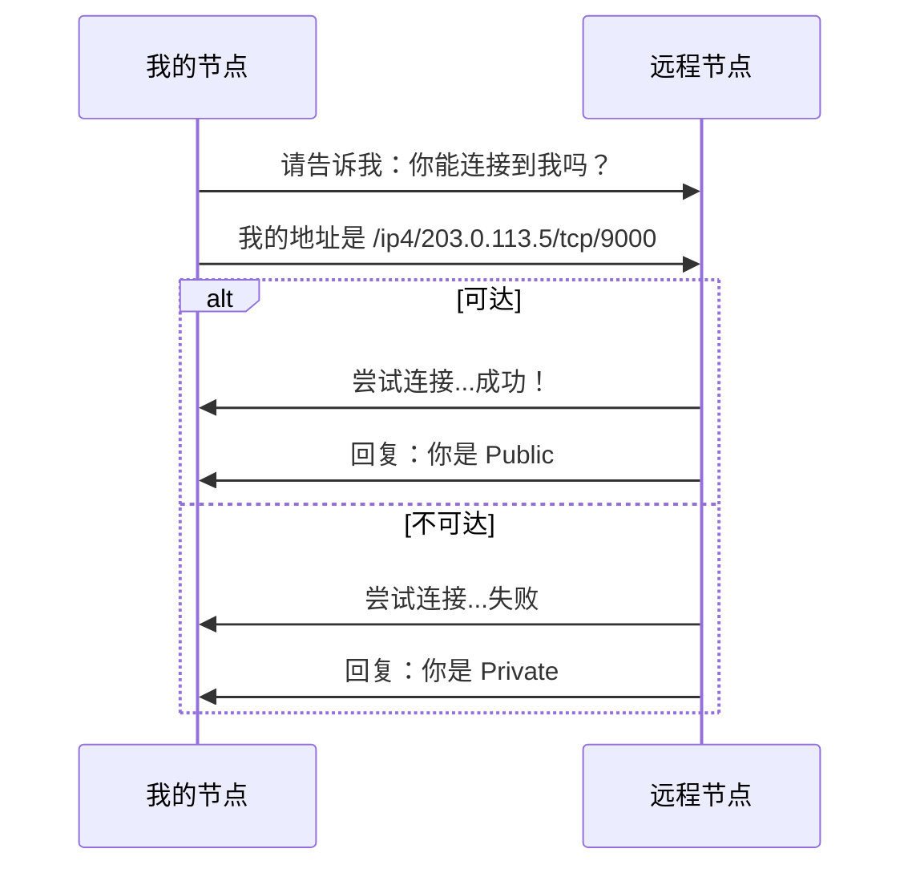
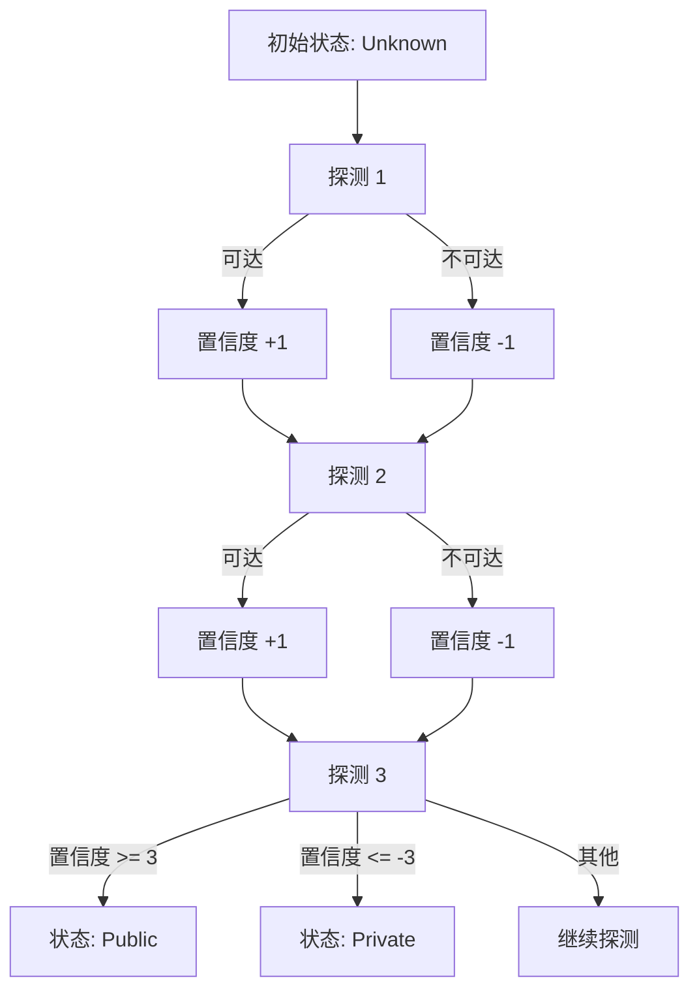

import { Steps, Tabs, TabItem } from '@astrojs/starlight/components';

> 知己知彼，百战不殆。
> ——《孙子兵法》

要突破 NAT 的限制，首先要了解自己的处境。**AutoNAT** 协议帮助节点自动检测自己是否可以被外部直接访问——这是制定正确穿透策略的前提。

## AutoNAT 原理

AutoNAT 通过请求其他节点"回拨"来测试自己的可达性：



### 协议标识符

```
/libp2p/autonat/1.0.0
```

### NAT 状态

AutoNAT 检测的结果：

| 状态 | 说明 |
|-----|------|
| **Public** | 可从外部直接访问 |
| **Private** | 在 NAT 后面，无法直接访问 |
| **Unknown** | 尚未确定（初始状态） |

## 动手实践

:::tip[配套工具]
本教程配套的桌面应用内置了 NAT 检测功能。打开应用后，连接到远程节点，即可查看你的 NAT 状态变化。
:::

<Steps>

1. **添加依赖**

   ```toml ins="autonat"
   [dependencies]
   libp2p = { version = "0.56", features = ["tcp", "noise", "yamux", "autonat", "identify", "macros", "tokio"] }
   tokio = { version = "1", features = ["full"] }
   anyhow = "1"
   tracing-subscriber = "0.3"
   ```

2. **定义组合行为**

   AutoNAT 需要配合 Identify 协议使用：

   ```rust ins={4-5}
   #[derive(NetworkBehaviour)]
   struct MyBehaviour {
       identify: identify::Behaviour,
       autonat: autonat::Behaviour,
   }
   ```

3. **配置 AutoNAT**

   ```rust ins={3-10}
   .with_behaviour(|key| {
       let local_peer_id = key.public().to_peer_id();

       let autonat_config = autonat::Config {
           boot_delay: Duration::from_secs(10),
           refresh_interval: Duration::from_secs(60),
           retry_interval: Duration::from_secs(30),
           ..Default::default()
       };

       Ok(MyBehaviour {
           identify: identify::Behaviour::new(
               identify::Config::new("/autonat-example/1.0.0".into(), key.public())
           ),
           autonat: autonat::Behaviour::new(local_peer_id, autonat_config),
       })
   })?
   ```

4. **处理 NAT 状态变化**

   ```rust ins={3-18}
   SwarmEvent::Behaviour(MyBehaviourEvent::AutoNat(event)) => {
       match event {
           autonat::Event::StatusChanged { old, new } => {
               println!("NAT status: {old:?} -> {new:?}");

               match new {
                   autonat::NatStatus::Public(addr) => {
                       println!("We are PUBLIC at {addr}");
                       // 可以作为服务器接受入站连接
                   }
                   autonat::NatStatus::Private => {
                       println!("We are PRIVATE (behind NAT)");
                       // 需要使用中继
                   }
                   autonat::NatStatus::Unknown => {
                       println!("NAT status unknown, waiting for probes...");
                   }
               }
           }
           _ => {}
       }
   }
   ```

</Steps>

### 配置参数说明

| 参数 | 说明 | 默认值 |
|-----|------|--------|
| `retry_interval` | 检测失败后重试间隔 | 90 秒 |
| `refresh_interval` | 状态确认后刷新间隔 | 15 分钟 |
| `confidence_max` | 需要的确认次数 | 3 |
| `boot_delay` | 启动后等待时间 | 15 秒 |
| `only_global_ips` | 只检测全局 IP | true |

## 完整代码

```rust
use anyhow::Result;
use libp2p::{
    autonat, identify,
    futures::StreamExt,
    identity::Keypair,
    noise, swarm::NetworkBehaviour, swarm::SwarmEvent, tcp, yamux, SwarmBuilder,
};
use std::time::Duration;

#[derive(NetworkBehaviour)]
struct MyBehaviour {
    identify: identify::Behaviour,
    autonat: autonat::Behaviour,
}

#[tokio::main]
async fn main() -> Result<()> {
    tracing_subscriber::fmt::init();

    let keypair = Keypair::generate_ed25519();
    let local_peer_id = keypair.public().to_peer_id();
    println!("Local PeerId: {local_peer_id}");

    let mut swarm = SwarmBuilder::with_existing_identity(keypair.clone())
        .with_tokio()
        .with_tcp(
            tcp::Config::default(),
            noise::Config::new,
            yamux::Config::default,
        )?
        .with_behaviour(|key| {
            let local_peer_id = key.public().to_peer_id();

            let identify = identify::Behaviour::new(
                identify::Config::new("/autonat-example/1.0.0".into(), key.public())
            );

            let autonat_config = autonat::Config {
                boot_delay: Duration::from_secs(10),
                refresh_interval: Duration::from_secs(60),
                retry_interval: Duration::from_secs(30),
                ..Default::default()
            };
            let autonat = autonat::Behaviour::new(local_peer_id, autonat_config);

            Ok(MyBehaviour { identify, autonat })
        })?
        .with_swarm_config(|cfg| {
            cfg.with_idle_connection_timeout(Duration::from_secs(60))
        })
        .build();

    swarm.listen_on("/ip4/0.0.0.0/tcp/0".parse()?)?;

    // 连接到远程节点进行测试
    if let Some(addr) = std::env::args().nth(1) {
        swarm.dial(addr.parse::<libp2p::Multiaddr>()?)?;
    }

    println!("Waiting for AutoNAT detection...");

    loop {
        match swarm.select_next_some().await {
            SwarmEvent::NewListenAddr { address, .. } => {
                println!("Listening on {address}");
            }

            SwarmEvent::ConnectionEstablished { peer_id, .. } => {
                println!("Connected to {peer_id}");
            }

            SwarmEvent::Behaviour(MyBehaviourEvent::Identify(
                identify::Event::Received { peer_id, info }
            )) => {
                println!("Identified {peer_id}:");
                if let Some(addr) = info.observed_addr {
                    println!("  Observed address: {addr}");
                }
            }

            SwarmEvent::Behaviour(MyBehaviourEvent::AutoNat(event)) => {
                match event {
                    autonat::Event::StatusChanged { old, new } => {
                        println!("\n=== NAT Status Changed ===");
                        println!("  Old: {old:?}");
                        println!("  New: {new:?}");

                        match new {
                            autonat::NatStatus::Public(addr) => {
                                println!("  Result: PUBLIC at {addr}");
                                println!("  Action: Can accept incoming connections");
                            }
                            autonat::NatStatus::Private => {
                                println!("  Result: PRIVATE (behind NAT)");
                                println!("  Action: Need relay for incoming connections");
                            }
                            autonat::NatStatus::Unknown => {
                                println!("  Result: UNKNOWN");
                                println!("  Action: Waiting for more probes");
                            }
                        }
                    }

                    autonat::Event::OutboundProbe(probe) => {
                        match probe {
                            autonat::OutboundProbeEvent::Response { peer, address, .. } => {
                                println!("Probe response from {peer}:");
                                if let Some(addr) = address {
                                    println!("  Reachable at: {addr}");
                                } else {
                                    println!("  Not reachable");
                                }
                            }
                            autonat::OutboundProbeEvent::Error { error, .. } => {
                                println!("Probe error: {error:?}");
                            }
                            _ => {}
                        }
                    }

                    _ => {}
                }
            }

            _ => {}
        }
    }
}
```

## 置信度机制

AutoNAT 使用置信度来确定状态，避免因单次探测结果误判：



## AutoNAT 与其他协议配合

### 与 Kademlia 配合

根据 NAT 状态设置 Kademlia 模式：

```rust ins={3-11}
SwarmEvent::Behaviour(MyBehaviourEvent::AutoNat(
    autonat::Event::StatusChanged { new, .. }
)) => {
    match new {
        autonat::NatStatus::Public(_) => {
            // 公网可达，作为 DHT 服务器
            swarm.behaviour_mut().kademlia.set_mode(Some(kad::Mode::Server));
        }
        autonat::NatStatus::Private => {
            // NAT 后面，只作为客户端
            swarm.behaviour_mut().kademlia.set_mode(Some(kad::Mode::Client));
        }
        _ => {}
    }
}
```

### 与 Relay 配合

根据 NAT 状态决定是否使用中继：

```rust ins={3-9}
SwarmEvent::Behaviour(MyBehaviourEvent::AutoNat(
    autonat::Event::StatusChanged { new, .. }
)) => {
    if matches!(new, autonat::NatStatus::Private) {
        // 在 NAT 后面，监听中继地址
        let relay_listen = relay_addr
            .clone()
            .with(libp2p::multiaddr::Protocol::P2pCircuit);
        swarm.listen_on(relay_listen)?;
    }
}
```

## 故障排查

### 常见问题

<Tabs>
<TabItem label="始终显示 Unknown">

确保连接了足够多的支持 AutoNAT 的节点，并检查日志：

```rust
std::env::set_var("RUST_LOG", "libp2p_autonat=debug");
tracing_subscriber::fmt::init();
```

</TabItem>
<TabItem label="状态频繁变化">

增加置信度阈值，需要更多确认：

```rust
let config = autonat::Config {
    confidence_max: 5,  // 从默认 3 增加到 5
    ..Default::default()
};
```

</TabItem>
<TabItem label="探测超时">

检查防火墙设置，确保监听的端口可访问。也可能是远程节点不支持 AutoNAT 服务端。

</TabItem>
</Tabs>

## 小结

本章介绍了 AutoNAT 协议：

- **工作原理**：请求其他节点回拨测试可达性
- **NAT 状态**：Public、Private、Unknown
- **置信度机制**：多次确认避免误判
- **协议配合**：与 Identify、Kademlia、Relay 协同工作

AutoNAT 是 NAT 穿透的第一步——知道自己的状态，才能制定正确的策略。

下一章，我们将学习 **Relay（中继服务）**——当直接连接不可能时的备选方案。
