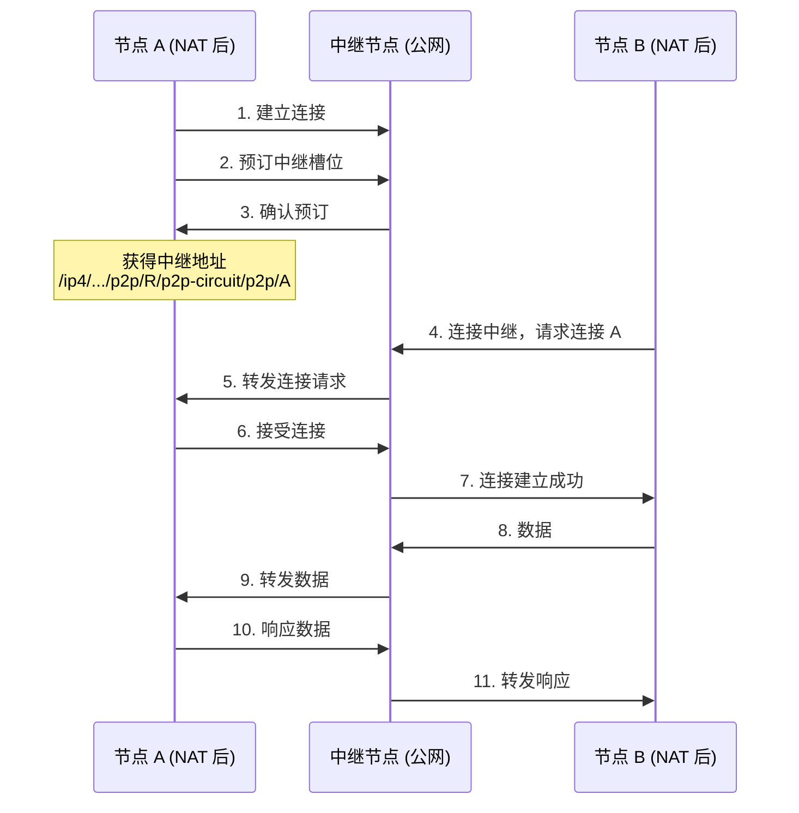
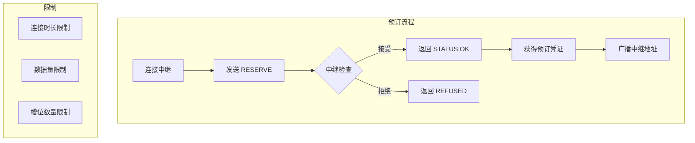
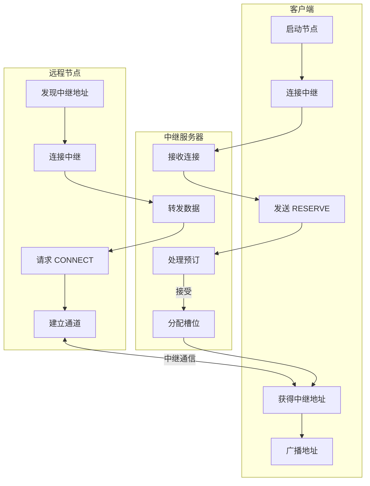

import { Steps, Tabs, TabItem } from '@astrojs/starlight/components';

> 驿寄梅花，鱼传尺素。
> ——秦观《踏莎行》

当两个节点都在 NAT 后面无法直接通信时，需要一个公网可达的"驿站"来转发消息。这就是 **Circuit Relay**（电路中继）——libp2p 的邮递员。

## 中继原理

中继就像古代的驿站，帮助无法直接到达的两地传递信息：



### 协议标识符

Circuit Relay v2 使用两个子协议：

| 协议 | 标识符 | 用途 |
|-----|--------|------|
| **Hop** | `/libp2p/circuit/relay/0.2.0/hop` | 客户端与中继交互 |
| **Stop** | `/libp2p/circuit/relay/0.2.0/stop` | 中继与目标节点交互 |

### 中继地址

中继地址使用 `p2p-circuit` 协议：

```
/ip4/203.0.113.5/tcp/4001/p2p/QmRelay.../p2p-circuit/p2p/QmTarget...
  └─────────────────────────────────────┘                └─────────┘
              中继节点地址                               目标节点 ID
```

## 预订机制

Circuit Relay v2 引入了**槽位预订**机制，解决了 v1 的资源滥用问题：



## 动手实践

:::tip[配套工具]
本教程配套的桌面应用可以作为中继客户端，连接到你运行的中继服务器，观察预订和中继连接的过程。
:::

### 中继客户端

<Steps>

1. **添加依赖**

   ```toml ins="relay"
   [dependencies]
   libp2p = { version = "0.56", features = ["tcp", "noise", "yamux", "relay", "identify", "macros", "tokio"] }
   tokio = { version = "1", features = ["full"] }
   anyhow = "1"
   ```

2. **定义客户端 Behaviour**

   ```rust ins={4-5}
   #[derive(NetworkBehaviour)]
   struct ClientBehaviour {
       relay_client: relay::client::Behaviour,
       identify: identify::Behaviour,
   }
   ```

3. **构建 Swarm（重要：添加中继传输层）**

   ```rust ins={8-9,11-14}
   let mut swarm = SwarmBuilder::with_existing_identity(keypair)
       .with_tokio()
       .with_tcp(
           tcp::Config::default(),
           noise::Config::new,
           yamux::Config::default,
       )?
       // 添加中继客户端传输层（关键！）
       .with_relay_client(noise::Config::new, yamux::Config::default)?
       .with_behaviour(|key, relay_client| {
           Ok(ClientBehaviour {
               relay_client,
               identify: identify::Behaviour::new(
                   identify::Config::new("/relay-client/1.0.0".into(), key.public())
               ),
           })
       })?
       .build();
   ```

4. **连接中继并监听**

   ```rust ins={3-9}
   // 连接中继节点
   swarm.dial(relay_addr.clone())?;

   // 等待连接建立后，通过中继监听
   let relay_listen = relay_addr
       .clone()
       .with(libp2p::multiaddr::Protocol::P2pCircuit);
   swarm.listen_on(relay_listen)?;
   ```

5. **处理中继事件**

   ```rust ins={3-15}
   SwarmEvent::Behaviour(ClientBehaviourEvent::RelayClient(event)) => {
       match event {
           relay::client::Event::ReservationReqAccepted {
               relay_peer_id, limit, ..
           } => {
               println!("Relay reservation accepted by {relay_peer_id}");
               if let Some(limit) = limit {
                   println!("  Duration: {:?}", limit.duration);
                   println!("  Data: {:?}", limit.data_limit);
               }
           }
           relay::client::Event::ReservationReqFailed { error, .. } => {
               println!("Relay reservation failed: {error}");
           }
           _ => {}
       }
   }
   ```

</Steps>

### 中继服务器

<Steps>

1. **定义服务器 Behaviour**

   ```rust ins={4-6}
   #[derive(NetworkBehaviour)]
   struct RelayServerBehaviour {
       relay: relay::Behaviour,
       identify: identify::Behaviour,
       ping: ping::Behaviour,
   }
   ```

2. **配置中继服务**

   ```rust ins={3-12}
   .with_behaviour(|key| {
       let local_peer_id = key.public().to_peer_id();

       let relay_config = relay::Config {
           max_reservations: 128,
           max_reservations_per_peer: 4,
           reservation_duration: Duration::from_secs(3600),
           max_circuits: 16,
           max_circuit_duration: Duration::from_secs(120),
           max_circuit_bytes: 1 << 17, // 128 KiB
           ..Default::default()
       };

       Ok(RelayServerBehaviour {
           relay: relay::Behaviour::new(local_peer_id, relay_config),
           identify: identify::Behaviour::new(
               identify::Config::new("/relay-server/1.0.0".into(), key.public())
           ),
           ping: ping::Behaviour::new(ping::Config::new()),
       })
   })?
   ```

3. **监听公网地址**

   ```rust
   // 中继服务器需要监听公网可达的地址
   swarm.listen_on("/ip4/0.0.0.0/tcp/4001".parse()?)?;
   ```

</Steps>

### 配置参数说明

| 参数 | 说明 | 默认值 |
|-----|------|--------|
| `max_reservations` | 最大预订总数 | 128 |
| `max_reservations_per_peer` | 单节点最大预订 | 4 |
| `reservation_duration` | 预订有效期 | 1 小时 |
| `max_circuits` | 最大并发连接 | 16 |
| `max_circuit_duration` | 连接时长限制 | 2 分钟 |
| `max_circuit_bytes` | 数据量限制 | 128 KiB |

## 完整代码

<Tabs>
<TabItem label="中继服务器">

```rust
use anyhow::Result;
use libp2p::{
    futures::StreamExt, identify, ping, relay,
    identity::Keypair, noise, swarm::NetworkBehaviour,
    swarm::SwarmEvent, tcp, yamux, SwarmBuilder,
};
use std::time::Duration;

#[derive(NetworkBehaviour)]
struct RelayServerBehaviour {
    relay: relay::Behaviour,
    identify: identify::Behaviour,
    ping: ping::Behaviour,
}

#[tokio::main]
async fn main() -> Result<()> {
    tracing_subscriber::fmt::init();

    let keypair = Keypair::generate_ed25519();
    let local_peer_id = keypair.public().to_peer_id();
    println!("Relay PeerId: {local_peer_id}");

    let mut swarm = SwarmBuilder::with_existing_identity(keypair.clone())
        .with_tokio()
        .with_tcp(
            tcp::Config::default(),
            noise::Config::new,
            yamux::Config::default,
        )?
        .with_behaviour(|key| {
            Ok(RelayServerBehaviour {
                relay: relay::Behaviour::new(
                    key.public().to_peer_id(),
                    relay::Config::default(),
                ),
                identify: identify::Behaviour::new(
                    identify::Config::new("/relay-server/1.0.0".into(), key.public())
                ),
                ping: ping::Behaviour::new(ping::Config::new()),
            })
        })?
        .with_swarm_config(|cfg| {
            cfg.with_idle_connection_timeout(Duration::from_secs(60))
        })
        .build();

    swarm.listen_on("/ip4/0.0.0.0/tcp/4001".parse()?)?;

    println!("Relay server running...");

    loop {
        match swarm.select_next_some().await {
            SwarmEvent::NewListenAddr { address, .. } => {
                println!("Listening on {address}");
                println!("Relay address: {address}/p2p/{local_peer_id}");
            }

            SwarmEvent::Behaviour(RelayServerBehaviourEvent::Identify(
                identify::Event::Received { info, .. }
            )) => {
                if let Some(addr) = info.observed_addr {
                    swarm.add_external_address(addr);
                }
            }

            SwarmEvent::Behaviour(RelayServerBehaviourEvent::Relay(event)) => {
                println!("Relay event: {event:?}");
            }

            _ => {}
        }
    }
}
```

</TabItem>
<TabItem label="中继客户端">

```rust
use anyhow::Result;
use libp2p::{
    autonat, dcutr, futures::StreamExt, identify, ping, relay,
    identity::Keypair, noise, swarm::NetworkBehaviour,
    swarm::SwarmEvent, tcp, yamux, Multiaddr, SwarmBuilder,
};
use std::time::Duration;

#[derive(NetworkBehaviour)]
struct ClientBehaviour {
    relay_client: relay::client::Behaviour,
    identify: identify::Behaviour,
    autonat: autonat::Behaviour,
    dcutr: dcutr::Behaviour,
    ping: ping::Behaviour,
}

#[tokio::main]
async fn main() -> Result<()> {
    tracing_subscriber::fmt::init();

    let keypair = Keypair::generate_ed25519();
    let local_peer_id = keypair.public().to_peer_id();
    println!("Local PeerId: {local_peer_id}");

    let mut swarm = SwarmBuilder::with_existing_identity(keypair.clone())
        .with_tokio()
        .with_tcp(
            tcp::Config::default(),
            noise::Config::new,
            yamux::Config::default,
        )?
        .with_relay_client(noise::Config::new, yamux::Config::default)?
        .with_behaviour(|key, relay_client| {
            let local_peer_id = key.public().to_peer_id();

            Ok(ClientBehaviour {
                relay_client,
                identify: identify::Behaviour::new(
                    identify::Config::new("/relay-client/1.0.0".into(), key.public())
                ),
                autonat: autonat::Behaviour::new(local_peer_id, autonat::Config::default()),
                dcutr: dcutr::Behaviour::new(local_peer_id),
                ping: ping::Behaviour::new(ping::Config::new()),
            })
        })?
        .with_swarm_config(|cfg| {
            cfg.with_idle_connection_timeout(Duration::from_secs(60))
        })
        .build();

    swarm.listen_on("/ip4/0.0.0.0/tcp/0".parse()?)?;

    // 中继服务器地址
    let relay_addr: Multiaddr = std::env::args()
        .nth(1)
        .expect("usage: client <relay-addr>")
        .parse()?;

    // 连接中继
    println!("Connecting to relay: {relay_addr}");
    swarm.dial(relay_addr.clone())?;

    let mut connected_to_relay = false;

    loop {
        match swarm.select_next_some().await {
            SwarmEvent::NewListenAddr { address, .. } => {
                println!("Listening on {address}");
            }

            SwarmEvent::ConnectionEstablished { peer_id, .. } => {
                println!("Connected to {peer_id}");

                if !connected_to_relay {
                    connected_to_relay = true;

                    let relay_listen = relay_addr
                        .clone()
                        .with(libp2p::multiaddr::Protocol::P2pCircuit);
                    println!("Listening on relay: {relay_listen}");
                    swarm.listen_on(relay_listen)?;
                }
            }

            SwarmEvent::Behaviour(ClientBehaviourEvent::RelayClient(
                relay::client::Event::ReservationReqAccepted { relay_peer_id, .. }
            )) => {
                println!("Reservation accepted by {relay_peer_id}");
                println!("My relay address: {}/p2p-circuit/p2p/{local_peer_id}", relay_addr);
            }

            SwarmEvent::Behaviour(ClientBehaviourEvent::AutoNat(
                autonat::Event::StatusChanged { new, .. }
            )) => {
                println!("AutoNAT status: {new:?}");
            }

            SwarmEvent::Behaviour(ClientBehaviourEvent::Dcutr(event)) => {
                println!("DCUtR event: {event:?}");
            }

            _ => {}
        }
    }
}
```

</TabItem>
</Tabs>

## 中继连接流程



## 中继 vs 直连

| 特性 | 中继连接 | 直接连接 |
|-----|----------|----------|
| **延迟** | 高（经过第三方） | 低 |
| **带宽** | 受限 | 无限制 |
| **可靠性** | 依赖中继 | 更可靠 |
| **隐私** | 中继可见流量 | 端到端 |
| **成本** | 消耗中继资源 | 无额外成本 |

:::tip[最佳实践]
中继应该作为**备选方案**，而不是主要连接方式。配合 DCUtR 打洞，尽可能升级为直接连接。
:::

## 故障排查

<Tabs>
<TabItem label="预订被拒绝">

检查中继是否已满，或是否超过了每节点限制：

```rust
std::env::set_var("RUST_LOG", "libp2p_relay=debug");
tracing_subscriber::fmt::init();
```

</TabItem>
<TabItem label="连接超时">

验证中继地址正确，检查网络连通性。确保中继服务器正在运行且端口可达。

</TabItem>
<TabItem label="数据传输中断">

可能超过了数据限制或时长限制。检查中继服务器的配置参数。

</TabItem>
</Tabs>

## 小结

本章介绍了 Circuit Relay v2 协议：

- **工作原理**：通过公网中继转发数据
- **预订机制**：槽位预订、资源限制
- **客户端配置**：`relay::client::Behaviour` + `.with_relay_client()`
- **服务器配置**：`relay::Behaviour`
- **最佳实践**：中继作为备选，配合打洞

中继是 NAT 穿透的最后防线——当其他方法都失败时，它确保连接仍然可能。

下一章，我们将学习 **DCUtR（直连升级）**——利用中继协调打洞，将中继连接升级为直接连接。
