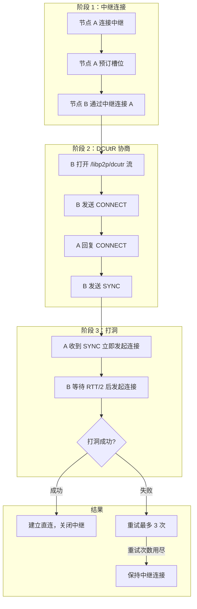
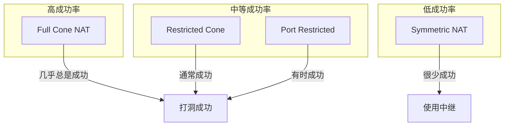
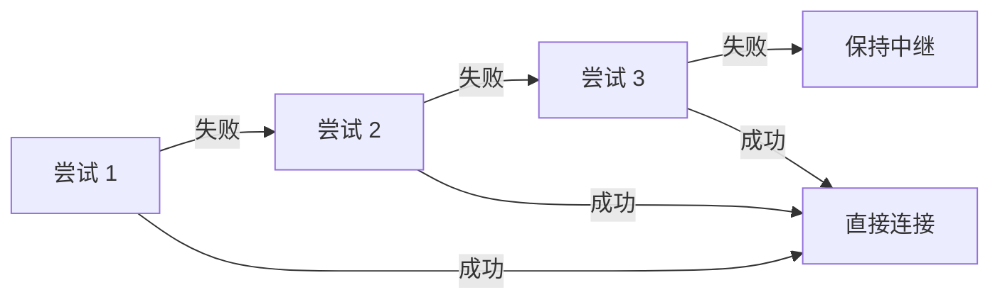

import { Steps, Tabs, TabItem } from '@astrojs/starlight/components';

> 不入虎穴，焉得虎子。
> ——《后汉书·班超传》

中继虽然可靠，但延迟高、带宽受限。如果能"打洞"建立直连，岂不更好？**DCUtR**（Direct Connection Upgrade through Relay）就是这样的"虎穴之旅"——利用中继协调，尝试穿透 NAT 建立直接连接。

## 打洞原理

NAT 打洞（Hole Punching）利用 NAT 的行为特性：

```mermaid
sequenceDiagram
    participant A as 节点 A (NAT 后)
    participant NAT_A as NAT A
    participant NAT_B as NAT B
    participant B as 节点 B (NAT 后)
    participant R as 中继

    Note over A,B: 1. 通过中继建立连接

    A->>R: 建立中继连接
    B->>R: 建立中继连接
    A<-->B: 中继通信

    Note over A,B: 2. 交换地址信息

    B->>A: CONNECT (我的地址列表)
    A->>B: CONNECT (我的地址列表)

    Note over A,B: 3. 同步打洞

    B->>A: SYNC (开始计时)

    Note over A,NAT_A,NAT_B,B: 4. 同时发起连接

    A->>NAT_A: 连接 B 的地址
    NAT_A->>NAT_B: SYN
    B->>NAT_B: 连接 A 的地址
    NAT_B->>NAT_A: SYN

    Note over NAT_A,NAT_B: NAT 看到"响应"<br/>允许数据通过

    A<-->B: 直接连接建立！
```

### 为什么需要同步？

打洞成功的关键是**同时开洞**：

1. **A 先发**：NAT A 记录"A 要连 B"
2. **B 后发**：NAT B 记录"B 要连 A"
3. **双方都发**：两个 NAT 都看到对方的"响应"，允许通过

如果不同步，先发的包会被对方 NAT 丢弃。

## DCUtR 协议

### 协议标识符

```
/libp2p/dcutr
```

### 消息类型

| 消息 | 用途 |
|-----|------|
| `CONNECT` | 交换观察到的地址 |
| `SYNC` | 同步打洞时机 |

### 协议流程



## 动手实践

:::tip[配套工具]
本教程配套的桌面应用支持 DCUtR 协议。你可以用两台设备通过中继连接，观察打洞过程和直连升级。
:::

<Steps>

1. **添加依赖**

   ```toml ins="dcutr"
   [dependencies]
   libp2p = { version = "0.56", features = ["tcp", "noise", "yamux", "relay", "dcutr", "identify", "ping", "macros", "tokio"] }
   tokio = { version = "1", features = ["full"] }
   anyhow = "1"
   tracing-subscriber = { version = "0.3", features = ["env-filter"] }
   ```

2. **定义 Behaviour**

   ```rust ins={5}
   #[derive(NetworkBehaviour)]
   struct MyBehaviour {
       relay_client: relay::client::Behaviour,
       dcutr: dcutr::Behaviour,
       identify: identify::Behaviour,
       ping: ping::Behaviour,
   }
   ```

3. **配置 TCP（重要：启用 nodelay）**

   ```rust ins={4}
   .with_tcp(
       tcp::Config::default().nodelay(true), // 禁用 Nagle 算法，减少打洞延迟
       noise::Config::new,
       yamux::Config::default,
   )?
   ```

4. **创建 DCUtR Behaviour**

   ```rust ins={5}
   .with_behaviour(|key, relay_client| {
       Ok(MyBehaviour {
           relay_client,
           dcutr: dcutr::Behaviour::new(key.public().to_peer_id()),
           identify: identify::Behaviour::new(
               identify::Config::new("/dcutr-example/1.0.0".into(), key.public())
           ),
           ping: ping::Behaviour::new(ping::Config::new()),
       })
   })?
   ```

5. **处理 DCUtR 事件**

   ```rust ins={3-17}
   SwarmEvent::Behaviour(MyBehaviourEvent::Dcutr(event)) => {
       match event {
           dcutr::Event::InitiatedDirectConnectionUpgrade {
               remote_peer_id, local_relayed_addr,
           } => {
               println!("Starting DCUtR with {remote_peer_id}");
               println!("  Relayed addr: {local_relayed_addr}");
           }
           dcutr::Event::DirectConnectionUpgradeSucceeded { remote_peer_id } => {
               println!("DCUtR succeeded with {remote_peer_id}!");
               println!("Now communicating directly");
           }
           dcutr::Event::DirectConnectionUpgradeFailed { remote_peer_id, error } => {
               println!("DCUtR failed with {remote_peer_id}: {error}");
               println!("Keeping relay connection");
           }
           _ => {}
       }
   }
   ```

</Steps>

## 完整代码

<Tabs>
<TabItem label="监听模式">

```rust
use anyhow::Result;
use libp2p::{
    core::multiaddr::Protocol, dcutr, futures::StreamExt, identify, ping, relay,
    identity::Keypair, noise, swarm::NetworkBehaviour,
    swarm::SwarmEvent, tcp, yamux, Multiaddr, SwarmBuilder,
};
use std::time::Duration;

#[derive(NetworkBehaviour)]
struct ListenerBehaviour {
    relay_client: relay::client::Behaviour,
    dcutr: dcutr::Behaviour,
    identify: identify::Behaviour,
    ping: ping::Behaviour,
}

#[tokio::main]
async fn main() -> Result<()> {
    tracing_subscriber::fmt()
        .with_env_filter("libp2p_dcutr=debug,libp2p_relay=debug")
        .init();

    let keypair = Keypair::generate_ed25519();
    let local_peer_id = keypair.public().to_peer_id();
    println!("Local PeerId: {local_peer_id}");

    let mut swarm = SwarmBuilder::with_existing_identity(keypair.clone())
        .with_tokio()
        .with_tcp(
            tcp::Config::default().nodelay(true),
            noise::Config::new,
            yamux::Config::default,
        )?
        .with_relay_client(noise::Config::new, yamux::Config::default)?
        .with_behaviour(|key, relay_client| {
            Ok(ListenerBehaviour {
                relay_client,
                dcutr: dcutr::Behaviour::new(key.public().to_peer_id()),
                identify: identify::Behaviour::new(
                    identify::Config::new("/dcutr-listener/1.0.0".into(), key.public())
                ),
                ping: ping::Behaviour::new(ping::Config::new()),
            })
        })?
        .with_swarm_config(|cfg| {
            cfg.with_idle_connection_timeout(Duration::from_secs(60))
        })
        .build();

    swarm.listen_on("/ip4/0.0.0.0/tcp/0".parse()?)?;

    let relay_addr: Multiaddr = std::env::args()
        .nth(1)
        .expect("usage: listener <relay-addr>")
        .parse()?;

    println!("Connecting to relay: {relay_addr}");
    swarm.dial(relay_addr.clone())?;

    // 等待连接建立
    loop {
        if let SwarmEvent::ConnectionEstablished { peer_id, .. } =
            swarm.select_next_some().await
        {
            println!("Connected to relay: {peer_id}");
            break;
        }
    }

    // 通过中继监听
    let circuit_addr = relay_addr.clone().with(Protocol::P2pCircuit);
    println!("Listening on relay circuit: {circuit_addr}");
    swarm.listen_on(circuit_addr)?;

    loop {
        match swarm.select_next_some().await {
            SwarmEvent::NewListenAddr { address, .. } => {
                println!("Listening on: {address}");
            }

            SwarmEvent::Behaviour(ListenerBehaviourEvent::RelayClient(
                relay::client::Event::ReservationReqAccepted { .. }
            )) => {
                println!("Relay reservation accepted!");
                println!("Other peers can connect via:");
                println!("  {}/p2p-circuit/p2p/{}", relay_addr, local_peer_id);
            }

            SwarmEvent::Behaviour(ListenerBehaviourEvent::Dcutr(event)) => {
                match event {
                    dcutr::Event::DirectConnectionUpgradeSucceeded { remote_peer_id } => {
                        println!("Direct connection established with {remote_peer_id}");
                    }
                    dcutr::Event::DirectConnectionUpgradeFailed { remote_peer_id, error } => {
                        println!("DCUtR failed with {remote_peer_id}: {error}");
                    }
                    other => println!("DCUtR: {other:?}"),
                }
            }

            SwarmEvent::ConnectionEstablished { peer_id, endpoint, .. } => {
                let conn_type = if endpoint.is_relayed() { "relayed" } else { "direct" };
                println!("Connection: {peer_id} ({conn_type})");
            }

            _ => {}
        }
    }
}
```

</TabItem>
<TabItem label="拨号模式">

```rust
use anyhow::Result;
use libp2p::{
    core::multiaddr::Protocol, dcutr, futures::StreamExt, identify, ping, relay,
    identity::Keypair, noise, swarm::NetworkBehaviour,
    swarm::SwarmEvent, tcp, yamux, Multiaddr, PeerId, SwarmBuilder,
};
use std::time::Duration;

#[derive(NetworkBehaviour)]
struct DialerBehaviour {
    relay_client: relay::client::Behaviour,
    dcutr: dcutr::Behaviour,
    identify: identify::Behaviour,
    ping: ping::Behaviour,
}

#[tokio::main]
async fn main() -> Result<()> {
    tracing_subscriber::fmt()
        .with_env_filter("libp2p_dcutr=debug")
        .init();

    let keypair = Keypair::generate_ed25519();
    let local_peer_id = keypair.public().to_peer_id();
    println!("Local PeerId: {local_peer_id}");

    let mut swarm = SwarmBuilder::with_existing_identity(keypair.clone())
        .with_tokio()
        .with_tcp(
            tcp::Config::default().nodelay(true),
            noise::Config::new,
            yamux::Config::default,
        )?
        .with_relay_client(noise::Config::new, yamux::Config::default)?
        .with_behaviour(|key, relay_client| {
            Ok(DialerBehaviour {
                relay_client,
                dcutr: dcutr::Behaviour::new(key.public().to_peer_id()),
                identify: identify::Behaviour::new(
                    identify::Config::new("/dcutr-dialer/1.0.0".into(), key.public())
                ),
                ping: ping::Behaviour::new(ping::Config::new()),
            })
        })?
        .with_swarm_config(|cfg| {
            cfg.with_idle_connection_timeout(Duration::from_secs(60))
        })
        .build();

    swarm.listen_on("/ip4/0.0.0.0/tcp/0".parse()?)?;

    let relay_addr: Multiaddr = std::env::args()
        .nth(1)
        .expect("usage: dialer <relay-addr> <remote-peer-id>")
        .parse()?;

    let remote_peer_id: PeerId = std::env::args()
        .nth(2)
        .expect("usage: dialer <relay-addr> <remote-peer-id>")
        .parse()?;

    // 先连接中继
    println!("Connecting to relay: {relay_addr}");
    swarm.dial(relay_addr.clone())?;

    // 等待 Identify 交换完成
    loop {
        if let SwarmEvent::Behaviour(DialerBehaviourEvent::Identify(
            identify::Event::Received { .. }
        )) = swarm.select_next_some().await
        {
            println!("Exchanged identity with relay");
            break;
        }
    }

    // 通过中继连接目标节点
    let circuit_addr = relay_addr
        .with(Protocol::P2pCircuit)
        .with(Protocol::P2p(remote_peer_id));

    println!("Dialing {remote_peer_id} via relay...");
    swarm.dial(circuit_addr)?;

    loop {
        match swarm.select_next_some().await {
            SwarmEvent::Behaviour(DialerBehaviourEvent::Dcutr(event)) => {
                match event {
                    dcutr::Event::InitiatedDirectConnectionUpgrade { remote_peer_id, .. } => {
                        println!("Starting DCUtR with {remote_peer_id}");
                    }
                    dcutr::Event::DirectConnectionUpgradeSucceeded { remote_peer_id } => {
                        println!("Direct connection established with {remote_peer_id}");
                    }
                    dcutr::Event::DirectConnectionUpgradeFailed { remote_peer_id, error } => {
                        println!("DCUtR failed with {remote_peer_id}: {error}");
                    }
                    other => println!("DCUtR: {other:?}"),
                }
            }

            SwarmEvent::ConnectionEstablished { peer_id, endpoint, .. } => {
                let conn_type = if endpoint.is_relayed() { "relayed" } else { "direct" };
                println!("Connection: {peer_id} ({conn_type})");
            }

            SwarmEvent::Behaviour(DialerBehaviourEvent::Ping(ping::Event {
                peer, result: Ok(rtt), ..
            })) => {
                println!("Ping to {peer}: {rtt:?}");
            }

            _ => {}
        }
    }
}
```

</TabItem>
</Tabs>

## 打洞成功率

打洞成功率取决于 NAT 类型：

| NAT A | NAT B | 成功率 |
|-------|-------|--------|
| Full Cone | 任意 | 高 |
| Restricted | Restricted | 中 |
| Symmetric | Full Cone | 中 |
| Symmetric | Symmetric | 低 |



## DCUtR 与 TCP/QUIC

<Tabs>
<TabItem label="TCP 打洞">

TCP 打洞使用"同时打开"（Simultaneous Open）：

```mermaid
sequenceDiagram
    participant A as 节点 A
    participant NAT_A as NAT A
    participant NAT_B as NAT B
    participant B as 节点 B

    Note over A,B: 同时发送 SYN

    A->>NAT_A: SYN to B
    NAT_A->>NAT_B: SYN
    B->>NAT_B: SYN to A
    NAT_B->>NAT_A: SYN

    Note over NAT_A,NAT_B: 双方 NAT 都看到 SYN<br/>认为是合法连接

    NAT_A->>NAT_B: SYN+ACK
    NAT_B->>NAT_A: SYN+ACK

    A<-->B: TCP 连接建立
```

启用 `nodelay` 禁用 Nagle 算法，减少打洞延迟：

```rust
tcp::Config::default().nodelay(true)
```

</TabItem>
<TabItem label="QUIC 打洞">

QUIC 打洞成功率通常更高（UDP 更容易穿透 NAT）：

```rust
// 同时支持 TCP 和 QUIC
let mut swarm = SwarmBuilder::with_existing_identity(keypair)
    .with_tokio()
    .with_tcp(/* ... */)?
    .with_quic()  // 添加 QUIC 支持
    .with_relay_client(/* ... */)?
    .with_behaviour(/* ... */)?
    .build();

// 同时监听 TCP 和 QUIC
swarm.listen_on("/ip4/0.0.0.0/tcp/0".parse()?)?;
swarm.listen_on("/ip4/0.0.0.0/udp/0/quic-v1".parse()?)?;
```

</TabItem>
</Tabs>

## 重试机制

DCUtR 默认重试 3 次：



每次重试都会：

1. 重新交换 CONNECT 消息
2. 重新测量 RTT
3. 重新同步打洞

## 最佳实践

### 1. 同时支持 TCP 和 QUIC

```rust
swarm.listen_on("/ip4/0.0.0.0/tcp/0".parse()?)?;
swarm.listen_on("/ip4/0.0.0.0/udp/0/quic-v1".parse()?)?;
```

### 2. 监控打洞结果

```rust
SwarmEvent::Behaviour(MyBehaviourEvent::Dcutr(event)) => {
    match event {
        dcutr::Event::DirectConnectionUpgradeSucceeded { .. } => {
            // 记录成功指标
            metrics.hole_punch_success.inc();
        }
        dcutr::Event::DirectConnectionUpgradeFailed { .. } => {
            // 记录失败指标
            metrics.hole_punch_failure.inc();
        }
        _ => {}
    }
}
```

### 3. 正确处理连接类型

```rust
SwarmEvent::ConnectionEstablished { endpoint, .. } => {
    if endpoint.is_relayed() {
        // 中继连接，可能会升级
    } else {
        // 直接连接
    }
}
```

## 故障排查

<Tabs>
<TabItem label="打洞总是失败">

- 检查 NAT 类型（Symmetric NAT 难以打洞）
- 确认双方都监听了正确的地址
- 检查防火墙设置

```rust
std::env::set_var("RUST_LOG", "libp2p_dcutr=debug,libp2p_relay=debug");
tracing_subscriber::fmt::init();
```

</TabItem>
<TabItem label="RTT 测量不准">

可能原因：
- 中继服务器负载过高
- 网络波动

解决：使用更稳定的中继服务器。

</TabItem>
<TabItem label="直连建立后断开">

- 检查安全协议配置是否一致
- 检查多路复用配置

</TabItem>
</Tabs>

## 小结

本章介绍了 DCUtR 协议：

- **打洞原理**：同时开洞，利用 NAT 行为
- **协议流程**：CONNECT 交换地址，SYNC 同步打洞
- **TCP vs QUIC**：QUIC 成功率通常更高
- **重试机制**：默认重试 3 次

DCUtR 是优化 P2P 连接的关键——尽可能将中继连接升级为直接连接，降低延迟、提高带宽。

下一章，我们将学习 **监控与可观测性**——如何观测 libp2p 应用的运行状态。
