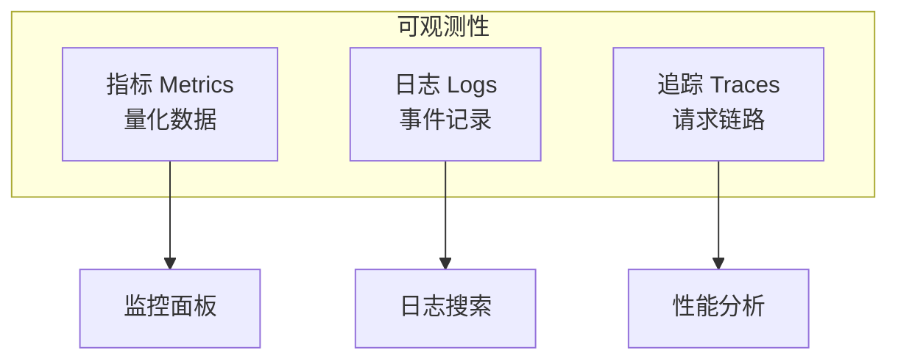

import { Steps, Tabs, TabItem } from '@astrojs/starlight/components';

> 知屋漏者在宇下，知政失者在草野。
> ——王充《论衡》

生产环境的 P2P 应用需要可观测性——知道节点在做什么、连接了多少对等节点、带宽使用情况如何。libp2p 提供了完善的指标（Metrics）支持，让你能够监控和调优你的应用。

## 可观测性三要素



| 类型 | 用途 | 工具 |
|-----|------|------|
| **Metrics** | 量化指标，趋势分析 | Prometheus, Grafana |
| **Logs** | 事件记录，问题排查 | tracing, ELK |
| **Traces** | 请求链路，性能分析 | OpenTelemetry, Jaeger |

## libp2p 支持的指标

libp2p 通过 `libp2p-metrics` crate 提供指标：

| 指标类别 | 说明 |
|---------|------|
| **连接** | 连接数、连接时长、连接方向 |
| **带宽** | 入站/出站字节数 |
| **协议** | 各协议的流数量、错误数 |
| **Ping** | 延迟、成功率 |
| **Identify** | 识别事件数 |
| **Kademlia** | DHT 查询、路由表大小 |
| **GossipSub** | 消息数、主题订阅数 |
| **Relay** | 中继连接数、数据量 |

## 动手实践

:::tip[配套工具]
本教程配套的桌面应用内置了指标展示功能。你可以在应用中查看连接数、带宽等实时指标。
:::

<Steps>

1. **添加依赖**

   ```toml ins="metrics"
   [dependencies]
   libp2p = { version = "0.56", features = ["tcp", "noise", "yamux", "ping", "identify", "metrics", "macros", "tokio"] }
   prometheus-client = "0.22"
   tokio = { version = "1", features = ["full", "net"] }
   anyhow = "1"
   tracing-subscriber = { version = "0.3", features = ["env-filter"] }
   ```

2. **创建指标注册表**

   ```rust ins={3-5}
   use prometheus_client::registry::Registry;
   use libp2p::metrics::{Metrics, Recorder};

   // 创建 Prometheus 注册表
   let mut registry = Registry::default();
   ```

3. **启用带宽指标**

   ```rust ins={8}
   let mut swarm = SwarmBuilder::with_existing_identity(keypair.clone())
       .with_tokio()
       .with_tcp(
           tcp::Config::default(),
           noise::Config::new,
           yamux::Config::default,
       )?
       .with_bandwidth_metrics(&mut registry)
       .with_behaviour(|key| {
           // ...
       })?
       .build();
   ```

4. **创建 libp2p 指标收集器**

   ```rust ins={3}
   // 在构建 Swarm 后创建
   let metrics = Metrics::new(&mut registry);
   ```

5. **记录事件**

   ```rust ins={3-12}
   loop {
       match swarm.select_next_some().await {
           SwarmEvent::Behaviour(MyBehaviourEvent::Ping(event)) => {
               metrics.record(&event);
               // 处理 Ping 事件...
           }
           SwarmEvent::Behaviour(MyBehaviourEvent::Identify(event)) => {
               metrics.record(&event);
               // 处理 Identify 事件...
           }
           swarm_event => {
               metrics.record(&swarm_event);
               // 处理其他事件...
           }
       }
   }
   ```

6. **暴露指标端点**

   ```rust ins={3-20}
   use prometheus_client::encoding::text::encode;
   use tokio::net::TcpListener;
   use tokio::io::AsyncWriteExt;

   async fn serve_metrics(registry: Registry) -> anyhow::Result<()> {
       let listener = TcpListener::bind("0.0.0.0:9090").await?;

       loop {
           let (mut stream, _) = listener.accept().await?;

           let mut buffer = String::new();
           encode(&mut buffer, &registry)?;

           let response = format!(
               "HTTP/1.1 200 OK\r\nContent-Type: text/plain\r\nContent-Length: {}\r\n\r\n{}",
               buffer.len(), buffer
           );

           stream.write_all(response.as_bytes()).await?;
       }
   }
   ```

</Steps>

## 完整代码

```rust
use anyhow::Result;
use libp2p::{
    futures::StreamExt, identify, ping,
    identity::Keypair, metrics::{Metrics, Recorder}, noise,
    swarm::NetworkBehaviour, swarm::SwarmEvent, tcp, yamux, Multiaddr, SwarmBuilder,
};
use prometheus_client::{encoding::text::encode, registry::Registry};
use std::time::Duration;
use tokio::io::AsyncWriteExt;
use tokio::net::TcpListener;

#[derive(NetworkBehaviour)]
struct MyBehaviour {
    ping: ping::Behaviour,
    identify: identify::Behaviour,
}

#[tokio::main]
async fn main() -> Result<()> {
    tracing_subscriber::fmt()
        .with_env_filter("info,libp2p=debug")
        .init();

    // 创建指标注册表
    let mut registry = Registry::default();

    let keypair = Keypair::generate_ed25519();
    let local_peer_id = keypair.public().to_peer_id();
    println!("Local PeerId: {local_peer_id}");

    // 构建 Swarm，启用带宽指标
    let mut swarm = SwarmBuilder::with_existing_identity(keypair.clone())
        .with_tokio()
        .with_tcp(
            tcp::Config::default(),
            noise::Config::new,
            yamux::Config::default,
        )?
        .with_bandwidth_metrics(&mut registry)
        .with_behaviour(|key| {
            Ok(MyBehaviour {
                ping: ping::Behaviour::new(ping::Config::new()),
                identify: identify::Behaviour::new(
                    identify::Config::new("/metrics-example/1.0.0".into(), key.public())
                ),
            })
        })?
        .with_swarm_config(|cfg| {
            cfg.with_idle_connection_timeout(Duration::from_secs(60))
        })
        .build();

    swarm.listen_on("/ip4/0.0.0.0/tcp/0".parse()?)?;

    // 连接到远程节点（可选）
    if let Some(addr) = std::env::args().nth(1) {
        let remote: Multiaddr = addr.parse()?;
        swarm.dial(remote)?;
    }

    // 创建 libp2p 指标收集器
    let metrics = Metrics::new(&mut registry);

    // 启动指标 HTTP 服务
    tokio::spawn(serve_metrics(registry));

    println!("Metrics available at http://localhost:9090/metrics");

    loop {
        match swarm.select_next_some().await {
            SwarmEvent::NewListenAddr { address, .. } => {
                println!("Listening on {address}");
            }

            SwarmEvent::ConnectionEstablished { peer_id, .. } => {
                println!("Connected to {peer_id}");
            }

            SwarmEvent::Behaviour(MyBehaviourEvent::Ping(event)) => {
                println!("Ping: {event:?}");
                metrics.record(&event);
            }

            SwarmEvent::Behaviour(MyBehaviourEvent::Identify(event)) => {
                println!("Identify: {event:?}");
                metrics.record(&event);
            }

            swarm_event => {
                metrics.record(&swarm_event);
            }
        }
    }
}

async fn serve_metrics(registry: Registry) -> Result<()> {
    let listener = TcpListener::bind("0.0.0.0:9090").await?;

    loop {
        let (mut stream, _) = listener.accept().await?;

        let mut buffer = String::new();
        encode(&mut buffer, &registry)?;

        let response = format!(
            "HTTP/1.1 200 OK\r\nContent-Type: text/plain\r\nContent-Length: {}\r\n\r\n{}",
            buffer.len(), buffer
        );

        stream.write_all(response.as_bytes()).await?;
    }
}
```

## 日志配置

<Steps>

1. **基本配置**

   ```rust
   use tracing_subscriber::{fmt, EnvFilter};

   tracing_subscriber::fmt()
       .with_env_filter(
           EnvFilter::from_default_env()
               .add_directive("libp2p=debug".parse().unwrap())
               .add_directive("libp2p_ping=info".parse().unwrap())
       )
       .with_target(true)
       .with_file(true)
       .with_line_number(true)
       .init();
   ```

2. **环境变量配置**

   ```bash
   # 按模块配置日志级别
   RUST_LOG=info,libp2p=debug,libp2p_gossipsub=trace cargo run
   ```

</Steps>

### 日志级别

| 级别 | 用途 |
|-----|------|
| `error` | 严重错误 |
| `warn` | 警告信息 |
| `info` | 一般信息 |
| `debug` | 调试信息 |
| `trace` | 详细追踪 |

## Prometheus + Grafana

### 架构


### Prometheus 配置

```yaml
# prometheus.yml
global:
  scrape_interval: 15s

scrape_configs:
  - job_name: 'libp2p'
    static_configs:
      - targets: ['localhost:9090']
```

### 常用 PromQL 查询

<Tabs>
<TabItem label="连接">

```promql
# 当前连接数
libp2p_swarm_connections_established_total - libp2p_swarm_connections_closed_total

# 连接错误率
rate(libp2p_swarm_connections_error_total[5m])
```

</TabItem>
<TabItem label="带宽">

```promql
# 入站带宽（每秒）
rate(libp2p_bandwidth_inbound_bytes_total[1m])

# 出站带宽（每秒）
rate(libp2p_bandwidth_outbound_bytes_total[1m])
```

</TabItem>
<TabItem label="延迟">

```promql
# Ping 延迟 P95
histogram_quantile(0.95, rate(libp2p_ping_rtt_bucket[5m]))
```

</TabItem>
</Tabs>

### 推荐 Grafana 面板

| 面板 | 指标 | 说明 |
|-----|------|------|
| 连接数 | `connections_established - connections_closed` | 当前活跃连接 |
| 带宽 | `rate(bandwidth_*_bytes_total[1m])` | 入站/出站流量 |
| Ping 延迟 | `ping_rtt` histogram | P50/P95/P99 延迟 |
| 协议流量 | `per_protocol_*` | 各协议的数据量 |
| 错误率 | `rate(*_error_total)` | 连接/协议错误 |

## 自定义指标

```rust
use prometheus_client::{
    encoding::EncodeLabelSet,
    metrics::{counter::Counter, family::Family, gauge::Gauge, histogram::Histogram},
    registry::Registry,
};

#[derive(Clone, Debug, Hash, PartialEq, Eq, EncodeLabelSet)]
struct MessageLabels {
    topic: String,
    peer_id: String,
}

struct AppMetrics {
    messages_received: Family<MessageLabels, Counter>,
    messages_sent: Family<MessageLabels, Counter>,
    active_peers: Gauge,
    message_size: Histogram,
}

impl AppMetrics {
    fn new(registry: &mut Registry) -> Self {
        let messages_received = Family::<MessageLabels, Counter>::default();
        let messages_sent = Family::<MessageLabels, Counter>::default();
        let active_peers = Gauge::default();
        let message_size = Histogram::new(
            [64.0, 256.0, 1024.0, 4096.0, 16384.0, 65536.0].into_iter()
        );

        registry.register("app_messages_received", "Total messages received", messages_received.clone());
        registry.register("app_messages_sent", "Total messages sent", messages_sent.clone());
        registry.register("app_active_peers", "Current number of active peers", active_peers.clone());
        registry.register("app_message_size_bytes", "Message size distribution", message_size.clone());

        Self { messages_received, messages_sent, active_peers, message_size }
    }
}

// 使用
app_metrics.messages_received
    .get_or_create(&MessageLabels {
        topic: "chat".to_string(),
        peer_id: peer_id.to_string(),
    })
    .inc();

app_metrics.active_peers.set(connected_peers.len() as i64);
app_metrics.message_size.observe(message.len() as f64);
```

## 告警配置

### Prometheus 告警规则

```yaml
# alerts.yml
groups:
  - name: libp2p
    rules:
      - alert: HighConnectionErrorRate
        expr: rate(libp2p_swarm_connections_error_total[5m]) > 0.1
        for: 5m
        labels:
          severity: warning
        annotations:
          summary: "High connection error rate"
          description: "Connection error rate is {{ $value }} errors/second"

      - alert: LowPeerCount
        expr: (libp2p_swarm_connections_established_total - libp2p_swarm_connections_closed_total) < 3
        for: 10m
        labels:
          severity: critical
        annotations:
          summary: "Low peer count"
          description: "Only {{ $value }} peers connected"

      - alert: HighPingLatency
        expr: histogram_quantile(0.95, rate(libp2p_ping_rtt_bucket[5m])) > 1
        for: 5m
        labels:
          severity: warning
        annotations:
          summary: "High ping latency"
          description: "P95 ping latency is {{ $value }}s"
```

## 生产环境配置

### 指标安全

```rust
// 只在内网暴露指标端口
let metrics_addr: std::net::SocketAddr = "127.0.0.1:9090".parse()?;
```

### 采样率

```rust
// 高频事件可以采样
let should_record = rand::random::<f64>() < 0.1; // 10% 采样
if should_record {
    metrics.record(&event);
}
```

## 调试技巧

<Tabs>
<TabItem label="详细日志">

```bash
RUST_LOG=libp2p=trace cargo run 2>&1 | tee debug.log
```

</TabItem>
<TabItem label="检查指标">

```bash
curl -s http://localhost:9090/metrics | grep libp2p
```

</TabItem>
<TabItem label="监控连接">

```rust
SwarmEvent::ConnectionEstablished { peer_id, endpoint, .. } => {
    tracing::info!(
        peer = %peer_id,
        endpoint = ?endpoint,
        total_peers = swarm.connected_peers().count(),
        "Connection established"
    );
}
```

</TabItem>
</Tabs>

## 小结

本章介绍了 libp2p 的监控与可观测性：

- **指标（Metrics）**：使用 prometheus-client 收集和暴露指标
- **日志（Logs）**：使用 tracing 进行结构化日志
- **带宽监控**：`.with_bandwidth_metrics()` 启用带宽统计
- **可视化**：Prometheus + Grafana 构建监控面板
- **告警**：基于指标配置告警规则

良好的可观测性是生产级 P2P 应用的基础——让你能够及时发现和解决问题。

至此，我们完成了第六篇"生产环境"的全部内容。你已经掌握了 NAT 穿透、中继服务、打洞协议和监控可观测性——这些是部署生产级 P2P 应用的关键技术。

下一篇，我们将进入**实战项目**——综合运用所学知识，构建一个基于 libp2p 的 P2P 协作编辑应用。
