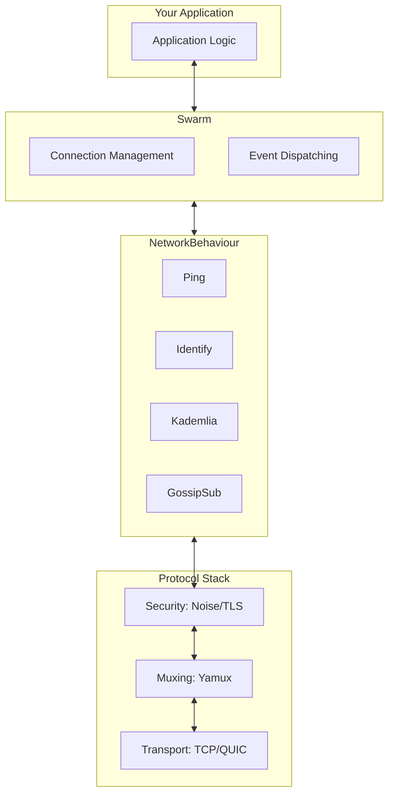

## Every P2P Project Was Reinventing the Wheel

In 2015, [Juan Benet](https://en.wikipedia.org/wiki/Juan_Benet_(computer_scientist)) and his team were developing [IPFS](https://ipfs.tech/)—a decentralized file system designed to replace HTTP. They needed to build a P2P network capable of efficient communication among millions of nodes worldwide.

But soon, they found themselves trapped in a familiar dilemma:

- How do two devices behind home routers connect to each other? (NAT traversal)
- How do you establish secure channels between untrusted nodes? (Encrypted transport)
- How do you discover who in the network has a particular file? (Peer discovery)
- How do you automatically reconnect after disconnection? (Connection management)

These problems had been encountered by [Napster](https://en.wikipedia.org/wiki/Napster) twenty years earlier, partially solved by [BitTorrent](https://en.wikipedia.org/wiki/BitTorrent), and addressed differently by [Bitcoin](https://bitcoin.org/) and [Freenet](https://freenetproject.org/). **Every project was reinventing the networking layer**.

Worse still, these implementations were often tightly coupled with application logic. Want to use BitTorrent's [DHT](https://en.wikipedia.org/wiki/Distributed_hash_table) in a blockchain? Nearly impossible. Want to add [QUIC](https://en.wikipedia.org/wiki/QUIC) transport to Bitcoin? You'd have to rewrite half the network stack.

"This is absurd," Benet later recalled. "We weren't building new protocols—we were constantly copying old mistakes."

So the IPFS team made a decision: **extract the networking layer into a standalone, reusable toolkit**. That toolkit became **[libp2p](https://libp2p.io/)**.

> libp2p is not an application—it's a **LEGO system for building network stacks**.

## Modularity: The Core Philosophy of libp2p

In traditional network programming, we're used to fixed combinations like TCP/IP + TLS + DNS. It's like a prix fixe meal: take it all or starve.

But P2P networks have vastly different requirements:

- Blockchain nodes need maximum security, willing to sacrifice some speed
- Real-time collaborative editing needs low latency, tolerating occasional packet loss
- IoT devices have limited resources, only able to run lightweight protocols
- Some network environments require [WebRTC](https://webrtc.org/) or [WebSocket](https://en.wikipedia.org/wiki/WebSocket) relaying

**No "universal protocol" can fit all scenarios**. libp2p's answer is: **decoupling**.

It breaks down P2P network communication into a series of orthogonal abstraction layers, each offering multiple implementations that developers can combine as needed:

| Abstraction Layer | Purpose | Available Implementations |
|------------------|---------|---------------------------|
| **Transport** | Establish low-level byte stream connections | TCP, QUIC, WebSocket, WebRTC |
| **Security** | Encryption and authentication | TLS, [Noise](https://noiseprotocol.org/) |
| **Muxing** | Carry multiple logical streams over a single connection | Yamux, Mplex |
| **Discovery** | Find other nodes in the network | [mDNS](https://en.wikipedia.org/wiki/Multicast_DNS), [Kademlia](https://en.wikipedia.org/wiki/Kademlia) DHT, Bootstrap |
| **Routing** | Query "who has X?" | Kademlia DHT |
| **PubSub** | Broadcast messages to interest groups | [GossipSub](https://docs.libp2p.io/concepts/pubsub/overview/) |

You can use TCP + Noise + Yamux to build a secure, efficient private network; or use WebRTC + TLS to let browsers participate directly in P2P communication. You can even dynamically switch transport protocols at runtime—try direct connection first, automatically fall back to WebSocket relay on failure.

This is the core philosophy of libp2p: **don't dictate "how you should do it"—provide options for "how you could do it"**.

## Two Fundamental Concepts: PeerId and Multiaddr

Before diving deeper into libp2p's architecture, we need to understand two fundamental concepts—they are the foundation of the entire system.

### PeerId: A Node's Identity

In centralized networks, you find servers by IP address. But in P2P networks, IP addresses are unreliable—devices may move, restart, or switch networks. More importantly, **IP cannot prove "who you are"**.

libp2p introduces **PeerId** as a node's permanent identity. It's not a random string, but generated using **public-key cryptography**:


Key properties of PeerId:

- **Uniqueness**: Different public keys are virtually guaranteed to produce different PeerIds
- **Verifiability**: Any node can use the public key to verify whether the counterpart truly owns that PeerId
- **Location-independent**: PeerId remains the same regardless of which IP or port you connect from

This means in a libp2p network, you're not "connecting to an address"—you're "connecting to an identity."

```rust
use libp2p::identity::Keypair;

let keypair = Keypair::generate_ed25519();  // Ed25519 is an efficient elliptic curve signature algorithm
let peer_id = keypair.public().to_peer_id();
println!("My PeerId: {peer_id}");
// Output: 12D3KooWDpJ7As7BWAwRMfu1VU2WCqNjvq387JEYKDBj4kx6nXTN
```

### Multiaddr: How to Reach You

With identity established, we still need to know "how to connect." libp2p invented **[Multiaddr](https://multiformats.io/multiaddr/)**—a self-describing address format.

Traditional addresses are flat: `192.168.1.100:8080`

Multiaddr is **layered**, explicitly describing the connection path:

```text
/ip4/192.168.1.100/tcp/8080/p2p/12D3KooWRvUH...
```

It tells you: use IPv4, target IP is 192.168.1.100, connect via TCP port 8080, then verify the peer's PeerId.

Multiaddr supports arbitrary protocol nesting, allowing libp2p to seamlessly support future transport protocols:

```text
/ip4/192.168.1.1/udp/8080/quic-v1
/ip4/192.168.1.1/tcp/8080/ws
/dns4/bootstrap.libp2p.io/tcp/443/wss/p2p/12D3KooW...
```

## Swarm and NetworkBehaviour: libp2p's Runtime Architecture

With PeerId (identity) and Multiaddr (address), we know "who is who" and "how to connect." But these are just static concepts—what actually makes libp2p run are **Swarm** and **NetworkBehaviour**.



### Swarm: The Connection Management Hub

**Swarm** is libp2p's core runtime, responsible for:

- Managing all active connections
- Listening for inbound connections and initiating outbound connections
- Dispatching network events to corresponding protocol handlers

Think of Swarm as a "switch"—all network traffic flows through it.

```rust
use libp2p::swarm::SwarmEvent;

loop {
    match swarm.select_next_some().await {
        SwarmEvent::NewListenAddr { address, .. } => {
            println!("Listening on: {address}");
        }
        SwarmEvent::ConnectionEstablished { peer_id, .. } => {
            println!("Connected to: {peer_id}");
        }
        SwarmEvent::Behaviour(event) => {
            // Handle protocol events
        }
        _ => {}
    }
}
```

Swarm is your single entry point for interacting with the libp2p network—listening, connecting, sending messages all go through it.

### NetworkBehaviour: Defining Node Behavior

Swarm manages the "pipes," but "what flows through the pipes" is determined by **NetworkBehaviour**.

NetworkBehaviour is a trait that defines how a node responds to network events. libp2p provides several built-in implementations:

| Behaviour | Purpose |
|-----------|---------|
| **Ping** | Check if a connection is alive |
| **Identify** | Exchange node information (protocol versions, listen addresses, etc.) |
| **Kademlia** | Distributed hash table for peer discovery and content routing |
| **GossipSub** | Publish-subscribe message delivery |
| **RequestResponse** | Request-response pattern |

You can combine multiple Behaviours to build complex applications:

```rust
use libp2p::{ping, identify, gossipsub, swarm::NetworkBehaviour};

#[derive(NetworkBehaviour)]
struct MyBehaviour {
    ping: ping::Behaviour,
    identify: identify::Behaviour,
    gossipsub: gossipsub::Behaviour,
}
```

The `#[derive(NetworkBehaviour)]` macro automatically merges events from each sub-Behaviour, letting you handle all protocols in a single event loop.

### The Relationship Between Abstraction Layers and Runtime

Now we can connect the concepts:

- **Abstraction layers** (Transport, Security, Muxing) define "how to establish connections"
- **Swarm** manages the lifecycle of these connections
- **NetworkBehaviour** defines "what to do after the connection is established"

When you call `swarm.dial(addr)`, libp2p will:

1. Select the appropriate Transport based on the Multiaddr (e.g., TCP)
2. After establishing the connection, encrypt it using the Security layer (e.g., Noise)
3. Multiplex using the Muxing layer (e.g., Yamux)
4. Finally hand the connection to NetworkBehaviour for processing

This layered design lets you flexibly replace any layer without affecting the others.

## The libp2p Ecosystem

Since its open-source release in 2015, libp2p has become the "networking layer standard" for decentralized infrastructure:

- **[IPFS](https://ipfs.tech/)**: Uses libp2p for file block discovery and transfer
- **[Filecoin](https://filecoin.io/)**: Heavily relies on libp2p for storage markets and retrieval protocols
- **[Ethereum 2.0](https://ethereum.org/)**: The consensus layer uses libp2p for peer discovery and GossipSub block broadcasting
- **[Polkadot](https://polkadot.network/)**: Uses libp2p for communication between parachains and relay chains

libp2p is **language-agnostic**—different implementations can interoperate:

| Language | Project | Maturity |
|----------|---------|----------|
| Go | [go-libp2p](https://github.com/libp2p/go-libp2p) | Most mature, primary IPFS implementation |
| Rust | [rust-libp2p](https://github.com/libp2p/rust-libp2p) | Active development, excellent performance |
| JavaScript | [js-libp2p](https://github.com/libp2p/js-libp2p) | Browser and Node.js |
| Nim | [nim-libp2p](https://github.com/status-im/nim-libp2p) | Maintained by Status team |

## Why Choose libp2p?

Back to the original question: why use libp2p instead of writing your own P2P network?

- **Avoid reinventing the wheel**: NAT traversal, relay, encryption, DHT... these hard problems already have mature implementations
- **Protocol flexibility**: Easily switch transport and security layers to adapt to different deployment environments
- **Interoperability**: Native compatibility with IPFS, Ethereum, and other major projects
- **Future-ready**: WebTransport, QUIC, and other new protocols are already integrated or planned

Most importantly, libp2p lets you **focus on application logic**, not networking details.

## Summary

This chapter introduced the background and core architecture of libp2p:

- **Modular design**: Transport, security, and multiplexing layers are independent and flexibly combinable
- **PeerId**: Public-key-based node identity, self-proving and location-independent
- **Multiaddr**: Self-describing address format supporting arbitrary protocol nesting
- **Swarm**: Connection management hub, the entry point for all network operations
- **NetworkBehaviour**: Defines node behavior, composable across multiple protocols

In the next chapter, we'll dive deeper into PeerId and key management, exploring how libp2p establishes trust between nodes.
