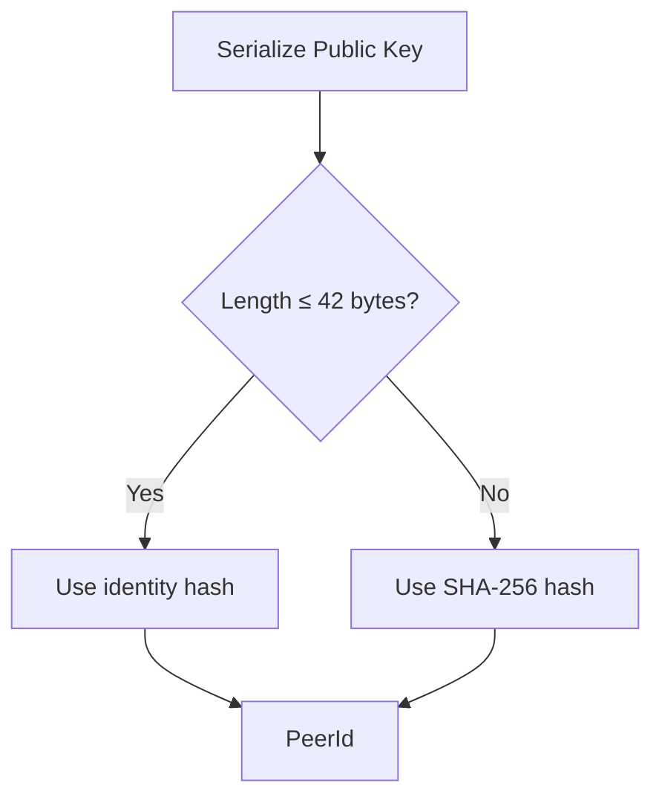

## A Real Security Incident

In 2018, the Ethereum network suffered an "[Eclipse Attack](https://www.cs.bu.edu/~goldbe/projects/eclipseEth.pdf)". Through careful planning, attackers gradually took control of all network connections of the victim node. The victim believed they were connected to the real Ethereum network, but in reality, all connections were to malicious nodes controlled by the attackers. The transactions and blocks the victim saw were all forged.

Imagine this scenario: you run a small shop accepting Ethereum payments. A "customer" buys goods worth $1,000 in ETH. Your node shows the transaction as confirmed, and you hand over the merchandise. But hours later, you discover your node was isolated—that transaction never actually occurred on the mainnet.

This attack exposed a fundamental problem: **In a network without a central server, how do you know the nodes you're connected to are really the ones you intended to connect to?**

## The Identity Dilemma

In the traditional internet, we use IP addresses to locate servers. But IP addresses have two fatal flaws as identity markers:

**Unstable.** When your phone switches from WiFi to 4G, your IP changes. When your home router restarts, your IP might change. When you take your laptop from home to a coffee shop, your IP will definitely change. In P2P networks, nodes may run on different devices in different network environments—IP addresses simply cannot serve as stable identifiers.

**Untrustworthy.** An IP address is just a "location", not an "identity". Anyone can claim to be providing services behind a certain IP address, and you have no way to verify their true identity. In client-server architecture, we solve this through DNS + TLS certificates—CA organizations act as trusted third parties, certifying that a domain truly belongs to a company.

But P2P networks have no centralized CA. No one can "issue certificates" to prove that node A is really node A. We need a **self-certifying identity**—one that doesn't rely on any third party and can be independently verified by anyone.

libp2p's answer is: **Replace location with cryptography, replace third-party authentication with self-certifying identity**.

## PeerId: Your Digital Fingerprint

Every libp2p node has a **PeerId**—a unique identifier derived from a public key. It looks like this:

```
12D3KooWMgcJeCtWqiptgnn4HHY6jRkMaRzHumXrntP3Np7qUqMT
```

The PeerId generation process is straightforward:


In Rust code:

```rust
use libp2p::identity::Keypair;

// Generate Ed25519 key pair
let keypair = Keypair::generate_ed25519();

// Derive PeerId from public key
let peer_id = keypair.public().to_peer_id();

println!("PeerId: {peer_id}");
// Output: 12D3KooWMgcJeCtWqiptgnn4HHY6jRkMaRzHumXrntP3Np7qUqMT
```

### Why is PeerId Trustworthy?

The magic of PeerId lies in its binding to the key pair. When node A connects to node B:

1. B presents its public key
2. A uses this public key to compute the PeerId and verifies it matches
3. B signs a challenge message with its private key, proving it actually holds the private key

This process occurs during the encrypted handshake when establishing a connection (Noise or TLS), requiring no additional configuration.

**Key insight**: PeerId is not "assigned"—it's "computed". Only someone holding the corresponding private key can prove they own a particular PeerId.

## Key Types

libp2p supports four key types:

| Type | Characteristics | Recommended Use Cases |
|------|-----------------|----------------------|
| **[Ed25519](https://ed25519.cr.yp.to/)** | Fast, secure, short keys (32 bytes) | **Default choice**, most scenarios |
| RSA | Good compatibility, but long keys and slow | Interoperating with legacy systems |
| [Secp256k1](https://en.bitcoin.it/wiki/Secp256k1) | Curve used by Bitcoin/Ethereum | Blockchain applications, reusing existing keys |
| ECDSA | Standard elliptic curve | Special compatibility requirements |

:::tip[Companion Tool]
You can use the companion tool "PeerId Generator" from this tutorial to generate PeerIds with different key types and see their format differences firsthand.
:::

**Practical advice**: Unless you have a specific reason, always use Ed25519. It's libp2p's default choice and currently the most balanced option.

```rust
use libp2p::identity::Keypair;

// Ed25519 (recommended)
let keypair = Keypair::generate_ed25519();

// If you need other types
// let keypair = Keypair::generate_secp256k1();
// let keypair = Keypair::generate_ecdsa();
```

## Specification Deep Dive: Key and PeerId Serialization

libp2p has an official specification [peer-ids](https://github.com/libp2p/specs/blob/master/peer-ids/peer-ids.md) that defines the encoding formats for keys and PeerIds. Understanding this specification helps you debug issues, achieve interoperability, and understand why PeerIds look the way they do.

### Protobuf Encoding of Keys

All keys are encoded using [Protobuf](https://protobuf.dev/) format with two fields:

```protobuf
enum KeyType {
    RSA = 0;
    Ed25519 = 1;
    Secp256k1 = 2;
    ECDSA = 3;
}

message PublicKey {
    required KeyType Type = 1;
    required bytes Data = 2;
}
```

The content of the `Data` field varies by key type:

| Key Type    | Data Field Content           |
| ----------- | ---------------------------- |
| Ed25519     | Raw public key bytes (32 bytes) |
| RSA         | DER-encoded PKIX format      |
| Secp256k1   | Bitcoin standard EC encoding |
| ECDSA       | ASN.1 DER encoding           |

The specification has an additional requirement for encoders: **Encoding must be deterministic**. This means the same key must produce exactly the same encoding result, regardless of when or where it's encoded. This is critical for PeerId consistency.

### PeerId Generation Rules

A PeerId is a [Multihash](https://multiformats.io/multihash/) of the public key. The specification defines a critical 42-byte threshold:



- **≤ 42 bytes**: Uses `identity` multihash (actually no hashing, the public key is embedded directly)
- **> 42 bytes**: Uses SHA-256 multihash (hashed before embedding)

Why 42 bytes? This is a pragmatic choice—Ed25519 public keys serialize to within this range (about 36 bytes) and can be embedded directly. RSA public keys can be hundreds of bytes and must be hashed first.

:::note[Interoperability]
If you need to interoperate with libp2p implementations in other languages, ensure your key serialization follows the specification. [rust-libp2p](https://github.com/libp2p/rust-libp2p)'s `to_protobuf_encoding()` and `from_protobuf_encoding()` correctly implement these rules.
:::

### String Representation: Two Formats

The specification defines two string representations for PeerIds:

**Legacy format ([Base58btc](https://en.bitcoin.it/wiki/Base58Check_encoding) encoded Multihash):**

```
12D3KooWD3eckifWpRn9wQpMG9R9hX3sD158z7EqHWmweQAJU5SA  # Ed25519
QmYyQSo1c1Ym7orWxLYvCrM2EmxFTANf8wXmmE7DWjhx5N        # RSA
```

**New format (CIDv1 encoded):**

```
bafzbeie5745rpv2m6tjyuugywy4d5ewrqgqqhfnf445he3omzpjbx5xqxe
```

The new format uses [CIDv1](https://github.com/multiformats/cid), containing the `libp2p-key` [multicodec](https://github.com/multiformats/multicodec) (0x72), defaulting to [Base32](https://en.wikipedia.org/wiki/Base32) encoding.

Currently, the specification requires implementations to **support parsing both formats**, but **should use the legacy format for display**—until the new format is widely supported. rust-libp2p outputs the legacy format by default.

## Key Persistence

Generate a new key on every startup? Then your PeerId will change each time, and other nodes won't be able to recognize you. In production environments, keys must be persisted.

### Saving Keys

```rust
use libp2p::identity::Keypair;
use std::fs;

let keypair = Keypair::generate_ed25519();

// Serialize to Protobuf format
let encoded = keypair.to_protobuf_encoding()
    .expect("Failed to encode keypair");

// Save to file (note: this is sensitive data!)
fs::write("keypair.bin", &encoded)
    .expect("Failed to write keypair");
```

### Loading Keys

```rust
use libp2p::identity::Keypair;
use std::fs;

let encoded = fs::read("keypair.bin")
    .expect("Failed to read keypair");

let keypair = Keypair::from_protobuf_encoding(&encoded)
    .expect("Failed to decode keypair");

println!("Loaded PeerId: {}", keypair.public().to_peer_id());
```

### Complete Example: Load or Generate on Startup

```rust
use libp2p::identity::Keypair;
use std::path::Path;
use std::fs;

fn load_or_generate_keypair(path: &Path) -> Keypair {
    if path.exists() {
        // Load existing key
        let encoded = fs::read(path).expect("Failed to read keypair");
        Keypair::from_protobuf_encoding(&encoded)
            .expect("Failed to decode keypair")
    } else {
        // Generate new key and save
        let keypair = Keypair::generate_ed25519();
        let encoded = keypair.to_protobuf_encoding()
            .expect("Failed to encode keypair");
        fs::write(path, &encoded).expect("Failed to write keypair");
        keypair
    }
}
```

:::caution[Security Warning]
Private key files must be properly protected:

- Set strict file permissions (e.g., `chmod 600`)
- Don't commit to version control
- For production, consider using Key Management Services (KMS) or Hardware Security Modules (HSM)

:::

## Summary

This chapter introduced libp2p's identity system:

- **PeerId** is a node's unique identifier, derived from its public key, verifiable and location-independent
- **Ed25519** is the recommended key type, balancing security and performance
- **Key serialization** follows the official specification, using Protobuf encoding for cross-implementation interoperability
- **Key persistence** ensures the node's identity remains stable across restarts

Returning to the eclipse attack from the beginning—if every node has a verifiable identity, attackers cannot easily impersonate legitimate nodes. This is the value of libp2p's identity system: **You're not "connecting to an address", you're "connecting to an identity"**.

As for how nodes establish connections and verify identities during connection, we'll explore that in later chapters.

In the next chapter, we'll learn about Multiaddr—how libp2p uses a flexible format to describe "how to find a node".
