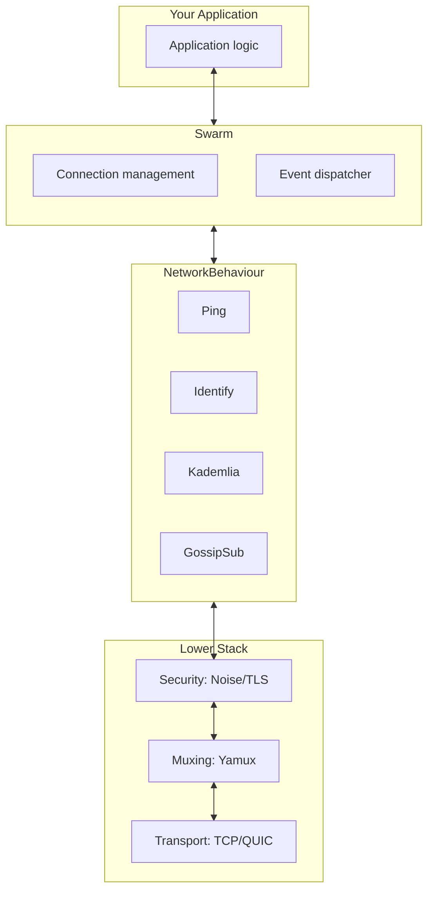

---
title: libp2p Overview
description: From reinventing the wheel to a modular network stack, libp2p's origin story and architectural philosophy
tableOfContents:
  minHeadingLevel: 2
  maxHeadingLevel: 4
---

## Every P2P Project Keeps Reinventing the Wheel

In 2015, [Juan Benet](https://en.wikipedia.org/wiki/Juan_Benet_(computer_scientist)) and his team were building [IPFS](https://ipfs.tech/), a decentralized file system meant to replace HTTP. They needed a P2P network that could communicate efficiently across millions of nodes worldwide.

But they quickly ran into a familiar set of problems:

- How can two devices hiding behind home routers connect to each other? (NAT traversal)
- How can untrusted nodes establish secure channels? (encrypted transport)
- How do you discover who in the network stores a given file? (peer discovery)
- How do you reconnect automatically after a link drops? (connection management)

Two decades earlier [Napster](https://zh.wikipedia.org/wiki/Napster) had seen the same challenges, [BitTorrent](https://zh.wikipedia.org/wiki/BitTorrent) solved a portion of them, and [Bitcoin](https://bitcoin.org/) plus [Freenet](https://freenetproject.org/) each improvised different solutions. **Every new project was reinventing the network layer.**

Worse yet, those implementations were tightly coupled to application logic. Want to reuse BitTorrent's [DHT](https://zh.wikipedia.org/wiki/分散式雜湊表) inside a blockchain client? Nearly impossible. Want to add [QUIC](https://zh.wikipedia.org/wiki/QUIC) transport to Bitcoin? You would need to rewrite half of its networking stack.

"This was absurd," Benet later recalled. "We were not creating new protocols; we were copying old mistakes again and again."

So the IPFS team made a decision: **extract the networking layer into an independent, reusable toolbox**. That toolbox became **[libp2p](https://libp2p.io/)**.

> libp2p is not an application; it is a **box of LEGO bricks for building network stacks**.

## Modularity: The Core Philosophy of libp2p

In traditional network programming we default to fixed bundles such as TCP/IP + TLS + DNS. It is like a prix fixe meal: take the whole thing or go hungry.

P2P networks, however, have wildly different needs:

- Blockchain nodes prioritize security and can trade off some speed.
- Real-time collaborative editors crave low latency and can tolerate occasional packet loss.
- IoT devices have limited resources and can only afford lightweight protocols.
- Certain network environments require [WebRTC](https://webrtc.org/) or [WebSocket](https://zh.wikipedia.org/wiki/WebSocket) relays.

**There is no single magic protocol that fits every scenario.** libp2p's answer is **decoupling**.

It breaks P2P networking into orthogonal abstraction layers, each with multiple implementations that developers can mix and match:

| Abstraction Layer | Purpose | Optional Implementations |
|-------|------|---------|
| **Transport** | Establishes the underlying byte-stream connection | TCP, QUIC, WebSocket, WebRTC |
| **Security** | Provides encryption and identity authentication | TLS, [Noise](https://noiseprotocol.org/) |
| **Muxing** | Carries multiple logical streams over one connection | Yamux, Mplex |
| **Discovery** | Finds other peers in the network | [mDNS](https://zh.wikipedia.org/wiki/多播DNS), [Kademlia](https://zh.wikipedia.org/wiki/Kademlia) DHT, Bootstrap |
| **Routing** | Answers "who has X?" | Kademlia DHT |
| **PubSub** | Broadcasts messages to interested peers | [GossipSub](https://docs.libp2p.io/concepts/pubsub/overview/) |

You can combine TCP + Noise + Yamux to build a secure, efficient private network, or pick WebRTC + TLS so browsers can join the swarm directly. You can even switch transports at runtime: attempt a direct connection first, then fall back to a WebSocket relay when that fails.

That is libp2p's core philosophy: **do not dictate "how things must be done"; provide choices for "how things can be done."**

## Two Foundational Concepts: PeerId and Multiaddr

Before exploring libp2p's runtime architecture we need to understand two foundational concepts. They are the bedrock of the entire system.

### PeerId: A Node's Identity

In centralized networks you locate servers via IP addresses. In P2P networks, IPs are unreliable: devices move, reboot, and change networks. More importantly, **an IP address cannot prove who you are.**

libp2p introduces the **PeerId** as a node's long-term identity. It is not a random string but is derived from **public-key cryptography**:


Key properties of a PeerId:

- **Uniqueness:** Two different public keys will almost never yield the same PeerId.
- **Verifiability:** Any peer can verify that the other side actually holds the corresponding private key.
- **Location independence:** The PeerId stays the same regardless of the IP or port you connect from.

In a libp2p network you do not connect to an address; you connect to an **identity**.

```rust
use libp2p::identity::Keypair;

let keypair = Keypair::generate_ed25519();  // Ed25519 is an efficient elliptic curve signature scheme
let peer_id = keypair.public().to_peer_id();
println!("My PeerId: {peer_id}");
// Output: 12D3KooWDpJ7As7BWAwRMfu1VU2WCqNjvq387JEYKDBj4kx6nXTN
```

### Multiaddr: How to Reach You

Identity alone is not enough; peers still need to know **how** to dial you. libp2p created **[Multiaddr](https://multiformats.io/multiaddr/)**, a self-describing addressing format.

Traditional addresses are flat: `192.168.1.100:8080`

A Multiaddr is **layered**, spelling out the connection path:

```text
/ip4/192.168.1.100/tcp/8080/p2p/12D3KooWRvUH...
```

It tells you to use IPv4, target IP 192.168.1.100, connect over TCP port 8080, and verify the remote PeerId afterwards.

Multiaddrs support arbitrary protocol nesting, enabling libp2p to adopt future transports seamlessly:

```text
/ip4/192.168.1.1/udp/8080/quic-v1
/ip4/192.168.1.1/tcp/8080/ws
/dns4/bootstrap.libp2p.io/tcp/443/wss/p2p/12D3KooW...
```

## Swarm and NetworkBehaviour: libp2p's Runtime Architecture

With PeerId (identity) and Multiaddr (addressing) we know who is who and how to connect. But those are static ideas. What actually drives libp2p at runtime are the **Swarm** and the **NetworkBehaviour**.



### Swarm: The Connection Control Room

The **Swarm** is libp2p's runtime heart. It is responsible for:

- Managing every active connection
- Listening for inbound dials and initiating outbound ones
- Dispatching network events to the appropriate protocol handler

Think of the Swarm as a switching fabric that all traffic flows through.

```rust
use libp2p::swarm::SwarmEvent;

loop {
    match swarm.select_next_some().await {
        SwarmEvent::NewListenAddr { address, .. } => {
            println!("Listening on: {address}");
        }
        SwarmEvent::ConnectionEstablished { peer_id, .. } => {
            println!("Connected to: {peer_id}");
        }
        SwarmEvent::Behaviour(event) => {
            // Handle protocol-specific events
        }
        _ => {}
    }
}
```

Every interaction with the libp2p network goes through the Swarm: listening, dialing, sending messages, everything.

### NetworkBehaviour: Defining What the Node Does

The Swarm manages the pipes, but **NetworkBehaviour** decides what flows through them.

`NetworkBehaviour` is a trait that defines how a node reacts to network events. libp2p ships with many built-in behaviours:

| Behaviour | Purpose |
|-----------|---------|
| **Ping** | Check whether a connection is still alive |
| **Identify** | Exchange metadata such as protocol version and listening addresses |
| **Kademlia** | Distributed hash table for peer discovery and content routing |
| **GossipSub** | Publish-subscribe message propagation |
| **RequestResponse** | Request-response pattern for RPC-style exchanges |

You can combine multiple behaviours to build sophisticated applications:

```rust
use libp2p::{ping, identify, gossipsub, swarm::NetworkBehaviour};

#[derive(NetworkBehaviour)]
struct MyBehaviour {
    ping: ping::Behaviour,
    identify: identify::Behaviour,
    gossipsub: gossipsub::Behaviour,
}
```

The `#[derive(NetworkBehaviour)]` macro merges the events from each child behaviour so you can process them inside a single event loop.

### How the Abstraction Layers Work with the Runtime

Now we can stitch the earlier concepts together:

- The **abstraction layers** (Transport, Security, Muxing) define **how** a connection is established.
- The **Swarm** manages the lifecycle of those connections.
- The **NetworkBehaviour** specifies what happens after the connection is live.

When you call `swarm.dial(addr)`, libp2p will:

1. Inspect the Multiaddr and pick the right transport (for example TCP).
2. Establish the connection and secure it (for example with Noise).
3. Apply a multiplexing protocol (for example Yamux) so multiple streams can share the link.
4. Hand the connection off to your NetworkBehaviour for protocol-level handling.

This layered approach allows you to replace any component without rewriting the rest.

## The libp2p Ecosystem

Since going open source in 2015, libp2p has become the de facto "network layer standard" for decentralized infrastructure:

- **[IPFS](https://ipfs.tech/):** Uses libp2p for discovering and transferring file blocks.
- **[Filecoin](https://filecoin.io/):** Relies heavily on libp2p in both the storage market and retrieval protocols.
- **[Ethereum 2.0](https://ethereum.org/):** The consensus layer uses libp2p for peer discovery and GossipSub block propagation.
- **[Polkadot](https://polkadot.network/):** Handles communication between parachains and the relay chain over libp2p.

libp2p is **language-agnostic**, and different implementations interoperate:

| Language | Project | Maturity |
|-----|------|-------|
| Go | [go-libp2p](https://github.com/libp2p/go-libp2p) | Most mature; used by IPFS |
| Rust | [rust-libp2p](https://github.com/libp2p/rust-libp2p) | Actively developed with great performance |
| JavaScript | [js-libp2p](https://github.com/libp2p/js-libp2p) | Targets browsers and Node.js |
| Nim | [nim-libp2p](https://github.com/status-im/nim-libp2p) | Maintained by the Status team |

## Why Choose libp2p?

Back to the original question: why adopt libp2p instead of writing yet another P2P stack?

- **Avoid reinventing the wheel:** NAT traversal, relays, encryption, DHTs, and other hard problems already have hardened implementations.
- **Protocol flexibility:** Swap transports or security layers to match each deployment environment without rewiring the app.
- **Interoperability:** Speak the same language as IPFS, Ethereum, and other major decentralized systems.
- **Future-ready:** WebTransport, QUIC, and other emerging protocols are already integrated or on the roadmap.

Most importantly, libp2p lets you **focus on application logic instead of low-level networking details**.

## Summary

This chapter covered libp2p's origin story and core architecture:

- **Modular design:** Transport, security, and multiplexing layers stay independent and composable.
- **PeerId:** Public-key-based identities that are self-verifiable and location-independent.
- **Multiaddr:** Self-describing addresses that support arbitrary protocol nesting.
- **Swarm:** The connection management hub and entry point for all network operations.
- **NetworkBehaviour:** Defines node behavior and lets you compose multiple protocols.

Next up we will dive into PeerId and key management to see how libp2p establishes trust between nodes.

