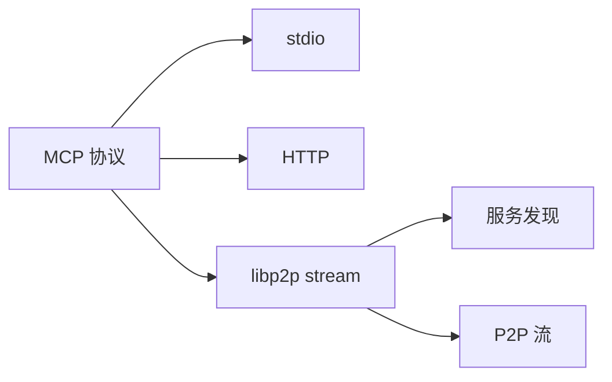
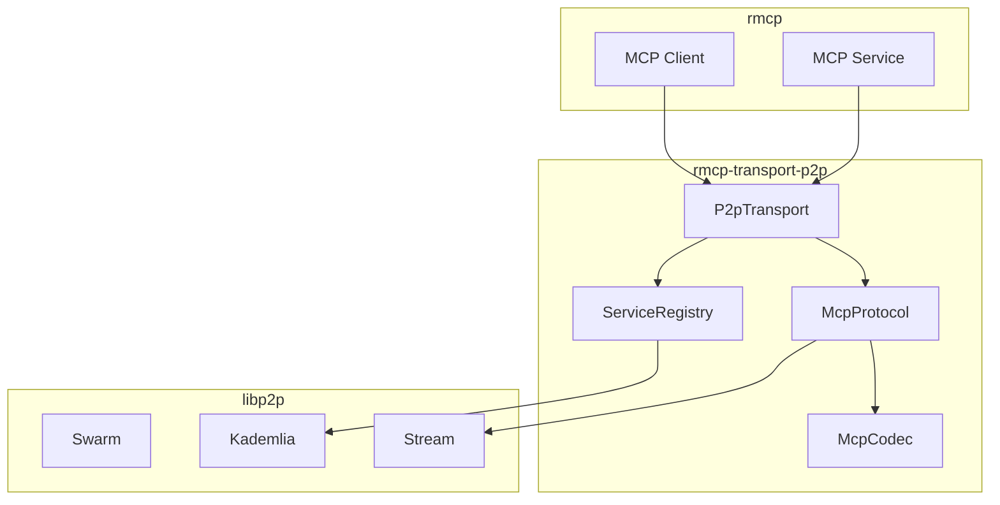

# 进阶教程：rmcp-transport-p2p

## 概述

| 项目 | 说明 |
|------|------|
| 前置要求 | SwarmBook 基础教程（第一篇至第六篇） |
| 目标读者 | 想要为 MCP 协议扩展 P2P 传输层的开发者 |
| 最终产出 | `rmcp-transport-p2p` crate |
| 核心依赖 | rmcp + libp2p |
| 协议规范 | [MCP over libp2p Spec](mcp-over-libp2p-spec.md) |

---

## 核心创新

**不是网关，而是传输层扩展**

```
现有 MCP 传输：stdio、HTTP、SSE
我们新增：libp2p stream
```



---

## 使用示例

### 服务端

```rust
use rmcp::ServiceExt;
use rmcp_transport_p2p::P2pTransport;

my_mcp_service()
    .serve(P2pTransport::new(config))
    .await?;
```

### 客户端

```rust
use rmcp::ClientExt;
use rmcp_transport_p2p::P2pTransport;

let client = ()
    .serve(P2pTransport::connect(peer_id, config))
    .await?;

let tools = client.list_tools().await?;
```

### 服务发现

```rust
// 注册
transport.register_service(ServiceInfo {
    name: "knowledge-base",
    capabilities: vec!["search"],
}).await?;

// 发现
let services = transport
    .discover_services(ServiceQuery::capability("search"))
    .await?;
```

---

## 架构



---

## 章节规划

### 第一篇：MCP 基础与 rmcp 实战（4 章）

> 目标：理解 MCP 协议，用 rmcp 实现一个完整的 MCP 服务

| 章节 | 内容 | 产出 |
|------|------|------|
| 01 | MCP 协议概述 | 理解 JSON-RPC、tools、resources、prompts |
| 02 | rmcp 快速入门 | 环境搭建，运行官方示例 |
| 03 | 实现 MCP 服务 | `examples/calculator/` 计算器服务 |
| 04 | MCP 传输层分析 | 理解 stdio/HTTP/SSE，为 P2P 做准备 |

### 第二篇：P2P 协议设计（3 章）

> 目标：设计 MCP over libp2p 协议

| 章节 | 内容 | 产出 |
|------|------|------|
| 05 | 协议设计 | 协议 ID、消息帧格式 |
| 06 | 消息编解码 | `src/codec.rs` |
| 07 | libp2p 协议处理器 | `src/protocol.rs` |

### 第三篇：传输层实现（3 章）

> 目标：实现 P2pTransport，对接 rmcp

| 章节 | 内容 | 产出 |
|------|------|------|
| 08 | Transport trait 实现 | `src/transport.rs` |
| 09 | 服务端模式 | 监听 P2P 连接 |
| 10 | 客户端模式 | 连接远程 MCP 服务 |

### 第四篇：服务发现（3 章）

> 目标：基于 DHT 的服务注册与发现

| 章节 | 内容 | 产出 |
|------|------|------|
| 11 | 服务元数据设计 | `src/registry/info.rs` |
| 12 | DHT 服务注册 | `src/registry/register.rs` |
| 13 | DHT 服务发现 | `src/registry/discover.rs` |

### 第五篇：生产特性（2 章）

> 目标：添加生产级特性

| 章节 | 内容 | 产出 |
|------|------|------|
| 14 | 连接池与重连 | `src/pool.rs` |
| 15 | 监控与调试 | `src/metrics.rs` |

---

## 目录结构

```
crates/rmcp-transport-p2p/
├── src/
│   ├── lib.rs
│   ├── config.rs
│   ├── transport.rs
│   ├── codec.rs
│   ├── protocol.rs
│   └── registry/
│       ├── mod.rs
│       ├── info.rs
│       ├── register.rs
│       └── discover.rs
├── tests/
│   └── integration.rs
└── examples/
    ├── calculator/          # 第一篇：MCP 服务示例
    │   ├── main.rs
    │   └── service.rs
    ├── server.rs            # P2P MCP 服务端
    ├── client.rs            # P2P MCP 客户端
    └── discovery.rs         # 服务发现示例
```

---

## 核心 API

```rust
// 传输层
pub struct P2pTransport { /* ... */ }

impl P2pTransport {
    pub async fn new(config: P2pConfig) -> Result<Self>;
    pub async fn connect(peer_id: PeerId, config: P2pConfig) -> Result<Self>;
    pub fn local_peer_id(&self) -> &PeerId;
}

// 服务发现
pub struct ServiceRegistry { /* ... */ }

impl ServiceRegistry {
    pub async fn register(&self, info: ServiceInfo) -> Result<()>;
    pub async fn discover(&self, query: ServiceQuery) -> Result<Vec<ServiceInfo>>;
}
```

---

## 学习收获

- MCP 协议核心概念（tools、resources、prompts）
- rmcp 服务开发
- MCP 传输层架构
- libp2p 自定义协议开发
- 协议设计与编解码
- DHT 服务发现

---

## 参考资源

- [MCP 规范](https://spec.modelcontextprotocol.io/)
- [rmcp](https://github.com/anthropics/rmcp)
- [rust-libp2p](https://github.com/libp2p/rust-libp2p)
- [MCP over libp2p 协议规范](mcp-over-libp2p-spec.md)
