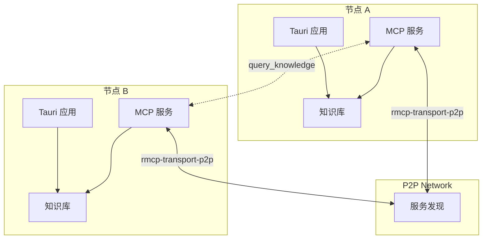
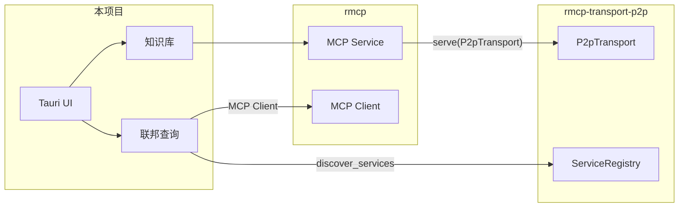

# 终极实战：P2P 联邦知识网络

## 概述

| 项目   | 说明                               |
| ---- | -------------------------------- |
| 前置要求 | rmcp-transport-p2p 教程            |
| 目标读者 | 想要构建去中心化 AI 应用的开发者               |
| 最终产出 | P2P 知识共享桌面应用                     |
| 核心依赖 | rmcp-transport-p2p + Rig + Tauri |

---

## 项目愿景



**核心特性**：

- 本地知识库（Rig + 向量数据库）
- 通过 P2P 传输层共享 MCP 工具
- 联邦查询：一个问题查多个知识库
- Tauri 桌面应用

---

## 与 SDK 的关系



---

## 使用示例

### 暴露知识库到 P2P 网络

```rust
use rmcp::ServiceExt;
use rmcp_transport_p2p::{P2pTransport, P2pConfig};

#[derive(Clone)]
struct KnowledgeService {
    kb: KnowledgeBase,
}

#[tool(tool_box)]
impl KnowledgeService {
    #[tool(description = "查询知识库")]
    async fn query(&self, question: String) -> String {
        self.kb.query(&question).await
    }
}

// 直接在 P2P 网络上提供 MCP 服务
let transport = P2pTransport::new(P2pConfig::default()).await?;

// 注册到 DHT
transport.register_service(ServiceInfo {
    name: "my-knowledge",
    capabilities: vec!["search", "qa"],
}).await?;

// 启动服务
KnowledgeService { kb }
    .serve(transport)
    .await?;
```

### 联邦查询

```rust
use rmcp::ClientExt;
use rmcp_transport_p2p::{P2pTransport, ServiceQuery};

async fn federated_query(question: &str) -> Result<String> {
    let transport = P2pTransport::new(P2pConfig::default()).await?;

    // 1. 发现知识库服务
    let services = transport
        .discover_services(ServiceQuery::capability("qa"))
        .await?;

    // 2. 并行查询所有知识库
    let futures: Vec<_> = services.iter().map(|svc| async {
        let client_transport = P2pTransport::connect(
            svc.peer_id,
            P2pConfig::default(),
        ).await?;

        let client = ().serve(client_transport).await?;
        client.call_tool("query", json!({ "question": question })).await
    }).collect();

    let results = futures::future::join_all(futures).await;

    // 3. 合并结果
    let merged = merge_results(results)?;

    // 4. LLM 综合答案
    synthesize_answer(question, &merged).await
}
```

---

## 章节规划

### 第一篇：本地知识库（4 章）

| 章节 | 内容 | 产出 |
|------|------|------|
| 01 | Rig 框架与 RAG 原理 | - |
| 02 | 向量数据库 LanceDB | `src/knowledge/store.rs` |
| 03 | 文档加载与分块 | `src/knowledge/loader.rs` |
| 04 | RAG 查询实现 | `src/knowledge/query.rs` |

### 第二篇：P2P MCP 服务（4 章）

| 章节 | 内容 | 产出 |
|------|------|------|
| 05 | 设计 query_knowledge 工具 | `src/tools/knowledge.rs` |
| 06 | 集成 rmcp-transport-p2p | `src/node.rs` |
| 07 | 服务注册与发现 | `src/discovery.rs` |
| 08 | 远程调用测试 | - |

### 第三篇：联邦查询（4 章）

| 章节 | 内容 | 产出 |
|------|------|------|
| 09 | 联邦查询设计 | `src/federated/mod.rs` |
| 10 | 并行查询多节点 | `src/federated/query.rs` |
| 11 | 结果合并与排序 | `src/federated/merge.rs` |
| 12 | LLM 答案综合 | `src/federated/synthesis.rs` |

### 第四篇：Tauri 桌面应用（4 章）

| 章节 | 内容 | 产出 |
|------|------|------|
| 13 | Tauri 项目搭建 | `client/` |
| 14 | 知识库管理界面 | `src/routes/knowledge.tsx` |
| 15 | 问答聊天界面 | `src/routes/chat.tsx` |
| 16 | 网络状态界面 | `src/routes/network.tsx` |

### 第五篇：部署与发布（3 章）

| 章节 | 内容 | 产出 |
|------|------|------|
| 17 | 多平台打包 | 安装包 |
| 18 | 引导节点部署 | 部署脚本 |
| 19 | 用户使用指南 | 文档 |

---

## 目录结构

```
examples/p2p-knowledge/
├── src/
│   ├── lib.rs
│   ├── node.rs                 # P2P 节点
│   ├── discovery.rs            # 服务发现
│   │
│   ├── knowledge/              # 知识库
│   │   ├── mod.rs
│   │   ├── store.rs
│   │   ├── loader.rs
│   │   └── query.rs
│   │
│   ├── tools/                  # MCP 工具
│   │   └── knowledge.rs
│   │
│   └── federated/              # 联邦查询
│       ├── mod.rs
│       ├── query.rs
│       ├── merge.rs
│       └── synthesis.rs
│
└── client/                     # Tauri 应用
    ├── src-tauri/
    └── src/routes/
```

---

## 用户界面

```
┌─────────────────────────────────────────────────────────────┐
│  🌐 P2P Knowledge Network                          [设置]   │
├─────────────┬───────────────────────────────────────────────┤
│             │                                               │
│  📚 我的知识库 │  💬 问答                                      │
│  ├─ 技术笔记  │  ┌─────────────────────────────────────────┐ │
│  └─ 读书摘要  │  │ 🔍 Rust 异步编程最佳实践？                  │ │
│             │  └─────────────────────────────────────────┘ │
│  🌍 网络节点  │                                               │
│  ├─ 🟢 Alice │  ┌─────────────────────────────────────────┐ │
│  └─ 🟢 Bob   │  │ 根据多个知识库的信息...                     │ │
│             │  │                                         │ │
│             │  │ 📎 来源:                                 │ │
│             │  │   • Alice/技术笔记                       │ │
│             │  │   • Bob/Rust库                          │ │
│             │  └─────────────────────────────────────────┘ │
└─────────────┴───────────────────────────────────────────────┘
```

---

## 技术栈

| 组件 | 技术 |
|------|------|
| MCP 服务 | rmcp |
| P2P 传输 | rmcp-transport-p2p |
| 知识库 | Rig + LanceDB |
| AI 推理 | Ollama / OpenAI |
| 桌面应用 | Tauri + React |

---

## 竞品分析

| 项目 | 相似点 | 差异 |
|------|--------|------|
| Obsidian | 本地知识库 | 无 P2P，无联邦查询 |
| Anytype | P2P 同步 | 无 AI，无 MCP |
| PrivateGPT | 本地 RAG | 单机，无 P2P |
| Perplexity | AI 搜索 | 中心化 |

**独特定位**：P2P + MCP + 联邦 RAG = 去中心化 AI 知识协作

---

## 参考资源

- [rmcp-transport-p2p 教程](02-advanced-p2p-mcp.md)
- [MCP over libp2p 规范](mcp-over-libp2p-spec.md)
- [Rig](https://github.com/0xPlaygrounds/rig)
- [LanceDB](https://lancedb.com/)
