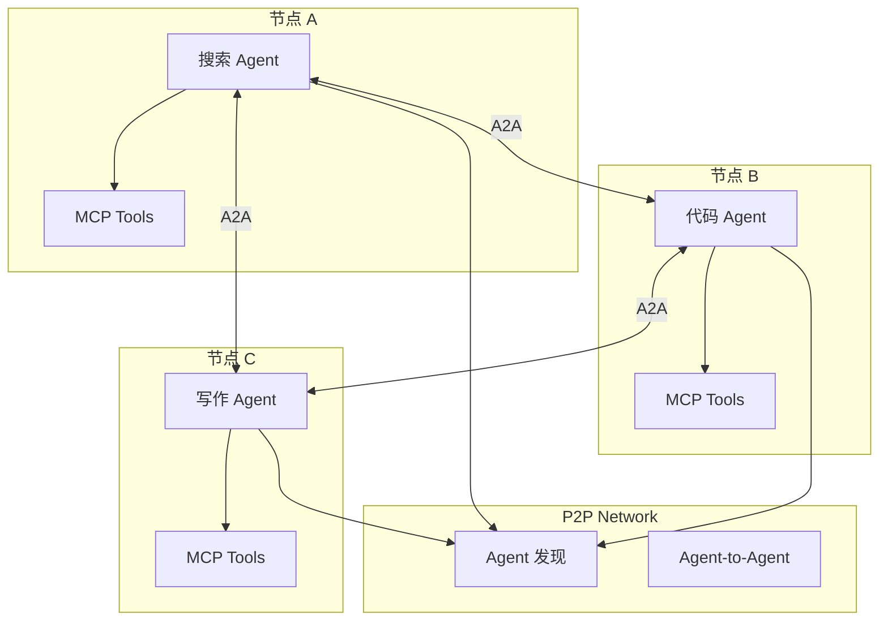
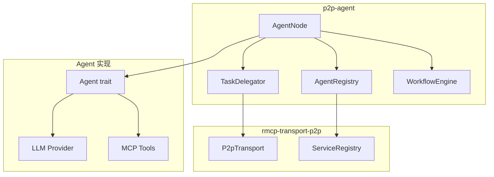

# 终极实战：P2P AI Agent 网络

## 概述

| 项目 | 说明 |
|------|------|
| 前置要求 | rmcp-transport-p2p 教程 + 联邦知识网络教程 |
| 目标读者 | 想要构建去中心化 AI Agent 系统的开发者 |
| 最终产出 | P2P Multi-Agent 协作框架 |
| 核心依赖 | rmcp-transport-p2p + Rig + A2A 协议 |

---

## 项目愿景



**核心特性**：

- 每个节点运行一个专业 Agent
- Agent 之间通过 P2P 直接通信
- Agent 可以调用其他 Agent 的能力
- 去中心化的 Multi-Agent 协作

---

## 与前面教程的关系

```
01: SwarmBook 基础     → libp2p 基础
02: rmcp-transport-p2p → MCP over P2P
03: 联邦知识网络        → P2P RAG 应用
04: Agent 网络（本教程）→ P2P Multi-Agent
```

**进化路径**：

| 教程 | 节点角色 | 协作模式 |
|------|---------|---------|
| 03 | 知识库 | 联邦查询 |
| 04 | AI Agent | Agent 协作 |

---

## 核心概念

### Agent vs MCP Service

| 对比 | MCP Service | AI Agent |
|------|-------------|----------|
| 本质 | 工具提供者 | 自主决策者 |
| 交互 | 被动响应 | 主动协作 |
| 能力 | 固定 tools | LLM + tools |
| 通信 | MCP 协议 | A2A 协议 |

### A2A 协议（Agent-to-Agent）

Google 提出的 Agent 间通信协议，我们将其运行在 P2P 网络上：

```
现有 A2A：HTTP
我们新增：libp2p stream（P2P）
```

---

## 使用示例

### 定义 Agent

```rust
use p2p_agent::{Agent, AgentConfig, Capability};
use rmcp_transport_p2p::P2pTransport;

struct SearchAgent {
    llm: Box<dyn LlmProvider>,
    tools: Vec<Tool>,
}

impl Agent for SearchAgent {
    fn capabilities(&self) -> Vec<Capability> {
        vec![
            Capability::new("web_search", "搜索互联网信息"),
            Capability::new("summarize", "总结搜索结果"),
        ]
    }

    async fn handle_task(&self, task: Task) -> Result<TaskResult> {
        // Agent 自主决策如何完成任务
        let plan = self.llm.plan(&task).await?;
        self.execute_plan(plan).await
    }
}
```

### 启动 Agent 节点

```rust
use p2p_agent::{AgentNode, AgentConfig};
use rmcp_transport_p2p::P2pTransport;

let transport = P2pTransport::new(config).await?;

let node = AgentNode::builder()
    .with_transport(transport)
    .with_agent(SearchAgent::new())
    .build()
    .await?;

// 注册到网络
node.register().await?;

// 运行
node.run().await?;
```

### Agent 协作

```rust
use p2p_agent::{AgentClient, TaskBuilder};

// 发现网络中的 Agent
let agents = node.discover_agents(
    AgentQuery::capability("code_generation")
).await?;

// 委托任务给其他 Agent
let code_agent = &agents[0];
let result = node.delegate_task(
    code_agent,
    TaskBuilder::new("写一个 Rust HTTP 服务器")
        .with_context(context)
        .build()
).await?;
```

### Multi-Agent 工作流

```rust
use p2p_agent::{Workflow, WorkflowBuilder};

// 定义协作工作流
let workflow = WorkflowBuilder::new("研究报告")
    .step("search", AgentQuery::capability("web_search"))
    .step("analyze", AgentQuery::capability("data_analysis"))
    .step("write", AgentQuery::capability("writing"))
    .build();

// 执行（自动发现和调度 Agent）
let report = node.execute_workflow(workflow, input).await?;
```

---

## 架构



---

## 章节规划

### 第一篇：Agent 基础（4 章）

> 目标：理解 AI Agent，实现单机 Agent

| 章节 | 内容 | 产出 |
|------|------|------|
| 01 | AI Agent 概念 | 理解 Agent vs Tool |
| 02 | A2A 协议分析 | 理解 Agent 通信 |
| 03 | 实现本地 Agent | `src/agent/mod.rs` |
| 04 | Agent + MCP Tools | Agent 调用本地工具 |

### 第二篇：P2P Agent 网络（4 章）

> 目标：让 Agent 运行在 P2P 网络上

| 章节 | 内容 | 产出 |
|------|------|------|
| 05 | A2A over libp2p | `src/protocol/a2a.rs` |
| 06 | Agent 注册与发现 | `src/registry.rs` |
| 07 | AgentNode 实现 | `src/node.rs` |
| 08 | 跨节点通信测试 | 两个 Agent 对话 |

### 第三篇：Agent 协作（4 章）

> 目标：实现 Multi-Agent 协作

| 章节 | 内容 | 产出 |
|------|------|------|
| 09 | 任务委托 | `src/delegate.rs` |
| 10 | 能力协商 | Agent 能力匹配 |
| 11 | 工作流引擎 | `src/workflow.rs` |
| 12 | 协作示例 | 研究报告生成 |

### 第四篇：高级特性（4 章）

> 目标：生产级特性

| 章节 | 内容 | 产出 |
|------|------|------|
| 13 | Agent 信任与声誉 | `src/trust.rs` |
| 14 | 任务定价与激励 | `src/incentive.rs` |
| 15 | 故障恢复 | 任务重试、Agent 替换 |
| 16 | 监控与调试 | Agent 行为追踪 |

---

## 目录结构

```
crates/p2p-agent/
├── src/
│   ├── lib.rs
│   ├── agent/
│   │   ├── mod.rs
│   │   ├── traits.rs        # Agent trait
│   │   └── local.rs         # 本地 Agent 实现
│   │
│   ├── protocol/
│   │   ├── mod.rs
│   │   └── a2a.rs           # A2A over libp2p
│   │
│   ├── node.rs              # AgentNode
│   ├── registry.rs          # Agent 注册发现
│   ├── delegate.rs          # 任务委托
│   ├── workflow.rs          # 工作流引擎
│   │
│   ├── trust.rs             # 信任系统
│   └── incentive.rs         # 激励机制
│
└── examples/
    ├── search_agent/        # 搜索 Agent
    ├── code_agent/          # 代码 Agent
    ├── writer_agent/        # 写作 Agent
    └── workflow_demo/       # 协作示例
```

---

## 核心 API

```rust
// Agent trait
pub trait Agent: Send + Sync {
    fn id(&self) -> &AgentId;
    fn capabilities(&self) -> Vec<Capability>;
    async fn handle_task(&self, task: Task) -> Result<TaskResult>;
}

// AgentNode
pub struct AgentNode { /* ... */ }

impl AgentNode {
    pub async fn register(&self) -> Result<()>;
    pub async fn discover_agents(&self, query: AgentQuery) -> Result<Vec<AgentInfo>>;
    pub async fn delegate_task(&self, agent: &AgentInfo, task: Task) -> Result<TaskResult>;
    pub async fn execute_workflow(&self, workflow: Workflow, input: Value) -> Result<Value>;
}

// Workflow
pub struct WorkflowBuilder { /* ... */ }

impl WorkflowBuilder {
    pub fn step(self, name: &str, agent_query: AgentQuery) -> Self;
    pub fn parallel(self, steps: Vec<(&str, AgentQuery)>) -> Self;
    pub fn build(self) -> Workflow;
}
```

---

## 竞品分析

| 项目 | 相似点 | 差异 |
|------|--------|------|
| AutoGPT | Multi-Agent | 单机，中心化 |
| CrewAI | Agent 协作 | 单机，无 P2P |
| LangGraph | 工作流 | 单机，无网络 |
| **本项目** | Multi-Agent | P2P，去中心化 |

**独特定位**：去中心化 Multi-Agent 网络

---

## 应用场景

### 1. 分布式研究助手

```
用户 → 协调 Agent
         ├→ 搜索 Agent（节点 A）
         ├→ 分析 Agent（节点 B）
         └→ 写作 Agent（节点 C）
              ↓
         综合报告
```

### 2. 去中心化代码审查

```
PR 提交 → 代码 Agent 网络
           ├→ 安全审查 Agent
           ├→ 性能审查 Agent
           └→ 风格审查 Agent
                ↓
           综合审查意见
```

### 3. 协作创作

```
创意 → 创作 Agent 网络
        ├→ 故事 Agent
        ├→ 角色 Agent
        └→ 世界观 Agent
             ↓
        协作小说
```

---

## 技术栈

| 组件 | 技术 |
|------|------|
| Agent 框架 | Rig |
| P2P 传输 | rmcp-transport-p2p |
| Agent 通信 | A2A over libp2p |
| LLM | Ollama / OpenAI |
| 工作流 | 自研 WorkflowEngine |

---

## 教学价值

| 维度 | 评分 | 说明 |
|------|------|------|
| 创新性 | ★★★★★ | 首个 P2P Multi-Agent 框架 |
| 复杂度 | ★★★★☆ | 涉及 Agent、协议、分布式 |
| 实用性 | ★★★★☆ | AI Agent 是趋势 |
| 前沿性 | ★★★★★ | 结合 A2A + P2P |

---

## 参考资源

- [A2A 协议](https://github.com/anthropics/a2a-spec)（假设）
- [Rig](https://github.com/0xPlaygrounds/rig)
- [rmcp-transport-p2p 教程](02-advanced-p2p-mcp.md)
- [联邦知识网络教程](03-ultimate-p2p-knowledge.md)

---

## 与 03 的关系

| 对比 | 03 联邦知识网络 | 04 Agent 网络 |
|------|----------------|---------------|
| 节点角色 | 知识库（被动） | Agent（主动） |
| 协作模式 | 查询-响应 | 任务委托 |
| 智能程度 | RAG | LLM 推理 |
| 复杂度 | 中等 | 高 |

03 是 04 的子集：知识库可以作为 Agent 的一个工具。
